# Rules Engine Architecture Design - Comprehensive Review & Analysis

## Executive Summary

The Rules Engine architecture design represents a **well-structured, enterprise-grade system** that successfully applies Domain-Driven Design (DDD) principles within a modern microservices architecture. The design demonstrates **strong architectural maturity** with comprehensive specifications for all components, from backend services to frontend applications and deployment infrastructure.

**Overall Rating: ★★★★☆ (4.2/5)**

## 1. Architectural Overview Assessment

### ✅ **Strengths**

#### 1.1 Clear Layered Architecture
- **Well-defined layers**: Presentation → API Gateway → Microservices → Integration → Data
- **Proper separation of concerns** with clear boundaries between each layer
- **Technology-appropriate choices**: Golang for performance-critical backend, TypeScript/Vue for rich frontend

#### 1.2 Domain-Driven Design Implementation
- **9 properly bounded contexts** representing distinct business domains
- **Clear ubiquitous language** maintained across all specifications
- **Proper aggregate design** with well-defined entity relationships
- **Event-driven architecture** supporting eventual consistency

#### 1.3 Microservices Design Principles
- **Single responsibility** per service with clear business boundaries
- **Independent deployment** capability for each service
- **Technology diversity** where appropriate (gRPC for performance, REST for external APIs)
- **Database per service** pattern properly implemented

### ⚠️ **Areas for Improvement**

#### 1.1 Service Dependencies
- **Potential coupling risk** between Rules Calculation and Rules Evaluation services
- **Shared Calculator service** could become a bottleneck without proper scaling
- **Cross-cutting concerns** like authentication could be better distributed

#### 1.2 Complexity Management
- **9 microservices** may be excessive for initial MVP - consider service consolidation
- **Event choreography complexity** with multiple message types and routing patterns
- **Operational overhead** of managing multiple services simultaneously

## 2. Technical Architecture Analysis

### ✅ **Backend Services (Golang) - Excellent Design**

#### 2.1 Service Architecture

**Positive Aspects:**
- **Comprehensive domain models** with proper entity relationships
- **Dual API design** (REST for external, gRPC for internal) is excellent
- **Clear performance targets** for each service (<500ms, 1000+ TPS)
- **Proper error handling** and circuit breaker patterns

**Concerns:**
- **Rules Calculation Service** appears over-engineered with 25-32 day development time
- **Shared Calculator Service** creates potential dependency bottleneck
- **Database strategy** could benefit from read replicas specification

#### 2.2 Data Architecture

```mermaid
graph LR
    subgraph "Data Layer Assessment"
        PG[(PostgreSQL<br/>★★★★☆)]
        REDIS[(Redis Cache<br/>★★★★★)]
        ES[(Elasticsearch<br/>★★★☆☆)]
    end
    
    subgraph "Concerns"
        PERF[Performance<br/>Bottlenecks]
        SCALE[Scaling<br/>Challenges]
        COST[Operational<br/>Cost]
    end
    
    ES -.-> COST
    PG -.-> SCALE
    REDIS -.-> PERF
```

**Strengths:**
- **Appropriate technology choices** for each data type
- **Caching strategy** well-defined with multi-level approach
- **Event sourcing** properly implemented with NATS JetStream

**Weaknesses:**
- **Elasticsearch usage** may be overkill for audit logs only
- **Database sharding strategy** not clearly defined for scale
- **Data consistency patterns** could be more explicit

### ✅ **Integration Layer (NATS) - Very Strong**

#### 2.3 Event-Driven Architecture

**Excellent Design Elements:**
- **Hierarchical subject structure** provides clear message routing
- **Comprehensive event schemas** with correlation/causation tracking
- **Anti-corruption layer** properly protects domain integrity
- **Resilience patterns** implemented (circuit breakers, retries, DLQ)

**Minor Improvements:**
- **Event versioning strategy** could be more explicit
- **Message ordering guarantees** not clearly specified
- **Event replay capabilities** need more detail

### ⚠️ **Frontend Architecture (TypeScript/Vue) - Good with Gaps**

#### 2.4 Frontend Design Assessment

```mermaid
graph TB
    subgraph "Frontend Stack - Good Choice"
        VUE[Vue 3 + TS<br/>★★★★☆]
        QUASAR[Quasar UI<br/>★★★★☆]
        PINIA[Pinia Store<br/>★★★★☆]
    end
    
    subgraph "Architecture Concerns"
        COMP[Component<br/>Complexity]
        TEST[Testing<br/>Strategy]
        PERF[Performance<br/>Optimization]
    end
    
    VUE -.-> COMP
    QUASAR -.-> PERF
    PINIA -.-> TEST
```

**Strengths:**
- **Modern technology stack** with Vue 3 Composition API
- **Component-based architecture** with proper entity representation
- **Type safety** throughout with comprehensive TypeScript definitions
- **Responsive design** considerations for multiple devices

**Areas Needing Attention:**
- **State management complexity** with multiple Pinia stores
- **Component testing strategy** not fully detailed
- **Performance optimization** strategies need more specifics
- **Mobile interface** specifications are underdeveloped

## 3. Performance & Scalability Analysis

### ✅ **Performance Targets - Well Defined**

| Service | Response Time | Throughput | Availability |
|---------|---------------|------------|--------------|
| Rules Calculation | <500ms (95th) | 1000+ TPS | 99.9% |
| Rules Evaluation | <300ms (95th) | 2000+ RPS | 99.95% |
| Calculator | <100ms basic | 10,000+ ops/s | 99.9% |

**Positive Aspects:**
- **Realistic performance targets** based on business requirements
- **Comprehensive caching strategy** (L1: Memory, L2: Redis)
- **Load balancing** and circuit breaker patterns implemented

**Scalability Concerns:**
- **Database scaling strategy** not clearly defined
- **NATS cluster scaling** needs more specification
- **Cross-service transaction handling** could impact performance

### ⚠️ **Scalability Architecture**

```mermaid
graph TB
    subgraph "Scaling Challenges"
        DB[Database<br/>Scaling Strategy<br/>⚠️ Unclear]
        MSG[Message<br/>Throughput<br/>⚠️ Limits Unknown]
        CALC[Calculator<br/>Bottleneck<br/>⚠️ Single Point]
    end
    
    subgraph "Scaling Solutions"
        SHARD[Database<br/>Sharding]
        CLUSTER[NATS<br/>Clustering]
        LB[Load<br/>Balancing]
    end
    
    DB -.-> SHARD
    MSG -.-> CLUSTER
    CALC -.-> LB
```

## 4. Security & Compliance Analysis

### ⚠️ **Security Framework - Needs Enhancement**

#### 4.1 Current Security Measures

```mermaid
graph TB
    subgraph "Implemented Security"
        JWT[JWT Authentication<br/>★★★☆☆]
        RBAC[Role-Based Access<br/>★★★☆☆]
        INPUT[Input Validation<br/>★★★☆☆]
    end
    
    subgraph "Missing Security"
        ENCRYPT[Data Encryption<br/>❌ Not Specified]
        AUDIT[Security Audit<br/>❌ Limited]
        SECRETS[Secret Management<br/>❌ Basic]
    end
    
    JWT -.-> AUDIT
    RBAC -.-> SECRETS
    INPUT -.-> ENCRYPT
```

**Current Security Features:**
- **JWT-based authentication** at API Gateway level
- **Role-based access control** for different user types
- **Input validation and sanitization** across services
- **Rate limiting** and DDoS protection measures

**Critical Security Gaps:**
1. **Data encryption at rest** not specified
2. **TLS/SSL configuration** details missing
3. **Secret management strategy** not comprehensive
4. **Security audit logging** not fully defined
5. **Compliance framework** (GDPR, PCI-DSS) not addressed

#### 4.2 Fraud Prevention
**Strengths:**
- **Comprehensive fraud detection** in Coupons and Payments services
- **Device fingerprinting** and behavioral analysis
- **Risk scoring algorithms** with ML integration

**Needs Improvement:**
- **Cross-service fraud correlation** not clearly defined
- **Real-time fraud response** mechanisms need enhancement

## 5. Development & Operations Analysis

### ✅ **DevOps & Deployment - Strong Foundation**

#### 5.1 Containerization Strategy

**Excellent Practices:**
- **Multi-stage Docker builds** for optimization
- **Scratch-based final images** for security and performance
- **Comprehensive health checks** for all services
- **Environment-specific configurations** well-defined

**Operational Readiness:**
- **Complete docker-compose** setup for development
- **Production-ready** Kubernetes configurations
- **Monitoring stack** with Prometheus and Grafana
- **Backup and recovery** procedures defined

### ⚠️ **Testing Strategy - Needs Strengthening**

#### 5.2 Testing Coverage Analysis
| Testing Type | Backend Coverage | Frontend Coverage | Integration |
|-------------|------------------|-------------------|-------------|
| Unit Tests | 80-90% ✅ | Not Specified ⚠️ | Limited ⚠️ |
| Integration | Good ✅ | Basic ⚠️ | Good ✅ |
| Performance | Excellent ✅ | Limited ⚠️ | Good ✅ |
| E2E Tests | Limited ⚠️ | Planned ✅ | Limited ⚠️ |

**Testing Strengths:**
- **High unit test coverage** targets for backend services
- **Performance testing** well-defined with specific targets
- **Load testing** specifications for high-throughput services

**Testing Gaps:**
- **End-to-end testing strategy** not comprehensive
- **Chaos engineering** mentioned but not detailed
- **Security testing** not explicitly addressed
- **Data integrity testing** across services missing

## 6. Implementation Feasibility

### ✅ **Project Planning - Very Strong**

#### 6.1 Timeline Analysis

**Timeline Strengths:**
- **Realistic 20-week timeline** for complete implementation
- **Well-defined phases** with clear dependencies
- **Proper resource allocation** across team members
- **Risk mitigation** strategies identified

**Resource Requirements:**
- **Team of 10 developers** appropriately structured
- **800+ person-days** properly distributed across components
- **Clear skill requirements** for each team member

### ⚠️ **Complexity vs. Value Trade-offs**

#### 6.2 Implementation Risks

```mermaid
graph TB
    subgraph "High Risk Areas"
        COMPLEXITY[Service Complexity<br/>9 Microservices]
        INTEGRATION[Integration Complexity<br/>Event Choreography]
        TEAM[Team Coordination<br/>Multiple Dependencies]
    end
    
    subgraph "Mitigation Strategies"
        PHASED[Phased Approach<br/>✅ Well Planned]
        API[API First<br/>✅ Good Strategy]
        TESTING[Testing Strategy<br/>⚠️ Needs Enhancement]
    end
    
    COMPLEXITY --> PHASED
    INTEGRATION --> API
    TEAM --> TESTING
```

**High-Risk Elements:**
1. **Over-engineering risk** with 9 microservices for initial release
2. **Integration complexity** with event-driven architecture
3. **Team coordination** across multiple concurrent development streams

**Recommended Risk Mitigations:**
1. **Consider service consolidation** for MVP release
2. **Implement comprehensive integration testing** early
3. **Establish clear API contracts** before parallel development

## 7. Recommendations & Improvements

### 🎯 **Priority 1 (Critical)**

#### 7.1 Security Enhancements
1. **Implement comprehensive encryption strategy**
   - Data at rest encryption for all databases
   - TLS 1.3 for all service communications
   - Secret management with HashiCorp Vault or equivalent

2. **Enhance audit and compliance framework**
   - Comprehensive security audit logging
   - GDPR/PCI-DSS compliance documentation
   - Security incident response procedures

#### 7.2 Testing Strategy Improvement
1. **Develop comprehensive E2E testing framework**
   - Cross-service transaction testing
   - Business workflow validation
   - Data consistency verification

2. **Implement chaos engineering practices**
   - Service failure simulation
   - Network partition testing
   - Database failure scenarios

### 🎯 **Priority 2 (High)**

#### 7.3 Scalability Enhancements
1. **Define database scaling strategy**
   - Read replica configuration
   - Sharding strategies for high-volume tables
   - Database performance monitoring

2. **Enhance NATS clustering specification**
   - Message throughput limits
   - Scaling patterns for high load
   - Disaster recovery procedures

#### 7.4 Frontend Architecture Strengthening
1. **Complete mobile interface specifications**
   - Progressive Web App features
   - Offline capability design
   - Mobile-specific performance optimization

2. **Enhance state management strategy**
   - Redux/Pinia pattern guidelines
   - State normalization strategies
   - Performance optimization techniques

### 🎯 **Priority 3 (Medium)**

#### 7.5 Operational Excellence
1. **Service consolidation consideration**
   - Evaluate merging related services for MVP
   - Define service splitting criteria
   - Migration strategy for future separation

2. **Enhanced monitoring and observability**
   - Business metrics dashboards
   - Custom alerting rules
   - Performance optimization recommendations

## 8. Final Assessment & Recommendations

### ✅ **Overall Strengths**
1. **Excellent architectural foundation** with proper DDD implementation
2. **Comprehensive technical specifications** for all components
3. **Realistic implementation timeline** with proper resource allocation
4. **Modern technology stack** appropriate for requirements
5. **Strong performance targets** with clear metrics

### ⚠️ **Key Concerns to Address**
1. **Security framework** needs significant enhancement
2. **Testing strategy** requires more comprehensive approach
3. **Service complexity** may be excessive for initial release
4. **Frontend mobile strategy** needs completion
5. **Database scaling strategy** needs clarification

### 🎯 **Strategic Recommendations**

#### 8.1 For Immediate Implementation
1. **Start with consolidated services** (6 services instead of 9)
   - Merge Calculator into Rules Calculation
   - Combine Payments and Fraud into single service
   - Consider combining Promotions and Coupons

2. **Implement security-first approach**
   - Begin with comprehensive security framework
   - Implement encryption and audit logging from day one
   - Establish compliance requirements early

#### 8.2 For Production Readiness
1. **Comprehensive testing before deployment**
   - Full E2E testing suite
   - Chaos engineering validation
   - Security penetration testing

2. **Gradual rollout strategy**
   - Canary deployments
   - Feature flags for gradual feature enablement
   - Comprehensive monitoring during rollout

## Conclusion

The Rules Engine architecture design demonstrates **strong technical competency** and **architectural maturity**. The design successfully addresses the complex requirements of a multi-domain rules engine while maintaining proper separation of concerns and scalability considerations.

**The architecture is ready for implementation** with the recommended enhancements, particularly in security, testing, and initial service consolidation. The comprehensive specifications provide clear guidance for development teams and should result in a robust, enterprise-grade system.

**Recommendation: Proceed with implementation** following the enhanced security and testing recommendations outlined above.

---

**Overall Assessment: ★★★★☆ (4.2/5)**
- Architecture Design: ★★★★★ (5/5)
- Technical Specifications: ★★★★☆ (4/5)  
- Security Framework: ★★★☆☆ (3/5)
- Testing Strategy: ★★★☆☆ (3/5)
- Implementation Feasibility: ★★★★★ (5/5)
