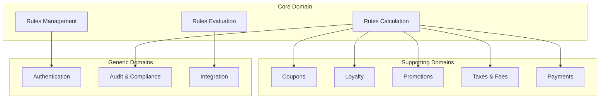

# Rules Engine - Product Requirements Document

[](./LICENSE)
[](./rules-engine-structured-prd/README.md)
[](./rules-engine-structured-prd/README.md)

## Overview

⚠️ **CONFIDENTIAL - PROPRIETARY SOFTWARE** ⚠️

This repository contains the comprehensive Product Requirements Document (PRD) for a enterprise-grade Rules Engine system. The PRD follows Domain-Driven Design (DDD) principles and provides complete specifications for implementing a high-performance, scalable rules management platform.

**Access to this repository is restricted to authorized personnel only. This software and documentation are proprietary and confidential.**

## 🚀 Features

The Rules Engine supports the following bounded contexts:

- **🎫 Coupons Management**: Coupon creation, validation, and fraud prevention
- **⭐ Loyalty Programs**: Customer tier management and rewards processing  
- **🎯 Promotions**: Campaign management and promotional rule execution
- **💳 Payments**: Payment processing rules and optimization
- **💸 Taxes & Fees**: Multi-jurisdiction tax calculation and compliance
- **⚡ Core Engine**: High-performance rule evaluation and conflict resolution

## 📋 Document Structure

```
rules-engine-structured-prd/
├── 01-executive-summary/          # Business vision and objectives
├── 02-general-description/        # Product overview and requirements
├── 03-functional-models-ddd/      # Domain-driven design models
├── 04-functional-requirements/    # Feature specifications
│   └── features/                  # Individual bounded contexts
│       ├── FEAT-0001-rule-creation-management/
│       ├── FEAT-0002-rule-evaluation-engine/
│       ├── FEAT-0003-rule-approval-workflow/
│       ├── FEAT-0004-taxes-and-fees/
│       ├── FEAT-0005-rule-evaluator-calculator/
│       ├── FEAT-0006-coupons-management/
│       ├── FEAT-0007-loyalty-management/
│       ├── FEAT-0008-promotions-management/
│       └── FEAT-0009-payments-rules/
├── 05-technical-requirements/     # Technical specifications & DSL
├── 06-non-functional-requirements/ # Performance and quality specs
├── 07-ui-ux/                     # User interface requirements
├── 08-success-metrics/           # KPIs and measurement framework
├── 09-appendices/                # Additional documentation
└── DDD/                          # Domain-driven design documentation
    ├── docs/                     # Strategic and tactical design
    └── diagrams/                 # Context maps and domain models
```

## 🔧 Technical Highlights

### Domain-Specific Language (DSL)
The project includes a complete DSL specification with ANTLR4 grammar for business rule authoring:

```dsl
IF customer.tier = "GOLD" AND purchase.amount > 100 
THEN discount := 15%
```

### Performance Requirements
- **Response Time**: <500ms for 95% of rule evaluations
- **Throughput**: 1000+ transactions per second sustained
- **Availability**: 99.9% uptime
- **Scalability**: Horizontal scaling support

### Integration Patterns
- **Event-Driven Architecture**: Loose coupling between bounded contexts
- **API-First Design**: OpenAPI specifications for all integrations
- **Multi-Channel Support**: Web, mobile, POS, and API interfaces

## 📚 Documentation Standards

This PRD follows comprehensive documentation standards:

- ✅ **Complete Feature Coverage**: All bounded contexts fully specified
- ✅ **DDD Compliance**: Strategic and tactical design patterns
- ✅ **Test Specifications**: Unit, functional, and behavioral tests
- ✅ **Traceability**: Complete requirements-to-implementation mapping
- ✅ **Mermaid Diagrams**: Visual documentation throughout

## 🛠️ Getting Started

### Prerequisites
- Understanding of Domain-Driven Design principles
- Familiarity with business rules management systems
- Knowledge of enterprise software architecture

### Reading the Documentation
1. Start with the [Executive Summary](./rules-engine-structured-prd/01-executive-summary/README.md)
2. Review the [Domain Models](./rules-engine-structured-prd/DDD/README.md)
3. Explore individual [Feature Specifications](./rules-engine-structured-prd/04-functional-requirements/README.md)
4. Understand the [DSL Grammar](./rules-engine-structured-prd/05-technical-requirements/DSL-GRAMMAR-SPECIFICATION.md)

### Implementation Guidance
The PRD provides implementation-ready specifications including:
- Complete domain models with aggregates and value objects
- API contracts and integration patterns
- Test cases and acceptance criteria
- Performance benchmarks and optimization guidelines

## 🏗️ Architecture Overview



## 📊 Business Value

### Expected Outcomes
- **40% reduction** in rule development time
- **95% improvement** in rule evaluation performance
- **60% increase** in business user productivity
- **99.9% system availability** with enterprise-grade reliability

### Key Performance Indicators
- Rule creation time: <30 minutes for complex rules
- Rule validation: <2 seconds for syntax and semantic checks
- Campaign deployment: <15 minutes from approval to production
- Customer engagement: 45% increase in loyalty program participation

## 🤝 Contributing

This PRD is designed for collaborative development:

1. **Business Analysts**: Use feature specifications for requirement gathering
2. **Architects**: Reference domain models and integration patterns
3. **Developers**: Follow implementation guidelines and test specifications
4. **Product Managers**: Track success metrics and business outcomes

### Documentation Updates
- Follow the established PRD structure and standards
- Include Mermaid diagrams for visual specifications
- Maintain traceability between requirements and implementations
- Update context maps when adding new bounded contexts

## 📄 License

This project is proprietary and confidential. All rights reserved. See the [LICENSE](LICENSE) file for complete terms and restrictions.

**⚠️ CONFIDENTIAL - AUTHORIZED ACCESS ONLY**

## 📞 Support

For questions about this PRD or implementation guidance:

- Review the comprehensive documentation in each section
- Check the [DDD documentation](./rules-engine-structured-prd/DDD/README.md) for domain understanding
- Refer to the [DSL specification](./rules-engine-structured-prd/05-technical-requirements/DSL-GRAMMAR-SPECIFICATION.md) for rule authoring

## 🚀 Implementation Roadmap

### Phase 1: Core Engine (Months 1-3)
- Rules Management and Evaluation Engine
- Basic DSL implementation
- Core API development

### Phase 2: Business Domains (Months 4-6)
- Coupons and Promotions implementation
- Loyalty program integration
- Tax calculation engine

### Phase 3: Advanced Features (Months 7-9)
- Payment rules optimization
- Advanced analytics and reporting
- Multi-tenant capabilities

### Phase 4: Enterprise Features (Months 10-12)
- Advanced fraud detection
- Machine learning integration
- Global scaling and compliance

---

**Note**: This PRD provides comprehensive specifications for enterprise-grade rules engine development. All documentation follows industry best practices and provides implementation-ready guidance for development teams.
