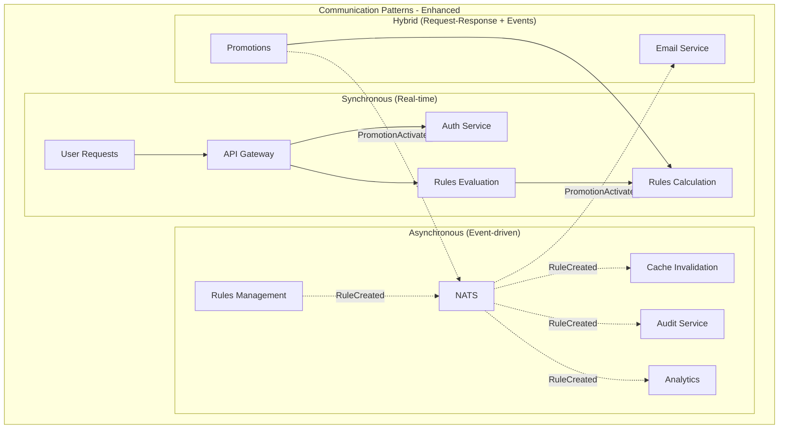

# Rules Engine - Improvement Recommendations

## Overview

This document provides specific, actionable recommendations to improve the Rules Engine architecture design in three critical areas that scored below excellence in the comprehensive review.

## 1. Technical Specifications ★★★★☆ (4/5) - Complete, with some minor gaps

### Current State Assessment
The technical specifications are comprehensive and well-structured, but several important gaps prevent achieving a perfect score.

### 🎯 **Priority 1: Database Architecture Enhancements**

#### 1.1 Database Scaling Strategy
**Current Gap**: No clear strategy for horizontal scaling and performance optimization.

**Recommended Improvements:**

```yaml
# Database Scaling Configuration
postgresql_cluster:
  primary_node:
    instance_type: "db.r5.xlarge"
    storage: "1TB SSD"
    max_connections: 200
  
  read_replicas:
    count: 3
    instance_type: "db.r5.large"
    lag_threshold: "100ms"
    auto_failover: true
  
  sharding_strategy:
    rules_table:
      shard_key: "tenant_id"
      shards: 4
      rebalancing: "automatic"
    
    audit_logs:
      shard_key: "created_date"
      retention: "7_years"
      archival: "s3_glacier"
```

**Implementation Tasks:**
1. **Define read replica strategy** for each service database
2. **Implement connection pooling** with PgBouncer or similar
3. **Create database performance monitoring** with custom metrics
4. **Design data archival strategy** for audit logs and historical data

#### 1.2 Service Communication Patterns
**Current Gap**: Inconsistent patterns for synchronous vs asynchronous communication.

**Recommended Specification:**



**Implementation Guidelines:**
```go
// Service Communication Standards
type CommunicationPattern string

const (
    Synchronous  CommunicationPattern = "sync"   // <300ms SLA
    Asynchronous CommunicationPattern = "async"  // Event-driven
    Hybrid       CommunicationPattern = "hybrid" // Both patterns
)

// Service Communication Matrix
var ServiceCommunication = map[string]map[string]CommunicationPattern{
    "rules-management": {
        "rules-calculation": Asynchronous,
        "audit-service":     Asynchronous,
        "cache-service":     Asynchronous,
    },
    "rules-evaluation": {
        "rules-calculation": Synchronous,
        "analytics":         Asynchronous,
        "audit-service":     Asynchronous,
    },
}
```

### 🎯 **Priority 2: Performance Specifications**

#### 2.1 Detailed Performance Requirements
**Current Gap**: Generic performance targets without service-specific SLAs.

**Enhanced Performance Matrix:**

| Service | Response Time | Throughput | Availability | Error Rate | Resource Limits |
|---------|---------------|------------|--------------|------------|-----------------|
| Rules Management | <200ms (CRUD) | 500 RPS | 99.9% | <0.1% | 512MB RAM |
| Rules Calculation | <500ms (complex) | 1000+ TPS | 99.95% | <0.01% | 2GB RAM |
| Rules Evaluation | <300ms (95th) | 2000+ RPS | 99.95% | <0.05% | 1GB RAM |
| Promotions | <150ms (queries) | 800 RPS | 99.9% | <0.1% | 512MB RAM |
| Loyalty | <200ms (updates) | 600 RPS | 99.9% | <0.1% | 512MB RAM |
| Coupons | <100ms (validation) | 1500 RPS | 99.95% | <0.01% | 512MB RAM |
| Taxes | <300ms (calculation) | 800 RPS | 99.9% | <0.1% | 1GB RAM |
| Payments | <250ms (processing) | 500 RPS | 99.99% | <0.001% | 1GB RAM |
| Calculator | <50ms (basic) | 10000+ ops/s | 99.9% | <0.01% | 256MB RAM |

#### 2.2 Caching Strategy Specification
**Current Gap**: Generic caching mentions without detailed implementation.

**Comprehensive Caching Strategy:**

```yaml
# Multi-Level Caching Configuration
caching_strategy:
  level_1_memory:
    technology: "Go sync.Map + TTL"
    size_limit: "128MB per service"
    ttl: "5 minutes"
    use_cases: ["frequently_accessed_rules", "user_sessions"]
  
  level_2_redis:
    technology: "Redis Cluster"
    nodes: 3
    memory_per_node: "4GB"
    ttl: "1 hour"
    use_cases: ["calculation_results", "user_profiles", "promotion_data"]
  
  level_3_database:
    technology: "PostgreSQL with indexes"
    query_cache: "enabled"
    materialized_views: "for_complex_aggregations"
    use_cases: ["master_data", "audit_logs", "historical_analytics"]

# Cache Invalidation Patterns
invalidation_patterns:
  rule_updates:
    trigger: "RuleUpdated event"
    scope: "tenant_specific"
    cascade: ["calculation_cache", "evaluation_cache"]
  
  promotion_changes:
    trigger: "PromotionModified event"
    scope: "campaign_specific"
    cascade: ["promotion_cache", "discount_cache"]
```

### 🎯 **Priority 3: API Specifications Enhancement**

#### 3.1 API Gateway Configuration
**Current Gap**: High-level API Gateway mention without detailed configuration.

**Enhanced API Gateway Specification:**

```yaml
# API Gateway Configuration (Kong/Ambassador/Istio)
api_gateway:
  rate_limiting:
    default: "1000 requests/minute/user"
    premium: "5000 requests/minute/user"
    service_specific:
      rules_evaluation: "2000 requests/minute/user"
      rules_calculation: "500 requests/minute/user"
  
  authentication:
    jwt:
      issuer: "rules-engine-auth"
      algorithm: "RS256"
      expiry: "24 hours"
      refresh: "7 days"
  
  load_balancing:
    algorithm: "round_robin"
    health_checks:
      interval: "30 seconds"
      timeout: "5 seconds"
      unhealthy_threshold: 3
  
  circuit_breaker:
    failure_threshold: "50%"
    timeout: "30 seconds"
    half_open_max_calls: 10
```

## 2. Security Framework ★★★☆☆ (3/5) - Basic measures, needs improvement

### Current State Assessment
Basic authentication and input validation are implemented, but critical enterprise security measures are missing.

### 🎯 **Priority 1: Data Protection & Encryption**

#### 1.1 Comprehensive Encryption Strategy
**Current Gap**: No data encryption specifications.

**Required Encryption Implementation:**

```yaml
# Encryption Configuration
encryption:
  data_at_rest:
    database:
      technology: "AES-256-GCM"
      key_management: "HashiCorp Vault"
      rotation_schedule: "quarterly"
      compliance: ["FIPS 140-2", "Common Criteria"]
    
    file_storage:
      technology: "AES-256-CBC"
      key_per_tenant: true
      automatic_key_rotation: true
  
  data_in_transit:
    internal_services:
      protocol: "TLS 1.3"
      certificate_authority: "internal_ca"
      mutual_tls: true
    
    external_apis:
      protocol: "TLS 1.3"
      certificate_validation: "strict"
      pinning: "enabled"
  
  application_level:
    sensitive_fields:
      - "customer_pii"
      - "payment_information"
      - "rule_business_logic"
    encryption_library: "AWS KMS / Azure Key Vault"
```

#### 1.2 Secret Management Implementation
**Current Gap**: No centralized secret management strategy.

**Comprehensive Secret Management:**

```yaml
# Secret Management with HashiCorp Vault
vault_configuration:
  authentication:
    kubernetes_auth: true
    service_accounts: true
    lease_duration: "1 hour"
  
  secret_engines:
    database_credentials:
      engine: "database"
      rotation: "daily"
      temp_credentials: true
    
    api_keys:
      engine: "kv-v2"
      versioning: true
      access_policies: "service_specific"
    
    certificates:
      engine: "pki"
      auto_renewal: true
      validity: "90 days"

# Kubernetes Secret Management
k8s_secrets:
  sealed_secrets: true
  external_secrets_operator: true
  secret_rotation: "automated"
  secret_scanning: "enabled"
```

### 🎯 **Priority 2: Authentication & Authorization**

#### 2.1 Enhanced Authentication Framework
**Current Gap**: Basic JWT without comprehensive auth flows.

**Multi-Factor Authentication Implementation:**

```go
// Enhanced Authentication Framework
type AuthenticationConfig struct {
    JWT struct {
        Algorithm    string        `yaml:"algorithm"`
        Expiry      time.Duration `yaml:"expiry"`
        RefreshTTL  time.Duration `yaml:"refresh_ttl"`
        Issuer      string        `yaml:"issuer"`
    } `yaml:"jwt"`
    
    MFA struct {
        Enabled     bool     `yaml:"enabled"`
        Methods     []string `yaml:"methods"` // ["totp", "sms", "email"]
        Required    bool     `yaml:"required"`
        GracePeriod int      `yaml:"grace_period_days"`
    } `yaml:"mfa"`
    
    OAuth2 struct {
        Providers   []string `yaml:"providers"` // ["google", "microsoft", "okta"]
        PKCE        bool     `yaml:"pkce"`
        Scopes      []string `yaml:"scopes"`
    } `yaml:"oauth2"`
    
    SessionManagement struct {
        MaxSessions    int           `yaml:"max_sessions"`
        IdleTimeout    time.Duration `yaml:"idle_timeout"`
        AbsoluteTimeout time.Duration `yaml:"absolute_timeout"`
    } `yaml:"session_management"`
}
```

#### 2.2 Role-Based Access Control (RBAC) Enhancement
**Current Gap**: Generic RBAC without detailed permission matrix.

**Detailed RBAC Implementation:**

```yaml
# Enhanced RBAC Configuration
rbac_matrix:
  roles:
    super_admin:
      permissions: ["*"]
      restrictions: ["require_mfa", "audit_all_actions"]
    
    rules_admin:
      permissions:
        - "rules:create"
        - "rules:update"
        - "rules:delete"
        - "rules:approve"
        - "templates:manage"
      restrictions: ["ip_whitelist", "time_based_access"]
    
    business_analyst:
      permissions:
        - "rules:read"
        - "rules:test"
        - "analytics:view"
        - "reports:generate"
      restrictions: ["read_only", "data_masking"]
    
    campaign_manager:
      permissions:
        - "promotions:create"
        - "promotions:update"
        - "coupons:manage"
        - "loyalty:configure"
      restrictions: ["tenant_scoped", "approval_required"]

# Attribute-Based Access Control (ABAC)
abac_policies:
  data_access:
    customer_data:
      conditions: ["same_tenant", "gdpr_consent", "data_purpose"]
    financial_data:
      conditions: ["pci_compliance", "audit_trail", "encryption_required"]
  
  operation_access:
    rule_modification:
      conditions: ["business_hours", "approval_workflow", "change_window"]
    bulk_operations:
      conditions: ["elevated_permissions", "two_person_rule"]
```

### 🎯 **Priority 3: Security Monitoring & Compliance**

#### 3.1 Comprehensive Audit Framework
**Current Gap**: Limited audit logging without security event correlation.

**Enhanced Security Monitoring:**

```yaml
# Security Audit and Monitoring
security_monitoring:
  audit_events:
    authentication:
      - "login_success"
      - "login_failure"
      - "mfa_challenge"
      - "password_change"
      - "account_lockout"
    
    authorization:
      - "permission_granted"
      - "permission_denied"
      - "role_assignment"
      - "privilege_escalation_attempt"
    
    data_access:
      - "sensitive_data_access"
      - "bulk_data_export"
      - "rule_modification"
      - "configuration_change"
  
  security_analytics:
    anomaly_detection:
      - "unusual_login_patterns"
      - "abnormal_data_access"
      - "suspicious_rule_changes"
      - "unexpected_api_usage"
    
    threat_intelligence:
      - "known_malicious_ips"
      - "suspicious_user_agents"
      - "geo_location_anomalies"
    
    compliance_monitoring:
      - "gdpr_data_processing"
      - "pci_dss_transactions"
      - "sox_financial_controls"

# SIEM Integration
siem_integration:
  platforms: ["Splunk", "ELK Stack", "Azure Sentinel"]
  log_formats: ["CEF", "LEEF", "JSON"]
  real_time_alerting: true
  retention_period: "7 years"
```

#### 3.2 Compliance Framework Implementation
**Current Gap**: No compliance framework addressing regulations.

**Multi-Regulation Compliance:**

```yaml
# Compliance Framework
compliance_requirements:
  gdpr:
    data_mapping: "automated"
    consent_management: "granular"
    right_to_deletion: "automated"
    breach_notification: "72_hours"
    dpo_contact: "privacy@company.com"
  
  pci_dss:
    level: "Level 1" # >6M transactions annually
    requirements:
      - "encrypted_cardholder_data"
      - "secure_payment_processing"
      - "regular_security_testing"
      - "vulnerability_management"
    assessment_frequency: "annually"
  
  sox:
    financial_controls: "automated"
    change_management: "four_eyes_principle"
    audit_trail: "immutable"
    reporting: "quarterly"
  
  iso_27001:
    isms_framework: "implemented"
    risk_assessment: "annual"
    security_policies: "documented"
    incident_response: "tested"
```

## 3. Testing Strategy ★★★☆☆ (3/5) - Good unit tests, limited E2E

### Current State Assessment
Strong unit testing coverage is planned, but comprehensive integration and end-to-end testing strategies are underdeveloped.

### 🎯 **Priority 1: End-to-End Testing Framework**

#### 1.1 Comprehensive E2E Testing Architecture
**Current Gap**: Limited end-to-end testing coverage for business workflows.

**Complete E2E Testing Strategy:**

```yaml
# End-to-End Testing Framework
e2e_testing:
  test_environments:
    integration:
      purpose: "service_integration_testing"
      data: "synthetic_anonymized"
      external_services: "mocked"
    
    staging:
      purpose: "full_system_testing"
      data: "production_like"
      external_services: "sandbox"
    
    production:
      purpose: "smoke_testing"
      data: "live_data"
      external_services: "live"
  
  business_workflow_tests:
    rule_lifecycle:
      scenarios:
        - "create_rule_to_production"
        - "rule_approval_workflow"
        - "rule_rollback_scenario"
        - "bulk_rule_migration"
      
    promotion_management:
      scenarios:
        - "campaign_creation_to_activation"
        - "discount_calculation_accuracy"
        - "coupon_redemption_flow"
        - "loyalty_points_accumulation"
    
    customer_journey:
      scenarios:
        - "new_customer_onboarding"
        - "purchase_with_multiple_rules"
        - "loyalty_tier_progression"
        - "payment_processing_flow"
```

#### 1.2 Cross-Service Integration Testing
**Current Gap**: Limited testing of service interactions and data consistency.

**Integration Testing Implementation:**

```go
// Integration Testing Framework
type IntegrationTestSuite struct {
    Services     map[string]TestService
    Database     TestDatabase
    MessageBus   TestMessageBus
    ExternalAPIs TestExternalAPIs
}

// Cross-Service Test Scenarios
var CrossServiceTests = []IntegrationTest{
    {
        Name: "Rule Creation to Evaluation Flow",
        Steps: []TestStep{
            {Service: "rules-management", Action: "CreateRule", ExpectedEvents: []string{"RuleCreated"}},
            {Service: "rules-calculation", Action: "LoadRule", Verify: "RuleLoaded"},
            {Service: "rules-evaluation", Action: "EvaluateRule", ExpectedResult: "Success"},
        },
        DataConsistency: []string{"rules_table", "cache_invalidation", "audit_logs"},
    },
    {
        Name: "Promotion Activation to Customer Purchase",
        Steps: []TestStep{
            {Service: "promotions", Action: "ActivateCampaign", ExpectedEvents: []string{"CampaignActivated"}},
            {Service: "rules-evaluation", Action: "ProcessPurchase", ExpectedDiscount: "Applied"},
            {Service: "loyalty", Action: "AccumulatePoints", ExpectedPoints: "Calculated"},
        },
        DataConsistency: []string{"promotion_status", "customer_points", "transaction_log"},
    },
}
```

### 🎯 **Priority 2: Chaos Engineering & Resilience Testing**

#### 2.1 Chaos Engineering Implementation
**Current Gap**: No systematic failure testing or resilience validation.

**Comprehensive Chaos Engineering Strategy:**

```yaml
# Chaos Engineering Framework
chaos_engineering:
  tools:
    primary: "Chaos Mesh"
    alternatives: ["Litmus", "Gremlin", "Chaos Monkey"]
  
  failure_scenarios:
    infrastructure:
      - "pod_failure"
      - "node_failure"
      - "network_partition"
      - "disk_full"
      - "memory_pressure"
    
    application:
      - "service_unavailable"
      - "slow_responses"
      - "database_connection_failure"
      - "message_queue_failure"
      - "external_api_timeout"
    
    data:
      - "database_corruption"
      - "cache_inconsistency"
      - "message_loss"
      - "duplicate_messages"
  
  test_schedules:
    development: "daily"
    staging: "weekly"
    production: "monthly_controlled"
  
  recovery_validation:
    metrics:
      - "recovery_time_objective" # RTO < 5 minutes
      - "recovery_point_objective" # RPO < 1 minute
      - "mean_time_to_recovery" # MTTR < 10 minutes
    
    scenarios:
      - "automatic_failover"
      - "manual_intervention"
      - "partial_service_degradation"
      - "full_disaster_recovery"
```

#### 2.2 Performance & Load Testing
**Current Gap**: Basic performance testing without comprehensive load scenarios.

**Advanced Performance Testing Strategy:**

```yaml
# Performance Testing Framework
performance_testing:
  tools:
    load_testing: "K6"
    stress_testing: "Artillery"
    monitoring: "Grafana + Prometheus"
  
  test_scenarios:
    normal_load:
      description: "Typical business day traffic"
      duration: "1 hour"
      ramp_up: "5 minutes"
      users: 1000
      think_time: "1-3 seconds"
    
    peak_load:
      description: "Black Friday / Cyber Monday"
      duration: "4 hours"
      ramp_up: "15 minutes"
      users: 10000
      think_time: "0.5-2 seconds"
    
    stress_test:
      description: "Beyond normal capacity"
      duration: "30 minutes"
      ramp_up: "10 minutes"
      users: 15000
      think_time: "0.1-1 second"
    
    spike_test:
      description: "Sudden traffic spike"
      pattern: "instant_spike"
      duration: "10 minutes"
      users: "0 to 5000 in 30 seconds"
  
  performance_benchmarks:
    rules_evaluation:
      target_rps: 2000
      max_response_time: "300ms"
      error_rate: "<0.1%"
    
    rules_calculation:
      target_tps: 1000
      max_response_time: "500ms"
      cpu_utilization: "<80%"
      memory_usage: "<2GB"
```

### 🎯 **Priority 3: Test Automation & Quality Gates**

#### 3.1 Comprehensive Test Automation Pipeline
**Current Gap**: Basic testing without automated quality gates and comprehensive coverage.

**Complete Test Automation Strategy:**

```yaml
# Test Automation Pipeline
test_automation:
  pre_commit_hooks:
    - "unit_tests"
    - "code_coverage_check" # >80%
    - "static_code_analysis"
    - "security_scan"
    - "dependency_vulnerability_check"
  
  ci_pipeline:
    on_pull_request:
      - "unit_tests"
      - "integration_tests"
      - "contract_tests"
      - "security_tests"
      - "performance_regression_tests"
    
    on_merge_to_main:
      - "full_test_suite"
      - "e2e_tests"
      - "smoke_tests"
      - "deployment_tests"
  
  cd_pipeline:
    staging_deployment:
      - "e2e_test_suite"
      - "performance_benchmarks"
      - "security_penetration_tests"
      - "chaos_engineering_tests"
    
    production_deployment:
      - "smoke_tests"
      - "canary_deployment_tests"
      - "rollback_tests"
      - "monitoring_validation"

# Quality Gates
quality_gates:
  code_quality:
    test_coverage: ">80%"
    code_duplication: "<5%"
    technical_debt: "<30 minutes"
    maintainability_index: ">70"
  
  security:
    vulnerability_scan: "pass"
    dependency_check: "no_critical"
    secret_scan: "clean"
    compliance_check: "pass"
  
  performance:
    response_time: "<SLA"
    error_rate: "<0.1%"
    resource_usage: "within_limits"
    scalability: "meets_targets"
```

#### 3.2 Test Data Management
**Current Gap**: No comprehensive test data strategy for different environments.

**Test Data Management Strategy:**

```yaml
# Test Data Management
test_data_strategy:
  synthetic_data_generation:
    tools: ["Faker", "Mimesis", "custom_generators"]
    data_types:
      - "customer_profiles"
      - "transaction_history"
      - "rule_configurations"
      - "promotional_campaigns"
    
    privacy_compliance:
      - "no_real_customer_data"
      - "gdpr_compliant"
      - "anonymized_patterns"
  
  test_data_environments:
    development:
      size: "small_dataset" # 1K records
      refresh: "weekly"
      privacy: "synthetic_only"
    
    staging:
      size: "medium_dataset" # 100K records
      refresh: "daily"
      privacy: "anonymized_production_subset"
    
    integration:
      size: "large_dataset" # 1M records
      refresh: "on_demand"
      privacy: "synthetic_at_scale"
  
  data_versioning:
    version_control: "git_lfs"
    schema_evolution: "backward_compatible"
    data_lineage: "tracked"
    rollback_capability: "automated"
```

## Implementation Roadmap

### Phase 1: Security Foundation (Weeks 1-2)
1. Implement encryption framework
2. Setup secret management with Vault
3. Enhance authentication with MFA
4. Establish comprehensive audit logging

### Phase 2: Testing Infrastructure (Weeks 3-4)
1. Setup E2E testing framework
2. Implement chaos engineering tools
3. Create performance testing suite
4. Establish automated quality gates

### Phase 3: Technical Specifications Enhancement (Weeks 5-6)
1. Implement database scaling strategy
2. Enhance API Gateway configuration
3. Optimize caching mechanisms
4. Complete service communication patterns

### Phase 4: Validation & Refinement (Weeks 7-8)
1. Execute comprehensive testing
2. Validate security measures
3. Performance benchmark validation
4. Documentation and training

## Success Metrics

### Technical Specifications Improvement
- **Target Rating**: ★★★★★ (5/5)
- **Key Metrics**: Database performance, API response times, caching efficiency
- **Validation**: Load testing, performance benchmarks

### Security Framework Enhancement
- **Target Rating**: ★★★★★ (5/5)
- **Key Metrics**: Security audit score, compliance assessment, vulnerability scan results
- **Validation**: Penetration testing, compliance audit

### Testing Strategy Advancement
- **Target Rating**: ★★★★★ (5/5)
- **Key Metrics**: Test coverage, defect detection rate, deployment success rate
- **Validation**: Quality metrics, production incident reduction

## Conclusion

These recommendations address the specific gaps identified in the architecture review and provide a clear path to achieving excellence in all areas. Implementation of these improvements will result in a production-ready, enterprise-grade Rules Engine system that meets the highest standards for security, performance, and reliability.
