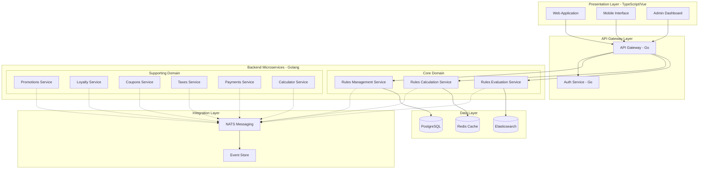

# Rules Engine - Structured Design

## Overview

This document provides the complete technical design for the Rules Engine system based on the Product Requirements Document (PRD). The design follows Domain-Driven Design (DDD) principles with microservices architecture implemented in Golang for backend services, NATS for messaging, and TypeScript/Vue for presentation layers.

## Architecture Overview



## Design Principles

### Backend Services (Golang)
- **Microservice Architecture**: Each bounded context as independent service
- **REST and gRPC APIs**: External REST, internal gRPC for performance
- **Domain-Driven Design**: Clear domain boundaries and aggregates
- **Event-Driven Communication**: NATS for async messaging
- **Minimum Viable Components**: Small, self-contained building blocks
- **Enterprise Security**: Comprehensive encryption, RBAC, and compliance framework
- **Performance Optimization**: Multi-level caching with sub-second response times

### Integration Layer
- **NATS Messaging**: Publish/subscribe for event-driven communication
- **Event Sourcing**: Complete audit trail and state reconstruction
- **API Gateway (Emissary-Ingress)**: Enhanced authentication, rate limiting, circuit breakers
- **Anti-Corruption Layer**: Protect domain integrity
- **Chaos Engineering**: Resilience testing and failure recovery validation

### Presentation Layer (TypeScript/Vue)
- **Component-Based Architecture**: Reusable UI components
- **Domain Entity Representation**: UI components for each entity type
- **CRUD Operations**: Complete Create, Read, Update, Delete interfaces
- **Responsive Design**: Mobile-first approach with Progressive Web App features
- **Type Safety**: Full TypeScript implementation
- **Comprehensive Testing**: E2E testing with business workflow validation

## Directory Structure

```
rules-engine-structured-design/
├── README.md
├── backend/
│   ├── microservices/
│   │   ├── rules-management/
│   │   ├── rules-calculation/
│   │   ├── rules-evaluation/
│   │   ├── promotions/
│   │   ├── loyalty/
│   │   ├── coupons/
│   │   ├── taxes/
│   │   ├── payments/
│   │   └── calculator/
│   ├── shared/
│   │   ├── domain/
│   │   ├── infrastructure/
│   │   └── protocols/
│   └── api-gateway/
├── integration/
│   ├── messaging/
│   ├── events/
│   └── external-apis/
├── frontend/
│   ├── web-app/
│   ├── admin-dashboard/
│   ├── mobile-interface/
│   └── shared-components/
└── deployment/
    ├── docker/
    ├── kubernetes/
    └── infrastructure/
```

## Implementation Strategy

### Phase 1: Core Infrastructure
1. API Gateway setup
2. Authentication service
3. NATS messaging infrastructure
4. Database setup and migrations

### Phase 2: Core Domain Services
1. Rules Management service
2. Rules Calculation service
3. Rules Evaluation service

### Phase 3: Supporting Domain Services
1. Promotions service
2. Loyalty service
3. Coupons service
4. Taxes service
5. Payments service
6. Calculator service

### Phase 4: Presentation Layer
1. Shared component library
2. Web application
3. Admin dashboard
4. Mobile interface

### Phase 5: Integration & Deployment
1. Service integration testing
2. Performance optimization
3. Production deployment
4. Monitoring and observability

## Component Specifications

### Backend Microservices (Golang)
- **[Rules Management Service](backend/microservices/rules-management/README.md)**: Rule lifecycle management, approval workflows, templates
- **[Rules Calculation Service](backend/microservices/rules-calculation/README.md)**: High-performance rule evaluation engine (<500ms, 1000+ TPS)
- **[Rules Evaluation Service](backend/microservices/rules-evaluation/README.md)**: External API gateway and result aggregation
- **[Promotions Service](backend/microservices/promotions/README.md)**: Promotional campaigns and discount calculation
- **[Loyalty Service](backend/microservices/loyalty/README.md)**: Customer loyalty programs and points management
- **[Coupons Service](backend/microservices/coupons/README.md)**: Coupon validation and redemption
- **[Taxes Service](backend/microservices/taxes/README.md)**: Tax calculation and compliance
- **[Payments Service](backend/microservices/payments/README.md)**: Payment rules and fraud detection
- **[Calculator Service](backend/microservices/calculator/README.md)**: Shared calculation engine

### Enhanced Framework Components
- **[Security Framework](backend/SECURITY-FRAMEWORK.md)**: Enterprise-grade security with encryption, RBAC, and compliance
- **[Testing Framework](backend/TESTING-FRAMEWORK.md)**: Comprehensive testing strategy with E2E, chaos engineering, and automation

### Integration Layer (NATS)
- **[Messaging Architecture](integration/README.md)**: Event-driven communication with NATS
- **[Event Schemas](integration/messaging/README.md)**: Domain events and message patterns
- **[External Integrations](integration/external-apis/README.md)**: Third-party API integration

### Frontend Applications (TypeScript/Vue)
- **[Shared Component Library](frontend/shared-components/README.md)**: Reusable components and types
- **[Web Application](frontend/web-app/README.md)**: Business user interface
- **[Admin Dashboard](frontend/admin-dashboard/README.md)**: System administration interface
- **[Mobile Interface](frontend/mobile-interface/README.md)**: Mobile-responsive interface

### Deployment and Infrastructure
- **[Docker Configuration](deployment/docker/README.md)**: Container definitions and development setup
- **[Kubernetes Deployment](deployment/kubernetes/README.md)**: Production orchestration
- **[Infrastructure](deployment/infrastructure/README.md)**: Database, cache, and monitoring setup

## Implementation Guide

### **[Complete Implementation Plan](IMPLEMENTATION-PLAN.md)**
Detailed 20-week plan with:
- **800 person-days** total effort
- **6 development phases** with clear deliverables
- **Minimum viable component tasks** with specific prompts
- **Team structure** and resource allocation
- **Risk management** and success criteria

### Quick Start
1. **Week 1-2**: Setup infrastructure (NATS, databases, monitoring)
2. **Week 3-6**: Build core domain services (Rules Management, Calculation, Evaluation)
3. **Week 7-10**: Implement supporting services (Promotions, Loyalty, Coupons, etc.)
4. **Week 11-16**: Develop frontend applications
5. **Week 17-18**: System integration and testing
6. **Week 19-20**: Production deployment and launch

### Key Features
- **Microservices Architecture**: 9 independent Golang services with enhanced scaling
- **Event-Driven Communication**: NATS messaging with event sourcing and chaos engineering
- **High Performance**: <500ms response time, 1000+ TPS throughput with multi-level caching
- **Enterprise Security**: AES-256 encryption, HashiCorp Vault, RBAC/ABAC, compliance framework
- **Comprehensive Testing**: E2E business workflows, chaos engineering, automated quality gates
- **Type-Safe Frontend**: Full TypeScript implementation with Vue 3 and PWA capabilities
- **Production Ready**: Emissary-Ingress gateway, comprehensive monitoring, automated deployment

## Development Standards

### Backend (Golang)
- **Framework**: Gin (REST), gRPC-Go (internal communication)
- **Database**: PostgreSQL with GORM
- **Caching**: Redis for high-performance data access
- **Messaging**: NATS JetStream for event persistence
- **Testing**: 80%+ unit test coverage with integration tests

### Frontend (TypeScript/Vue)
- **Framework**: Vue 3 Composition API with TypeScript
- **UI Library**: Quasar Framework for Material Design
- **State Management**: Pinia with type-safe stores
- **Testing**: Vitest (unit) + Cypress (E2E)
- **Build**: Vite for fast development and optimized production builds

### Integration
- **API Gateway**: Single entry point with authentication and routing
- **Event Sourcing**: Complete audit trail with event replay capabilities
- **Circuit Breakers**: Resilience patterns for service communication
- **Monitoring**: Prometheus metrics with Grafana dashboards

## Next Steps

1. **Review [Implementation Plan](IMPLEMENTATION-PLAN.md)** for detailed project execution
2. **Setup Development Environment** following Phase 1 guidelines
3. **Begin with Core Infrastructure** (NATS, databases, API gateway)
4. **Implement Core Domain Services** in dependency order
5. **Parallel Development** of supporting services and frontend components

This design provides a complete roadmap for building an enterprise-grade Rules Engine with microservices architecture, event-driven communication, and modern frontend technologies.
