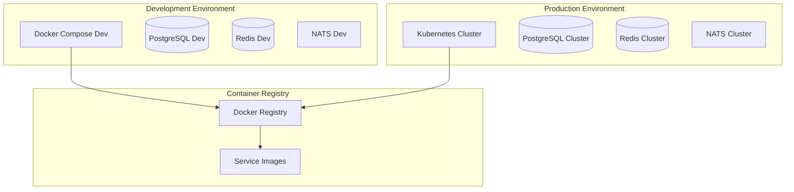

# Docker Configuration and Containerization

## Overview
This document provides comprehensive Docker configuration for all Rules Engine components, including microservices, databases, message brokers, and frontend applications. The configuration supports both development and production environments.

## Docker Architecture



## Base Images and Standards

### Golang Services Base Image
```dockerfile
# Dockerfile.base-go
FROM golang:1.21-alpine AS builder

# Install git and ca-certificates
RUN apk add --no-cache git ca-certificates tzdata

# Create non-root user
RUN adduser -D -g '' appuser

WORKDIR /build

# Copy go mod files
COPY go.mod go.sum ./

# Download dependencies
RUN go mod download

# Copy source code
COPY . .

# Build the binary
RUN CGO_ENABLED=0 GOOS=linux go build \
    -ldflags='-w -s -extldflags "-static"' \
    -a -installsuffix cgo \
    -o app ./cmd/main.go

# Final stage
FROM scratch

# Import from builder
COPY --from=builder /etc/ssl/certs/ca-certificates.crt /etc/ssl/certs/
COPY --from=builder /usr/share/zoneinfo /usr/share/zoneinfo
COPY --from=builder /etc/passwd /etc/passwd

# Copy binary
COPY --from=builder /build/app /app

# Use non-root user
USER appuser

# Expose port
EXPOSE 8080

# Health check
HEALTHCHECK --interval=30s --timeout=3s --start-period=5s --retries=3 \
    CMD ["/app", "health"]

# Run the binary
ENTRYPOINT ["/app"]
```

### Node.js Frontend Base Image
```dockerfile
# Dockerfile.base-node
FROM node:18-alpine AS builder

# Install dependencies for building
RUN apk add --no-cache python3 make g++

WORKDIR /app

# Copy package files
COPY package*.json ./

# Install dependencies
RUN npm ci --only=production

# Copy source code
COPY . .

# Build the application
RUN npm run build

# Production stage
FROM nginx:alpine

# Copy nginx configuration
COPY nginx.conf /etc/nginx/nginx.conf

# Copy built application
COPY --from=builder /app/dist /usr/share/nginx/html

# Create non-root user
RUN addgroup -g 1001 -S nodejs && adduser -S nextjs -u 1001

# Change ownership
RUN chown -R nextjs:nodejs /usr/share/nginx/html
RUN chown -R nextjs:nodejs /var/cache/nginx
RUN chown -R nextjs:nodejs /var/log/nginx
RUN chown -R nextjs:nodejs /etc/nginx/conf.d

# Use non-root user
USER nextjs

# Expose port
EXPOSE 3000

# Health check
HEALTHCHECK --interval=30s --timeout=3s --start-period=5s --retries=3 \
    CMD curl -f http://localhost:3000/health || exit 1

# Start nginx
CMD ["nginx", "-g", "daemon off;"]
```

## Service-Specific Dockerfiles

### Rules Management Service
```dockerfile
# backend/microservices/rules-management/Dockerfile
FROM rules-engine/base-go:latest AS base

# Service-specific configuration
ENV SERVICE_NAME=rules-management
ENV SERVICE_PORT=8080
ENV DB_HOST=postgres
ENV DB_PORT=5432
ENV DB_NAME=rules_management
ENV NATS_URL=nats://nats:4222

# Copy service binary
COPY --from=builder /build/rules-management /app

# Copy configuration files
COPY config/ /config/
COPY migrations/ /migrations/

# Expose service port
EXPOSE 8080

# Health check endpoint
HEALTHCHECK --interval=30s --timeout=10s --start-period=40s --retries=3 \
    CMD /app health || exit 1

# Labels for identification
LABEL service="rules-management" \
      version="1.0.0" \
      environment="production"

# Run service
CMD ["/app", "serve"]
```

### Rules Calculation Service
```dockerfile
# backend/microservices/rules-calculation/Dockerfile
FROM rules-engine/base-go:latest AS base

# Service-specific configuration
ENV SERVICE_NAME=rules-calculation
ENV SERVICE_PORT=8081
ENV GRPC_PORT=9081
ENV REDIS_HOST=redis
ENV REDIS_PORT=6379
ENV NATS_URL=nats://nats:4222

# Performance optimization for calculation service
ENV GOMAXPROCS=4
ENV GOGC=100

# Copy service binary
COPY --from=builder /build/rules-calculation /app

# Copy configuration
COPY config/ /config/

# Expose both HTTP and gRPC ports
EXPOSE 8081 9081

# Health check
HEALTHCHECK --interval=15s --timeout=5s --start-period=30s --retries=5 \
    CMD /app health || exit 1

# Resource limits
LABEL service="rules-calculation" \
      version="1.0.0" \
      cpu.limit="2000m" \
      memory.limit="2Gi"

CMD ["/app", "serve"]
```

### Web Application
```dockerfile
# frontend/web-app/Dockerfile
FROM rules-engine/base-node:latest AS base

# Application-specific configuration
ENV NODE_ENV=production
ENV API_BASE_URL=http://api-gateway:8080
ENV WS_URL=ws://api-gateway:8080/ws

# Copy built application
COPY --from=builder /app/dist /usr/share/nginx/html

# Copy nginx configuration
COPY nginx.conf /etc/nginx/nginx.conf
COPY nginx-default.conf /etc/nginx/conf.d/default.conf

# Expose port
EXPOSE 3000

# Health check
HEALTHCHECK --interval=30s --timeout=5s --start-period=10s --retries=3 \
    CMD curl -f http://localhost:3000/health || exit 1

# Labels
LABEL app="web-application" \
      version="1.0.0" \
      type="frontend"

CMD ["nginx", "-g", "daemon off;"]
```

## Development Docker Compose

### Main Compose File
```yaml
# docker-compose.yml
version: '3.8'

services:
  # Database Services
  postgres:
    image: postgres:15-alpine
    container_name: rules-postgres
    environment:
      POSTGRES_DB: rules_engine
      POSTGRES_USER: rules_user
      POSTGRES_PASSWORD: rules_password
      POSTGRES_MULTIPLE_EXTENSIONS: uuid-ossp,pgcrypto
    ports:
      - "5432:5432"
    volumes:
      - postgres_data:/var/lib/postgresql/data
      - ./database/init:/docker-entrypoint-initdb.d
    healthcheck:
      test: ["CMD-SHELL", "pg_isready -U rules_user -d rules_engine"]
      interval: 30s
      timeout: 10s
      retries: 5
    networks:
      - rules-network

  redis:
    image: redis:7-alpine
    container_name: rules-redis
    ports:
      - "6379:6379"
    volumes:
      - redis_data:/data
      - ./redis/redis.conf:/usr/local/etc/redis/redis.conf
    command: redis-server /usr/local/etc/redis/redis.conf
    healthcheck:
      test: ["CMD", "redis-cli", "ping"]
      interval: 30s
      timeout: 10s
      retries: 3
    networks:
      - rules-network

  # Message Broker
  nats:
    image: nats:2.10-alpine
    container_name: rules-nats
    ports:
      - "4222:4222"
      - "8222:8222"
      - "6222:6222"
    volumes:
      - ./nats/nats-server.conf:/etc/nats/nats-server.conf
      - nats_data:/data
    command: ["-c", "/etc/nats/nats-server.conf"]
    healthcheck:
      test: ["CMD", "nats", "server", "check"]
      interval: 30s
      timeout: 10s
      retries: 3
    networks:
      - rules-network

  # Search Engine
  elasticsearch:
    image: elasticsearch:8.11.0
    container_name: rules-elasticsearch
    environment:
      - discovery.type=single-node
      - "ES_JAVA_OPTS=-Xms512m -Xmx512m"
      - xpack.security.enabled=false
    ports:
      - "9200:9200"
    volumes:
      - elasticsearch_data:/usr/share/elasticsearch/data
    healthcheck:
      test: ["CMD-SHELL", "curl -f http://localhost:9200/_cluster/health || exit 1"]
      interval: 30s
      timeout: 10s
      retries: 5
    networks:
      - rules-network

  # Monitoring
  prometheus:
    image: prom/prometheus:latest
    container_name: rules-prometheus
    ports:
      - "9090:9090"
    volumes:
      - ./monitoring/prometheus.yml:/etc/prometheus/prometheus.yml
      - prometheus_data:/prometheus
    command:
      - '--config.file=/etc/prometheus/prometheus.yml'
      - '--storage.tsdb.path=/prometheus'
      - '--web.console.libraries=/etc/prometheus/console_libraries'
      - '--web.console.templates=/etc/prometheus/consoles'
      - '--storage.tsdb.retention.time=200h'
      - '--web.enable-lifecycle'
    networks:
      - rules-network

  grafana:
    image: grafana/grafana:latest
    container_name: rules-grafana
    ports:
      - "3001:3000"
    environment:
      - GF_SECURITY_ADMIN_PASSWORD=admin
    volumes:
      - grafana_data:/var/lib/grafana
      - ./monitoring/grafana:/etc/grafana/provisioning
    networks:
      - rules-network

  # Core Services
  api-gateway:
    build:
      context: ./backend/api-gateway
      dockerfile: Dockerfile
    container_name: rules-api-gateway
    ports:
      - "8080:8080"
    environment:
      - SERVICE_NAME=api-gateway
      - DB_HOST=postgres
      - REDIS_HOST=redis
      - NATS_URL=nats://nats:4222
    depends_on:
      postgres:
        condition: service_healthy
      redis:
        condition: service_healthy
      nats:
        condition: service_healthy
    healthcheck:
      test: ["CMD", "curl", "-f", "http://localhost:8080/health"]
      interval: 30s
      timeout: 10s
      retries: 3
    networks:
      - rules-network

  rules-management:
    build:
      context: ./backend/microservices/rules-management
      dockerfile: Dockerfile
    container_name: rules-management
    environment:
      - SERVICE_NAME=rules-management
      - DB_HOST=postgres
      - NATS_URL=nats://nats:4222
    depends_on:
      postgres:
        condition: service_healthy
      nats:
        condition: service_healthy
    healthcheck:
      test: ["CMD", "/app", "health"]
      interval: 30s
      timeout: 10s
      retries: 3
    networks:
      - rules-network

  rules-calculation:
    build:
      context: ./backend/microservices/rules-calculation
      dockerfile: Dockerfile
    container_name: rules-calculation
    environment:
      - SERVICE_NAME=rules-calculation
      - DB_HOST=postgres
      - REDIS_HOST=redis
      - NATS_URL=nats://nats:4222
      - GOMAXPROCS=2
    depends_on:
      postgres:
        condition: service_healthy
      redis:
        condition: service_healthy
      nats:
        condition: service_healthy
    deploy:
      resources:
        limits:
          cpus: '2.0'
          memory: 2G
        reservations:
          cpus: '1.0'
          memory: 1G
    healthcheck:
      test: ["CMD", "/app", "health"]
      interval: 15s
      timeout: 5s
      retries: 5
    networks:
      - rules-network

  # Frontend Applications
  web-app:
    build:
      context: ./frontend/web-app
      dockerfile: Dockerfile
    container_name: rules-web-app
    ports:
      - "3000:3000"
    environment:
      - NODE_ENV=development
      - API_BASE_URL=http://localhost:8080
    depends_on:
      - api-gateway
    healthcheck:
      test: ["CMD", "curl", "-f", "http://localhost:3000/health"]
      interval: 30s
      timeout: 10s
      retries: 3
    networks:
      - rules-network

volumes:
  postgres_data:
  redis_data:
  nats_data:
  elasticsearch_data:
  prometheus_data:
  grafana_data:

networks:
  rules-network:
    driver: bridge
    ipam:
      driver: default
      config:
        - subnet: 172.20.0.0/16
```

### Development Override
```yaml
# docker-compose.override.yml
version: '3.8'

services:
  # Development-specific overrides
  postgres:
    ports:
      - "5432:5432"
    environment:
      POSTGRES_DB: rules_engine_dev
      POSTGRES_USER: dev_user
      POSTGRES_PASSWORD: dev_password

  redis:
    ports:
      - "6379:6379"

  nats:
    ports:
      - "4222:4222"
      - "8222:8222"

  # Mount source code for development
  rules-management:
    volumes:
      - ./backend/microservices/rules-management:/app
      - /app/vendor
    environment:
      - ENV=development
      - LOG_LEVEL=debug
      - HOT_RELOAD=true

  rules-calculation:
    volumes:
      - ./backend/microservices/rules-calculation:/app
      - /app/vendor
    environment:
      - ENV=development
      - LOG_LEVEL=debug

  web-app:
    volumes:
      - ./frontend/web-app/src:/app/src
      - ./frontend/web-app/public:/app/public
    environment:
      - NODE_ENV=development
      - HOT_RELOAD=true
```

## Production Configuration

### Production Compose Template
```yaml
# docker-compose.prod.yml
version: '3.8'

services:
  # Production configurations
  postgres:
    image: postgres:15-alpine
    environment:
      POSTGRES_DB_FILE: /run/secrets/postgres_db
      POSTGRES_USER_FILE: /run/secrets/postgres_user
      POSTGRES_PASSWORD_FILE: /run/secrets/postgres_password
    secrets:
      - postgres_db
      - postgres_user
      - postgres_password
    deploy:
      replicas: 1
      resources:
        limits:
          cpus: '2.0'
          memory: 4G
        reservations:
          cpus: '1.0'
          memory: 2G
      restart_policy:
        condition: on-failure
        delay: 5s
        max_attempts: 3

  rules-calculation:
    image: rules-engine/rules-calculation:${VERSION:-latest}
    deploy:
      replicas: 3
      resources:
        limits:
          cpus: '2.0'
          memory: 2G
        reservations:
          cpus: '1.0'
          memory: 1G
      restart_policy:
        condition: on-failure
        delay: 5s
        max_attempts: 3
      update_config:
        parallelism: 1
        delay: 10s
        failure_action: rollback
      rollback_config:
        parallelism: 1
        delay: 5s

secrets:
  postgres_db:
    external: true
  postgres_user:
    external: true
  postgres_password:
    external: true
```

## Build and Development Scripts

### Makefile
```makefile
# Makefile
.PHONY: build dev prod clean test lint

# Variables
REGISTRY=your-registry.com/rules-engine
VERSION?=latest
ENV?=development

# Build all services
build:
	@echo "Building all services..."
	docker-compose build

# Build specific service
build-service:
	@echo "Building $(SERVICE)..."
	docker-compose build $(SERVICE)

# Development environment
dev:
	@echo "Starting development environment..."
	docker-compose up -d
	docker-compose logs -f

# Production environment
prod:
	@echo "Starting production environment..."
	docker-compose -f docker-compose.yml -f docker-compose.prod.yml up -d

# Stop all services
stop:
	@echo "Stopping all services..."
	docker-compose down

# Clean up
clean:
	@echo "Cleaning up..."
	docker-compose down -v --rmi all
	docker system prune -f

# Run tests
test:
	@echo "Running tests..."
	docker-compose exec rules-management go test ./...
	docker-compose exec rules-calculation go test ./...

# Database migrations
migrate:
	@echo "Running database migrations..."
	docker-compose exec rules-management /app migrate up

# Lint code
lint:
	@echo "Linting code..."
	docker-compose exec rules-management golangci-lint run
	docker-compose exec web-app npm run lint

# Push images to registry
push:
	@echo "Pushing images to registry..."
	docker tag rules-engine_rules-management $(REGISTRY)/rules-management:$(VERSION)
	docker push $(REGISTRY)/rules-management:$(VERSION)

# Health check all services
health:
	@echo "Checking service health..."
	curl -f http://localhost:8080/health || exit 1
	curl -f http://localhost:3000/health || exit 1

# View logs
logs:
	docker-compose logs -f $(SERVICE)

# Scale services
scale:
	docker-compose up -d --scale $(SERVICE)=$(REPLICAS)

# Backup database
backup:
	docker-compose exec postgres pg_dump -U rules_user rules_engine > backup_$(shell date +%Y%m%d_%H%M%S).sql

# Restore database
restore:
	docker-compose exec -T postgres psql -U rules_user rules_engine < $(BACKUP_FILE)
```

### Development Scripts
```bash
#!/bin/bash
# scripts/dev-setup.sh

set -e

echo "Setting up development environment..."

# Create directories
mkdir -p {logs,data/{postgres,redis,elasticsearch},monitoring/dashboards}

# Set permissions
chmod -R 755 data/
chmod -R 755 logs/

# Copy configuration files
cp config/development/* .

# Generate SSL certificates for development
if [ ! -f ssl/server.crt ]; then
    mkdir -p ssl
    openssl req -x509 -newkey rsa:4096 -keyout ssl/server.key -out ssl/server.crt -days 365 -nodes -subj "/CN=localhost"
fi

# Build and start services
make build
make dev

echo "Development environment ready!"
echo "Web App: http://localhost:3000"
echo "API Gateway: http://localhost:8080"
echo "Prometheus: http://localhost:9090"
echo "Grafana: http://localhost:3001"
```

## Multi-Stage Build Optimization

### Optimized Golang Dockerfile
```dockerfile
# Dockerfile.optimized
ARG GO_VERSION=1.21
ARG ALPINE_VERSION=3.18

# Build stage
FROM golang:${GO_VERSION}-alpine${ALPINE_VERSION} AS builder

# Install dependencies
RUN apk add --no-cache git ca-certificates tzdata

WORKDIR /build

# Copy go mod files first for better caching
COPY go.mod go.sum ./
RUN go mod download

# Copy source code
COPY . .

# Build with optimizations
RUN CGO_ENABLED=0 GOOS=linux GOARCH=amd64 go build \
    -a -installsuffix cgo \
    -ldflags='-w -s -extldflags "-static"' \
    -o app ./cmd/main.go

# Final stage - minimal image
FROM scratch

# Copy certificates and timezone data
COPY --from=builder /etc/ssl/certs/ca-certificates.crt /etc/ssl/certs/
COPY --from=builder /usr/share/zoneinfo /usr/share/zoneinfo

# Copy binary
COPY --from=builder /build/app /app

# Metadata
LABEL maintainer="Rules Engine Team" \
      version="1.0.0" \
      description="Rules Engine Microservice"

# Run as non-root
USER 65534

EXPOSE 8080

ENTRYPOINT ["/app"]
```

## Implementation Tasks

### Phase 1: Base Images and Standards (2-3 days)
1. **Create Base Images**
   - Build optimized Golang base image
   - Create Node.js frontend base image
   - Implement multi-stage builds for optimization
   - Add security scanning and vulnerability checks

2. **Development Environment**
   - Create comprehensive docker-compose setup
   - Add development-specific configurations
   - Implement hot reload for development
   - Create database seeding and migration scripts

### Phase 2: Service Containerization (3-4 days)
1. **Backend Services**
   - Create Dockerfiles for all 9 microservices
   - Implement health checks and monitoring
   - Add proper resource limits and constraints
   - Configure environment-specific variables

2. **Frontend Applications**
   - Containerize web application with nginx
   - Add admin dashboard containerization
   - Implement mobile interface container
   - Configure reverse proxy and SSL termination

### Phase 3: Production Configuration (2-3 days)
1. **Production Optimizations**
   - Create production docker-compose configurations
   - Implement secrets management
   - Add container security hardening
   - Configure logging and monitoring

2. **CI/CD Integration**
   - Create automated build pipelines
   - Implement image scanning and testing
   - Add deployment automation
   - Configure registry integration

## Estimated Development Time: 7-10 days
