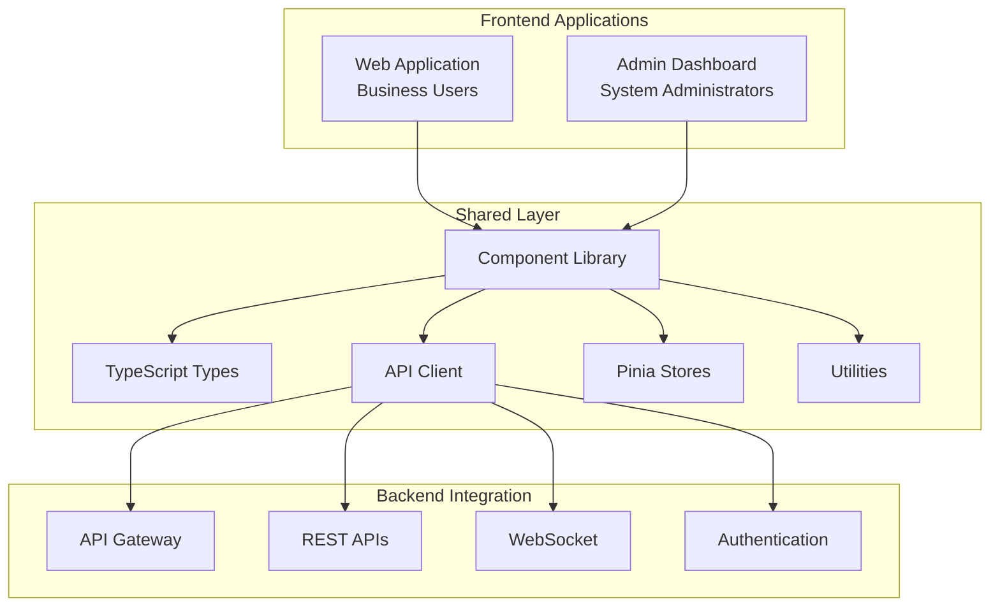

# Frontend Design - TypeScript & Vue.js

## Overview

The frontend layer consists of two main applications built with TypeScript and Vue.js 3 (Composition API), providing comprehensive interfaces for different user roles and use cases. Each application shares common components through a centralized component library.

## Architecture



## Technology Stack

### Core Technologies
- **Vue.js 3**: Composition API with `<script setup>`
- **TypeScript**: Full type safety and IntelliSense
- **Vite**: Fast development and optimized builds
- **Pinia**: State management with TypeScript support
- **Vue Router**: Type-safe routing

### UI Framework & Styling
- **Quasar Framework**: Component library with Material Design
- **SCSS**: Enhanced CSS with variables and mixins
- **CSS Grid & Flexbox**: Modern layout systems
- **Responsive Design**: Mobile-first approach

### Development Tools
- **ESLint**: Code linting with TypeScript rules
- **Prettier**: Code formatting
- **Vitest**: Unit testing framework
- **Cypress**: E2E testing
- **Storybook**: Component documentation

### Build & Deployment
- **Vite**: Module bundler and dev server
- **Docker**: Containerized deployment
- **Nginx**: Static file serving
- **PWA**: Progressive Web App capabilities

## Shared Component Library

### Core Components

#### Entity Components
```typescript
// Rule Entity Component
interface RuleEntityProps {
  rule: Rule
  mode: 'view' | 'edit' | 'create'
  readonly?: boolean
  onSave?: (rule: Rule) => void
  onCancel?: () => void
  onDelete?: (ruleId: string) => void
}

// Template Entity Component
interface TemplateEntityProps {
  template: RuleTemplate
  mode: 'view' | 'edit' | 'create'
  readonly?: boolean
  onSave?: (template: RuleTemplate) => void
  onCancel?: () => void
}

// Customer Entity Component
interface CustomerEntityProps {
  customer: Customer
  mode: 'view' | 'edit'
  readonly?: boolean
  onSave?: (customer: Customer) => void
}

// Transaction Entity Component
interface TransactionEntityProps {
  transaction: Transaction
  mode: 'view' | 'detail'
  readonly?: boolean
  showRuleResults?: boolean
}
```

#### CRUD Operation Components
```typescript
// Generic List Component
interface EntityListProps<T> {
  items: T[]
  columns: TableColumn[]
  loading?: boolean
  pagination?: PaginationConfig
  filters?: FilterConfig[]
  actions?: EntityAction[]
  onRowClick?: (item: T) => void
  onSort?: (column: string, direction: 'asc' | 'desc') => void
  onFilter?: (filters: Record<string, any>) => void
  onPaginate?: (page: number, limit: number) => void
}

// Generic Form Component
interface EntityFormProps<T> {
  entity?: T
  schema: FormSchema
  mode: 'create' | 'edit'
  loading?: boolean
  errors?: Record<string, string>
  onSubmit?: (data: T) => void
  onCancel?: () => void
  onFieldChange?: (field: string, value: any) => void
}

// Generic Detail Component
interface EntityDetailProps<T> {
  entity: T
  schema: DetailSchema
  loading?: boolean
  actions?: EntityAction[]
  onEdit?: () => void
  onDelete?: () => void
  onAction?: (action: string, entity: T) => void
}
```

### Component Structure
```
shared-components/
├── src/
│   ├── components/
│   │   ├── entities/              # Entity-specific components
│   │   │   ├── rule/
│   │   │   │   ├── RuleCard.vue
│   │   │   │   ├── RuleForm.vue
│   │   │   │   ├── RuleList.vue
│   │   │   │   ├── RuleDetail.vue
│   │   │   │   └── RuleDSLEditor.vue
│   │   │   ├── template/
│   │   │   │   ├── TemplateCard.vue
│   │   │   │   ├── TemplateForm.vue
│   │   │   │   ├── TemplateList.vue
│   │   │   │   └── TemplateSelector.vue
│   │   │   ├── customer/
│   │   │   │   ├── CustomerCard.vue
│   │   │   │   ├── CustomerDetail.vue
│   │   │   │   └── CustomerSelector.vue
│   │   │   ├── transaction/
│   │   │   │   ├── TransactionCard.vue
│   │   │   │   ├── TransactionDetail.vue
│   │   │   │   └── TransactionList.vue
│   │   │   ├── promotion/
│   │   │   │   ├── PromotionCard.vue
│   │   │   │   ├── PromotionForm.vue
│   │   │   │   └── PromotionCampaign.vue
│   │   │   ├── loyalty/
│   │   │   │   ├── LoyaltyTierCard.vue
│   │   │   │   ├── PointsDisplay.vue
│   │   │   │   └── RewardsPanel.vue
│   │   │   ├── coupon/
│   │   │   │   ├── CouponCard.vue
│   │   │   │   ├── CouponValidator.vue
│   │   │   │   └── CouponCampaign.vue
│   │   │   ├── tax/
│   │   │   │   ├── TaxRuleCard.vue
│   │   │   │   ├── TaxCalculator.vue
│   │   │   │   └── JurisdictionSelector.vue
│   │   │   └── payment/
│   │   │       ├── PaymentRuleCard.vue
│   │   │       ├── PaymentMethodSelector.vue
│   │   │       └── FraudIndicator.vue
│   │   ├── common/                # Generic reusable components
│   │   │   ├── forms/
│   │   │   │   ├── BaseForm.vue
│   │   │   │   ├── FormField.vue
│   │   │   │   ├── FormValidation.vue
│   │   │   │   └── FormActions.vue
│   │   │   ├── data/
│   │   │   │   ├── DataTable.vue
│   │   │   │   ├── DataList.vue
│   │   │   │   ├── DataCard.vue
│   │   │   │   └── DataPagination.vue
│   │   │   ├── navigation/
│   │   │   │   ├── MainNavigation.vue
│   │   │   │   ├── Breadcrumbs.vue
│   │   │   │   ├── TabNavigation.vue
│   │   │   │   └── StepNavigation.vue
│   │   │   ├── feedback/
│   │   │   │   ├── LoadingSpinner.vue
│   │   │   │   ├── ErrorMessage.vue
│   │   │   │   ├── SuccessMessage.vue
│   │   │   │   └── ConfirmDialog.vue
│   │   │   └── layout/
│   │   │       ├── AppLayout.vue
│   │   │       ├── ContentLayout.vue
│   │   │       ├── SidebarLayout.vue
│   │   │       └── ModalLayout.vue
│   │   └── composables/           # Vue 3 composables
│   │       ├── useApi.ts
│   │       ├── useAuth.ts
│   │       ├── useForm.ts
│   │       ├── useTable.ts
│   │       ├── usePagination.ts
│   │       └── useNotification.ts
│   ├── types/                     # TypeScript type definitions
│   │   ├── entities/
│   │   │   ├── Rule.ts
│   │   │   ├── Template.ts
│   │   │   ├── Customer.ts
│   │   │   ├── Transaction.ts
│   │   │   ├── Promotion.ts
│   │   │   ├── Loyalty.ts
│   │   │   ├── Coupon.ts
│   │   │   ├── Tax.ts
│   │   │   └── Payment.ts
│   │   ├── api/
│   │   │   ├── requests.ts
│   │   │   ├── responses.ts
│   │   │   └── errors.ts
│   │   └── common/
│   │       ├── forms.ts
│   │       ├── tables.ts
│   │       └── ui.ts
│   ├── stores/                    # Pinia stores
│   │   ├── auth.ts
│   │   ├── rules.ts
│   │   ├── templates.ts
│   │   ├── customers.ts
│   │   ├── transactions.ts
│   │   ├── promotions.ts
│   │   ├── loyalty.ts
│   │   ├── coupons.ts
│   │   ├── taxes.ts
│   │   └── payments.ts
│   ├── api/                       # API client
│   │   ├── client.ts
│   │   ├── auth.ts
│   │   ├── rules.ts
│   │   ├── templates.ts
│   │   ├── customers.ts
│   │   ├── transactions.ts
│   │   ├── promotions.ts
│   │   ├── loyalty.ts
│   │   ├── coupons.ts
│   │   ├── taxes.ts
│   │   └── payments.ts
│   └── utils/                     # Utility functions
│       ├── validators.ts
│       ├── formatters.ts
│       ├── constants.ts
│       └── helpers.ts
```

## Type Definitions

### Core Entity Types
```typescript
// Rule Entity
export interface Rule {
  id: string
  name: string
  description: string
  dslContent: string
  status: RuleStatus
  priority: Priority
  createdAt: string
  updatedAt: string
  createdBy: string
  approvedBy?: string
  approvedAt?: string
  version: number
  templateId?: string
  template?: RuleTemplate
  tags?: string[]
}

export type RuleStatus = 
  | 'DRAFT' 
  | 'UNDER_REVIEW' 
  | 'APPROVED' 
  | 'ACTIVE' 
  | 'INACTIVE' 
  | 'DEPRECATED'

export type Priority = 'LOW' | 'MEDIUM' | 'HIGH' | 'CRITICAL'

// Rule Template
export interface RuleTemplate {
  id: string
  name: string
  description: string
  category: string
  dslTemplate: string
  parameters: TemplateParameter[]
  isActive: boolean
  createdAt: string
  updatedAt: string
  createdBy: string
}

export interface TemplateParameter {
  id: string
  templateId: string
  name: string
  type: string
  description: string
  required: boolean
  defaultValue?: string
  validationRules?: ValidationRule[]
}

// Customer Entity
export interface Customer {
  id: string
  name: string
  email: string
  tier?: string
  segment?: string
  loyaltyPoints?: number
  registeredAt: string
  lastActive?: string
  attributes: Record<string, any>
}

// Transaction Entity
export interface Transaction {
  id: string
  customerId: string
  amount: number
  currency: string
  type: string
  channel: string
  location?: string
  timestamp: string
  products: Product[]
  status: TransactionStatus
  ruleResults?: RuleExecutionResult[]
}

export interface Product {
  id: string
  sku: string
  name: string
  category: string
  price: number
  quantity: number
  attributes: Record<string, any>
}

export type TransactionStatus = 'PENDING' | 'COMPLETED' | 'FAILED' | 'CANCELLED'

// Promotion Entity
export interface Promotion {
  id: string
  name: string
  description: string
  type: PromotionType
  discountType: DiscountType
  discountValue: number
  startDate: string
  endDate: string
  targetSegments: string[]
  budgetLimit?: number
  usageLimit?: number
  currentUsage: number
  status: PromotionStatus
  rules: Rule[]
}

export type PromotionType = 'PERCENTAGE' | 'FIXED_AMOUNT' | 'BUY_X_GET_Y' | 'BUNDLE'
export type DiscountType = 'PERCENTAGE' | 'FIXED' | 'FREE_SHIPPING'
export type PromotionStatus = 'DRAFT' | 'SCHEDULED' | 'ACTIVE' | 'PAUSED' | 'EXPIRED'

// Loyalty Entity
export interface LoyaltyProgram {
  id: string
  name: string
  description: string
  tiers: LoyaltyTier[]
  pointsExpiryDays?: number
  isActive: boolean
  rules: Rule[]
}

export interface LoyaltyTier {
  id: string
  name: string
  level: number
  requiredPoints: number
  benefitMultiplier: number
  benefits: string[]
  color: string
}

// Coupon Entity
export interface Coupon {
  id: string
  code: string
  name: string
  description: string
  type: CouponType
  discountType: DiscountType
  discountValue: number
  minimumAmount?: number
  maximumDiscount?: number
  startDate: string
  endDate: string
  usageLimit?: number
  currentUsage: number
  status: CouponStatus
  rules: Rule[]
}

export type CouponType = 'SINGLE_USE' | 'MULTI_USE' | 'UNLIMITED'
export type CouponStatus = 'ACTIVE' | 'INACTIVE' | 'EXPIRED' | 'EXHAUSTED'

// Tax Entity
export interface TaxRule {
  id: string
  name: string
  jurisdiction: TaxJurisdiction
  taxType: TaxType
  rate: number
  isPercentage: boolean
  applicableCategories: string[]
  exemptions: TaxExemption[]
  effectiveDate: string
  expiryDate?: string
  status: TaxRuleStatus
}

export interface TaxJurisdiction {
  id: string
  name: string
  code: string
  type: JurisdictionType
  parentId?: string
  boundaries?: GeographicBoundary
}

export type TaxType = 'SALES_TAX' | 'VAT' | 'GST' | 'SERVICE_TAX' | 'LUXURY_TAX'
export type JurisdictionType = 'COUNTRY' | 'STATE' | 'COUNTY' | 'CITY' | 'ZONE'
export type TaxRuleStatus = 'ACTIVE' | 'INACTIVE' | 'PENDING' | 'ARCHIVED'

// Payment Entity
export interface PaymentRule {
  id: string
  name: string
  description: string
  paymentMethods: PaymentMethod[]
  fraudRules: FraudRule[]
  routingRules: RoutingRule[]
  isActive: boolean
  priority: number
}

export interface PaymentMethod {
  id: string
  type: PaymentMethodType
  provider: string
  configuration: Record<string, any>
  isActive: boolean
  supportedCurrencies: string[]
  fees: PaymentFee[]
}

export type PaymentMethodType = 'CREDIT_CARD' | 'DEBIT_CARD' | 'DIGITAL_WALLET' | 'BANK_TRANSFER' | 'CRYPTO'

export interface FraudRule {
  id: string
  name: string
  conditions: FraudCondition[]
  actions: FraudAction[]
  severity: FraudSeverity
  isActive: boolean
}

export type FraudSeverity = 'LOW' | 'MEDIUM' | 'HIGH' | 'CRITICAL'
```

### API Types
```typescript
// API Request/Response Types
export interface ApiResponse<T> {
  success: boolean
  data?: T
  error?: string
  message?: string
  pagination?: PaginationInfo
}

export interface PaginationInfo {
  page: number
  limit: number
  total: number
  totalPages: number
}

export interface ListRequest {
  page?: number
  limit?: number
  sort?: string
  order?: 'asc' | 'desc'
  filters?: Record<string, any>
  search?: string
}

export interface CreateRuleRequest {
  name: string
  description: string
  dslContent: string
  priority: Priority
  templateId?: string
  tags?: string[]
}

export interface UpdateRuleRequest {
  name?: string
  description?: string
  dslContent?: string
  priority?: Priority
  tags?: string[]
}

export interface RuleValidationRequest {
  dslContent: string
  testData?: Record<string, any>
}

export interface RuleValidationResponse {
  isValid: boolean
  errors: ValidationError[]
  warnings: ValidationWarning[]
  testResults?: TestResult[]
}
```

### Form Schema Types
```typescript
export interface FormSchema {
  fields: FormField[]
  validation?: ValidationSchema
  layout?: FormLayout
}

export interface FormField {
  name: string
  label: string
  type: FieldType
  required?: boolean
  readonly?: boolean
  hidden?: boolean
  placeholder?: string
  helpText?: string
  options?: SelectOption[]
  validation?: FieldValidation
  dependsOn?: string[]
  conditional?: ConditionalRule
}

export type FieldType = 
  | 'text' 
  | 'email' 
  | 'password' 
  | 'number' 
  | 'textarea' 
  | 'select' 
  | 'multiselect' 
  | 'checkbox' 
  | 'radio' 
  | 'date' 
  | 'datetime' 
  | 'file' 
  | 'dsl-editor'

export interface SelectOption {
  label: string
  value: any
  disabled?: boolean
  group?: string
}
```

## Pinia Store Implementation

### Rules Store
```typescript
// stores/rules.ts
import { defineStore } from 'pinia'
import { ref, computed } from 'vue'
import { rulesApi } from '@/api/rules'
import type { Rule, RuleStatus, Priority, ListRequest, CreateRuleRequest, UpdateRuleRequest } from '@/types'

export const useRulesStore = defineStore('rules', () => {
  // State
  const rules = ref<Rule[]>([])
  const currentRule = ref<Rule | null>(null)
  const loading = ref(false)
  const error = ref<string | null>(null)
  const pagination = ref({
    page: 1,
    limit: 20,
    total: 0,
    totalPages: 0
  })

  // Getters
  const activeRules = computed(() => 
    rules.value.filter(rule => rule.status === 'ACTIVE')
  )
  
  const rulesByStatus = computed(() => (status: RuleStatus) =>
    rules.value.filter(rule => rule.status === status)
  )
  
  const rulesByPriority = computed(() => (priority: Priority) =>
    rules.value.filter(rule => rule.priority === priority)
  )

  // Actions
  const fetchRules = async (request: ListRequest = {}) => {
    loading.value = true
    error.value = null
    
    try {
      const response = await rulesApi.list(request)
      rules.value = response.data || []
      pagination.value = response.pagination || pagination.value
    } catch (err) {
      error.value = err instanceof Error ? err.message : 'Failed to fetch rules'
    } finally {
      loading.value = false
    }
  }

  const fetchRule = async (id: string) => {
    loading.value = true
    error.value = null
    
    try {
      const response = await rulesApi.get(id)
      currentRule.value = response.data || null
      return response.data
    } catch (err) {
      error.value = err instanceof Error ? err.message : 'Failed to fetch rule'
      throw err
    } finally {
      loading.value = false
    }
  }

  const createRule = async (request: CreateRuleRequest) => {
    loading.value = true
    error.value = null
    
    try {
      const response = await rulesApi.create(request)
      if (response.data) {
        rules.value.unshift(response.data)
        currentRule.value = response.data
      }
      return response.data
    } catch (err) {
      error.value = err instanceof Error ? err.message : 'Failed to create rule'
      throw err
    } finally {
      loading.value = false
    }
  }

  const updateRule = async (id: string, request: UpdateRuleRequest) => {
    loading.value = true
    error.value = null
    
    try {
      const response = await rulesApi.update(id, request)
      if (response.data) {
        const index = rules.value.findIndex(rule => rule.id === id)
        if (index !== -1) {
          rules.value[index] = response.data
        }
        if (currentRule.value?.id === id) {
          currentRule.value = response.data
        }
      }
      return response.data
    } catch (err) {
      error.value = err instanceof Error ? err.message : 'Failed to update rule'
      throw err
    } finally {
      loading.value = false
    }
  }

  const deleteRule = async (id: string) => {
    loading.value = true
    error.value = null
    
    try {
      await rulesApi.delete(id)
      rules.value = rules.value.filter(rule => rule.id !== id)
      if (currentRule.value?.id === id) {
        currentRule.value = null
      }
    } catch (err) {
      error.value = err instanceof Error ? err.message : 'Failed to delete rule'
      throw err
    } finally {
      loading.value = false
    }
  }

  const validateRule = async (dslContent: string, testData?: Record<string, any>) => {
    try {
      const response = await rulesApi.validate({ dslContent, testData })
      return response.data
    } catch (err) {
      error.value = err instanceof Error ? err.message : 'Failed to validate rule'
      throw err
    }
  }

  const submitForApproval = async (id: string) => {
    loading.value = true
    error.value = null
    
    try {
      const response = await rulesApi.submitForApproval(id)
      const index = rules.value.findIndex(rule => rule.id === id)
      if (index !== -1 && response.data) {
        rules.value[index] = { ...rules.value[index], status: 'UNDER_REVIEW' }
      }
      return response.data
    } catch (err) {
      error.value = err instanceof Error ? err.message : 'Failed to submit rule for approval'
      throw err
    } finally {
      loading.value = false
    }
  }

  const activateRule = async (id: string) => {
    loading.value = true
    error.value = null
    
    try {
      await rulesApi.activate(id)
      const index = rules.value.findIndex(rule => rule.id === id)
      if (index !== -1) {
        rules.value[index] = { ...rules.value[index], status: 'ACTIVE' }
      }
    } catch (err) {
      error.value = err instanceof Error ? err.message : 'Failed to activate rule'
      throw err
    } finally {
      loading.value = false
    }
  }

  const deactivateRule = async (id: string) => {
    loading.value = true
    error.value = null
    
    try {
      await rulesApi.deactivate(id)
      const index = rules.value.findIndex(rule => rule.id === id)
      if (index !== -1) {
        rules.value[index] = { ...rules.value[index], status: 'INACTIVE' }
      }
    } catch (err) {
      error.value = err instanceof Error ? err.message : 'Failed to deactivate rule'
      throw err
    } finally {
      loading.value = false
    }
  }

  const clearError = () => {
    error.value = null
  }

  const reset = () => {
    rules.value = []
    currentRule.value = null
    loading.value = false
    error.value = null
    pagination.value = {
      page: 1,
      limit: 20,
      total: 0,
      totalPages: 0
    }
  }

  return {
    // State
    rules: readonly(rules),
    currentRule: readonly(currentRule),
    loading: readonly(loading),
    error: readonly(error),
    pagination: readonly(pagination),
    
    // Getters
    activeRules,
    rulesByStatus,
    rulesByPriority,
    
    // Actions
    fetchRules,
    fetchRule,
    createRule,
    updateRule,
    deleteRule,
    validateRule,
    submitForApproval,
    activateRule,
    deactivateRule,
    clearError,
    reset
  }
})
```

## Component Examples

### Rule Form Component
```vue
<!-- components/entities/rule/RuleForm.vue -->
<template>
  <q-form @submit="handleSubmit" class="rule-form">
    <div class="row q-gutter-md">
      <div class="col-12 col-md-6">
        <q-input
          v-model="form.name"
          label="Rule Name"
          :rules="[rules.required, rules.minLength(3)]"
          outlined
          dense
        />
      </div>
      
      <div class="col-12 col-md-6">
        <q-select
          v-model="form.priority"
          label="Priority"
          :options="priorityOptions"
          outlined
          dense
          emit-value
          map-options
        />
      </div>
    </div>

    <div class="row q-gutter-md q-mt-sm">
      <div class="col-12">
        <q-input
          v-model="form.description"
          label="Description"
          type="textarea"
          rows="3"
          outlined
          dense
        />
      </div>
    </div>

    <div class="row q-gutter-md q-mt-sm">
      <div class="col-12">
        <DSLEditor
          v-model="form.dslContent"
          label="Rule DSL Content"
          :rules="[rules.required]"
          @validate="handleDSLValidation"
          :validation-errors="dslErrors"
        />
      </div>
    </div>

    <div class="row q-gutter-md q-mt-sm">
      <div class="col-12">
        <q-input
          v-model="form.tags"
          label="Tags (comma separated)"
          outlined
          dense
        />
      </div>
    </div>

    <div class="row q-gutter-md q-mt-md">
      <div class="col-auto">
        <q-btn
          type="submit"
          color="primary"
          :loading="loading"
          :disable="!isFormValid"
        >
          {{ mode === 'create' ? 'Create Rule' : 'Update Rule' }}
        </q-btn>
      </div>
      
      <div class="col-auto">
        <q-btn
          type="button"
          color="grey"
          flat
          @click="handleCancel"
        >
          Cancel
        </q-btn>
      </div>
      
      <div class="col-auto" v-if="mode === 'edit'">
        <q-btn
          type="button"
          color="orange"
          outline
          @click="handleTest"
          :loading="testing"
        >
          Test Rule
        </q-btn>
      </div>
    </div>

    <!-- Test Results Dialog -->
    <q-dialog v-model="showTestResults">
      <q-card style="min-width: 600px">
        <q-card-section>
          <div class="text-h6">Rule Test Results</div>
        </q-card-section>
        
        <q-card-section>
          <RuleTestResults :results="testResults" />
        </q-card-section>
        
        <q-card-actions align="right">
          <q-btn flat label="Close" v-close-popup />
        </q-card-actions>
      </q-card>
    </q-dialog>
  </q-form>
</template>

<script setup lang="ts">
import { ref, computed, watch } from 'vue'
import { useQuasar } from 'quasar'
import { useRulesStore } from '@/stores/rules'
import DSLEditor from '@/components/common/DSLEditor.vue'
import RuleTestResults from './RuleTestResults.vue'
import type { Rule, Priority, CreateRuleRequest, UpdateRuleRequest } from '@/types'

interface Props {
  rule?: Rule
  mode: 'create' | 'edit'
  templateId?: string
}

interface Emits {
  (e: 'save', rule: Rule): void
  (e: 'cancel'): void
}

const props = defineProps<Props>()
const emit = defineEmits<Emits>()

const $q = useQuasar()
const rulesStore = useRulesStore()

// Form state
const form = ref({
  name: '',
  description: '',
  dslContent: '',
  priority: 'MEDIUM' as Priority,
  tags: '',
  templateId: props.templateId
})

const loading = ref(false)
const testing = ref(false)
const dslErrors = ref<string[]>([])
const showTestResults = ref(false)
const testResults = ref(null)

// Options
const priorityOptions = [
  { label: 'Low', value: 'LOW' },
  { label: 'Medium', value: 'MEDIUM' },
  { label: 'High', value: 'HIGH' },
  { label: 'Critical', value: 'CRITICAL' }
]

// Validation rules
const rules = {
  required: (value: string) => !!value || 'This field is required',
  minLength: (min: number) => (value: string) => 
    value.length >= min || `Must be at least ${min} characters`
}

// Computed
const isFormValid = computed(() => {
  return form.value.name.trim() !== '' &&
         form.value.dslContent.trim() !== '' &&
         dslErrors.value.length === 0
})

// Watch for rule prop changes
watch(() => props.rule, (newRule) => {
  if (newRule) {
    form.value = {
      name: newRule.name,
      description: newRule.description,
      dslContent: newRule.dslContent,
      priority: newRule.priority,
      tags: newRule.tags?.join(', ') || '',
      templateId: newRule.templateId
    }
  }
}, { immediate: true })

// Methods
const handleSubmit = async () => {
  loading.value = true
  
  try {
    const tagsArray = form.value.tags
      ? form.value.tags.split(',').map(tag => tag.trim()).filter(Boolean)
      : []
    
    if (props.mode === 'create') {
      const request: CreateRuleRequest = {
        name: form.value.name,
        description: form.value.description,
        dslContent: form.value.dslContent,
        priority: form.value.priority,
        templateId: form.value.templateId,
        tags: tagsArray
      }
      
      const newRule = await rulesStore.createRule(request)
      emit('save', newRule)
      $q.notify({
        type: 'positive',
        message: 'Rule created successfully'
      })
    } else {
      const request: UpdateRuleRequest = {
        name: form.value.name,
        description: form.value.description,
        dslContent: form.value.dslContent,
        priority: form.value.priority,
        tags: tagsArray
      }
      
      const updatedRule = await rulesStore.updateRule(props.rule!.id, request)
      emit('save', updatedRule)
      $q.notify({
        type: 'positive',
        message: 'Rule updated successfully'
      })
    }
  } catch (error) {
    $q.notify({
      type: 'negative',
      message: 'Failed to save rule'
    })
  } finally {
    loading.value = false
  }
}

const handleCancel = () => {
  emit('cancel')
}

const handleDSLValidation = async (dslContent: string) => {
  if (!dslContent.trim()) {
    dslErrors.value = []
    return
  }
  
  try {
    const validation = await rulesStore.validateRule(dslContent)
    dslErrors.value = validation.errors.map(error => error.message)
  } catch (error) {
    dslErrors.value = ['Validation failed']
  }
}

const handleTest = async () => {
  testing.value = true
  
  try {
    // For testing, we'll use sample data
    const testData = {
      customer: { id: 'test-customer', tier: 'GOLD' },
      transaction: { amount: 100, currency: 'USD' },
      products: [{ id: 'test-product', category: 'electronics', price: 100 }]
    }
    
    const results = await rulesStore.validateRule(form.value.dslContent, testData)
    testResults.value = results
    showTestResults.value = true
  } catch (error) {
    $q.notify({
      type: 'negative',
      message: 'Failed to test rule'
    })
  } finally {
    testing.value = false
  }
}
</script>

<style scoped lang="scss">
.rule-form {
  .q-field {
    margin-bottom: 16px;
  }
}
</style>
```

## Implementation Tasks

### Phase 1: Shared Component Library Setup (4-5 days)
1. **Project Initialization**
   - Setup Vite + Vue 3 + TypeScript + Quasar
   - Configure ESLint, Prettier, and Vitest
   - Setup Storybook for component documentation
   - Configure build system for library distribution

2. **Type Definitions**
   - Create comprehensive TypeScript types for all entities
   - Define API request/response types
   - Create form schema and validation types
   - Implement generic utility types

3. **Base Components**
   - Implement generic form components (BaseForm, FormField)
   - Create data display components (DataTable, DataList)
   - Build navigation components (MainNav, Breadcrumbs)
   - Add feedback components (LoadingSpinner, ErrorMessage)

### Phase 2: Entity-Specific Components (6-8 days)
1. **Rule Components**
   - RuleCard, RuleForm, RuleList, RuleDetail
   - DSL Editor with syntax highlighting and validation
   - Rule test interface and results display
   - Rule approval workflow components

2. **Template Components**
   - TemplateCard, TemplateForm, TemplateSelector
   - Template parameter editor
   - Rule generation from template interface

3. **Domain Entity Components**
   - Customer, Transaction, Promotion components
   - Loyalty, Coupon, Tax, Payment components
   - CRUD operations for each entity type
   - Specialized views and forms for each domain

### Phase 3: Pinia Stores and API Client (3-4 days)
1. **API Client**
   - HTTP client with interceptors for auth and error handling
   - API methods for all entities and operations
   - Request/response type safety
   - Error handling and retry logic

2. **Pinia Stores**
   - Store for each entity type with full CRUD operations
   - Caching and state management
   - Error handling and loading states
   - Computed getters for filtered and sorted data

### Phase 4: Web Application (5-6 days)
1. **Application Shell**
   - Main layout with navigation and routing
   - Authentication integration
   - Dashboard with key metrics and quick actions
   - User profile and settings

2. **Rule Management Interface**
   - Rule listing with filtering and search
   - Rule creation and editing forms
   - Rule approval workflow interface
   - Rule testing and validation tools

3. **Domain-Specific Interfaces**
   - Promotion management interface
   - Loyalty program management
   - Coupon management interface
   - Tax and payment rule interfaces

### Phase 5: Admin Dashboard (4-5 days)
1. **Administrative Interface**
   - System configuration and settings
   - User management and permissions
   - Service monitoring and health checks
   - Performance metrics and analytics

2. **Advanced Features**
   - Bulk operations and data import/export
   - System logs and audit trails
   - Performance tuning and optimization tools
   - Integration management

### Phase 6: Enhanced Features (4-5 days)
1. **Progressive Web App Features**
   - Offline capability for key features
   - Push notifications
   - App-like experience
   - Background sync

2. **Advanced Integrations**
   - Real-time collaboration features
   - Advanced export capabilities
   - API documentation integration
   - Third-party service integrations

### Phase 7: Testing and Quality Assurance (4-5 days)
1. **Unit Testing**
   - Component unit tests with Vitest
   - Store unit tests
   - API client tests
   - Utility function tests

2. **Integration Testing**
   - E2E tests with Cypress
   - Component integration tests
   - API integration tests
   - User workflow tests

3. **Performance Testing**
   - Bundle size optimization
   - Runtime performance testing
   - Accessibility testing
   - Cross-browser testing

### Phase 8: Documentation and Deployment (3-4 days)
1. **Documentation**
   - Component documentation with Storybook
   - User guides and tutorials
   - Developer documentation
   - API documentation

2. **Deployment**
   - Docker containerization
   - CI/CD pipeline setup
   - Production build optimization
   - CDN configuration for static assets

## Estimated Development Time: 33-42 days
