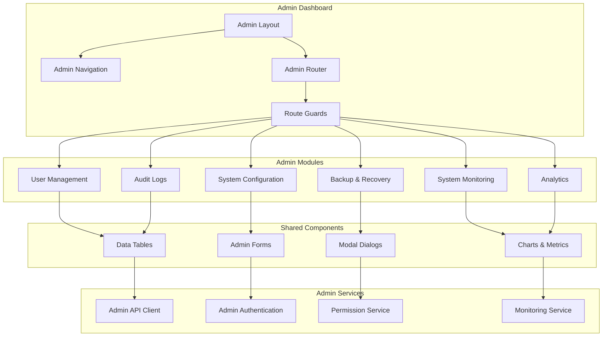

# Admin Dashboard - System Administration Interface

## Overview
The Admin Dashboard provides system administrators with comprehensive tools for managing the Rules Engine platform, including user management, system configuration, monitoring, and maintenance operations.

## Application Architecture



## Core Features

### 1. User Management
- **User Accounts**: Create, edit, and manage user accounts
- **Role Assignment**: Assign and modify user roles and permissions
- **Access Control**: Configure fine-grained access permissions
- **User Activity**: Monitor user login and activity patterns
- **Bulk Operations**: Import/export users, bulk role changes

### 2. System Configuration
- **Application Settings**: Configure system-wide settings
- **Feature Flags**: Enable/disable application features
- **Integration Settings**: Configure external service connections
- **Performance Tuning**: Adjust system performance parameters
- **Security Policies**: Configure security and compliance settings

### 3. System Monitoring
- **Real-time Metrics**: Live system performance metrics
- **Service Health**: Monitor microservice health and status
- **Resource Usage**: Track CPU, memory, and storage usage
- **API Performance**: Monitor API response times and error rates
- **Alert Management**: Configure and manage system alerts

### 4. Audit & Compliance
- **Audit Logs**: Comprehensive system and user activity logs
- **Compliance Reports**: Generate compliance and security reports
- **Data Retention**: Configure data retention policies
- **Export Capabilities**: Export audit data for external analysis
- **Security Events**: Monitor and respond to security events

### 5. Backup & Recovery
- **Backup Management**: Schedule and manage system backups
- **Recovery Operations**: Restore system from backups
- **Data Migration**: Import/export system data
- **Disaster Recovery**: Configure disaster recovery procedures
- **Version Control**: Manage system configuration versions

## Technology Stack

### Frontend Framework
- **Vue.js 3**: Composition API with `<script setup>`
- **TypeScript**: Full type safety for admin operations
- **Quasar Framework**: Admin-focused UI components
- **Pinia**: State management for admin data

### Admin-Specific Libraries
- **Chart.js**: Real-time monitoring charts
- **Date-fns**: Advanced date manipulation for logs
- **File-saver**: Export functionality for reports
- **Papa Parse**: CSV import/export for user data
- **Monaco Editor**: Configuration file editing

### Security & Authentication
- **JWT**: Admin session management
- **RBAC**: Role-based access control
- **2FA**: Two-factor authentication for admin accounts
- **Session Management**: Secure admin session handling

## Admin Dashboard Structure

```
admin-dashboard/
├── src/
│   ├── components/
│   │   ├── admin/              # Admin-specific components
│   │   │   ├── user-management/
│   │   │   │   ├── UserList.vue
│   │   │   │   ├── UserForm.vue
│   │   │   │   ├── UserPermissions.vue
│   │   │   │   ├── BulkUserActions.vue
│   │   │   │   └── UserActivity.vue
│   │   │   ├── system-config/
│   │   │   │   ├── ConfigEditor.vue
│   │   │   │   ├── FeatureFlags.vue
│   │   │   │   ├── IntegrationSettings.vue
│   │   │   │   ├── SecurityPolicies.vue
│   │   │   │   └── PerformanceSettings.vue
│   │   │   ├── monitoring/
│   │   │   │   ├── SystemMetrics.vue
│   │   │   │   ├── ServiceHealth.vue
│   │   │   │   ├── ResourceUsage.vue
│   │   │   │   ├── APIMetrics.vue
│   │   │   │   └── AlertManager.vue
│   │   │   ├── audit/
│   │   │   │   ├── AuditLogViewer.vue
│   │   │   │   ├── ComplianceReports.vue
│   │   │   │   ├── SecurityEvents.vue
│   │   │   │   ├── DataRetention.vue
│   │   │   │   └── ExportManager.vue
│   │   │   └── backup/
│   │   │       ├── BackupManager.vue
│   │   │       ├── RecoveryTools.vue
│   │   │       ├── DataMigration.vue
│   │   │       ├── VersionControl.vue
│   │   │       └── DisasterRecovery.vue
│   │   ├── charts/             # Admin-specific charts
│   │   │   ├── MetricsChart.vue
│   │   │   ├── PerformanceChart.vue
│   │   │   ├── UsageChart.vue
│   │   │   └── HealthChart.vue
│   │   ├── layout/             # Admin layout components
│   │   │   ├── AdminLayout.vue
│   │   │   ├── AdminSidebar.vue
│   │   │   ├── AdminHeader.vue
│   │   │   └── AdminFooter.vue
│   │   └── common/             # Shared admin components
│   │       ├── PermissionGuard.vue
│   │       ├── ConfigForm.vue
│   │       ├── DataExporter.vue
│   │       └── SystemNotification.vue
│   ├── views/                  # Admin screen views
│   │   ├── DashboardView.vue
│   │   ├── UserManagementView.vue
│   │   ├── SystemConfigView.vue
│   │   ├── MonitoringView.vue
│   │   ├── AuditView.vue
│   │   └── BackupView.vue
│   ├── stores/                 # Admin Pinia stores
│   │   ├── adminAuth.ts
│   │   ├── users.ts
│   │   ├── systemConfig.ts
│   │   ├── monitoring.ts
│   │   ├── audit.ts
│   │   └── backup.ts
│   ├── api/                    # Admin API clients
│   │   ├── adminClient.ts
│   │   ├── users.ts
│   │   ├── system.ts
│   │   ├── monitoring.ts
│   │   ├── audit.ts
│   │   └── backup.ts
│   ├── types/                  # Admin TypeScript types
│   │   ├── admin.ts
│   │   ├── users.ts
│   │   ├── system.ts
│   │   ├── monitoring.ts
│   │   ├── audit.ts
│   │   └── backup.ts
│   ├── router/
│   │   ├── index.ts
│   │   └── guards.ts
│   ├── composables/            # Admin-specific composables
│   │   ├── useAdminAuth.ts
│   │   ├── usePermissions.ts
│   │   ├── useMonitoring.ts
│   │   ├── useAudit.ts
│   │   └── useBackup.ts
│   └── utils/                  # Admin utilities
│       ├── permissions.ts
│       ├── exporters.ts
│       ├── validators.ts
│       └── formatters.ts
```

## Admin Type Definitions

### Core Admin Types
```typescript
// Admin User Management
export interface AdminUser {
  id: string
  username: string
  email: string
  firstName: string
  lastName: string
  roles: AdminRole[]
  permissions: Permission[]
  isActive: boolean
  lastLogin?: string
  createdAt: string
  updatedAt: string
  loginAttempts: number
  isLocked: boolean
  lockedUntil?: string
  mfaEnabled: boolean
}

export interface AdminRole {
  id: string
  name: string
  description: string
  permissions: Permission[]
  isSystem: boolean
  userCount: number
}

export interface Permission {
  id: string
  name: string
  resource: string
  action: string
  conditions?: Record<string, any>
}

// System Configuration
export interface SystemConfig {
  id: string
  category: string
  key: string
  value: any
  type: 'string' | 'number' | 'boolean' | 'json' | 'array'
  description: string
  isEditable: boolean
  requiresRestart: boolean
  updatedAt: string
  updatedBy: string
}

export interface FeatureFlag {
  id: string
  name: string
  key: string
  description: string
  isEnabled: boolean
  conditions?: Record<string, any>
  rolloutPercentage: number
  targetAudience: string[]
  createdAt: string
  updatedAt: string
}

// System Monitoring
export interface SystemMetrics {
  timestamp: string
  cpu: {
    usage: number
    load: number[]
  }
  memory: {
    used: number
    available: number
    percentage: number
  }
  disk: {
    used: number
    available: number
    percentage: number
  }
  network: {
    inbound: number
    outbound: number
  }
}

export interface ServiceHealth {
  serviceName: string
  status: 'healthy' | 'degraded' | 'unhealthy'
  uptime: number
  version: string
  lastCheck: string
  endpoints: EndpointHealth[]
  dependencies: DependencyHealth[]
}

export interface EndpointHealth {
  path: string
  method: string
  status: number
  responseTime: number
  lastCheck: string
}

// Audit & Compliance
export interface AuditLog {
  id: string
  timestamp: string
  userId: string
  username: string
  action: string
  resource: string
  resourceId?: string
  details: Record<string, any>
  ipAddress: string
  userAgent: string
  sessionId: string
  result: 'success' | 'failure' | 'error'
  errorMessage?: string
}

export interface ComplianceReport {
  id: string
  type: 'gdpr' | 'sox' | 'hipaa' | 'pci' | 'custom'
  title: string
  description: string
  period: {
    start: string
    end: string
  }
  status: 'generating' | 'completed' | 'failed'
  findings: ComplianceFinding[]
  generatedAt: string
  generatedBy: string
}

// Backup & Recovery
export interface BackupRecord {
  id: string
  type: 'full' | 'incremental' | 'differential'
  status: 'running' | 'completed' | 'failed'
  startTime: string
  endTime?: string
  size: number
  location: string
  description?: string
  metadata: Record<string, any>
  retentionDate: string
}

export interface RecoveryOperation {
  id: string
  backupId: string
  type: 'full' | 'partial'
  status: 'preparing' | 'running' | 'completed' | 'failed'
  startTime: string
  endTime?: string
  targetEnvironment: string
  recoveryPoints: string[]
  progress: number
  errorMessage?: string
}
```

## Admin Screen Specifications

### Admin Dashboard Screen
- **System Overview**: Key metrics and system health
- **Quick Actions**: Common administrative tasks
- **Recent Activity**: Latest system and user activities
- **Alerts Panel**: Critical system alerts and notifications
- **Resource Usage**: Real-time resource consumption

### User Management Screen
- **User List**: Searchable and filterable user table
- **User Creation**: Comprehensive user creation form
- **Role Management**: Role assignment and permission editing
- **Bulk Operations**: Import/export and bulk user actions
- **Activity Monitoring**: User login and activity tracking

### System Configuration Screen
- **Configuration Editor**: Hierarchical configuration tree
- **Feature Flags**: Toggle and configure feature flags
- **Integration Settings**: External service configurations
- **Security Policies**: Password policies and security rules
- **Performance Tuning**: System performance parameters

### Monitoring Screen
- **Real-time Metrics**: Live system performance dashboard
- **Service Health**: Microservice status and health checks
- **API Monitoring**: API performance and error tracking
- **Alert Configuration**: Setup and manage system alerts
- **Historical Analysis**: Performance trends and analysis

### Audit Screen
- **Audit Log Viewer**: Searchable audit log interface
- **Compliance Reports**: Generate and view compliance reports
- **Security Events**: Security incident tracking
- **Data Retention**: Configure audit data retention
- **Export Tools**: Export audit data in various formats

## Security & Permissions

### Admin Role Hierarchy
```typescript
enum AdminRoles {
  SUPER_ADMIN = 'super_admin',        // Full system access
  SYSTEM_ADMIN = 'system_admin',      // System configuration
  USER_ADMIN = 'user_admin',          // User management
  SECURITY_ADMIN = 'security_admin',  // Security and compliance
  MONITORING_ADMIN = 'monitoring_admin', // System monitoring
  BACKUP_ADMIN = 'backup_admin',      // Backup and recovery
  READ_ONLY_ADMIN = 'read_only_admin' // View-only access
}
```

### Permission Matrix
```typescript
const ADMIN_PERMISSIONS = {
  users: {
    create: ['super_admin', 'user_admin'],
    read: ['super_admin', 'user_admin', 'read_only_admin'],
    update: ['super_admin', 'user_admin'],
    delete: ['super_admin', 'user_admin'],
    bulk_operations: ['super_admin', 'user_admin']
  },
  system: {
    config_read: ['super_admin', 'system_admin', 'read_only_admin'],
    config_write: ['super_admin', 'system_admin'],
    feature_flags: ['super_admin', 'system_admin'],
    integrations: ['super_admin', 'system_admin'],
    security_policies: ['super_admin', 'security_admin']
  },
  monitoring: {
    view_metrics: ['super_admin', 'system_admin', 'monitoring_admin', 'read_only_admin'],
    configure_alerts: ['super_admin', 'monitoring_admin'],
    export_data: ['super_admin', 'monitoring_admin']
  },
  audit: {
    view_logs: ['super_admin', 'security_admin', 'read_only_admin'],
    export_logs: ['super_admin', 'security_admin'],
    compliance_reports: ['super_admin', 'security_admin'],
    retention_policies: ['super_admin', 'security_admin']
  },
  backup: {
    view_backups: ['super_admin', 'backup_admin', 'read_only_admin'],
    create_backup: ['super_admin', 'backup_admin'],
    restore_backup: ['super_admin', 'backup_admin'],
    configure_schedules: ['super_admin', 'backup_admin']
  }
}
```

## Implementation Tasks

### Phase 1: Admin Foundation (5-6 days)
1. **Admin Layout & Navigation**
   - Create admin-specific layout components
   - Implement admin navigation and routing
   - Setup permission-based route guards
   - Configure admin authentication flow

2. **User Management Module**
   - User list with advanced filtering
   - User creation and editing forms
   - Role and permission management
   - Bulk user operations

### Phase 2: System Configuration (4-5 days)
1. **Configuration Management**
   - Hierarchical configuration editor
   - Feature flag management interface
   - Integration settings configuration
   - Security policy configuration

2. **System Settings**
   - Application settings interface
   - Performance tuning controls
   - Environment configuration
   - Service dependencies

### Phase 3: Monitoring & Analytics (6-7 days)
1. **Real-time Monitoring**
   - System metrics dashboard
   - Service health monitoring
   - API performance tracking
   - Resource usage visualization

2. **Analytics & Reporting**
   - Usage analytics dashboard
   - Performance trend analysis
   - Custom report generation
   - Data export capabilities

### Phase 4: Audit & Compliance (4-5 days)
1. **Audit Logging**
   - Comprehensive audit log viewer
   - Advanced search and filtering
   - Audit trail visualization
   - Security event tracking

2. **Compliance Management**
   - Compliance report generation
   - Data retention policies
   - Privacy compliance tools
   - Audit data export

### Phase 5: Backup & Recovery (3-4 days)
1. **Backup Management**
   - Backup scheduling interface
   - Backup monitoring and status
   - Backup verification tools
   - Storage management

2. **Recovery Operations**
   - Recovery wizard interface
   - Point-in-time recovery
   - Disaster recovery procedures
   - Data migration tools

### Phase 6: Testing & Documentation (3-4 days)
1. **Testing & Quality Assurance**
   - Admin component unit tests
   - Integration testing for admin APIs
   - Security testing for admin functions
   - Performance testing for admin interface

2. **Documentation & Training**
   - Admin user guide
   - System administration procedures
   - Security and compliance documentation
   - Troubleshooting guides

## Estimated Development Time: 25-31 days

## Security Considerations

### Access Control
- Multi-factor authentication for admin accounts
- IP address restrictions for admin access
- Session timeout and concurrent session limits
- Audit logging for all admin actions

### Data Protection
- Encryption of sensitive configuration data
- Secure handling of user credentials
- Data masking in audit logs
- Secure backup encryption

### Compliance
- GDPR compliance for user data management
- SOX compliance for audit trails
- HIPAA compliance for healthcare environments
- PCI compliance for payment data

## Performance Optimizations

### Real-time Updates
- WebSocket connections for live metrics
- Efficient data streaming for large datasets
- Optimized chart rendering for performance
- Lazy loading for heavy admin components

### Data Management
- Server-side pagination for large datasets
- Client-side caching for frequently accessed data
- Optimized queries for admin operations
- Background processing for heavy operations
