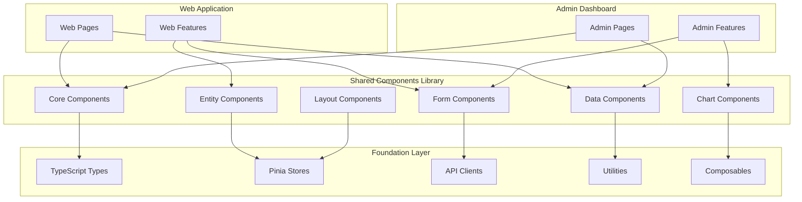

# Shared Components Library - Reusable UI Components

## Overview
The Shared Components Library provides a comprehensive set of reusable Vue 3 components built with TypeScript and Quasar Framework. These components are designed to be used across all frontend applications (Web App and Admin Dashboard) to ensure consistency and reduce development time.

## Architecture



## Component Categories

### 1. Core Components
Universal components used throughout the application

#### Basic UI Components
```typescript
// Button with loading states and variants
interface ButtonProps {
  label?: string
  icon?: string
  color?: string
  size?: 'xs' | 'sm' | 'md' | 'lg' | 'xl'
  variant?: 'filled' | 'outlined' | 'text' | 'unelevated'
  loading?: boolean
  disabled?: boolean
  type?: 'button' | 'submit' | 'reset'
  to?: string | RouteLocationRaw
  onClick?: () => void
}

// Enhanced Input with validation
interface InputProps {
  modelValue: string | number
  label?: string
  type?: 'text' | 'email' | 'password' | 'number' | 'tel' | 'url'
  placeholder?: string
  rules?: ValidationRule[]
  clearable?: boolean
  readonly?: boolean
  disabled?: boolean
  loading?: boolean
  prefix?: string
  suffix?: string
  mask?: string
  hint?: string
  errorMessage?: string
  dense?: boolean
  outlined?: boolean
}

// Select with search and multi-select
interface SelectProps<T = any> {
  modelValue: T | T[]
  options: SelectOption<T>[]
  label?: string
  multiple?: boolean
  clearable?: boolean
  searchable?: boolean
  createNew?: boolean
  loading?: boolean
  rules?: ValidationRule[]
  optionLabel?: string | ((option: T) => string)
  optionValue?: string | ((option: T) => any)
  groupBy?: string | ((option: T) => string)
  onFilter?: (query: string) => void
  onCreate?: (value: string) => void
}
```

#### Feedback Components
```typescript
// Loading spinner with customizable appearance
interface LoadingSpinnerProps {
  size?: string | number
  color?: string
  thickness?: number
  message?: string
  overlay?: boolean
  fullscreen?: boolean
}

// Error message with retry functionality
interface ErrorMessageProps {
  message?: string
  title?: string
  icon?: string
  color?: string
  showRetry?: boolean
  retryLabel?: string
  onRetry?: () => void
}

// Success notification
interface SuccessMessageProps {
  message: string
  title?: string
  icon?: string
  timeout?: number
  actions?: NotificationAction[]
}

// Confirm dialog with customizable actions
interface ConfirmDialogProps {
  title: string
  message: string
  confirmLabel?: string
  cancelLabel?: string
  confirmColor?: string
  icon?: string
  persistent?: boolean
  onConfirm: () => void | Promise<void>
  onCancel?: () => void
}
```

### 2. Entity Components
Components specifically designed for business entities

#### Rule Components
```vue
<!-- RuleCard.vue -->
<template>
  <q-card class="rule-card" :class="cardClasses">
    <q-card-section>
      <div class="rule-header">
        <div class="rule-title">
          <h4>{{ rule.name }}</h4>
          <div class="rule-metadata">
            <q-chip
              :color="getStatusColor(rule.status)"
              text-color="white"
              size="sm"
              :icon="getStatusIcon(rule.status)"
            >
              {{ rule.status }}
            </q-chip>
            
            <q-chip
              :color="getPriorityColor(rule.priority)"
              text-color="white"
              size="sm"
            >
              {{ rule.priority }}
            </q-chip>
          </div>
        </div>
        
        <div class="rule-actions">
          <q-btn
            flat
            dense
            icon="visibility"
            @click="viewRule"
            size="sm"
          >
            <q-tooltip>View Details</q-tooltip>
          </q-btn>
          
          <q-btn
            flat
            dense
            icon="edit"
            @click="editRule"
            size="sm"
            v-if="canEdit"
          >
            <q-tooltip>Edit Rule</q-tooltip>
          </q-btn>
          
          <q-btn
            flat
            dense
            icon="more_vert"
            size="sm"
          >
            <q-menu>
              <q-list>
                <q-item clickable @click="duplicateRule">
                  <q-item-section avatar>
                    <q-icon name="content_copy" />
                  </q-item-section>
                  <q-item-section>Duplicate</q-item-section>
                </q-item>
                
                <q-item clickable @click="testRule">
                  <q-item-section avatar>
                    <q-icon name="play_arrow" />
                  </q-item-section>
                  <q-item-section>Test</q-item-section>
                </q-item>
                
                <q-separator />
                
                <q-item 
                  clickable 
                  @click="deleteRule"
                  v-if="canDelete"
                  class="text-negative"
                >
                  <q-item-section avatar>
                    <q-icon name="delete" />
                  </q-item-section>
                  <q-item-section>Delete</q-item-section>
                </q-item>
              </q-list>
            </q-menu>
          </q-btn>
        </div>
      </div>
      
      <div class="rule-description" v-if="rule.description">
        <p>{{ truncateText(rule.description, 120) }}</p>
      </div>
      
      <div class="rule-tags" v-if="rule.tags?.length">
        <q-chip
          v-for="tag in rule.tags.slice(0, 3)"
          :key="tag"
          color="grey-3"
          text-color="grey-8"
          size="sm"
          dense
        >
          {{ tag }}
        </q-chip>
        <q-chip
          v-if="rule.tags.length > 3"
          color="grey-3"
          text-color="grey-8"
          size="sm"
          dense
        >
          +{{ rule.tags.length - 3 }}
        </q-chip>
      </div>
      
      <div class="rule-footer">
        <div class="rule-meta">
          <span class="created-by">{{ rule.createdBy }}</span>
          <span class="created-date">{{ formatRelativeTime(rule.createdAt) }}</span>
        </div>
        
        <div class="rule-stats" v-if="showStats">
          <q-tooltip>
            Executions: {{ stats.executionCount }} | 
            Success Rate: {{ formatPercentage(stats.successRate) }}
          </q-tooltip>
          
          <q-linear-progress
            :value="stats.successRate / 100"
            size="4px"
            :color="getSuccessRateColor(stats.successRate)"
            class="stats-bar"
          />
        </div>
      </div>
    </q-card-section>
  </q-card>
</template>

<script setup lang="ts">
import { computed } from 'vue'
import type { Rule, RuleStatistics } from '@/types'

interface Props {
  rule: Rule
  stats?: RuleStatistics
  showStats?: boolean
  canEdit?: boolean
  canDelete?: boolean
  compact?: boolean
}

interface Emits {
  (e: 'view', rule: Rule): void
  (e: 'edit', rule: Rule): void
  (e: 'duplicate', rule: Rule): void
  (e: 'test', rule: Rule): void
  (e: 'delete', rule: Rule): void
}

const props = withDefaults(defineProps<Props>(), {
  showStats: true,
  canEdit: true,
  canDelete: true,
  compact: false
})

const emit = defineEmits<Emits>()

const cardClasses = computed(() => ({
  'rule-card--compact': props.compact,
  [`rule-card--${props.rule.status.toLowerCase()}`]: true,
  [`rule-card--${props.rule.priority.toLowerCase()}`]: true
}))

// Methods
const viewRule = () => emit('view', props.rule)
const editRule = () => emit('edit', props.rule)
const duplicateRule = () => emit('duplicate', props.rule)
const testRule = () => emit('test', props.rule)
const deleteRule = () => emit('delete', props.rule)

// Utility functions
const getStatusColor = (status: string) => {
  const colors: Record<string, string> = {
    ACTIVE: 'positive',
    INACTIVE: 'warning',
    DRAFT: 'grey',
    UNDER_REVIEW: 'info',
    APPROVED: 'positive',
    DEPRECATED: 'negative'
  }
  return colors[status] || 'grey'
}

const getStatusIcon = (status: string) => {
  const icons: Record<string, string> = {
    ACTIVE: 'play_arrow',
    INACTIVE: 'pause',
    DRAFT: 'edit',
    UNDER_REVIEW: 'visibility',
    APPROVED: 'check_circle',
    DEPRECATED: 'warning'
  }
  return icons[status] || 'help'
}

const getPriorityColor = (priority: string) => {
  const colors: Record<string, string> = {
    LOW: 'grey',
    MEDIUM: 'warning',
    HIGH: 'orange',
    CRITICAL: 'negative'
  }
  return colors[priority] || 'grey'
}

const getSuccessRateColor = (rate: number) => {
  if (rate >= 95) return 'positive'
  if (rate >= 80) return 'warning'
  return 'negative'
}

const truncateText = (text: string, maxLength: number) => {
  if (text.length <= maxLength) return text
  return text.substring(0, maxLength) + '...'
}

const formatRelativeTime = (date: string) => {
  // Implementation for relative time formatting
  return new Intl.RelativeTimeFormat().format(-1, 'day')
}

const formatPercentage = (value: number) => {
  return `${value.toFixed(1)}%`
}
</script>

<style scoped lang="scss">
.rule-card {
  transition: all 0.3s ease;
  
  &:hover {
    box-shadow: 0 4px 12px rgba(0, 0, 0, 0.1);
    transform: translateY(-2px);
  }
  
  &--compact {
    .rule-header h4 {
      font-size: 1rem;
    }
    
    .rule-description {
      display: none;
    }
  }
  
  &--active {
    border-left: 4px solid $positive;
  }
  
  &--inactive {
    border-left: 4px solid $warning;
  }
  
  &--draft {
    border-left: 4px solid $grey;
  }
  
  .rule-header {
    display: flex;
    justify-content: space-between;
    align-items: flex-start;
    margin-bottom: 12px;
    
    .rule-title {
      flex: 1;
      
      h4 {
        margin: 0 0 8px 0;
        font-size: 1.1rem;
        font-weight: 600;
      }
      
      .rule-metadata {
        display: flex;
        gap: 8px;
        flex-wrap: wrap;
      }
    }
    
    .rule-actions {
      display: flex;
      gap: 4px;
    }
  }
  
  .rule-description {
    margin-bottom: 12px;
    color: $grey-7;
    
    p {
      margin: 0;
      line-height: 1.4;
    }
  }
  
  .rule-tags {
    margin-bottom: 12px;
    display: flex;
    gap: 4px;
    flex-wrap: wrap;
  }
  
  .rule-footer {
    display: flex;
    justify-content: space-between;
    align-items: center;
    
    .rule-meta {
      display: flex;
      flex-direction: column;
      gap: 4px;
      
      .created-by {
        font-weight: 500;
        color: $grey-8;
      }
      
      .created-date {
        font-size: 0.85rem;
        color: $grey-6;
      }
    }
    
    .rule-stats {
      min-width: 80px;
      
      .stats-bar {
        margin-top: 4px;
      }
    }
  }
}
</style>
```

#### Campaign Components
```typescript
// Campaign card for promotions, loyalty programs, etc.
interface CampaignCardProps {
  campaign: Campaign
  type: 'promotion' | 'loyalty' | 'coupon'
  showMetrics?: boolean
  canEdit?: boolean
  canDelete?: boolean
  onView?: (campaign: Campaign) => void
  onEdit?: (campaign: Campaign) => void
  onDelete?: (campaign: Campaign) => void
  onToggleStatus?: (campaign: Campaign) => void
}

// Campaign form for creating/editing campaigns
interface CampaignFormProps {
  campaign?: Campaign
  type: 'promotion' | 'loyalty' | 'coupon'
  mode: 'create' | 'edit'
  onSave: (campaign: Campaign) => void
  onCancel: () => void
}
```

### 3. Form Components
Advanced form components with validation and accessibility

#### Enhanced Form Builder
```vue
<!-- DynamicForm.vue -->
<template>
  <q-form @submit="handleSubmit" class="dynamic-form">
    <div
      v-for="field in formSchema.fields"
      :key="field.name"
      :class="getFieldClasses(field)"
    >
      <!-- Text Input -->
      <q-input
        v-if="isTextInput(field.type)"
        v-model="formData[field.name]"
        :label="field.label"
        :type="field.type"
        :placeholder="field.placeholder"
        :hint="field.hint"
        :readonly="field.readonly"
        :disable="field.disabled"
        :rules="getFieldRules(field)"
        :error="!!fieldErrors[field.name]"
        :error-message="fieldErrors[field.name]"
        outlined
        dense
        @blur="validateField(field.name)"
      />
      
      <!-- Select Input -->
      <q-select
        v-else-if="field.type === 'select'"
        v-model="formData[field.name]"
        :label="field.label"
        :options="field.options"
        :multiple="field.multiple"
        :clearable="field.clearable"
        :use-input="field.searchable"
        :rules="getFieldRules(field)"
        outlined
        dense
        emit-value
        map-options
        @filter="(val, update) => filterOptions(field, val, update)"
      />
      
      <!-- Date Input -->
      <q-input
        v-else-if="field.type === 'date'"
        v-model="formData[field.name]"
        :label="field.label"
        type="date"
        :rules="getFieldRules(field)"
        outlined
        dense
      />
      
      <!-- Checkbox -->
      <q-checkbox
        v-else-if="field.type === 'checkbox'"
        v-model="formData[field.name]"
        :label="field.label"
        :disable="field.disabled"
      />
      
      <!-- DSL Editor -->
      <DSLEditor
        v-else-if="field.type === 'dsl-editor'"
        v-model="formData[field.name]"
        :label="field.label"
        :rules="getFieldRules(field)"
        @validate="(errors) => setFieldErrors(field.name, errors)"
      />
      
      <!-- Custom Field Slot -->
      <slot
        v-else
        :name="`field-${field.name}`"
        :field="field"
        :value="formData[field.name]"
        :errors="fieldErrors[field.name]"
        :update-value="(value) => updateFieldValue(field.name, value)"
      />
    </div>
    
    <!-- Form Actions -->
    <div class="form-actions" v-if="showActions">
      <slot name="actions" :valid="isFormValid" :loading="loading">
        <q-btn
          type="submit"
          color="primary"
          :label="submitLabel"
          :loading="loading"
          :disable="!isFormValid"
        />
        
        <q-btn
          type="button"
          color="grey"
          :label="cancelLabel"
          flat
          @click="handleCancel"
          class="q-ml-sm"
        />
      </slot>
    </div>
  </q-form>
</template>

<script setup lang="ts">
import { ref, computed, watch } from 'vue'
import type { FormSchema, FormField, ValidationRule } from '@/types'

interface Props {
  schema: FormSchema
  modelValue?: Record<string, any>
  loading?: boolean
  submitLabel?: string
  cancelLabel?: string
  showActions?: boolean
}

interface Emits {
  (e: 'update:modelValue', value: Record<string, any>): void
  (e: 'submit', value: Record<string, any>): void
  (e: 'cancel'): void
}

const props = withDefaults(defineProps<Props>(), {
  submitLabel: 'Submit',
  cancelLabel: 'Cancel',
  showActions: true
})

const emit = defineEmits<Emits>()

// Form state
const formData = ref<Record<string, any>>({})
const fieldErrors = ref<Record<string, string>>({})

// Computed
const isFormValid = computed(() => {
  return Object.keys(fieldErrors.value).length === 0 &&
         props.schema.fields
           .filter(field => field.required)
           .every(field => formData.value[field.name] != null && formData.value[field.name] !== '')
})

// Initialize form data
watch(() => props.modelValue, (newValue) => {
  if (newValue) {
    formData.value = { ...newValue }
  }
}, { immediate: true })

// Watch form data changes
watch(formData, (newData) => {
  emit('update:modelValue', newData)
}, { deep: true })

// Methods
const isTextInput = (type: string) => {
  return ['text', 'email', 'password', 'number', 'tel', 'url', 'textarea'].includes(type)
}

const getFieldClasses = (field: FormField) => {
  return {
    'form-field': true,
    [`form-field--${field.type}`]: true,
    'form-field--required': field.required,
    'form-field--error': !!fieldErrors.value[field.name],
    [field.class || '']: true
  }
}

const getFieldRules = (field: FormField): ValidationRule[] => {
  const rules: ValidationRule[] = []
  
  if (field.required) {
    rules.push((value) => !!value || `${field.label} is required`)
  }
  
  if (field.validation) {
    rules.push(...field.validation)
  }
  
  return rules
}

const validateField = async (fieldName: string) => {
  const field = props.schema.fields.find(f => f.name === fieldName)
  if (!field) return
  
  const value = formData.value[fieldName]
  const rules = getFieldRules(field)
  
  for (const rule of rules) {
    const result = await rule(value)
    if (result !== true) {
      fieldErrors.value[fieldName] = result
      return
    }
  }
  
  delete fieldErrors.value[fieldName]
}

const setFieldErrors = (fieldName: string, errors: string[]) => {
  if (errors.length > 0) {
    fieldErrors.value[fieldName] = errors[0]
  } else {
    delete fieldErrors.value[fieldName]
  }
}

const updateFieldValue = (fieldName: string, value: any) => {
  formData.value[fieldName] = value
}

const filterOptions = (field: FormField, query: string, update: Function) => {
  if (!field.onFilter) {
    update()
    return
  }
  
  field.onFilter(query, update)
}

const handleSubmit = () => {
  emit('submit', formData.value)
}

const handleCancel = () => {
  emit('cancel')
}
</script>
```

### 4. Data Components
Components for displaying and manipulating data

#### Enhanced Data Table
```typescript
interface DataTableProps<T = any> {
  rows: T[]
  columns: TableColumn[]
  loading?: boolean
  selection?: 'none' | 'single' | 'multiple'
  pagination?: TablePagination
  dense?: boolean
  flat?: boolean
  bordered?: boolean
  separator?: 'cell' | 'horizontal' | 'vertical' | 'none'
  wrapCells?: boolean
  virtualScrolling?: boolean
  stickyHeader?: boolean
  expandable?: boolean
  sortMethod?: (rows: T[], sortBy: string, descending: boolean) => T[]
  filterMethod?: (rows: T[], terms: string, cols: TableColumn[]) => T[]
  onRequest?: (props: RequestProps) => void
  onRowClick?: (row: T, index: number) => void
  onRowDblClick?: (row: T, index: number) => void
  onSelection?: (selection: T[]) => void
}

interface TableColumn {
  name: string
  label: string
  field: string | ((row: any) => any)
  format?: (val: any, row: any) => string
  sortable?: boolean
  sort?: (a: any, b: any, rowA: any, rowB: any) => number
  align?: 'left' | 'center' | 'right'
  style?: string | ((row: any) => string)
  classes?: string | ((row: any) => string)
  headerStyle?: string
  headerClasses?: string
}
```

#### Data Export Component
```typescript
interface DataExporterProps<T = any> {
  data: T[]
  filename?: string
  formats?: ('csv' | 'json' | 'xlsx' | 'pdf')[]
  columns?: ExportColumn[]
  filters?: Record<string, any>
  onExport?: (format: string, data: T[]) => void
}

interface ExportColumn {
  key: string
  label: string
  format?: (value: any, row: T) => string
  include?: boolean
}
```

### 5. Chart Components
Visualization components for analytics and monitoring

#### Metrics Chart Component
```vue
<!-- MetricsChart.vue -->
<template>
  <div class="metrics-chart" :style="{ height: height + 'px' }">
    <canvas ref="chartCanvas"></canvas>
    
    <div v-if="loading" class="chart-loading">
      <q-spinner size="lg" />
      <p>Loading chart data...</p>
    </div>
    
    <div v-if="error" class="chart-error">
      <q-icon name="error" size="lg" color="negative" />
      <p>{{ error }}</p>
      <q-btn
        color="primary"
        label="Retry"
        @click="$emit('retry')"
        outline
      />
    </div>
    
    <div v-if="!data || data.datasets.length === 0" class="chart-empty">
      <q-icon name="bar_chart" size="lg" color="grey-4" />
      <p>No data available</p>
    </div>
  </div>
</template>

<script setup lang="ts">
import { ref, onMounted, onUnmounted, watch } from 'vue'
import {
  Chart,
  ChartConfiguration,
  ChartData,
  ChartOptions,
  registerables
} from 'chart.js'

Chart.register(...registerables)

interface Props {
  type: 'line' | 'bar' | 'pie' | 'doughnut' | 'radar'
  data?: ChartData
  options?: ChartOptions
  height?: number
  loading?: boolean
  error?: string
  responsive?: boolean
  maintainAspectRatio?: boolean
}

interface Emits {
  (e: 'retry'): void
  (e: 'chart-click', event: any, elements: any[]): void
}

const props = withDefaults(defineProps<Props>(), {
  height: 400,
  responsive: true,
  maintainAspectRatio: false
})

const emit = defineEmits<Emits>()

const chartCanvas = ref<HTMLCanvasElement>()
let chartInstance: Chart | null = null

const defaultOptions: ChartOptions = {
  responsive: props.responsive,
  maintainAspectRatio: props.maintainAspectRatio,
  plugins: {
    legend: {
      position: 'top'
    },
    tooltip: {
      mode: 'index',
      intersect: false
    }
  },
  scales: {
    x: {
      display: true,
      grid: {
        display: true
      }
    },
    y: {
      display: true,
      grid: {
        display: true
      }
    }
  },
  onClick: (event, elements) => {
    emit('chart-click', event, elements)
  }
}

const initChart = () => {
  if (!chartCanvas.value || !props.data) return
  
  const config: ChartConfiguration = {
    type: props.type,
    data: props.data,
    options: {
      ...defaultOptions,
      ...props.options
    }
  }
  
  chartInstance = new Chart(chartCanvas.value, config)
}

const updateChart = () => {
  if (!chartInstance || !props.data) return
  
  chartInstance.data = props.data
  chartInstance.update()
}

const destroyChart = () => {
  if (chartInstance) {
    chartInstance.destroy()
    chartInstance = null
  }
}

onMounted(() => {
  initChart()
})

onUnmounted(() => {
  destroyChart()
})

watch(() => props.data, () => {
  if (chartInstance) {
    updateChart()
  } else {
    initChart()
  }
}, { deep: true })

watch(() => props.options, () => {
  destroyChart()
  initChart()
}, { deep: true })
</script>

<style scoped lang="scss">
.metrics-chart {
  position: relative;
  
  .chart-loading,
  .chart-error,
  .chart-empty {
    position: absolute;
    top: 50%;
    left: 50%;
    transform: translate(-50%, -50%);
    text-align: center;
    
    p {
      margin-top: 16px;
      color: $grey-6;
    }
  }
  
  .chart-error {
    p {
      color: $negative;
    }
  }
}
</style>
```

## Composables

### Form Management
```typescript
// useForm.ts
export function useForm<T extends Record<string, any>>(
  initialData: T,
  validationSchema?: ValidationSchema<T>
) {
  const formData = ref<T>({ ...initialData })
  const errors = ref<Partial<Record<keyof T, string>>>({})
  const touched = ref<Partial<Record<keyof T, boolean>>>({})
  const isSubmitting = ref(false)
  
  const isValid = computed(() => {
    return Object.keys(errors.value).length === 0
  })
  
  const isDirty = computed(() => {
    return Object.keys(formData.value).some(key => 
      formData.value[key] !== initialData[key]
    )
  })
  
  const validateField = async (field: keyof T) => {
    if (!validationSchema?.[field]) return true
    
    const value = formData.value[field]
    const rules = validationSchema[field]
    
    for (const rule of rules) {
      const result = await rule(value)
      if (result !== true) {
        errors.value[field] = result
        return false
      }
    }
    
    delete errors.value[field]
    return true
  }
  
  const validateForm = async () => {
    const results = await Promise.all(
      Object.keys(formData.value).map(field => validateField(field as keyof T))
    )
    return results.every(Boolean)
  }
  
  const setFieldValue = (field: keyof T, value: any) => {
    formData.value[field] = value
    touched.value[field] = true
    validateField(field)
  }
  
  const setFieldError = (field: keyof T, error: string) => {
    errors.value[field] = error
  }
  
  const clearErrors = () => {
    errors.value = {}
  }
  
  const reset = (newData?: Partial<T>) => {
    formData.value = { ...initialData, ...newData }
    errors.value = {}
    touched.value = {}
    isSubmitting.value = false
  }
  
  const submit = async (submitFn: (data: T) => Promise<void>) => {
    isSubmitting.value = true
    
    try {
      const isFormValid = await validateForm()
      if (!isFormValid) return false
      
      await submitFn(formData.value)
      return true
    } catch (error) {
      console.error('Form submission error:', error)
      return false
    } finally {
      isSubmitting.value = false
    }
  }
  
  return {
    formData: readonly(formData),
    errors: readonly(errors),
    touched: readonly(touched),
    isValid,
    isDirty,
    isSubmitting: readonly(isSubmitting),
    setFieldValue,
    setFieldError,
    validateField,
    validateForm,
    clearErrors,
    reset,
    submit
  }
}
```

### Data Management
```typescript
// useDataTable.ts
export function useDataTable<T>(
  fetchFn: (params: TableRequestParams) => Promise<TableResponse<T>>,
  options: TableOptions = {}
) {
  const data = ref<T[]>([])
  const loading = ref(false)
  const error = ref<string | null>(null)
  const selected = ref<T[]>([])
  const pagination = ref<TablePagination>({
    page: 1,
    rowsPerPage: options.defaultRowsPerPage || 20,
    rowsNumber: 0,
    sortBy: options.defaultSortBy || '',
    descending: options.defaultDescending || false
  })
  
  const filters = ref<Record<string, any>>(options.defaultFilters || {})
  const searchQuery = ref('')
  
  const fetch = async (params?: Partial<TableRequestParams>) => {
    loading.value = true
    error.value = null
    
    try {
      const requestParams: TableRequestParams = {
        page: pagination.value.page,
        limit: pagination.value.rowsPerPage,
        sortBy: pagination.value.sortBy,
        descending: pagination.value.descending,
        filters: filters.value,
        search: searchQuery.value,
        ...params
      }
      
      const response = await fetchFn(requestParams)
      
      data.value = response.data
      pagination.value.rowsNumber = response.total
      
      return response
    } catch (err) {
      error.value = err instanceof Error ? err.message : 'Failed to fetch data'
      throw err
    } finally {
      loading.value = false
    }
  }
  
  const refresh = () => fetch()
  
  const sort = (sortBy: string, descending: boolean) => {
    pagination.value.sortBy = sortBy
    pagination.value.descending = descending
    pagination.value.page = 1
    fetch()
  }
  
  const filter = (newFilters: Record<string, any>) => {
    filters.value = { ...filters.value, ...newFilters }
    pagination.value.page = 1
    fetch()
  }
  
  const search = (query: string) => {
    searchQuery.value = query
    pagination.value.page = 1
    fetch()
  }
  
  const paginate = (page: number, rowsPerPage: number) => {
    pagination.value.page = page
    pagination.value.rowsPerPage = rowsPerPage
    fetch()
  }
  
  const clearSelection = () => {
    selected.value = []
  }
  
  const selectAll = () => {
    selected.value = [...data.value]
  }
  
  const toggleSelection = (item: T) => {
    const index = selected.value.findIndex(
      selectedItem => getItemId(selectedItem) === getItemId(item)
    )
    
    if (index >= 0) {
      selected.value.splice(index, 1)
    } else {
      selected.value.push(item)
    }
  }
  
  const getItemId = (item: T): string => {
    return options.itemKey ? item[options.itemKey] : item.id
  }
  
  return {
    data: readonly(data),
    loading: readonly(loading),
    error: readonly(error),
    selected,
    pagination: readonly(pagination),
    filters: readonly(filters),
    searchQuery: readonly(searchQuery),
    fetch,
    refresh,
    sort,
    filter,
    search,
    paginate,
    clearSelection,
    selectAll,
    toggleSelection
  }
}
```

## Utility Functions

### Formatters
```typescript
// formatters.ts
export const formatters = {
  currency: (amount: number, currency = 'USD') => {
    return new Intl.NumberFormat('en-US', {
      style: 'currency',
      currency
    }).format(amount)
  },
  
  percentage: (value: number, decimals = 1) => {
    return `${value.toFixed(decimals)}%`
  },
  
  number: (value: number, options: Intl.NumberFormatOptions = {}) => {
    return new Intl.NumberFormat('en-US', options).format(value)
  },
  
  date: (date: string | Date, format = 'short') => {
    const dateObj = typeof date === 'string' ? new Date(date) : date
    return new Intl.DateTimeFormat('en-US', {
      dateStyle: format as any
    }).format(dateObj)
  },
  
  dateTime: (date: string | Date) => {
    const dateObj = typeof date === 'string' ? new Date(date) : date
    return new Intl.DateTimeFormat('en-US', {
      dateStyle: 'short',
      timeStyle: 'short'
    }).format(dateObj)
  },
  
  relativeTime: (date: string | Date) => {
    const dateObj = typeof date === 'string' ? new Date(date) : date
    const now = new Date()
    const diffMs = now.getTime() - dateObj.getTime()
    const diffDays = Math.floor(diffMs / (1000 * 60 * 60 * 24))
    
    const rtf = new Intl.RelativeTimeFormat('en-US', { numeric: 'auto' })
    
    if (diffDays === 0) {
      const diffHours = Math.floor(diffMs / (1000 * 60 * 60))
      if (diffHours === 0) {
        const diffMinutes = Math.floor(diffMs / (1000 * 60))
        return rtf.format(-diffMinutes, 'minute')
      }
      return rtf.format(-diffHours, 'hour')
    }
    
    return rtf.format(-diffDays, 'day')
  },
  
  fileSize: (bytes: number) => {
    const units = ['B', 'KB', 'MB', 'GB', 'TB']
    let size = bytes
    let unitIndex = 0
    
    while (size >= 1024 && unitIndex < units.length - 1) {
      size /= 1024
      unitIndex++
    }
    
    return `${size.toFixed(1)} ${units[unitIndex]}`
  },
  
  truncate: (text: string, maxLength: number, suffix = '...') => {
    if (text.length <= maxLength) return text
    return text.substring(0, maxLength - suffix.length) + suffix
  }
}
```

## Testing Strategy

### Component Testing
- **Unit Tests**: Test individual component logic and rendering
- **Integration Tests**: Test component interactions and data flow
- **Visual Tests**: Screenshot testing for UI consistency
- **Accessibility Tests**: Ensure components meet WCAG guidelines

### Performance Testing
- **Bundle Size**: Monitor component library bundle size
- **Render Performance**: Test component rendering with large datasets
- **Memory Usage**: Monitor memory leaks in long-running components
- **Load Testing**: Test components under heavy user interaction

## Build and Distribution

### Library Build
```typescript
// vite.config.ts for component library
export default defineConfig({
  build: {
    lib: {
      entry: 'src/index.ts',
      name: 'RulesEngineComponents',
      fileName: (format) => `rules-engine-components.${format}.js`
    },
    rollupOptions: {
      external: ['vue', 'quasar'],
      output: {
        globals: {
          vue: 'Vue',
          quasar: 'Quasar'
        }
      }
    }
  }
})
```

### Package Distribution
- **NPM Package**: Distribute as private NPM package
- **Version Management**: Semantic versioning for component updates
- **Documentation**: Storybook documentation for all components
- **Types**: Full TypeScript support with exported type definitions

## Estimated Development Time: 15-18 days
