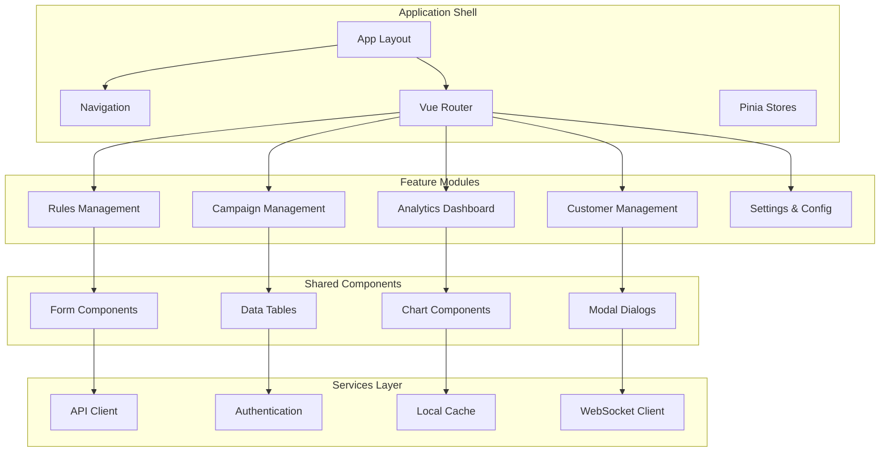

# Web Application - Business User Interface

## Overview
The Web Application provides a comprehensive interface for business users to manage rules, monitor campaigns, and analyze performance. Built with Vue 3, TypeScript, and Quasar Framework, it delivers a modern, responsive experience optimized for business workflows.

## Application Architecture



## Core Features

### 1. Rules Management Interface
- **Rule Creation Wizard**: Step-by-step rule creation with validation
- **DSL Editor**: Syntax-highlighted editor for business rules
- **Rule Testing**: Interactive testing with sample data
- **Approval Workflow**: Multi-step approval process with comments
- **Version Management**: Rule versioning and rollback capabilities

### 2. Campaign Management
- **Campaign Dashboard**: Overview of active and scheduled campaigns
- **Performance Tracking**: Real-time campaign metrics and KPIs
- **A/B Testing**: Campaign variant management and analysis
- **Budget Monitoring**: Spend tracking and budget alerts
- **Audience Targeting**: Customer segment selection and management

### 3. Analytics and Reporting
- **Executive Dashboard**: High-level business metrics
- **Rule Performance**: Detailed rule execution analytics
- **Customer Insights**: Customer behavior and engagement metrics
- **Revenue Impact**: Financial impact analysis of rules and campaigns
- **Custom Reports**: Configurable reporting with export capabilities

### 4. Customer Management
- **Customer Profiles**: Comprehensive customer data views
- **Segment Management**: Dynamic customer segmentation
- **Journey Mapping**: Customer interaction timeline
- **Loyalty Tracking**: Points, tiers, and rewards management
- **Communication History**: Campaign and notification history

## Page Structure and Components

### Application Shell
```vue
<!-- App.vue -->
<template>
  <q-layout view="lHh Lpr lFf">
    <q-header elevated>
      <AppHeader 
        :user="currentUser"
        :notifications="notifications"
        @logout="handleLogout"
      />
    </q-header>

    <q-drawer
      v-model="leftDrawerOpen"
      show-if-above
      bordered
      class="bg-grey-1"
    >
      <MainNavigation 
        :user="currentUser"
        :current-route="$route.name"
        @navigate="handleNavigation"
      />
    </q-drawer>

    <q-page-container>
      <router-view />
    </q-page-container>

    <q-footer elevated>
      <AppFooter />
    </q-footer>
  </q-layout>
</template>

<script setup lang="ts">
import { ref, computed } from 'vue'
import { useAuthStore } from '@/stores/auth'
import { useNotificationStore } from '@/stores/notifications'
import AppHeader from '@/components/layout/AppHeader.vue'
import MainNavigation from '@/components/layout/MainNavigation.vue'
import AppFooter from '@/components/layout/AppFooter.vue'

const authStore = useAuthStore()
const notificationStore = useNotificationStore()

const leftDrawerOpen = ref(false)
const currentUser = computed(() => authStore.user)
const notifications = computed(() => notificationStore.unreadNotifications)

const handleLogout = async () => {
  await authStore.logout()
  await $router.push('/login')
}

const handleNavigation = (route: string) => {
  $router.push(route)
  leftDrawerOpen.value = false
}
</script>
```

### Rules Management Pages

#### Rules Dashboard
```vue
<!-- pages/rules/RulesDashboard.vue -->
<template>
  <q-page class="rules-dashboard">
    <div class="page-header">
      <div class="row items-center justify-between">
        <div>
          <h1 class="text-h4 q-mb-xs">Rules Management</h1>
          <p class="text-subtitle2 text-grey-7">
            Manage business rules and approval workflows
          </p>
        </div>
        <div class="row q-gutter-sm">
          <q-btn
            color="primary"
            icon="add"
            label="Create Rule"
            @click="showCreateRuleDialog = true"
          />
          <q-btn
            color="secondary"
            icon="upload"
            label="Import Rules"
            @click="showImportDialog = true"
          />
        </div>
      </div>
    </div>

    <div class="dashboard-content">
      <!-- Key Metrics Cards -->
      <div class="row q-gutter-md q-mb-lg">
        <div class="col-12 col-md-3">
          <MetricCard
            title="Total Rules"
            :value="rulesMetrics.totalRules"
            icon="rule"
            color="primary"
            :trend="rulesMetrics.rulesTrend"
          />
        </div>
        <div class="col-12 col-md-3">
          <MetricCard
            title="Active Rules"
            :value="rulesMetrics.activeRules"
            icon="play_circle"
            color="positive"
            :trend="rulesMetrics.activeTrend"
          />
        </div>
        <div class="col-12 col-md-3">
          <MetricCard
            title="Pending Approval"
            :value="rulesMetrics.pendingApproval"
            icon="pending"
            color="warning"
            :trend="rulesMetrics.pendingTrend"
          />
        </div>
        <div class="col-12 col-md-3">
          <MetricCard
            title="Rules with Issues"
            :value="rulesMetrics.rulesWithIssues"
            icon="error"
            color="negative"
            :trend="rulesMetrics.issuesTrend"
          />
        </div>
      </div>

      <!-- Rules Filter and Search -->
      <q-card class="q-mb-lg">
        <q-card-section>
          <RulesFilterBar
            v-model:filters="rulesFilters"
            @search="handleRulesSearch"
            @filter="handleRulesFilter"
            @export="handleRulesExport"
          />
        </q-card-section>
      </q-card>

      <!-- Rules Table -->
      <q-card>
        <q-card-section>
          <RulesDataTable
            :rules="filteredRules"
            :loading="rulesLoading"
            :pagination="rulesPagination"
            @edit="handleEditRule"
            @activate="handleActivateRule"
            @deactivate="handleDeactivateRule"
            @duplicate="handleDuplicateRule"
            @delete="handleDeleteRule"
            @view-history="handleViewRuleHistory"
            @test-rule="handleTestRule"
          />
        </q-card-section>
      </q-card>
    </div>

    <!-- Create Rule Dialog -->
    <CreateRuleDialog
      v-model="showCreateRuleDialog"
      @created="handleRuleCreated"
    />

    <!-- Import Rules Dialog -->
    <ImportRulesDialog
      v-model="showImportDialog"
      @imported="handleRulesImported"
    />

    <!-- Rule Test Dialog -->
    <RuleTestDialog
      v-model="showTestDialog"
      :rule="selectedRule"
      @test-completed="handleTestCompleted"
    />
  </q-page>
</template>

<script setup lang="ts">
import { ref, computed, onMounted } from 'vue'
import { useRulesStore } from '@/stores/rules'
import { useNotificationStore } from '@/stores/notifications'
import type { Rule, RuleFilters, Pagination } from '@/types'

// Component imports
import MetricCard from '@/components/common/MetricCard.vue'
import RulesFilterBar from '@/components/rules/RulesFilterBar.vue'
import RulesDataTable from '@/components/rules/RulesDataTable.vue'
import CreateRuleDialog from '@/components/rules/CreateRuleDialog.vue'
import ImportRulesDialog from '@/components/rules/ImportRulesDialog.vue'
import RuleTestDialog from '@/components/rules/RuleTestDialog.vue'

const rulesStore = useRulesStore()
const notificationStore = useNotificationStore()

// Reactive state
const showCreateRuleDialog = ref(false)
const showImportDialog = ref(false)
const showTestDialog = ref(false)
const selectedRule = ref<Rule | null>(null)
const rulesFilters = ref<RuleFilters>({
  status: [],
  priority: [],
  type: [],
  createdBy: '',
  dateRange: null
})

// Computed properties
const filteredRules = computed(() => rulesStore.filteredRules)
const rulesLoading = computed(() => rulesStore.loading)
const rulesPagination = computed(() => rulesStore.pagination)
const rulesMetrics = computed(() => rulesStore.metrics)

// Event handlers
const handleRulesSearch = (searchTerm: string) => {
  rulesStore.searchRules(searchTerm)
}

const handleRulesFilter = (filters: RuleFilters) => {
  rulesStore.filterRules(filters)
}

const handleEditRule = (rule: Rule) => {
  $router.push(`/rules/${rule.id}/edit`)
}

const handleActivateRule = async (rule: Rule) => {
  try {
    await rulesStore.activateRule(rule.id)
    notificationStore.showSuccess(`Rule "${rule.name}" activated successfully`)
  } catch (error) {
    notificationStore.showError('Failed to activate rule')
  }
}

const handleTestRule = (rule: Rule) => {
  selectedRule.value = rule
  showTestDialog.value = true
}

const handleRuleCreated = (rule: Rule) => {
  notificationStore.showSuccess(`Rule "${rule.name}" created successfully`)
  rulesStore.fetchRules()
}

// Lifecycle
onMounted(() => {
  rulesStore.fetchRules()
  rulesStore.fetchMetrics()
})
</script>

<style scoped lang="scss">
.rules-dashboard {
  .page-header {
    padding: 24px;
    background: white;
    border-bottom: 1px solid #e0e0e0;
    margin-bottom: 24px;
  }
  
  .dashboard-content {
    padding: 0 24px 24px;
  }
  
  .metric-card {
    height: 120px;
  }
}
</style>
```

#### Rule Editor
```vue
<!-- pages/rules/RuleEditor.vue -->
<template>
  <q-page class="rule-editor">
    <div class="page-header">
      <div class="row items-center justify-between">
        <div>
          <h1 class="text-h4 q-mb-xs">
            {{ isEditing ? 'Edit Rule' : 'Create Rule' }}
          </h1>
          <p class="text-subtitle2 text-grey-7">
            {{ rule?.name || 'New business rule' }}
          </p>
        </div>
        <div class="row q-gutter-sm">
          <q-btn
            color="grey"
            outline
            label="Cancel"
            @click="handleCancel"
          />
          <q-btn
            color="orange"
            outline
            label="Test Rule"
            icon="play_circle"
            :disable="!canTestRule"
            @click="handleTestRule"
          />
          <q-btn
            color="secondary"
            label="Save Draft"
            icon="save"
            :loading="saving"
            @click="handleSaveDraft"
          />
          <q-btn
            color="primary"
            label="Save & Activate"
            icon="check"
            :loading="saving"
            :disable="!canActivate"
            @click="handleSaveAndActivate"
          />
        </div>
      </div>
    </div>

    <div class="editor-content">
      <div class="row q-gutter-lg">
        <!-- Main Editor -->
        <div class="col-12 col-lg-8">
          <q-card>
            <q-card-section>
              <q-tabs
                v-model="activeTab"
                class="text-grey"
                active-color="primary"
                indicator-color="primary"
                align="justify"
              >
                <q-tab name="basic" label="Basic Info" />
                <q-tab name="conditions" label="Conditions" />
                <q-tab name="actions" label="Actions" />
                <q-tab name="testing" label="Testing" />
              </q-tabs>

              <q-separator />

              <q-tab-panels v-model="activeTab" animated>
                <!-- Basic Information Tab -->
                <q-tab-panel name="basic">
                  <RuleBasicInfoForm
                    v-model="ruleForm"
                    :templates="availableTemplates"
                    :errors="validationErrors"
                    @template-selected="handleTemplateSelected"
                  />
                </q-tab-panel>

                <!-- Conditions Tab -->
                <q-tab-panel name="conditions">
                  <RuleConditionsEditor
                    v-model="ruleForm.conditions"
                    :available-fields="availableFields"
                    :errors="validationErrors.conditions"
                    @validate="handleConditionsValidation"
                  />
                </q-tab-panel>

                <!-- Actions Tab -->
                <q-tab-panel name="actions">
                  <RuleActionsEditor
                    v-model="ruleForm.actions"
                    :available-actions="availableActions"
                    :errors="validationErrors.actions"
                    @validate="handleActionsValidation"
                  />
                </q-tab-panel>

                <!-- Testing Tab -->
                <q-tab-panel name="testing">
                  <RuleTestingPanel
                    :rule="ruleForm"
                    :test-results="testResults"
                    :testing="testing"
                    @run-test="handleRunTest"
                    @save-test-case="handleSaveTestCase"
                  />
                </q-tab-panel>
              </q-tab-panels>
            </q-card-section>
          </q-card>
        </div>

        <!-- Sidebar -->
        <div class="col-12 col-lg-4">
          <div class="column q-gutter-md">
            <!-- Rule Status Card -->
            <q-card>
              <q-card-section>
                <div class="text-h6 q-mb-md">Rule Status</div>
                <RuleStatusPanel
                  :rule="rule"
                  :can-approve="canApprove"
                  @status-change="handleStatusChange"
                  @submit-for-approval="handleSubmitForApproval"
                />
              </q-card-section>
            </q-card>

            <!-- DSL Preview Card -->
            <q-card>
              <q-card-section>
                <div class="text-h6 q-mb-md">DSL Preview</div>
                <DSLPreview
                  :rule="ruleForm"
                  :syntax-errors="dslErrors"
                  @dsl-changed="handleDSLChanged"
                />
              </q-card-section>
            </q-card>

            <!-- Validation Results Card -->
            <q-card v-if="validationResults.length > 0">
              <q-card-section>
                <div class="text-h6 q-mb-md">Validation Results</div>
                <ValidationResultsList
                  :results="validationResults"
                  @fix-issue="handleFixValidationIssue"
                />
              </q-card-section>
            </q-card>

            <!-- Rule Dependencies Card -->
            <q-card v-if="ruleDependencies.length > 0">
              <q-card-section>
                <div class="text-h6 q-mb-md">Dependencies</div>
                <RuleDependenciesList
                  :dependencies="ruleDependencies"
                  @view-dependency="handleViewDependency"
                />
              </q-card-section>
            </q-card>
          </div>
        </div>
      </div>
    </div>

    <!-- Test Results Dialog -->
    <RuleTestResultsDialog
      v-model="showTestResults"
      :results="testResults"
      @save-as-test-case="handleSaveAsTestCase"
    />
  </q-page>
</template>

<script setup lang="ts">
import { ref, computed, onMounted, watch } from 'vue'
import { useRoute, useRouter } from 'vue-router'
import { useRulesStore } from '@/stores/rules'
import { useTemplatesStore } from '@/stores/templates'
import type { Rule, RuleForm, ValidationError, TestResult } from '@/types'

// Component imports
import RuleBasicInfoForm from '@/components/rules/RuleBasicInfoForm.vue'
import RuleConditionsEditor from '@/components/rules/RuleConditionsEditor.vue'
import RuleActionsEditor from '@/components/rules/RuleActionsEditor.vue'
import RuleTestingPanel from '@/components/rules/RuleTestingPanel.vue'
import RuleStatusPanel from '@/components/rules/RuleStatusPanel.vue'
import DSLPreview from '@/components/rules/DSLPreview.vue'
import ValidationResultsList from '@/components/rules/ValidationResultsList.vue'
import RuleDependenciesList from '@/components/rules/RuleDependenciesList.vue'
import RuleTestResultsDialog from '@/components/rules/RuleTestResultsDialog.vue'

const route = useRoute()
const router = useRouter()
const rulesStore = useRulesStore()
const templatesStore = useTemplatesStore()

// Reactive state
const activeTab = ref('basic')
const rule = ref<Rule | null>(null)
const ruleForm = ref<RuleForm>({
  name: '',
  description: '',
  priority: 'MEDIUM',
  conditions: [],
  actions: [],
  tags: []
})
const validationErrors = ref<Record<string, ValidationError[]>>({})
const validationResults = ref<ValidationError[]>([])
const testResults = ref<TestResult[]>([])
const dslErrors = ref<string[]>([])
const showTestResults = ref(false)
const saving = ref(false)
const testing = ref(false)

// Computed properties
const isEditing = computed(() => !!route.params.id)
const canTestRule = computed(() => {
  return ruleForm.value.conditions.length > 0 && ruleForm.value.actions.length > 0
})
const canActivate = computed(() => {
  return validationResults.value.length === 0 && dslErrors.value.length === 0
})
const canApprove = computed(() => {
  // Check if user has approval permissions
  return true // Implement based on user roles
})
const availableTemplates = computed(() => templatesStore.templates)
const availableFields = computed(() => rulesStore.availableFields)
const availableActions = computed(() => rulesStore.availableActions)
const ruleDependencies = computed(() => rulesStore.getRuleDependencies(rule.value?.id))

// Event handlers
const handleSaveDraft = async () => {
  saving.value = true
  try {
    if (isEditing.value) {
      await rulesStore.updateRule(rule.value!.id, ruleForm.value)
    } else {
      await rulesStore.createRule(ruleForm.value)
    }
    router.push('/rules')
  } catch (error) {
    // Handle error
  } finally {
    saving.value = false
  }
}

const handleTestRule = () => {
  showTestResults.value = true
}

const handleRunTest = async (testData: any) => {
  testing.value = true
  try {
    const results = await rulesStore.testRule(ruleForm.value, testData)
    testResults.value = results
  } catch (error) {
    // Handle error
  } finally {
    testing.value = false
  }
}

// Lifecycle
onMounted(async () => {
  if (isEditing.value) {
    const ruleId = route.params.id as string
    rule.value = await rulesStore.fetchRule(ruleId)
    if (rule.value) {
      ruleForm.value = { ...rule.value }
    }
  }
  
  await templatesStore.fetchTemplates()
})

// Watch for form changes to validate
watch(ruleForm, async (newForm) => {
  if (newForm.conditions.length > 0 || newForm.actions.length > 0) {
    const results = await rulesStore.validateRule(newForm)
    validationResults.value = results
  }
}, { deep: true })
</script>

<style scoped lang="scss">
.rule-editor {
  .page-header {
    padding: 24px;
    background: white;
    border-bottom: 1px solid #e0e0e0;
    margin-bottom: 24px;
  }
  
  .editor-content {
    padding: 0 24px 24px;
  }
  
  .q-tab-panel {
    padding: 24px;
  }
}
</style>
```

## Key Components

### Rules Data Table
```vue
<!-- components/rules/RulesDataTable.vue -->
<template>
  <q-table
    :rows="rules"
    :columns="columns"
    :loading="loading"
    :pagination="pagination"
    row-key="id"
    selection="multiple"
    v-model:selected="selected"
    class="rules-table"
    @request="onRequest"
  >
    <!-- Status Column -->
    <template v-slot:body-cell-status="props">
      <q-td :props="props">
        <q-chip
          :color="getStatusColor(props.value)"
          text-color="white"
          dense
        >
          {{ props.value }}
        </q-chip>
      </q-td>
    </template>

    <!-- Priority Column -->
    <template v-slot:body-cell-priority="props">
      <q-td :props="props">
        <q-icon
          :name="getPriorityIcon(props.value)"
          :color="getPriorityColor(props.value)"
          size="sm"
        />
        {{ props.value }}
      </q-td>
    </template>

    <!-- Actions Column -->
    <template v-slot:body-cell-actions="props">
      <q-td :props="props">
        <q-btn-group flat>
          <q-btn
            flat
            dense
            icon="edit"
            color="primary"
            @click="$emit('edit', props.row)"
          >
            <q-tooltip>Edit Rule</q-tooltip>
          </q-btn>
          
          <q-btn
            flat
            dense
            :icon="props.row.status === 'ACTIVE' ? 'pause' : 'play_arrow'"
            :color="props.row.status === 'ACTIVE' ? 'orange' : 'positive'"
            @click="toggleRuleStatus(props.row)"
          >
            <q-tooltip>
              {{ props.row.status === 'ACTIVE' ? 'Deactivate' : 'Activate' }}
            </q-tooltip>
          </q-btn>
          
          <q-btn
            flat
            dense
            icon="content_copy"
            color="secondary"
            @click="$emit('duplicate', props.row)"
          >
            <q-tooltip>Duplicate Rule</q-tooltip>
          </q-btn>
          
          <q-btn
            flat
            dense
            icon="more_vert"
            color="grey-7"
          >
            <q-menu>
              <q-list dense>
                <q-item clickable @click="$emit('test-rule', props.row)">
                  <q-item-section avatar>
                    <q-icon name="play_circle" />
                  </q-item-section>
                  <q-item-section>Test Rule</q-item-section>
                </q-item>
                
                <q-item clickable @click="$emit('view-history', props.row)">
                  <q-item-section avatar>
                    <q-icon name="history" />
                  </q-item-section>
                  <q-item-section>View History</q-item-section>
                </q-item>
                
                <q-separator />
                
                <q-item clickable @click="confirmDelete(props.row)">
                  <q-item-section avatar>
                    <q-icon name="delete" color="negative" />
                  </q-item-section>
                  <q-item-section>Delete</q-item-section>
                </q-item>
              </q-list>
            </q-menu>
          </q-btn>
        </q-btn-group>
      </q-td>
    </template>

    <!-- Bulk Actions -->
    <template v-slot:top-selection="scope">
      <q-btn-group class="q-mr-md">
        <q-btn
          color="positive"
          icon="play_arrow"
          label="Activate Selected"
          @click="bulkActivate"
        />
        <q-btn
          color="orange"
          icon="pause"
          label="Deactivate Selected"
          @click="bulkDeactivate"
        />
        <q-btn
          color="negative"
          icon="delete"
          label="Delete Selected"
          @click="bulkDelete"
        />
      </q-btn-group>
      
      <div class="text-subtitle2">
        {{ scope.selectedRows.length }} rule(s) selected
      </div>
    </template>
  </q-table>
</template>

<script setup lang="ts">
import { ref, computed } from 'vue'
import { useQuasar } from 'quasar'
import type { Rule, Pagination } from '@/types'

interface Props {
  rules: Rule[]
  loading: boolean
  pagination: Pagination
}

interface Emits {
  (e: 'edit', rule: Rule): void
  (e: 'activate', rule: Rule): void
  (e: 'deactivate', rule: Rule): void
  (e: 'duplicate', rule: Rule): void
  (e: 'delete', rule: Rule): void
  (e: 'test-rule', rule: Rule): void
  (e: 'view-history', rule: Rule): void
  (e: 'request', pagination: any): void
}

const props = defineProps<Props>()
const emit = defineEmits<Emits>()

const $q = useQuasar()
const selected = ref<Rule[]>([])

const columns = [
  {
    name: 'name',
    label: 'Rule Name',
    field: 'name',
    align: 'left',
    sortable: true
  },
  {
    name: 'type',
    label: 'Type',
    field: 'type',
    align: 'left',
    sortable: true
  },
  {
    name: 'status',
    label: 'Status',
    field: 'status',
    align: 'center',
    sortable: true
  },
  {
    name: 'priority',
    label: 'Priority',
    field: 'priority',
    align: 'center',
    sortable: true
  },
  {
    name: 'created_at',
    label: 'Created',
    field: 'created_at',
    align: 'center',
    sortable: true,
    format: (val: string) => new Date(val).toLocaleDateString()
  },
  {
    name: 'created_by',
    label: 'Created By',
    field: 'created_by',
    align: 'center',
    sortable: true
  },
  {
    name: 'actions',
    label: 'Actions',
    field: 'actions',
    align: 'center'
  }
]

const getStatusColor = (status: string) => {
  const colors: Record<string, string> = {
    'ACTIVE': 'positive',
    'INACTIVE': 'grey',
    'DRAFT': 'info',
    'UNDER_REVIEW': 'warning',
    'APPROVED': 'positive',
    'DEPRECATED': 'negative'
  }
  return colors[status] || 'grey'
}

const getPriorityIcon = (priority: string) => {
  const icons: Record<string, string> = {
    'LOW': 'keyboard_arrow_down',
    'MEDIUM': 'remove',
    'HIGH': 'keyboard_arrow_up',
    'CRITICAL': 'priority_high'
  }
  return icons[priority] || 'remove'
}

const getPriorityColor = (priority: string) => {
  const colors: Record<string, string> = {
    'LOW': 'grey',
    'MEDIUM': 'info',
    'HIGH': 'warning',
    'CRITICAL': 'negative'
  }
  return colors[priority] || 'grey'
}

const toggleRuleStatus = (rule: Rule) => {
  if (rule.status === 'ACTIVE') {
    emit('deactivate', rule)
  } else {
    emit('activate', rule)
  }
}

const confirmDelete = (rule: Rule) => {
  $q.dialog({
    title: 'Confirm Delete',
    message: `Are you sure you want to delete the rule "${rule.name}"?`,
    cancel: true,
    persistent: true
  }).onOk(() => {
    emit('delete', rule)
  })
}

const bulkActivate = () => {
  selected.value.forEach(rule => emit('activate', rule))
  selected.value = []
}

const bulkDeactivate = () => {
  selected.value.forEach(rule => emit('deactivate', rule))
  selected.value = []
}

const bulkDelete = () => {
  $q.dialog({
    title: 'Confirm Bulk Delete',
    message: `Are you sure you want to delete ${selected.value.length} selected rules?`,
    cancel: true,
    persistent: true
  }).onOk(() => {
    selected.value.forEach(rule => emit('delete', rule))
    selected.value = []
  })
}

const onRequest = (props: any) => {
  emit('request', props)
}
</script>

<style scoped lang="scss">
.rules-table {
  .q-chip {
    font-weight: 500;
  }
  
  .q-btn-group {
    box-shadow: none;
  }
}
</style>
```

## Implementation Tasks

### Phase 1: Application Shell and Navigation (3-4 days)
1. **Project Setup and Configuration**
   - Initialize Vue 3 + TypeScript + Quasar project
   - Configure routing with Vue Router
   - Setup Pinia stores with TypeScript
   - Configure build system with Vite

2. **Layout and Navigation**
   - Create responsive application layout
   - Implement main navigation with role-based menu items
   - Add header with user profile and notifications
   - Create breadcrumb navigation

### Phase 2: Rules Management Interface (4-5 days)
1. **Rules Dashboard**
   - Create rules overview dashboard with metrics
   - Implement rules data table with filtering and sorting
   - Add bulk operations for rules management
   - Create rules search and filtering interface

2. **Rule Editor**
   - Build comprehensive rule creation/editing interface
   - Implement DSL editor with syntax highlighting
   - Add rule validation and testing capabilities
   - Create template-based rule generation

### Phase 3: Campaign Management (3-4 days)
1. **Campaign Dashboard**
   - Create campaign overview with performance metrics
   - Implement campaign creation and management interface
   - Add campaign targeting and audience selection
   - Create campaign performance tracking

2. **Campaign Analytics**
   - Build campaign performance dashboards
   - Implement A/B testing interface
   - Add budget monitoring and alerts
   - Create campaign ROI analysis

### Phase 4: Analytics and Reporting (3-4 days)
1. **Executive Dashboard**
   - Create high-level business metrics dashboard
   - Implement interactive charts and visualizations
   - Add date range filtering and comparison
   - Create custom dashboard configuration

2. **Detailed Analytics**
   - Build rule performance analytics
   - Implement customer behavior analysis
   - Add revenue impact tracking
   - Create custom report builder

### Phase 5: Customer Management (2-3 days)
1. **Customer Interface**
   - Create customer profile views
   - Implement customer segmentation interface
   - Add customer journey visualization
   - Create communication history tracking

2. **Loyalty Management**
   - Build loyalty program management interface
   - Implement points and rewards tracking
   - Add tier management capabilities
   - Create loyalty analytics

### Phase 6: Testing and Optimization (2-3 days)
1. **Component Testing**
   - Write unit tests for all components
   - Create integration tests for user workflows
   - Implement E2E tests with Cypress
   - Add accessibility testing

2. **Performance Optimization**
   - Optimize bundle size and loading times
   - Implement lazy loading for routes
   - Add progressive web app features
   - Create performance monitoring

## Estimated Development Time: 17-23 days
