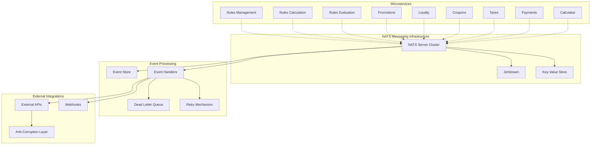

# Integration Layer Design - NATS Messaging

## Overview

The integration layer provides event-driven communication between microservices using NATS as the messaging backbone. This layer implements the publish-subscribe pattern for loose coupling and supports event sourcing for complete audit trails.

## Architecture



## NATS Configuration

### Server Configuration
```yaml
# nats-server.conf
server_name: "rules-engine-nats"
port: 4222
http_port: 8222
https_port: 8443

# Cluster configuration
cluster {
  name: "rules-engine-cluster"
  listen: "0.0.0.0:6222"
  routes: [
    "nats://nats-1:6222",
    "nats://nats-2:6222",
    "nats://nats-3:6222"
  ]
}

# JetStream configuration
jetstream {
  store_dir: "/data/jetstream"
  max_memory_store: 1GB
  max_file_store: 10GB
}

# Monitoring
monitoring {
  enabled: true
  http_port: 8222
}

# Security
accounts {
  rules_engine: {
    users: [
      {user: "rules-svc", password: "$RULES_SVC_PASSWORD"}
    ]
  }
}
```

### Subject Hierarchy
```
rules.>
├── rules.domain.>                    # Domain events
│   ├── rules.domain.rule.>          # Rule-related events
│   │   ├── rules.domain.rule.created
│   │   ├── rules.domain.rule.updated
│   │   ├── rules.domain.rule.activated
│   │   ├── rules.domain.rule.deactivated
│   │   └── rules.domain.rule.deleted
│   ├── rules.domain.evaluation.>    # Evaluation events
│   │   ├── rules.domain.evaluation.started
│   │   ├── rules.domain.evaluation.completed
│   │   └── rules.domain.evaluation.failed
│   ├── rules.domain.promotion.>     # Promotion events
│   ├── rules.domain.loyalty.>       # Loyalty events
│   ├── rules.domain.coupon.>        # Coupon events
│   ├── rules.domain.tax.>           # Tax events
│   └── rules.domain.payment.>       # Payment events
├── rules.integration.>              # Integration events
│   ├── rules.integration.external.> # External system events
│   ├── rules.integration.webhook.>  # Webhook events
│   └── rules.integration.sync.>     # Data synchronization events
├── rules.command.>                  # Command requests
│   ├── rules.command.rule.>         # Rule commands
│   ├── rules.command.evaluation.>   # Evaluation commands
│   └── rules.command.cache.>        # Cache commands
└── rules.query.>                    # Query requests
    ├── rules.query.rule.>           # Rule queries
    ├── rules.query.metrics.>        # Metrics queries
    └── rules.query.audit.>          # Audit queries
```

## Event Schema Design

### Base Event Structure
```go
// BaseEvent represents the common structure for all domain events
type BaseEvent struct {
    ID          string                 `json:"id"`
    Type        string                 `json:"type"`
    Source      string                 `json:"source"`
    Subject     string                 `json:"subject"`
    Time        time.Time              `json:"time"`
    Version     string                 `json:"version"`
    CorrelationID string               `json:"correlation_id,omitempty"`
    CausationID string                 `json:"causation_id,omitempty"`
    Metadata    map[string]interface{} `json:"metadata,omitempty"`
    Data        interface{}            `json:"data"`
}

// EventMetadata contains additional event information
type EventMetadata struct {
    UserID       string `json:"user_id,omitempty"`
    SessionID    string `json:"session_id,omitempty"`
    RequestID    string `json:"request_id,omitempty"`
    Source       string `json:"source"`
    Environment  string `json:"environment"`
    Region       string `json:"region,omitempty"`
}
```

### Domain Event Examples

#### Rule Management Events
```go
type RuleCreatedEvent struct {
    BaseEvent
    Data RuleCreatedData `json:"data"`
}

type RuleCreatedData struct {
    RuleID      string    `json:"rule_id"`
    Name        string    `json:"name"`
    Description string    `json:"description"`
    Status      string    `json:"status"`
    Priority    string    `json:"priority"`
    CreatedBy   string    `json:"created_by"`
    CreatedAt   time.Time `json:"created_at"`
    Version     int       `json:"version"`
}

type RuleUpdatedEvent struct {
    BaseEvent
    Data RuleUpdatedData `json:"data"`
}

type RuleUpdatedData struct {
    RuleID      string                 `json:"rule_id"`
    Name        string                 `json:"name,omitempty"`
    Changes     map[string]interface{} `json:"changes"`
    PreviousVersion int                `json:"previous_version"`
    NewVersion  int                    `json:"new_version"`
    UpdatedBy   string                 `json:"updated_by"`
    UpdatedAt   time.Time              `json:"updated_at"`
}

type RuleActivatedEvent struct {
    BaseEvent
    Data RuleActivatedData `json:"data"`
}

type RuleActivatedData struct {
    RuleID       string    `json:"rule_id"`
    Name         string    `json:"name"`
    ActivatedBy  string    `json:"activated_by"`
    ActivatedAt  time.Time `json:"activated_at"`
    EffectiveAt  time.Time `json:"effective_at"`
}
```

#### Evaluation Events
```go
type EvaluationStartedEvent struct {
    BaseEvent
    Data EvaluationStartedData `json:"data"`
}

type EvaluationStartedData struct {
    ContextID     string    `json:"context_id"`
    TransactionID string    `json:"transaction_id"`
    CustomerID    string    `json:"customer_id"`
    RuleCount     int       `json:"rule_count"`
    StartedAt     time.Time `json:"started_at"`
}

type EvaluationCompletedEvent struct {
    BaseEvent
    Data EvaluationCompletedData `json:"data"`
}

type EvaluationCompletedData struct {
    ContextID       string        `json:"context_id"`
    TransactionID   string        `json:"transaction_id"`
    Success         bool          `json:"success"`
    ExecutionTime   time.Duration `json:"execution_time"`
    RulesApplied    int           `json:"rules_applied"`
    ConflictsFound  int           `json:"conflicts_found"`
    CompletedAt     time.Time     `json:"completed_at"`
    FinalResult     interface{}   `json:"final_result"`
    ErrorMessage    string        `json:"error_message,omitempty"`
}
```

## NATS Go Client Implementation

### Connection Management
```go
package messaging

import (
    "context"
    "encoding/json"
    "fmt"
    "log"
    "time"
    
    "github.com/nats-io/nats.go"
    "github.com/nats-io/nats.go/jetstream"
)

type NATSClient struct {
    conn     *nats.Conn
    js       jetstream.JetStream
    kv       nats.KeyValue
    config   *NATSConfig
    handlers map[string][]EventHandler
}

type NATSConfig struct {
    URLs           []string      `yaml:"urls"`
    Username       string        `yaml:"username"`
    Password       string        `yaml:"password"`
    MaxReconnect   int           `yaml:"max_reconnect"`
    ReconnectWait  time.Duration `yaml:"reconnect_wait"`
    Timeout        time.Duration `yaml:"timeout"`
    PingInterval   time.Duration `yaml:"ping_interval"`
    MaxPingsOut    int           `yaml:"max_pings_out"`
    StreamName     string        `yaml:"stream_name"`
    ConsumerName   string        `yaml:"consumer_name"`
}

func NewNATSClient(config *NATSConfig) (*NATSClient, error) {
    opts := []nats.Option{
        nats.Name("rules-engine"),
        nats.UserInfo(config.Username, config.Password),
        nats.MaxReconnects(config.MaxReconnect),
        nats.ReconnectWait(config.ReconnectWait),
        nats.Timeout(config.Timeout),
        nats.PingInterval(config.PingInterval),
        nats.MaxPingsOutstanding(config.MaxPingsOut),
        nats.ReconnectHandler(func(nc *nats.Conn) {
            log.Printf("NATS reconnected: %s", nc.ConnectedUrl())
        }),
        nats.DisconnectErrHandler(func(nc *nats.Conn, err error) {
            log.Printf("NATS disconnected: %v", err)
        }),
        nats.ErrorHandler(func(nc *nats.Conn, sub *nats.Subscription, err error) {
            log.Printf("NATS error: %v", err)
        }),
    }
    
    conn, err := nats.Connect(strings.Join(config.URLs, ","), opts...)
    if err != nil {
        return nil, fmt.Errorf("failed to connect to NATS: %w", err)
    }
    
    js, err := jetstream.New(conn)
    if err != nil {
        return nil, fmt.Errorf("failed to create JetStream context: %w", err)
    }
    
    return &NATSClient{
        conn:     conn,
        js:       js,
        config:   config,
        handlers: make(map[string][]EventHandler),
    }, nil
}
```

### Event Publishing
```go
type EventPublisher interface {
    PublishEvent(ctx context.Context, event *BaseEvent) error
    PublishEventBatch(ctx context.Context, events []*BaseEvent) error
}

func (c *NATSClient) PublishEvent(ctx context.Context, event *BaseEvent) error {
    data, err := json.Marshal(event)
    if err != nil {
        return fmt.Errorf("failed to marshal event: %w", err)
    }
    
    subject := c.buildSubject(event)
    
    // Publish to JetStream for persistence
    _, err = c.js.Publish(ctx, subject, data)
    if err != nil {
        return fmt.Errorf("failed to publish event to subject %s: %w", subject, err)
    }
    
    // Also publish to core NATS for real-time subscribers
    err = c.conn.Publish(subject, data)
    if err != nil {
        return fmt.Errorf("failed to publish event to core NATS: %w", err)
    }
    
    return nil
}

func (c *NATSClient) PublishEventBatch(ctx context.Context, events []*BaseEvent) error {
    for _, event := range events {
        if err := c.PublishEvent(ctx, event); err != nil {
            return err
        }
    }
    return nil
}

func (c *NATSClient) buildSubject(event *BaseEvent) string {
    return fmt.Sprintf("rules.domain.%s.%s", 
        strings.ToLower(event.Source), 
        strings.ToLower(event.Type))
}
```

### Event Subscription
```go
type EventHandler interface {
    Handle(ctx context.Context, event *BaseEvent) error
    CanHandle(eventType string) bool
}

type SubscriptionConfig struct {
    Subject        string        `json:"subject"`
    ConsumerName   string        `json:"consumer_name"`
    DeliverPolicy  string        `json:"deliver_policy"`
    AckPolicy      string        `json:"ack_policy"`
    MaxDeliver     int           `json:"max_deliver"`
    AckWait        time.Duration `json:"ack_wait"`
    MaxAckPending  int           `json:"max_ack_pending"`
}

func (c *NATSClient) Subscribe(config *SubscriptionConfig, handler EventHandler) error {
    consumerConfig := jetstream.ConsumerConfig{
        Name:          config.ConsumerName,
        Durable:       config.ConsumerName,
        DeliverPolicy: jetstream.DeliverAllPolicy,
        AckPolicy:     jetstream.AckExplicitPolicy,
        MaxDeliver:    config.MaxDeliver,
        AckWait:       config.AckWait,
        MaxAckPending: config.MaxAckPending,
    }
    
    consumer, err := c.js.CreateOrUpdateConsumer(ctx, c.config.StreamName, consumerConfig)
    if err != nil {
        return fmt.Errorf("failed to create consumer: %w", err)
    }
    
    _, err = consumer.Consume(func(msg jetstream.Msg) {
        var event BaseEvent
        if err := json.Unmarshal(msg.Data(), &event); err != nil {
            log.Printf("Failed to unmarshal event: %v", err)
            msg.Nak()
            return
        }
        
        if !handler.CanHandle(event.Type) {
            msg.Ack()
            return
        }
        
        ctx := context.Background()
        if err := handler.Handle(ctx, &event); err != nil {
            log.Printf("Failed to handle event %s: %v", event.ID, err)
            msg.Nak()
            return
        }
        
        msg.Ack()
    })
    
    if err != nil {
        return fmt.Errorf("failed to consume messages: %w", err)
    }
    
    return nil
}
```

## Stream Configuration

### JetStream Stream Setup
```go
func (c *NATSClient) SetupStreams(ctx context.Context) error {
    // Domain Events Stream
    domainStreamConfig := jetstream.StreamConfig{
        Name:        "RULES_DOMAIN_EVENTS",
        Description: "Domain events for rules engine",
        Subjects:    []string{"rules.domain.>"},
        Storage:     jetstream.FileStorage,
        Retention:   jetstream.LimitsPolicy,
        MaxAge:      30 * 24 * time.Hour, // 30 days
        MaxBytes:    10 * 1024 * 1024 * 1024, // 10GB
        MaxMsgs:     1000000,
        Replicas:    3,
        Duplicates:  2 * time.Minute,
    }
    
    _, err := c.js.CreateStream(ctx, domainStreamConfig)
    if err != nil {
        return fmt.Errorf("failed to create domain events stream: %w", err)
    }
    
    // Integration Events Stream
    integrationStreamConfig := jetstream.StreamConfig{
        Name:        "RULES_INTEGRATION_EVENTS",
        Description: "Integration events for external systems",
        Subjects:    []string{"rules.integration.>"},
        Storage:     jetstream.FileStorage,
        Retention:   jetstream.LimitsPolicy,
        MaxAge:      7 * 24 * time.Hour, // 7 days
        MaxBytes:    5 * 1024 * 1024 * 1024, // 5GB
        MaxMsgs:     500000,
        Replicas:    3,
        Duplicates:  1 * time.Minute,
    }
    
    _, err = c.js.CreateStream(ctx, integrationStreamConfig)
    if err != nil {
        return fmt.Errorf("failed to create integration events stream: %w", err)
    }
    
    return nil
}
```

## Error Handling and Resilience

### Dead Letter Queue
```go
type DeadLetterHandler struct {
    client      *NATSClient
    maxRetries  int
    retryDelay  time.Duration
}

func (h *DeadLetterHandler) HandleFailedEvent(ctx context.Context, event *BaseEvent, err error) {
    dlqEvent := &BaseEvent{
        ID:            uuid.New().String(),
        Type:          "dead_letter",
        Source:        "error_handler",
        Subject:       fmt.Sprintf("rules.dlq.%s", event.Type),
        Time:          time.Now(),
        Version:       "1.0",
        CorrelationID: event.CorrelationID,
        CausationID:   event.ID,
        Metadata: map[string]interface{}{
            "original_event": event,
            "error":         err.Error(),
            "retry_count":   h.maxRetries,
        },
    }
    
    h.client.PublishEvent(ctx, dlqEvent)
}
```

### Retry Mechanism
```go
type RetryHandler struct {
    client      *NATSClient
    maxRetries  int
    backoffFunc func(attempt int) time.Duration
}

func (r *RetryHandler) RetryWithBackoff(ctx context.Context, fn func() error) error {
    var lastErr error
    
    for attempt := 0; attempt <= r.maxRetries; attempt++ {
        if attempt > 0 {
            delay := r.backoffFunc(attempt)
            select {
            case <-ctx.Done():
                return ctx.Err()
            case <-time.After(delay):
            }
        }
        
        if err := fn(); err != nil {
            lastErr = err
            continue
        }
        
        return nil
    }
    
    return fmt.Errorf("max retries exceeded: %w", lastErr)
}

func ExponentialBackoff(attempt int) time.Duration {
    return time.Duration(math.Pow(2, float64(attempt))) * time.Second
}
```

## Implementation Tasks

### Phase 1: NATS Infrastructure Setup (2-3 days)
1. **NATS Server Configuration**
   - Setup NATS server cluster (3 nodes)
   - Configure JetStream for persistence
   - Setup monitoring and health checks
   - Configure security and authentication

2. **Go Client Library**
   - Implement NATSClient with connection management
   - Add reconnection and error handling
   - Create event publishing mechanisms
   - Implement subscription management

### Phase 2: Event Schema and Serialization (2-3 days)
1. **Event Schema Design**
   - Define BaseEvent structure and metadata
   - Create domain-specific event types
   - Implement event validation and serialization
   - Add event versioning support

2. **Subject Hierarchy**
   - Design subject naming conventions
   - Implement subject building utilities
   - Create routing and filtering mechanisms
   - Add subject-based security policies

### Phase 3: Stream and Consumer Management (3-4 days)
1. **Stream Configuration**
   - Setup domain events stream
   - Configure integration events stream
   - Implement retention and cleanup policies
   - Add stream monitoring and alerting

2. **Consumer Management**
   - Implement durable consumers for each service
   - Add consumer group management
   - Create load balancing and failover
   - Implement consumer health monitoring

### Phase 4: Error Handling and Resilience (3-4 days)
1. **Dead Letter Queue**
   - Implement DLQ for failed events
   - Add DLQ monitoring and alerting
   - Create DLQ replay mechanisms
   - Implement DLQ cleanup policies

2. **Retry Mechanisms**
   - Implement exponential backoff retry
   - Add circuit breaker patterns
   - Create retry policy configuration
   - Implement retry metrics and monitoring

### Phase 5: Integration with Microservices (4-5 days)
1. **Service Integration**
   - Integrate NATS client into each microservice
   - Implement event handlers for each service
   - Add event publishing to domain operations
   - Create service-specific subscriptions

2. **Event Choreography**
   - Design event flows between services
   - Implement saga patterns for complex workflows
   - Add event correlation and causation tracking
   - Create event sourcing capabilities

### Phase 6: Monitoring and Observability (2-3 days)
1. **Metrics and Monitoring**
   - Implement NATS metrics collection
   - Add event processing metrics
   - Create monitoring dashboards
   - Setup alerting for critical issues

2. **Distributed Tracing**
   - Add correlation ID propagation
   - Implement distributed tracing integration
   - Create event flow visualization
   - Add performance profiling

### Phase 7: Testing and Validation (3-4 days)
1. **Unit Testing**
   - Test event publishing and subscription
   - Test error handling and retry mechanisms
   - Test stream and consumer management
   - Test event serialization and validation

2. **Integration Testing**
   - Test end-to-end event flows
   - Test service-to-service communication
   - Test failure scenarios and recovery
   - Validate performance under load

### Phase 8: Production Deployment (2-3 days)
1. **Deployment Configuration**
   - Create production NATS cluster configuration
   - Setup monitoring and alerting in production
   - Configure backup and disaster recovery
   - Implement security hardening

2. **Documentation and Runbooks**
   - Create operational runbooks
   - Document event schemas and flows
   - Create troubleshooting guides
   - Add performance tuning guidelines

## Estimated Development Time: 21-29 days
