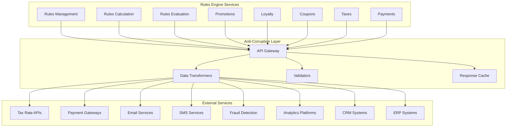

# External API Integration Specifications

## Overview
This document defines the external API integrations, third-party service connections, and anti-corruption layer patterns used to integrate the Rules Engine with external systems while maintaining domain integrity.

## Integration Architecture



## External Service Categories

### 1. Tax Rate Providers
- **Avalara**: Comprehensive tax calculation and compliance
- **TaxJar**: Sales tax API for e-commerce
- **Vertex**: Enterprise tax solutions
- **Custom Tax APIs**: Government and regional tax services

### 2. Payment Gateways
- **Stripe**: Payment processing and fraud detection
- **PayPal**: Digital wallet and payment processing
- **Square**: Point-of-sale and online payments
- **Authorize.Net**: Payment gateway services
- **Adyen**: Global payment platform

### 3. Communication Services
- **Twilio**: SMS and voice communications
- **SendGrid**: Email delivery platform
- **Mailgun**: Email automation
- **Amazon SES**: Simple Email Service
- **Firebase**: Push notifications

### 4. Fraud Detection Services
- **Kount**: AI-powered fraud prevention
- **Signifyd**: E-commerce fraud protection
- **Sift**: Digital trust and safety
- **Forter**: Real-time fraud prevention

### 5. Analytics and Business Intelligence
- **Google Analytics**: Web analytics
- **Adobe Analytics**: Digital analytics
- **Mixpanel**: Product analytics
- **Segment**: Customer data platform
- **Tableau**: Business intelligence

### 6. CRM and Customer Data
- **Salesforce**: Customer relationship management
- **HubSpot**: Inbound marketing and sales
- **Zendesk**: Customer service platform
- **Intercom**: Customer messaging

## Anti-Corruption Layer Implementation

### Base External Service Client
```go
type ExternalServiceClient interface {
    Call(ctx context.Context, request *ExternalRequest) (*ExternalResponse, error)
    CallAsync(ctx context.Context, request *ExternalRequest) (*AsyncResponse, error)
    GetHealth(ctx context.Context) (*HealthStatus, error)
    GetMetrics(ctx context.Context) (*ServiceMetrics, error)
}

type ExternalRequest struct {
    ServiceName    string                 `json:"service_name"`
    Endpoint       string                 `json:"endpoint"`
    Method         string                 `json:"method"`
    Headers        map[string]string      `json:"headers"`
    QueryParams    map[string]string      `json:"query_params"`
    Body           interface{}            `json:"body"`
    Timeout        time.Duration          `json:"timeout"`
    RetryPolicy    *RetryPolicy           `json:"retry_policy,omitempty"`
    CacheConfig    *CacheConfig           `json:"cache_config,omitempty"`
}

type ExternalResponse struct {
    StatusCode     int                    `json:"status_code"`
    Headers        map[string]string      `json:"headers"`
    Body           interface{}            `json:"body"`
    ResponseTime   time.Duration          `json:"response_time"`
    FromCache      bool                   `json:"from_cache"`
    RetryCount     int                    `json:"retry_count"`
}

type RetryPolicy struct {
    MaxRetries     int           `json:"max_retries"`
    InitialDelay   time.Duration `json:"initial_delay"`
    MaxDelay       time.Duration `json:"max_delay"`
    BackoffFactor  float64       `json:"backoff_factor"`
    RetryableErrors []string     `json:"retryable_errors"`
}

type CacheConfig struct {
    Enabled        bool          `json:"enabled"`
    TTL            time.Duration `json:"ttl"`
    Key            string        `json:"key"`
    InvalidateOn   []string      `json:"invalidate_on"`
}
```

### Data Transformation Framework
```go
type DataTransformer interface {
    TransformRequest(ctx context.Context, internal interface{}) (interface{}, error)
    TransformResponse(ctx context.Context, external interface{}) (interface{}, error)
    ValidateRequest(ctx context.Context, data interface{}) error
    ValidateResponse(ctx context.Context, data interface{}) error
}

type TransformationConfig struct {
    ServiceName        string                 `json:"service_name"`
    RequestMappings    map[string]string      `json:"request_mappings"`
    ResponseMappings   map[string]string      `json:"response_mappings"`
    DefaultValues      map[string]interface{} `json:"default_values"`
    RequiredFields     []string               `json:"required_fields"`
    ValidationRules    []ValidationRule       `json:"validation_rules"`
}

type ValidationRule struct {
    Field       string      `json:"field"`
    Rule        string      `json:"rule"`
    Value       interface{} `json:"value,omitempty"`
    ErrorMessage string     `json:"error_message"`
}
```

## Specific External Service Integrations

### Tax Rate API Integration (Avalara)
```go
type AvalaraClient struct {
    baseClient ExternalServiceClient
    config     AvalaraConfig
}

type AvalaraConfig struct {
    BaseURL      string `json:"base_url"`
    AccountID    string `json:"account_id"`
    LicenseKey   string `json:"license_key"`
    CompanyCode  string `json:"company_code"`
    Environment  string `json:"environment"`
}

type AvalaraTaxRequest struct {
    Type         string              `json:"type"`
    CompanyCode  string              `json:"companyCode"`
    Date         string              `json:"date"`
    CustomerCode string              `json:"customerCode"`
    Lines        []AvalaraTaxLine    `json:"lines"`
    Addresses    map[string]Address  `json:"addresses"`
}

type AvalaraTaxLine struct {
    Number       string  `json:"number"`
    Quantity     int     `json:"quantity"`
    Amount       float64 `json:"amount"`
    TaxCode      string  `json:"taxCode,omitempty"`
    ItemCode     string  `json:"itemCode,omitempty"`
    Description  string  `json:"description"`
    OriginAddress string `json:"originAddress"`
    DestinationAddress string `json:"destinationAddress"`
}

type AvalaraTaxResponse struct {
    TotalAmount float64           `json:"totalAmount"`
    TotalTax    float64           `json:"totalTax"`
    Lines       []AvalaraTaxLineResult `json:"lines"`
    Summary     []TaxSummary      `json:"summary"`
}

func (c *AvalaraClient) CalculateTax(ctx context.Context, req *TaxCalculationRequest) (*TaxCalculationResult, error) {
    // Transform internal request to Avalara format
    avalaraReq := c.transformToAvalaraRequest(req)
    
    // Make API call
    response, err := c.baseClient.Call(ctx, &ExternalRequest{
        ServiceName: "avalara",
        Endpoint:    "/api/v2/transactions/create",
        Method:      "POST",
        Body:        avalaraReq,
        Timeout:     5 * time.Second,
        RetryPolicy: &RetryPolicy{
            MaxRetries:    3,
            InitialDelay:  1 * time.Second,
            MaxDelay:      10 * time.Second,
            BackoffFactor: 2.0,
        },
        CacheConfig: &CacheConfig{
            Enabled: true,
            TTL:     15 * time.Minute,
            Key:     c.generateCacheKey(req),
        },
    })
    if err != nil {
        return nil, err
    }
    
    // Transform response back to internal format
    return c.transformFromAvalaraResponse(response.Body)
}
```

### Payment Gateway Integration (Stripe)
```go
type StripeClient struct {
    baseClient ExternalServiceClient
    config     StripeConfig
}

type StripeConfig struct {
    PublishableKey string `json:"publishable_key"`
    SecretKey      string `json:"secret_key"`
    WebhookSecret  string `json:"webhook_secret"`
    APIVersion     string `json:"api_version"`
}

type StripePaymentRequest struct {
    Amount               int                    `json:"amount"`
    Currency             string                 `json:"currency"`
    PaymentMethodTypes   []string               `json:"payment_method_types"`
    Customer             string                 `json:"customer,omitempty"`
    Description          string                 `json:"description,omitempty"`
    Metadata             map[string]string      `json:"metadata,omitempty"`
    SetupFutureUsage     string                 `json:"setup_future_usage,omitempty"`
}

type StripePaymentResponse struct {
    ID                   string                 `json:"id"`
    ClientSecret         string                 `json:"client_secret"`
    Status               string                 `json:"status"`
    Amount               int                    `json:"amount"`
    Currency             string                 `json:"currency"`
    PaymentMethod        *StripePaymentMethod   `json:"payment_method,omitempty"`
    NextAction           *StripeNextAction      `json:"next_action,omitempty"`
}

func (c *StripeClient) CreatePaymentIntent(ctx context.Context, req *PaymentRequest) (*PaymentResult, error) {
    stripeReq := c.transformToStripeRequest(req)
    
    response, err := c.baseClient.Call(ctx, &ExternalRequest{
        ServiceName: "stripe",
        Endpoint:    "/v1/payment_intents",
        Method:      "POST",
        Headers: map[string]string{
            "Authorization": "Bearer " + c.config.SecretKey,
            "Content-Type":  "application/x-www-form-urlencoded",
        },
        Body:    stripeReq,
        Timeout: 30 * time.Second,
        RetryPolicy: &RetryPolicy{
            MaxRetries:      3,
            InitialDelay:    2 * time.Second,
            MaxDelay:        30 * time.Second,
            BackoffFactor:   2.0,
            RetryableErrors: []string{"rate_limit", "api_connection_error"},
        },
    })
    if err != nil {
        return nil, err
    }
    
    return c.transformFromStripeResponse(response.Body)
}
```

### Email Service Integration (SendGrid)
```go
type SendGridClient struct {
    baseClient ExternalServiceClient
    config     SendGridConfig
}

type SendGridConfig struct {
    APIKey      string `json:"api_key"`
    FromEmail   string `json:"from_email"`
    FromName    string `json:"from_name"`
    TemplateID  string `json:"template_id,omitempty"`
}

type SendGridEmailRequest struct {
    Personalizations []SendGridPersonalization `json:"personalizations"`
    From             SendGridEmail             `json:"from"`
    TemplateID       string                    `json:"template_id,omitempty"`
    Subject          string                    `json:"subject,omitempty"`
    Content          []SendGridContent         `json:"content,omitempty"`
}

type SendGridPersonalization struct {
    To                []SendGridEmail           `json:"to"`
    CC                []SendGridEmail           `json:"cc,omitempty"`
    BCC               []SendGridEmail           `json:"bcc,omitempty"`
    Subject           string                    `json:"subject,omitempty"`
    DynamicTemplateData map[string]interface{} `json:"dynamic_template_data,omitempty"`
}

func (c *SendGridClient) SendEmail(ctx context.Context, req *EmailRequest) (*EmailResult, error) {
    sendGridReq := c.transformToSendGridRequest(req)
    
    response, err := c.baseClient.Call(ctx, &ExternalRequest{
        ServiceName: "sendgrid",
        Endpoint:    "/v3/mail/send",
        Method:      "POST",
        Headers: map[string]string{
            "Authorization": "Bearer " + c.config.APIKey,
            "Content-Type":  "application/json",
        },
        Body:    sendGridReq,
        Timeout: 15 * time.Second,
        RetryPolicy: &RetryPolicy{
            MaxRetries:      2,
            InitialDelay:    1 * time.Second,
            MaxDelay:        5 * time.Second,
            BackoffFactor:   2.0,
            RetryableErrors: []string{"rate_limit", "server_error"},
        },
    })
    if err != nil {
        return nil, err
    }
    
    return c.transformFromSendGridResponse(response.Body)
}
```

## Circuit Breaker and Resilience Patterns

### Circuit Breaker Implementation
```go
type CircuitBreaker struct {
    name                string
    maxRequests         uint32
    timeout             time.Duration
    readyToTrip         func(counts Counts) bool
    onStateChange       func(name string, from State, to State)
    state               State
    generation          uint64
    counts              Counts
    expiry              time.Time
    mutex               sync.RWMutex
}

type State int
const (
    StateClosed State = iota
    StateHalfOpen
    StateOpen
)

type Counts struct {
    Requests             uint32
    TotalSuccesses       uint32
    TotalFailures        uint32
    ConsecutiveSuccesses uint32
    ConsecutiveFailures  uint32
}

func (cb *CircuitBreaker) Execute(req func() (interface{}, error)) (interface{}, error) {
    generation, err := cb.beforeRequest()
    if err != nil {
        return nil, err
    }
    
    defer func() {
        e := recover()
        if e != nil {
            cb.afterRequest(generation, false)
            panic(e)
        }
    }()
    
    result, err := req()
    cb.afterRequest(generation, err == nil)
    return result, err
}

func (cb *CircuitBreaker) beforeRequest() (uint64, error) {
    cb.mutex.Lock()
    defer cb.mutex.Unlock()
    
    now := time.Now()
    state, generation := cb.currentState(now)
    
    if state == StateOpen {
        return generation, errors.New("circuit breaker is open")
    } else if state == StateHalfOpen && cb.counts.Requests >= cb.maxRequests {
        return generation, errors.New("too many requests in half-open state")
    }
    
    cb.counts.onRequest()
    return generation, nil
}
```

### Fallback Mechanisms
```go
type FallbackConfig struct {
    Strategy        FallbackStrategy       `json:"strategy"`
    CachedResponse  *CachedResponseConfig  `json:"cached_response,omitempty"`
    DefaultResponse *DefaultResponseConfig `json:"default_response,omitempty"`
    AlternateService *AlternateServiceConfig `json:"alternate_service,omitempty"`
}

type FallbackStrategy string
const (
    FallbackCachedResponse  FallbackStrategy = "CACHED_RESPONSE"
    FallbackDefaultResponse FallbackStrategy = "DEFAULT_RESPONSE"
    FallbackAlternateService FallbackStrategy = "ALTERNATE_SERVICE"
    FallbackFailFast        FallbackStrategy = "FAIL_FAST"
)

type CachedResponseConfig struct {
    MaxAge        time.Duration `json:"max_age"`
    AcceptStale   bool          `json:"accept_stale"`
    StaleMaxAge   time.Duration `json:"stale_max_age"`
}

type DefaultResponseConfig struct {
    Response      interface{} `json:"response"`
    StatusCode    int         `json:"status_code"`
    Headers       map[string]string `json:"headers"`
}

type AlternateServiceConfig struct {
    ServiceName   string        `json:"service_name"`
    Endpoint      string        `json:"endpoint"`
    Timeout       time.Duration `json:"timeout"`
    MaxRetries    int           `json:"max_retries"`
}

func (acl *AntiCorruptionLayer) executeWithFallback(ctx context.Context, req *ExternalRequest, fallback *FallbackConfig) (*ExternalResponse, error) {
    // Try primary service
    response, err := acl.primaryClient.Call(ctx, req)
    if err == nil {
        return response, nil
    }
    
    // Apply fallback strategy
    switch fallback.Strategy {
    case FallbackCachedResponse:
        return acl.getCachedResponse(req, fallback.CachedResponse)
    case FallbackDefaultResponse:
        return acl.getDefaultResponse(fallback.DefaultResponse)
    case FallbackAlternateService:
        return acl.callAlternateService(ctx, req, fallback.AlternateService)
    case FallbackFailFast:
        return nil, err
    default:
        return nil, err
    }
}
```

## Integration Monitoring and Observability

### Metrics Collection
```go
type IntegrationMetrics struct {
    ServiceName        string            `json:"service_name"`
    TotalRequests      int64             `json:"total_requests"`
    SuccessfulRequests int64             `json:"successful_requests"`
    FailedRequests     int64             `json:"failed_requests"`
    AverageResponseTime time.Duration    `json:"average_response_time"`
    P95ResponseTime    time.Duration     `json:"p95_response_time"`
    P99ResponseTime    time.Duration     `json:"p99_response_time"`
    ErrorRate          float64           `json:"error_rate"`
    CircuitBreakerState string           `json:"circuit_breaker_state"`
    CacheHitRate       float64           `json:"cache_hit_rate"`
    LastSuccess        time.Time         `json:"last_success"`
    LastFailure        time.Time         `json:"last_failure"`
}

type HealthCheck struct {
    ServiceName    string            `json:"service_name"`
    Status         HealthStatus      `json:"status"`
    ResponseTime   time.Duration     `json:"response_time"`
    LastChecked    time.Time         `json:"last_checked"`
    ErrorMessage   string            `json:"error_message,omitempty"`
    Dependencies   []DependencyCheck `json:"dependencies"`
}

type DependencyCheck struct {
    Name           string        `json:"name"`
    Status         HealthStatus  `json:"status"`
    ResponseTime   time.Duration `json:"response_time"`
    ErrorMessage   string        `json:"error_message,omitempty"`
}

type HealthStatus string
const (
    HealthStatusHealthy   HealthStatus = "HEALTHY"
    HealthStatusDegraded  HealthStatus = "DEGRADED"
    HealthStatusUnhealthy HealthStatus = "UNHEALTHY"
    HealthStatusUnknown   HealthStatus = "UNKNOWN"
)
```

### Integration Events
```go
type ExternalServiceEvent struct {
    BaseEvent
    Data ExternalServiceEventData `json:"data"`
}

type ExternalServiceEventData struct {
    ServiceName      string                 `json:"service_name"`
    Operation        string                 `json:"operation"`
    RequestID        string                 `json:"request_id"`
    Success          bool                   `json:"success"`
    ResponseTime     time.Duration          `json:"response_time"`
    StatusCode       int                    `json:"status_code,omitempty"`
    ErrorMessage     string                 `json:"error_message,omitempty"`
    RetryCount       int                    `json:"retry_count"`
    CircuitBreakerTripped bool              `json:"circuit_breaker_tripped"`
    FallbackUsed     bool                   `json:"fallback_used"`
    CacheHit         bool                   `json:"cache_hit"`
    RequestSize      int64                  `json:"request_size,omitempty"`
    ResponseSize     int64                  `json:"response_size,omitempty"`
}
```

## Implementation Tasks

### Phase 1: Anti-Corruption Layer Framework (3-4 days)
1. **Core Infrastructure**
   - Implement base external service client
   - Create data transformation framework
   - Add request/response validation
   - Implement configuration management

2. **Circuit Breaker and Resilience**
   - Implement circuit breaker pattern
   - Create fallback mechanisms
   - Add retry policies with exponential backoff
   - Implement timeout and cancellation handling

### Phase 2: Specific Service Integrations (4-5 days)
1. **Tax Services Integration**
   - Implement Avalara API client
   - Add TaxJar integration
   - Create tax rate caching layer
   - Implement tax calculation fallbacks

2. **Payment Gateway Integration**
   - Implement Stripe integration
   - Add PayPal API client
   - Create payment routing logic
   - Implement fraud detection integration

### Phase 3: Communication Services (3-4 days)
1. **Email and SMS Services**
   - Implement SendGrid integration
   - Add Twilio SMS client
   - Create template management
   - Implement delivery tracking

2. **Analytics Integration**
   - Implement Google Analytics integration
   - Add custom analytics platforms
   - Create event tracking framework
   - Implement real-time analytics streaming

### Phase 4: Monitoring and Observability (2-3 days)
1. **Health Monitoring**
   - Implement health check framework
   - Create dependency monitoring
   - Add service discovery integration
   - Implement alerting and notifications

2. **Performance Monitoring**
   - Create metrics collection system
   - Implement distributed tracing
   - Add performance analytics
   - Create performance optimization recommendations

### Phase 5: Testing and Documentation (2-3 days)
1. **Integration Testing**
   - Create mock external services
   - Implement contract testing
   - Add chaos engineering tests
   - Create performance benchmarks

2. **Documentation and Tooling**
   - Create integration documentation
   - Implement API testing tools
   - Add configuration management tools
   - Create troubleshooting guides

## Estimated Development Time: 14-19 days
