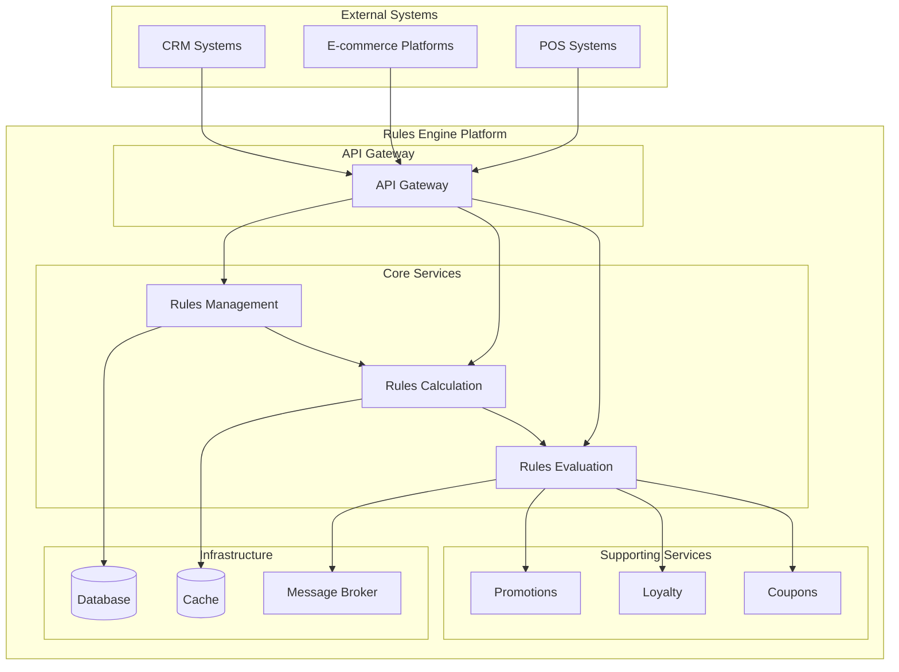
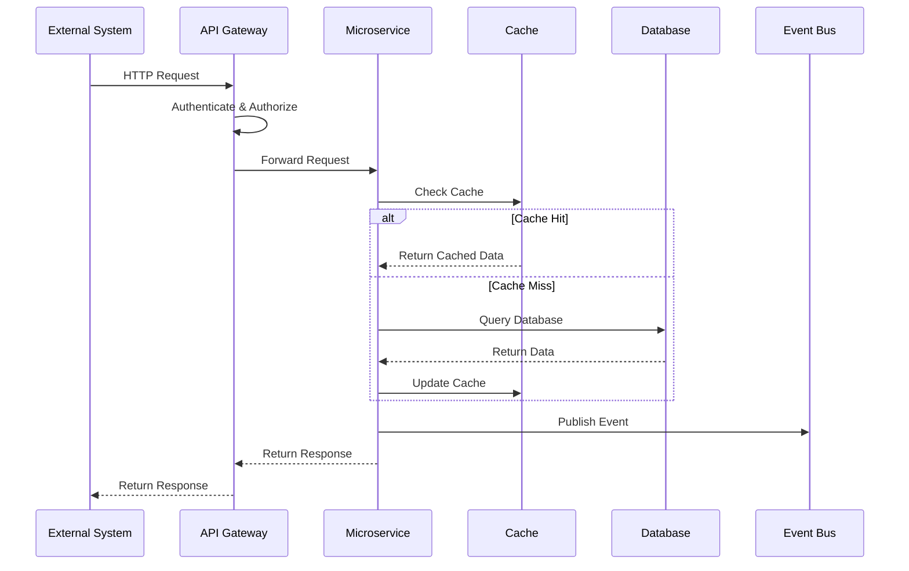

# General Description

## Product Description
The Rules Engine is a microservices-based platform that provides comprehensive business rule management capabilities. It consists of six core bounded contexts working together to deliver a complete rule lifecycle management solution from authoring to execution.

## Target Audience

### Primary Users
1. **Business Analysts**: Create and manage business rules using DSL
2. **Rule Authors**: Design complex promotional and loyalty rules
3. **Compliance Officers**: Review and approve rule changes
4. **System Administrators**: Monitor system performance and health

### Secondary Users
1. **Developers**: Integrate with rules engine APIs
2. **Data Analysts**: Analyze rule performance and business impact
3. **Auditors**: Review rule change history and compliance

## User Personas

### Business Rule Author (Primary)
- **Role**: Business Analyst/Product Manager
- **Goals**: Create promotional rules quickly without technical dependencies
- **Pain Points**: Complex approval processes, lack of testing capabilities
- **Technical Skill**: Low to medium, prefers visual/DSL interfaces

### Rule Approver (Primary)
- **Role**: Compliance Officer/Senior Manager
- **Goals**: Ensure rules comply with business policies and regulations
- **Pain Points**: Lack of visibility into rule impact and conflicts
- **Technical Skill**: Low, needs clear business impact summaries

### System Integrator (Secondary)
- **Role**: Software Developer/System Architect
- **Goals**: Integrate rule evaluation into existing systems
- **Pain Points**: Complex APIs, performance concerns, monitoring gaps
- **Technical Skill**: High, comfortable with APIs and technical documentation

## Value Proposition
- **For Business Users**: Intuitive DSL-based rule creation with immediate testing capabilities
- **For IT Teams**: Scalable, maintainable architecture with comprehensive monitoring
- **For Organizations**: Reduced operational costs and faster time-to-market for business changes

## Business Requirements

### Business Goals

#### Primary Goals
1. **Rule Democratization**: Enable business users to create 80% of business rules without IT intervention
2. **Operational Excellence**: Achieve 99.9% system availability with comprehensive monitoring
3. **Compliance Assurance**: Maintain complete audit trails for all rule changes and executions
4. **Performance Leadership**: Deliver industry-leading rule evaluation performance (<500ms)

#### Secondary Goals
1. **Cost Optimization**: Reduce rule management operational costs by 40%
2. **Innovation Enablement**: Provide platform for rapid business experimentation
3. **Risk Mitigation**: Implement comprehensive conflict detection and resolution

### Success Criteria

#### Business Success Criteria
- **Time-to-Market**: Reduce rule deployment time to 2 hours or less
- **User Adoption**: 90% of eligible business rules managed through the platform
- **Error Reduction**: 90% reduction in rule-related production issues
- **Compliance**: 100% audit trail coverage for regulatory requirements

#### Technical Success Criteria
- **Performance**: 95th percentile response time <500ms
- **Throughput**: Support 1000+ concurrent rule evaluations
- **Reliability**: 99.9% uptime with <1 minute recovery time
- **Scalability**: Linear scaling to 10x current transaction volume

### Market Requirements

#### Competitive Analysis
- **Advantage**: Domain-specific language optimized for business users
- **Differentiation**: Real-time conflict detection and resolution
- **Market Position**: Premium enterprise solution with comprehensive governance

#### Regulatory Requirements
- **SOX Compliance**: Complete audit trails for financial rule changes
- **GDPR Compliance**: Data privacy controls for customer-related rules
- **Industry Standards**: Support for retail and financial services regulations

## System Overview

### High-Level Architecture

### Service Interaction Flow

## Key Features

### Rule Management
- **DSL-Based Creation**: Intuitive domain-specific language for rule definition
- **Template System**: Pre-built templates for common business scenarios
- **Version Control**: Complete history tracking and rollback capabilities
- **Approval Workflow**: Multi-level approval with compliance checks

### Rule Execution
- **Real-Time Evaluation**: Sub-500ms response time for rule evaluation
- **Conflict Resolution**: Automatic detection and resolution of rule conflicts
- **Performance Optimization**: Rule compilation and caching for optimal performance
- **Scalability**: Horizontal scaling to handle 1000+ TPS

### Governance and Compliance
- **Audit Trail**: Complete tracking of all rule changes and executions
- **Access Control**: Role-based permissions and multi-factor authentication
- **Compliance Reporting**: Automated reports for regulatory requirements
- **Risk Assessment**: Impact analysis for rule changes
