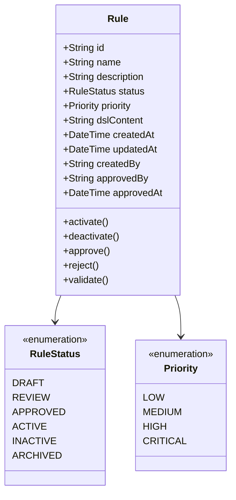
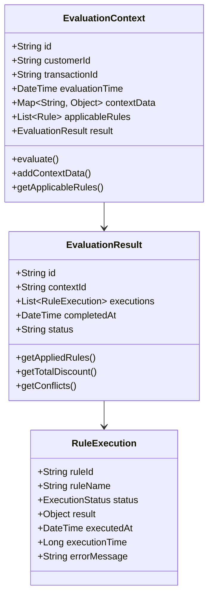

# Functional Models DDD

## Ubiquitous Language
- **Rule**: A business rule that defines business logic and constraints
- **Rule Engine**: The core system that evaluates business rules
- **Bounded Context**: A logical boundary within the domain
- **Aggregate**: A cluster of domain objects treated as a unit
- **Domain Event**: Something that happened in the domain
- **Policy**: A business policy that governs rule behavior
- **Specification**: A business rule specification
- **DSL**: Domain-Specific Language for rule definition
- **Transaction**: A business transaction that triggers rule evaluation
- **Customer**: The customer entity for rule evaluation

## Context Map
```
┌─────────────────┐    ┌─────────────────┐    ┌─────────────────┐
│   Rules        │    │   Rules         │    │   Rules         │
│ Management     │◄──►│  Calculation    │◄──►│  Evaluation    │
│ (Upstream)     │    │  (Core)         │    │  (Downstream)   │
└─────────────────┘    └─────────────────┘    └─────────────────┘
         │                       │                       │
         ▼                       ▼                       ▼
┌─────────────────┐    ┌─────────────────┐    ┌─────────────────┐
│   Promotions   │    │   Loyalty       │    │   Coupons       │
│   (Supporting) │    │   (Supporting)  │    │   (Supporting)  │
└─────────────────┘    └─────────────────┘    └─────────────────┘
         │                       │                       │
         ▼                       ▼                       ▼
┌─────────────────┐    ┌─────────────────┐    ┌─────────────────┐
│   Taxes & Fees │    │ Rule Evaluator/ │    │   Integration   │
│   (Supporting) │    │   Calculator    │    │   (Supporting)  │
│                │    │   (Core)        │    │                │
└─────────────────┘    └─────────────────┘    └─────────────────┘
```

## Core Domain Models

### Rule Aggregate


### Rule Evaluation Context


## Domain Services

### Rule Validation Service
- **Purpose**: Validates rule syntax and business logic
- **Responsibilities**: 
  - DSL syntax validation
  - Business rule conflict detection
  - Rule completeness validation
  - Performance impact assessment

### Rule Template Service
- **Purpose**: Manages rule templates and patterns
- **Responsibilities**:
  - Template creation and management
  - Template versioning
  - Template sharing and reuse
  - Template validation

### Rule Conflict Detection Service
- **Purpose**: Identifies and resolves rule conflicts
- **Responsibilities**:
  - Conflict detection algorithms
  - Priority-based resolution
  - Conflict reporting and recommendations
  - Business rule conflict identification
  - Conflict reporting and recommendations

## Domain Events

### Rule Lifecycle Events
- **RuleCreated**: When a new rule is created
- **RuleUpdated**: When an existing rule is modified
- **RuleApproved**: When a rule is approved for activation
- **RuleActivated**: When a rule becomes active
- **RuleDeactivated**: When a rule is deactivated
- **RuleArchived**: When a rule is archived

### Rule Execution Events
- **RuleEvaluationStarted**: When rule evaluation begins
- **RuleExecuted**: When a rule is successfully executed
- **RuleExecutionFailed**: When rule execution fails
- **RuleConflictDetected**: When rule conflicts are identified
- **RuleEvaluationCompleted**: When rule evaluation finishes

## Bounded Contexts

### Rules Management (Upstream)
- **Purpose**: Manages rule creation, modification, and lifecycle
- **Key Entities**: Rule, RuleTemplate, RuleCategory
- **Key Services**: RuleValidationService, RuleTemplateService
- **Integration**: Publishes rule lifecycle events

### Rules Calculation (Core)
- **Purpose**: Core rule evaluation and calculation engine
- **Key Entities**: EvaluationContext, EvaluationResult
- **Key Services**: RuleExecutionService, ConflictResolutionService
- **Integration**: Consumes rule events, publishes execution events

### Rules Evaluation (Downstream)
- **Purpose**: Provides rule evaluation services to external systems
- **Key Entities**: EvaluationRequest, EvaluationResponse
- **Key Services**: RuleEvaluationService, PerformanceOptimizationService
- **Integration**: Consumes execution events, provides REST APIs

### Supporting Contexts
- **Promotions**: Promotional rule management and execution
- **Loyalty**: Loyalty program rules and point calculations
- **Coupons**: Coupon validation and redemption rules
- **Taxes & Fees**: Tax and fee calculation with jurisdiction-aware processing
- **Rule Evaluator/Calculator**: High-performance calculation engine for all rule domains
- **Integration**: External system integration and data synchronization
