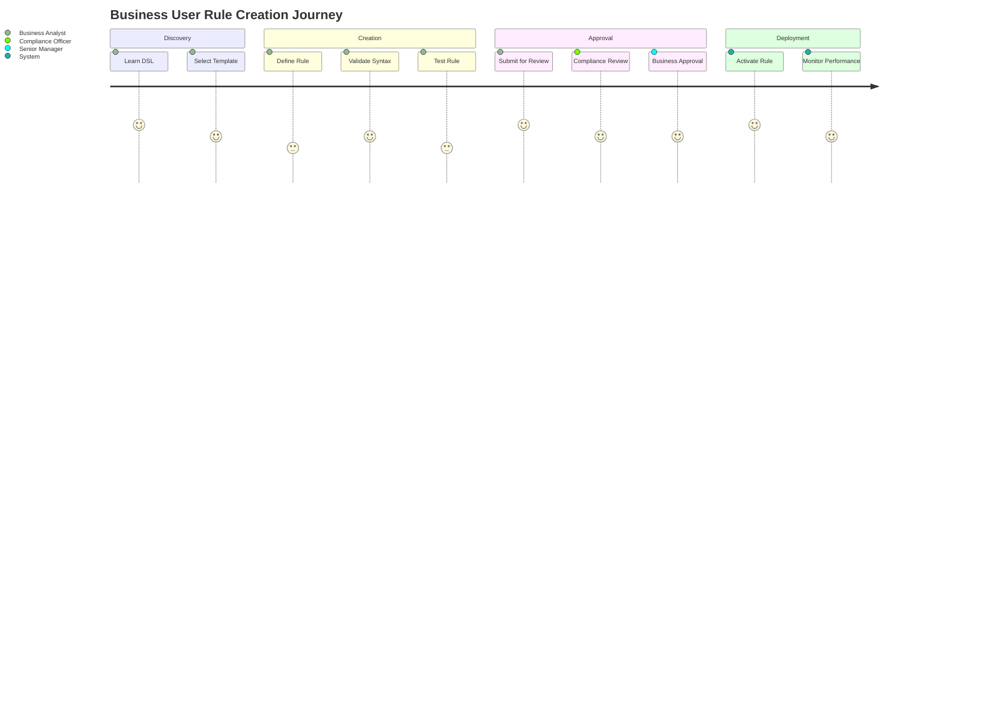
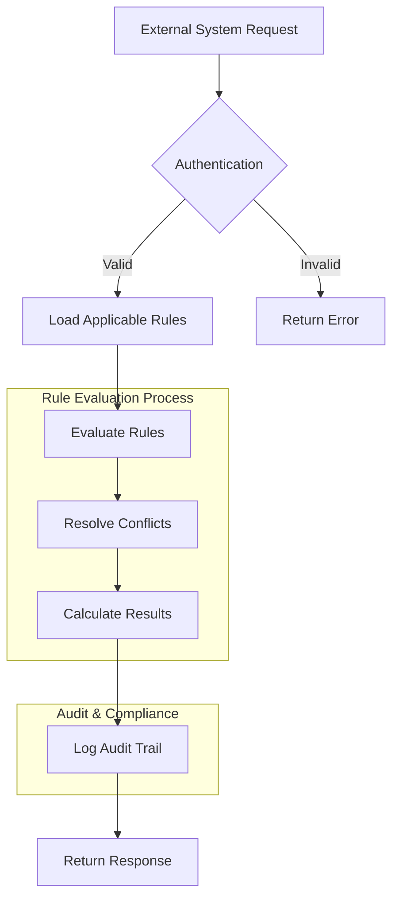

# Functional Requirements

## Overview
The Functional Requirements section defines the core features and capabilities of the Rules Engine system. Each feature is implemented as a separate bounded context with complete domain models, user stories, acceptance criteria, and test specifications.

## Core Features

### FEAT-0001: Rule Creation and Management
**Objective**: Enable business users to create and manage business rules using DSL without technical intervention
**Expected Value**: 80% reduction in rule creation time, faster time-to-market for business changes

**Key Capabilities**:
- DSL-based rule creation with real-time validation
- Comprehensive template system for common scenarios
- Rule lifecycle management (Draft → Review → Approved → Active)
- Conflict detection and resolution during creation

### FEAT-0002: Rule Evaluation Engine
**Objective**: Provide high-performance rule evaluation for real-time transactions with conflict resolution
**Expected Value**: <500ms evaluation time, 1000+ TPS, improved customer experience

**Key Capabilities**:
- Real-time rule evaluation with sub-500ms response time
- Priority-based conflict resolution
- Multi-level caching for performance optimization
- Horizontal scaling to handle high transaction volumes

### FEAT-0003: Rule Approval Workflow
**Objective**: Implement governance and approval processes for rule changes with impact analysis
**Expected Value**: 100% compliance coverage, reduced risk, improved governance

**Key Capabilities**:
- Multi-level approval workflow with role-based permissions
- Comprehensive impact analysis and testing
- Immutable audit trail with cryptographic signatures
- Compliance reporting and regulatory adherence

### FEAT-0004: Taxes and Fees Rules
**Objective**: Provide comprehensive tax and fee calculation capabilities with jurisdiction-aware computation
**Expected Value**: 100% accurate tax calculations per jurisdiction, 95% reduction in manual calculation errors

**Key Capabilities**:
- Multi-jurisdiction tax calculation engine
- Fee calculation for various transaction types
- Tax exemption and reduction rule processing
- Real-time compliance validation and audit trail

### FEAT-0005: Rule Evaluator/Calculator
**Objective**: High-performance calculation engine for real-time rule evaluation across all domains
**Expected Value**: <500ms evaluation time, 1000+ TPS throughput, 99.99% calculation accuracy

**Key Capabilities**:
- Specialized calculation engine for complex computations
- Priority-based conflict detection and resolution
- Multi-domain benefit calculation and aggregation
- Performance optimization and intelligent caching

## Feature Implementation Structure

Each feature follows the complete implementation pattern with all mandatory files:

```
features/FEAT-XXXX-feature-name/
├── feature.md              # Feature objectives, decisions, and ADR-lite
├── domain/
│   └── model.md           # DDD entities, aggregates, and domain services
├── stories.md              # User stories with acceptance criteria mapping
├── acceptance.md           # Given/When/Then acceptance criteria
├── functional-tests.md     # Functional test cases and scenarios
├── behaviour-tests.md      # BDD behavior scenarios
├── unit-tests.md           # Unit testing requirements and coverage
├── dependencies.md         # System dependencies and integrations
└── traceability.yaml       # Complete requirement traceability matrix
```

## User Story Mapping

### Business User Journey


### System Integration Flow


## Acceptance Criteria Framework

All acceptance criteria follow the Given/When/Then format:

- **Given**: Preconditions and context
- **When**: Action or event that occurs
- **Then**: Expected outcome or result
- **And**: Additional expected outcomes

## Testing Strategy

### Test Coverage Requirements
- **Functional Tests**: 100% coverage of all user stories
- **Behavior Tests**: 100% coverage of all acceptance criteria
- **Unit Tests**: ≥80% coverage of all business logic
- **Integration Tests**: Complete end-to-end workflow validation

### Test Types
1. **Functional Tests**: Business logic validation and workflow testing
2. **Behavior Tests**: BDD scenarios for user experience validation
3. **Unit Tests**: Individual component and service testing
4. **Performance Tests**: Load testing and performance validation
5. **Security Tests**: Authentication, authorization, and data protection

## Feature Dependencies

### Internal Dependencies
- **FEAT-0001** → **FEAT-0003**: Rules must be created before approval
- **FEAT-0001** → **FEAT-0002**: Rules must exist before evaluation
- **FEAT-0003** → **FEAT-0002**: Only approved rules can be evaluated

### External Dependencies
- **Authentication Service**: User management and permissions
- **Customer Data**: CRM and loyalty system integration
- **Transaction Systems**: POS and e-commerce platform integration

## Success Metrics

### Feature-Level Metrics
- **FEAT-0001**: Rule creation time, user adoption rate, validation error rate
- **FEAT-0002**: Evaluation performance, throughput, conflict resolution accuracy
- **FEAT-0003**: Approval cycle time, compliance coverage, audit trail completeness

### System-Level Metrics
- **Overall Performance**: 95th percentile response time <500ms
- **User Experience**: 90% user satisfaction score
- **Business Impact**: 50% reduction in rule deployment time
- **Compliance**: 100% audit trail coverage
