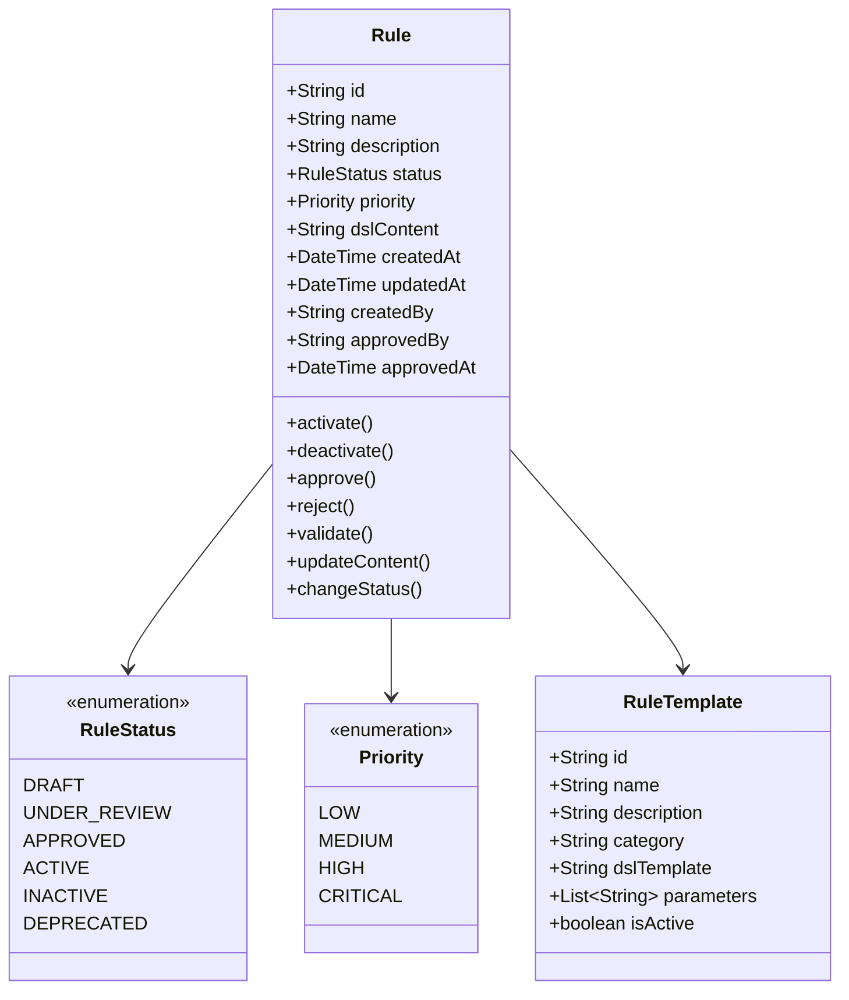

# Domain Model (FEAT-0001)

## Entities

### Rule Aggregate
The Rule aggregate is the root entity for rule management, encapsulating all rule-related data and behavior.

## Value Objects

### RuleId
- **Type**: String
- **Format**: UUID v4
- **Invariant**: Must be unique across the system

### RuleName
- **Type**: String
- **Constraints**: 3-100 characters, alphanumeric and spaces only
- **Invariant**: Must be unique within the same category

### DSLContent
- **Type**: String
- **Constraints**: Must be valid DSL syntax
- **Invariant**: Must pass syntax and semantic validation

### RuleMetadata
- **Type**: Map<String, Object>
- **Constraints**: Flexible key-value pairs for extensibility
- **Invariant**: Keys must be strings, values must be serializable

## Invariants

### Rule Lifecycle Invariants
1. **Status Transitions**: Only valid status transitions are allowed
   - DRAFT → UNDER_REVIEW → APPROVED → ACTIVE
   - Any status → INACTIVE (for deactivation)
   - Any status → DEPRECATED (for retirement)

2. **Content Validation**: Rule content must be valid before status changes
   - DRAFT: Basic syntax validation
   - UNDER_REVIEW: Full semantic validation
   - APPROVED: All validations passed
   - ACTIVE: No content changes allowed

3. **Approval Requirements**: Rules must be approved before activation
   - Only APPROVED rules can be activated
   - Approval requires valid approver credentials
   - Approval timestamp must be recorded

### Business Rule Invariants
1. **Priority Uniqueness**: Within the same category, no two active rules can have the same priority
2. **Naming Convention**: Rule names must follow business naming standards
3. **Content Limits**: DSL content must not exceed maximum complexity limits

## Policies

### Rule Creation Policy
- **Business Users**: Can create rules in DRAFT status
- **Technical Users**: Can create rules in any status
- **Template Usage**: New rules should use appropriate templates when available

### Rule Modification Policy
- **DRAFT Rules**: Can be modified by creator
- **UNDER_REVIEW Rules**: Cannot be modified (must be withdrawn first)
- **APPROVED Rules**: Cannot be modified (must create new version)
- **ACTIVE Rules**: Cannot be modified (must be deactivated first)

### Rule Approval Policy
- **Approver Role**: Must have appropriate approval permissions
- **Validation Check**: Rule must pass all validations before approval
- **Conflict Check**: System must check for conflicts with existing rules
- **Impact Analysis**: Business impact must be assessed before approval

## Domain Services

### RuleValidationService
- **Purpose**: Validates rule syntax and semantics
- **Responsibilities**:
  - DSL syntax validation
  - Business logic validation
  - Conflict detection
  - Performance impact analysis

### RuleTemplateService
- **Purpose**: Manages rule templates for common scenarios
- **Responsibilities**:
  - Template selection and application
  - Parameter substitution
  - Template versioning
  - Template validation

### RuleConflictDetectionService
- **Purpose**: Detects potential conflicts between rules
- **Responsibilities**:
  - Overlap detection
  - Priority conflict resolution
  - Business rule conflict identification
  - Conflict reporting and recommendations
