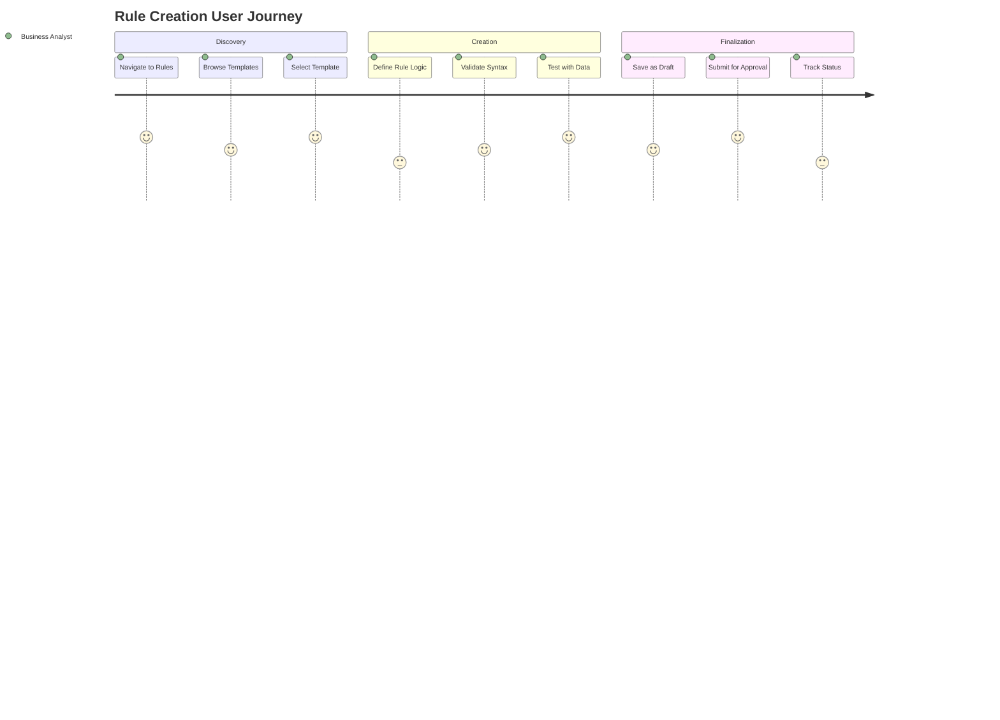
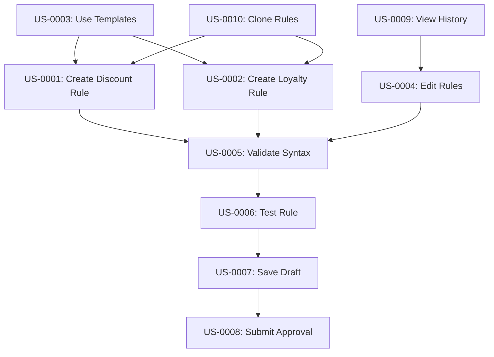

# User Stories - Rule Creation and Management

## US-0001: Create Percentage Discount Rule
**As a** Business Analyst  
**I want to** create a promotional rule offering percentage discounts with conditions  
**So that** I can quickly implement marketing campaigns without technical assistance

**Priority**: High  
**Acceptance Criteria**: AC-01, AC-02, AC-03, AC-04, AC-05

---

## US-0002: Create Loyalty Points Rule
**As a** Business Analyst  
**I want to** create rules that award loyalty points based on customer behavior  
**So that** I can design effective loyalty programs that drive customer engagement

**Priority**: High  
**Acceptance Criteria**: AC-01, AC-02, AC-03, AC-04, AC-05

---

## US-0003: Use Rule Templates
**As a** Business User  
**I want to** create rules from pre-defined templates  
**So that** I can quickly set up common promotional scenarios without starting from scratch

**Priority**: Medium  
**Acceptance Criteria**: AC-01, AC-06

---

## US-0004: Edit Existing Rules
**As a** Business Analyst  
**I want to** modify existing business rules  
**So that** I can adapt to changing business requirements and optimize rule performance

**Priority**: High  
**Acceptance Criteria**: AC-01, AC-02, AC-03, AC-04, AC-05

---

## US-0005: Validate Rule Syntax
**As a** Business User  
**I want to** validate rule syntax in real-time  
**So that** I can catch errors early and ensure rules will execute correctly

**Priority**: High  
**Acceptance Criteria**: AC-03

---

## US-0006: Test Rule with Sample Data
**As a** Business Analyst  
**I want to** test rules with sample transaction data  
**So that** I can verify rule behavior before deploying to production

**Priority**: High  
**Acceptance Criteria**: AC-04

---

## US-0007: Save Rule as Draft
**As a** Business User  
**I want to** save incomplete rules as drafts  
**So that** I can continue working on complex rules across multiple sessions

**Priority**: Medium  
**Acceptance Criteria**: AC-05

---

## US-0008: Submit Rule for Approval
**As a** Business Analyst  
**I want to** submit completed rules for approval  
**So that** rules can be reviewed before becoming active in production

**Priority**: High  
**Acceptance Criteria**: AC-01, AC-02, AC-03, AC-04, AC-05

---

## US-0009: View Rule History
**As a** Business User  
**I want to** view the complete history of rule changes  
**So that** I can track rule evolution and understand previous decisions

**Priority**: Low  
**Acceptance Criteria**: AC-05

---

## US-0010: Clone Existing Rules
**As a** Business Analyst  
**I want to** clone existing rules as a starting point  
**So that** I can create similar rules more efficiently

**Priority**: Medium  
**Acceptance Criteria**: AC-01, AC-02, AC-03, AC-04, AC-05, AC-08

---

## Story Mapping

### Epic: Rule Creation Workflow
- US-0001: Create Percentage Discount Rule
- US-0002: Create Loyalty Points Rule
- US-0003: Use Rule Templates
- US-0010: Clone Existing Rules

### Epic: Rule Validation and Testing
- US-0005: Validate Rule Syntax
- US-0006: Test Rule with Sample Data

### Epic: Rule Lifecycle Management
- US-0004: Edit Existing Rules
- US-0007: Save Rule as Draft
- US-0008: Submit Rule for Approval
- US-0009: View Rule History

## User Journey Flow

## Story Dependencies

## Definition of Done

### Story Completion Criteria
- [ ] User story implemented according to acceptance criteria
- [ ] Unit tests written and passing (≥80% coverage)
- [ ] Functional tests implemented and passing
- [ ] Behaviour tests implemented and passing
- [ ] Code reviewed and approved
- [ ] Integration tests passing
- [ ] Documentation updated
- [ ] Accessibility requirements met
- [ ] Performance requirements validated
- [ ] Security requirements verified

### Technical Requirements
- [ ] DSL validation engine implemented
- [ ] Rule template system functional
- [ ] Database schema updated
- [ ] API endpoints implemented
- [ ] UI components created
- [ ] Error handling implemented
- [ ] Audit logging functional
- [ ] Performance monitoring active
