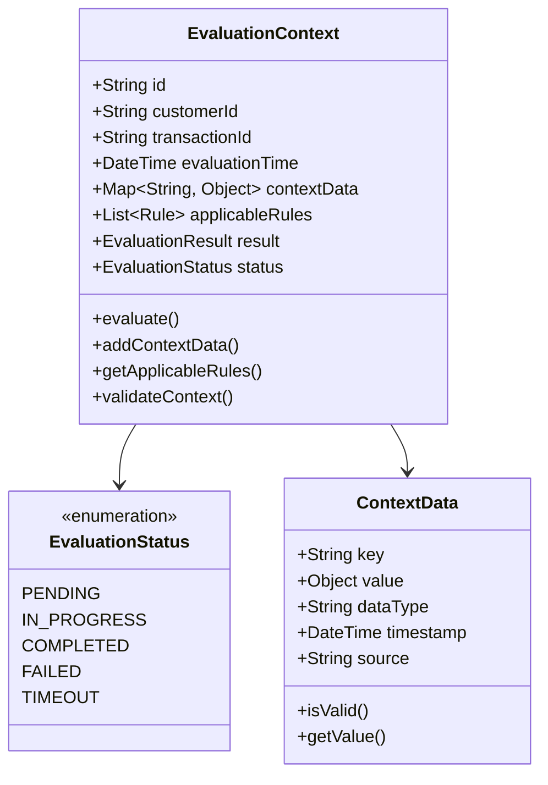
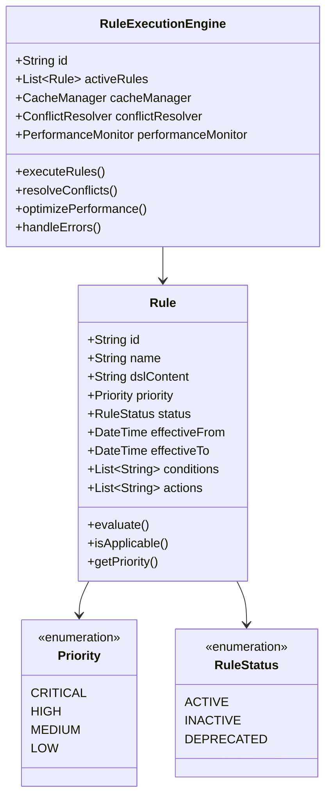
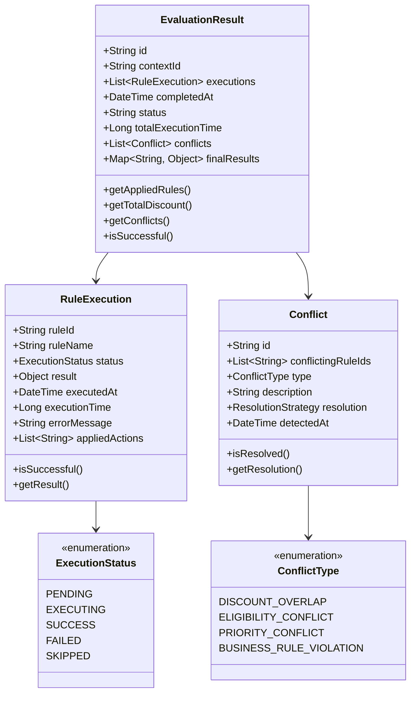

# Domain Model - Rule Evaluation Engine

## Core Entities

### Rule Evaluation Context

### Rule Execution Engine

### Evaluation Result

## Value Objects

### Rule Identifier
- **RuleId**: Unique identifier for rules with validation
- **CustomerId**: Customer identifier with format validation
- **TransactionId**: Transaction identifier with uniqueness guarantee
- **EvaluationId**: Evaluation session identifier

### Performance Metrics
- **ExecutionTime**: Time measurement for rule execution
- **ResponseTime**: Total response time measurement
- **Throughput**: Transactions per second measurement
- **CacheHitRate**: Cache performance measurement

### Business Rules
- **DiscountAmount**: Monetary amount with currency validation
- **PercentageValue**: Percentage with range validation (0-100)
- **EligibilityCriteria**: Customer eligibility conditions
- **PriorityLevel**: Rule priority with business validation

## Domain Services

### Rule Evaluation Service
- **Purpose**: Orchestrates the rule evaluation process
- **Responsibilities**:
  - Context validation and preparation
  - Rule selection and filtering
  - Execution coordination
  - Result aggregation and validation
  - Performance monitoring and optimization

### Conflict Resolution Service
- **Purpose**: Identifies and resolves rule conflicts
- **Responsibilities**:
  - Conflict detection algorithms
  - Priority-based resolution
  - Business rule validation
  - Conflict reporting and logging
  - Resolution strategy selection

### Cache Management Service
- **Purpose**: Manages rule caching and invalidation
- **Responsibilities**:
  - Rule compilation caching
  - Result caching with TTL
  - Cache invalidation strategies
  - Cache performance monitoring
  - Memory usage optimization

### Performance Optimization Service
- **Purpose**: Optimizes evaluation performance
- **Responsibilities**:
  - Rule execution optimization
  - Parallel processing coordination
  - Resource utilization monitoring
  - Performance bottleneck identification
  - Optimization recommendations

## Invariants

### Business Rules
1. **Rule Evaluation Lifecycle**: Rules must be in ACTIVE status to be evaluated
2. **Priority Enforcement**: Higher priority rules must be evaluated before lower priority rules
3. **Conflict Resolution**: All conflicts must be resolved before final result generation
4. **Performance Constraints**: Evaluation must complete within 500ms for 95% of requests
5. **Data Consistency**: Context data must be consistent throughout evaluation

### Technical Constraints
1. **Thread Safety**: Rule evaluation must be thread-safe for concurrent access
2. **Memory Management**: Cache usage must not exceed allocated memory limits
3. **Error Handling**: Evaluation failures must not cascade to other rules
4. **Resource Cleanup**: All resources must be properly cleaned up after evaluation
5. **Monitoring**: All evaluation metrics must be captured for analysis

## Policies

### Evaluation Policies
- **Rule Selection Policy**: Only active rules within effective date range are evaluated
- **Priority Policy**: Rules are evaluated in priority order (CRITICAL → HIGH → MEDIUM → LOW)
- **Conflict Policy**: Conflicts are resolved using priority-based resolution with business rule fallback
- **Performance Policy**: Evaluation is optimized for sub-500ms response time
- **Caching Policy**: Frequently used rules and results are cached with intelligent invalidation

### Error Handling Policies
- **Circuit Breaker Policy**: Failed rule evaluations trigger circuit breaker after threshold
- **Fallback Policy**: Default values are used when rule evaluation fails
- **Retry Policy**: Transient failures are retried with exponential backoff
- **Degradation Policy**: System gracefully degrades when under high load
- **Monitoring Policy**: All errors are logged and monitored for patterns

## Domain Events

### Evaluation Events
- **EvaluationStarted**: When rule evaluation begins
- **RuleExecuted**: When a rule is successfully executed
- **RuleExecutionFailed**: When rule execution fails
- **ConflictDetected**: When rule conflicts are identified
- **ConflictResolved**: When conflicts are successfully resolved
- **EvaluationCompleted**: When rule evaluation finishes
- **EvaluationTimeout**: When evaluation exceeds time limit

### Performance Events
- **CacheHit**: When cached rule is used
- **CacheMiss**: When rule is not found in cache
- **PerformanceThresholdExceeded**: When performance metrics exceed thresholds
- **ResourceUtilizationHigh**: When system resources are under pressure
- **OptimizationTriggered**: When performance optimization is activated
