# Domain Model - Rule Approval Workflow

## Overview
The Rule Approval Workflow domain model defines the core business concepts, entities, and relationships for managing business rule approval processes. This model ensures that all rule changes go through proper validation, compliance checks, and approval workflows before activation.

## Core Domain Concepts

### 1. Approval Workflow
The central entity that orchestrates the approval process for business rules.

### 2. Approval Request
Represents a request for approval of a business rule change, containing all necessary information for stakeholders to make informed decisions.

### 3. Compliance Check
Validates that business rules meet regulatory and organizational compliance requirements.

### 4. Risk Assessment
Evaluates the potential risks associated with rule changes and provides mitigation recommendations.

## Domain Model Diagram

```mermaid
classDiagram
    class ApprovalWorkflow {
        +String id
        +String name
        +String description
        +WorkflowStatus status
        +List~ApprovalStep~ steps
        +List~ApprovalRule~ rules
        +DateTime createdAt
        +DateTime updatedAt
        +createWorkflow()
        +addStep()
        +removeStep()
        +activateWorkflow()
        +deactivateWorkflow()
        +validateWorkflow()
    }

    class ApprovalStep {
        +String id
        +String name
        +String description
        +int order
        +ApprovalType type
        +List~String~ requiredRoles
        +int timeoutHours
        +EscalationPolicy escalationPolicy
        +addApprover()
        +removeApprover()
        +setTimeout()
        +setEscalationPolicy()
    }

    class ApprovalRequest {
        +String id
        +String ruleId
        +String workflowId
        +RequestStatus status
        +String requesterId
        +DateTime requestedAt
        +DateTime dueDate
        +Priority priority
        +String businessJustification
        +List~ApprovalStep~ completedSteps
        +List~ApprovalDecision~ decisions
        +submit()
        +approve()
        +reject()
        +escalate()
        +complete()
    }

    class ApprovalDecision {
        +String id
        +String approverId
        +String stepId
        +DecisionType decision
        +String comments
        +DateTime decidedAt
        +List~String~ attachments
        +recordDecision()
        +addComments()
        +addAttachments()
    }

    class ComplianceCheck {
        +String id
        +String requestId
        +ComplianceStatus status
        +List~ComplianceRule~ applicableRules
        +List~ComplianceViolation~ violations
        +DateTime checkedAt
        +String checkedBy
        +runComplianceCheck()
        +validateCompliance()
        +generateReport()
    }

    class RiskAssessment {
        +String id
        +String requestId
        +RiskLevel riskLevel
        +List~RiskFactor~ factors
        +List~MitigationStrategy~ mitigations
        +DateTime assessedAt
        +String assessedBy
        +assessRisk()
        +identifyFactors()
        +recommendMitigations()
    }

    class RuleApprovalTemplate {
        +String id
        +String name
        +String description
        +String category
        +List~ApprovalStep~ defaultSteps
        +List~ComplianceRule~ defaultComplianceRules
        +RiskThresholds defaultRiskThresholds
        +createFromTemplate()
        +customizeSteps()
        +setComplianceRules()
    }

    ApprovalWorkflow ||--o{ ApprovalStep : contains
    ApprovalWorkflow ||--o{ ApprovalRequest : manages
    ApprovalRequest ||--o{ ApprovalStep : follows
    ApprovalRequest ||--o{ ApprovalDecision : records
    ApprovalStep ||--o{ ApprovalDecision : receives
    ApprovalRequest ||--|| ComplianceCheck : triggers
    ApprovalRequest ||--|| RiskAssessment : requires
    RuleApprovalTemplate ||--o{ ApprovalWorkflow : creates
```

## Value Objects

### WorkflowStatus
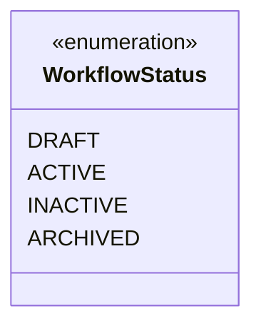

### RequestStatus
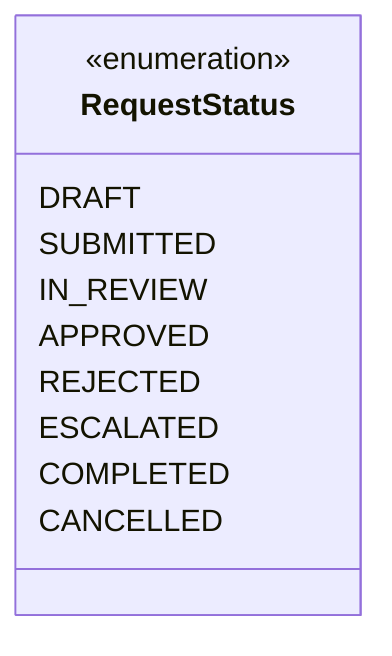

### ApprovalType
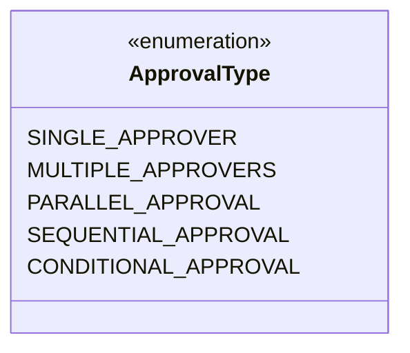

### DecisionType
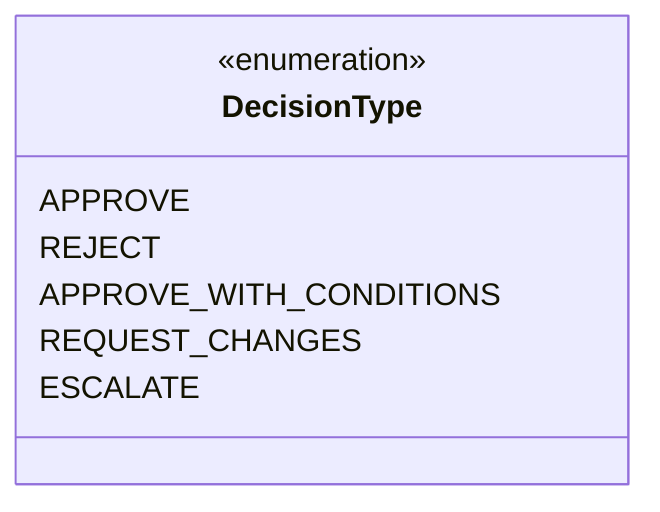

### Priority
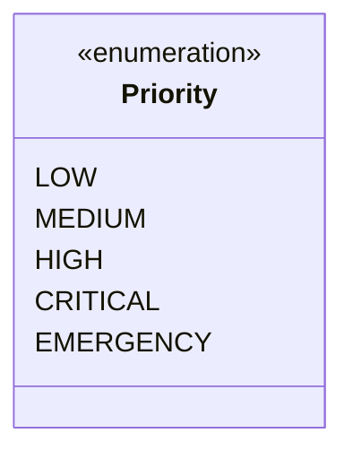

### RiskLevel
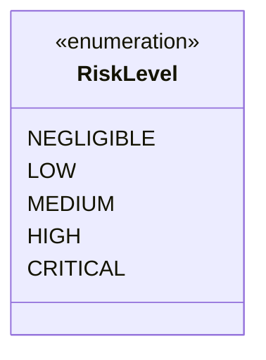

### ComplianceStatus
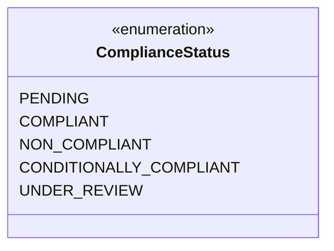

## Domain Services

### WorkflowEngineService
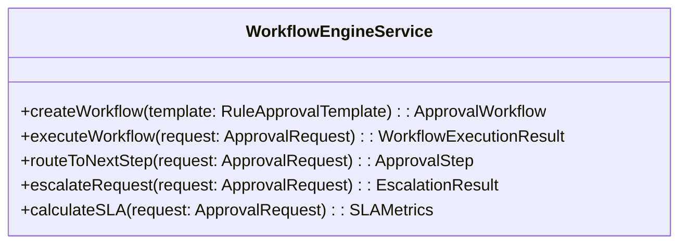

### ComplianceValidationService
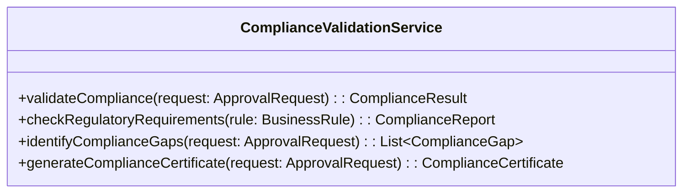

### RiskAssessmentService
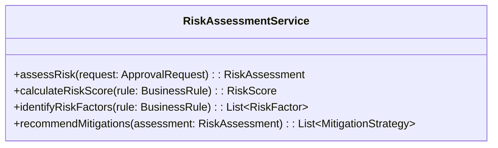

### ApprovalRoutingService
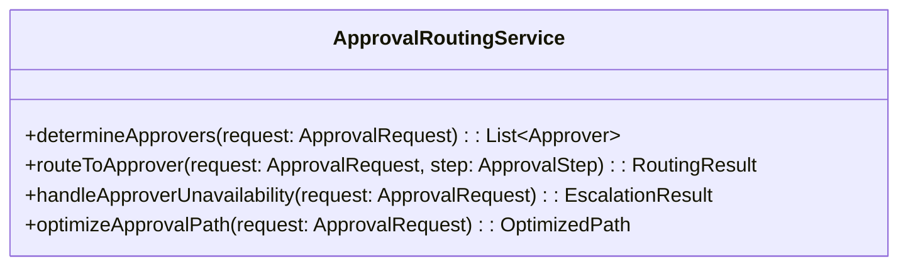

## Invariants

### Workflow Invariants
- A workflow must have at least one approval step
- Workflow steps must have unique order numbers
- Active workflows cannot be modified
- All workflow steps must have assigned roles

### Approval Request Invariants
- A request must be associated with a valid workflow
- Request status transitions must follow defined state machine
- Completed requests cannot be modified
- All required steps must be completed before approval

### Compliance Invariants
- Compliance checks must be completed before approval
- Non-compliant requests cannot be approved
- Compliance violations must be resolved before proceeding
- Compliance status must be current and valid

### Risk Assessment Invariants
- Risk assessment must be completed before approval
- High-risk requests require additional approval steps
- Risk mitigation strategies must be documented
- Risk level cannot be reduced without justification

## Policies

### Approval Policy
- **Escalation Policy**: Requests exceeding SLA thresholds automatically escalate
- **Delegation Policy**: Approvers can delegate to authorized substitutes
- **Timeout Policy**: Unattended requests automatically escalate after timeout
- **Priority Policy**: High-priority requests receive expedited processing

### Compliance Policy
- **Regulatory Policy**: All rules must meet regulatory requirements
- **Organizational Policy**: Rules must align with organizational standards
- **Industry Policy**: Industry-specific compliance requirements must be met
- **Audit Policy**: All compliance decisions must be auditable

### Risk Policy
- **Risk Threshold Policy**: Requests above risk thresholds require additional review
- **Mitigation Policy**: High-risk requests require documented mitigation strategies
- **Approval Level Policy**: Risk level determines required approval levels
- **Monitoring Policy**: High-risk rules require ongoing monitoring

## Domain Events

### Workflow Events
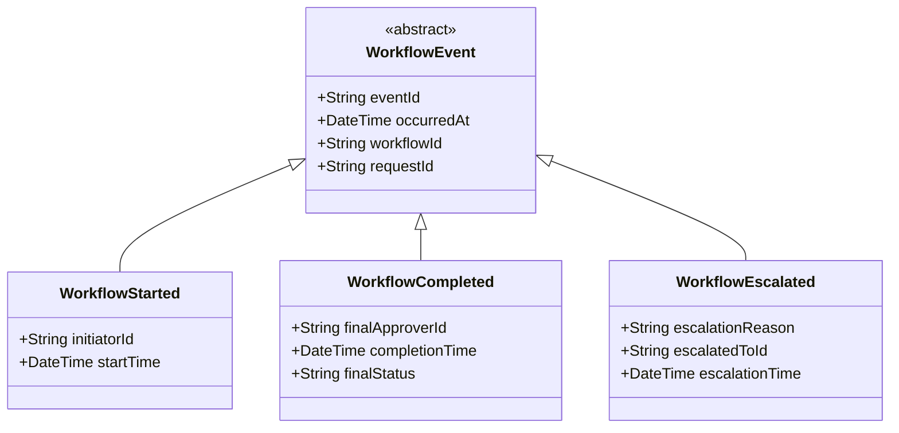

### Approval Events
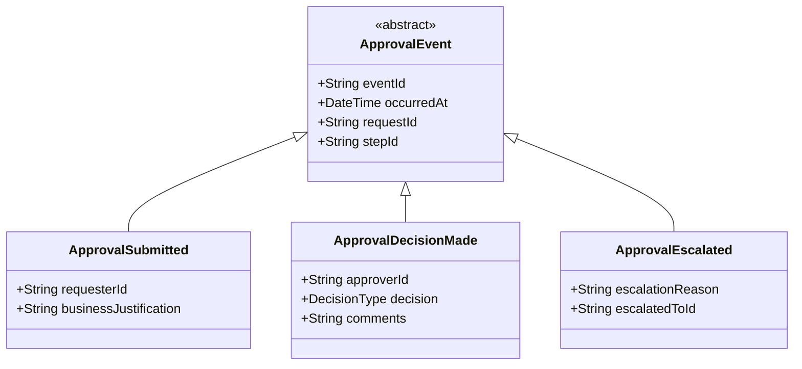

### Compliance Events
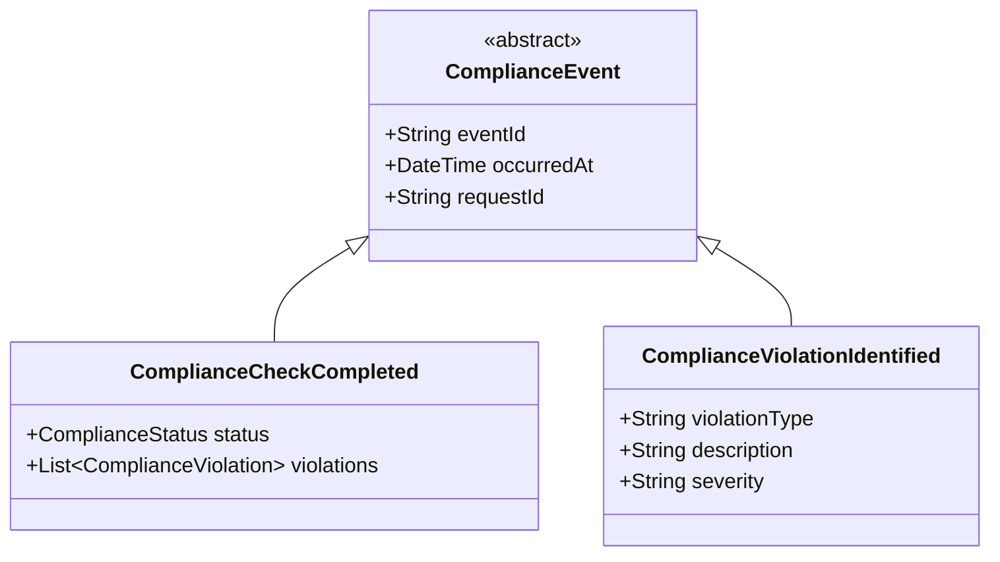

## Business Rules

### Workflow Rules
1. **Step Order Rule**: Approval steps must be completed in sequential order unless parallel approval is configured
2. **Role Assignment Rule**: Each approval step must have at least one assigned role
3. **Timeout Rule**: Steps exceeding timeout thresholds automatically escalate
4. **Completion Rule**: All workflow steps must be completed before final approval

### Approval Rules
1. **Single Approver Rule**: Only one approver per step unless parallel approval is configured
2. **Conflict Rule**: Approvers cannot approve their own requests
3. **Delegation Rule**: Approvers can delegate to authorized substitutes
4. **Escalation Rule**: Unresolved requests automatically escalate after timeout

### Compliance Rules
1. **Regulatory Compliance Rule**: All rules must meet applicable regulatory requirements
2. **Organizational Compliance Rule**: Rules must align with organizational policies
3. **Industry Compliance Rule**: Industry-specific requirements must be satisfied
4. **Audit Compliance Rule**: All compliance decisions must be auditable

### Risk Rules
1. **Risk Threshold Rule**: High-risk requests require additional approval levels
2. **Mitigation Rule**: High-risk requests must have documented mitigation strategies
3. **Monitoring Rule**: High-risk rules require ongoing monitoring and review
4. **Escalation Rule**: Critical risk requests automatically escalate to senior management
