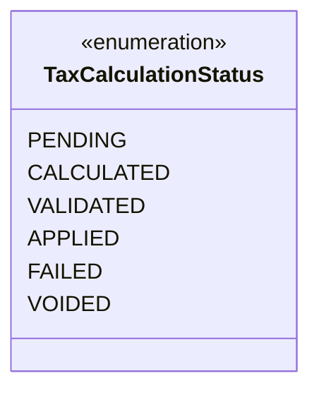
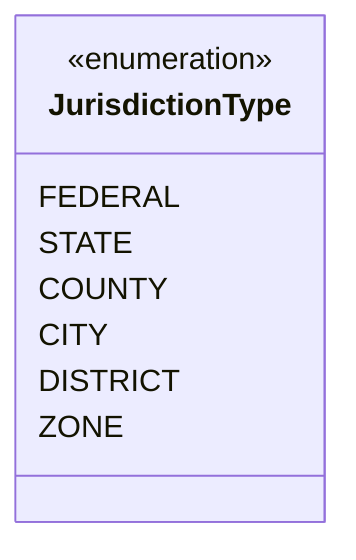
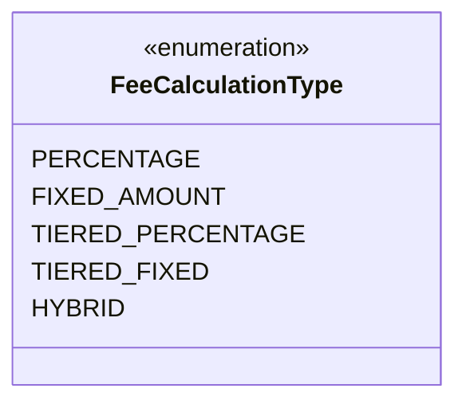
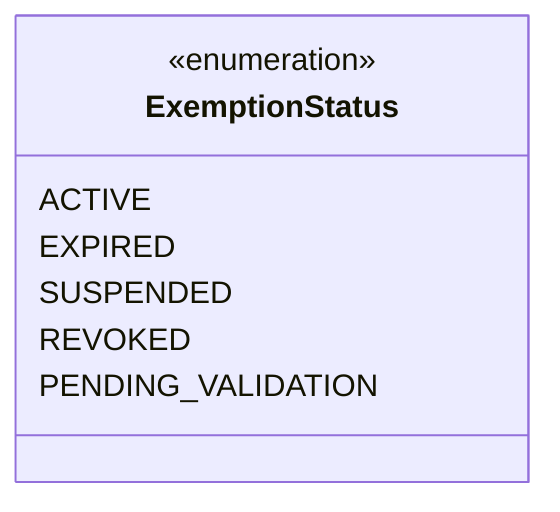
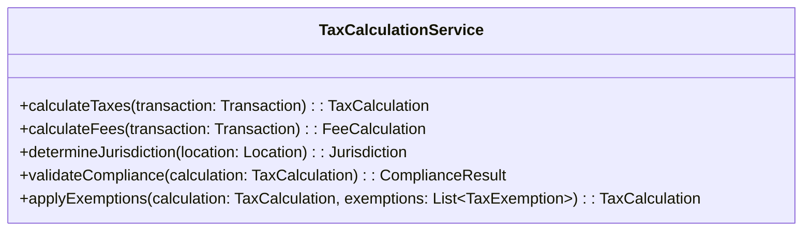
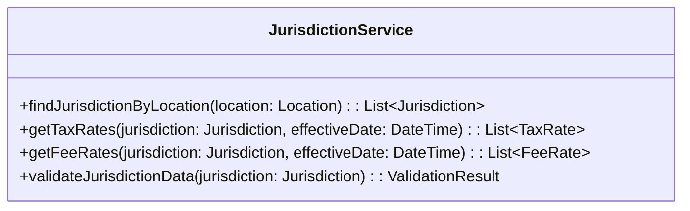
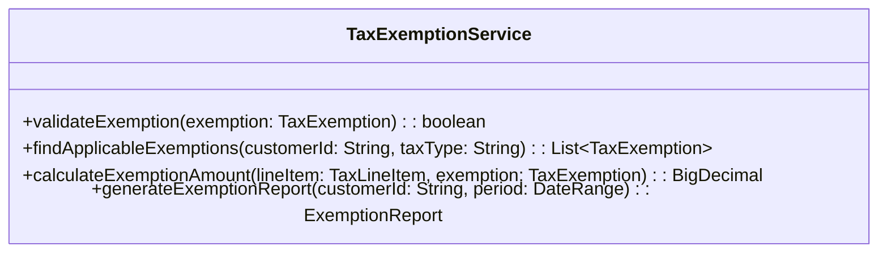
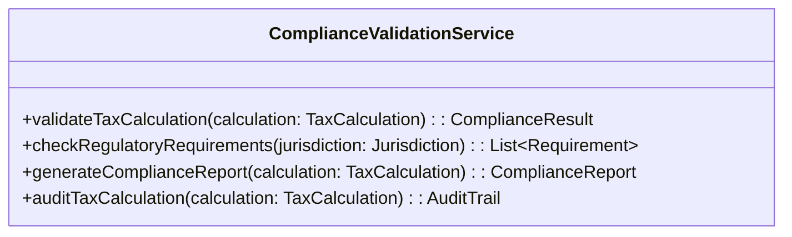
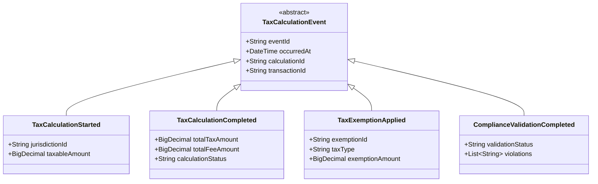
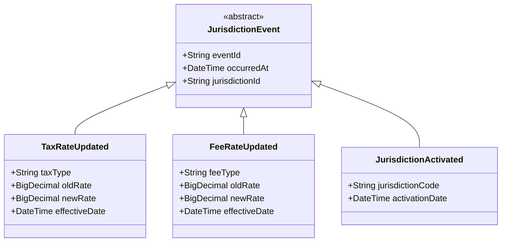

# Domain Model - Taxes and Fees Rules

## Overview
The Taxes and Fees domain model defines the core business concepts for calculating taxes and fees across multiple jurisdictions with compliance validation and audit trail management.

## Core Domain Concepts

### 1. Tax Calculation
The central capability that computes applicable taxes based on transaction details and jurisdiction rules.

### 2. Fee Assessment
The process of calculating various fees (processing, service, regulatory) based on transaction characteristics.

### 3. Jurisdiction Management
The system that determines applicable tax authorities and rates based on transaction location data.

### 4. Compliance Validation
The framework that ensures all tax and fee calculations meet regulatory requirements.

## Domain Model Diagram

```mermaid
classDiagram
    class TaxCalculation {
        +String id
        +String transactionId
        +List~TaxLineItem~ taxLineItems
        +List~FeeLineItem~ feeLineItems
        +BigDecimal totalTaxAmount
        +BigDecimal totalFeeAmount
        +DateTime calculatedAt
        +String jurisdictionId
        +TaxCalculationStatus status
        +calculateTaxes()
        +calculateFees()
        +validateCompliance()
        +generateAuditTrail()
    }

    class TaxLineItem {
        +String id
        +String taxType
        +String taxName
        +BigDecimal taxableAmount
        +BigDecimal taxRate
        +BigDecimal taxAmount
        +String jurisdictionCode
        +boolean isExempt
        +String exemptionReason
        +String ruleId
        +applyTax()
        +applyExemption()
    }

    class FeeLineItem {
        +String id
        +String feeType
        +String feeName
        +BigDecimal feeableAmount
        +BigDecimal feeRate
        +BigDecimal feeAmount
        +FeeCalculationType calculationType
        +String ruleId
        +calculateFee()
        +validateFee()
    }

    class Jurisdiction {
        +String id
        +String code
        +String name
        +JurisdictionType type
        +String parentJurisdictionId
        +List~TaxRate~ taxRates
        +List~FeeRate~ feeRates
        +boolean isActive
        +DateTime effectiveDate
        +DateTime expirationDate
        +getTaxRates()
        +getFeeRates()
        +isApplicable()
    }

    class TaxRate {
        +String id
        +String taxType
        +BigDecimal rate
        +BigDecimal minimumAmount
        +BigDecimal maximumAmount
        +DateTime effectiveDate
        +DateTime expirationDate
        +List~String~ applicableCategories
        +isEffective()
        +isApplicableToCategory()
    }

    class FeeRate {
        +String id
        +String feeType
        +BigDecimal rate
        +BigDecimal fixedAmount
        +FeeCalculationType calculationType
        +DateTime effectiveDate
        +DateTime expirationDate
        +calculateFeeAmount()
        +isEffective()
    }

    class TaxExemption {
        +String id
        +String customerId
        +String exemptionType
        +String certificateNumber
        +DateTime validFrom
        +DateTime validTo
        +List~String~ applicableTaxTypes
        +List~String~ applicableJurisdictions
        +ExemptionStatus status
        +isValid()
        +isApplicable()
    }

    TaxCalculation ||--o{ TaxLineItem : contains
    TaxCalculation ||--o{ FeeLineItem : contains
    TaxCalculation ||--|| Jurisdiction : appliedIn
    Jurisdiction ||--o{ TaxRate : defines
    Jurisdiction ||--o{ FeeRate : defines
    TaxLineItem ||--o| TaxExemption : mayHave
```

## Value Objects

### TaxCalculationStatus


### JurisdictionType


### FeeCalculationType


### ExemptionStatus


## Domain Services

### TaxCalculationService


### JurisdictionService


### TaxExemptionService


### ComplianceValidationService


## Invariants

### Tax Calculation Invariants
- Total tax amount must equal sum of all tax line items
- Tax rates must be between 0 and 100 percent
- Tax calculations must be associated with valid jurisdictions
- Exemptions can only be applied to applicable tax types

### Fee Calculation Invariants
- Fee amounts must be non-negative
- Fee calculations must specify valid calculation types
- Fixed fees cannot have percentage rates
- Percentage fees must have valid rate values

### Jurisdiction Invariants
- Jurisdiction codes must be unique within type
- Child jurisdictions must have valid parent references
- Tax rates must have non-overlapping effective periods for same tax type
- Jurisdictions must have at least one active tax rate

### Exemption Invariants
- Exemption certificates must have valid date ranges
- Customers can have multiple exemptions for different tax types
- Exemptions must specify applicable jurisdictions
- Expired exemptions cannot be applied to new calculations

## Policies

### Tax Calculation Policy
- **Rate Application Policy**: Most specific jurisdiction rate takes precedence
- **Exemption Policy**: Customer exemptions override default tax calculations
- **Rounding Policy**: Tax amounts rounded to nearest cent using banker's rounding
- **Negative Tax Policy**: Negative tax amounts not permitted without explicit approval

### Fee Calculation Policy
- **Fee Stacking Policy**: Multiple fees can apply to same transaction with proper categorization
- **Minimum Fee Policy**: Fees below minimum threshold are waived
- **Maximum Fee Policy**: Fees above maximum cap are limited to cap amount
- **Fee Exemption Policy**: Certain customer types may be exempt from specific fees

### Compliance Policy
- **Audit Trail Policy**: All calculations must maintain complete audit trails
- **Data Retention Policy**: Tax calculation data retained per regulatory requirements
- **Validation Policy**: All calculations must pass compliance validation before application
- **Error Handling Policy**: Calculation errors must be logged and reported

## Domain Events

### Tax Calculation Events


### Jurisdiction Events


## Business Rules

### Tax Calculation Rules
1. **Single Jurisdiction Rule**: Each transaction applies taxes from primary jurisdiction only
2. **Rate Precedence Rule**: Most specific jurisdiction rate overrides general rates
3. **Exemption Priority Rule**: Customer exemptions take precedence over default calculations
4. **Effective Date Rule**: Only rates effective on transaction date are applicable

### Fee Calculation Rules
1. **Fee Category Rule**: Fees are categorized and applied based on transaction type
2. **Cumulative Fee Rule**: Multiple fees can apply but must not exceed transaction value
3. **Fee Exemption Rule**: Certain customer categories are exempt from specific fees
4. **Fee Floor Rule**: Fees below minimum threshold are automatically waived

### Compliance Rules
1. **Validation Rule**: All calculations must pass compliance validation before application
2. **Audit Trail Rule**: Complete audit trail required for all tax and fee calculations
3. **Data Retention Rule**: Calculation data retained according to regulatory requirements
4. **Error Reporting Rule**: Calculation errors must be immediately reported and logged

### Integration Rules
1. **External Service Rule**: External tax services used for rate lookup with local fallback
2. **Cache Synchronization Rule**: Jurisdiction data cached and synchronized periodically
3. **API Response Rule**: Tax calculations must complete within 200ms for real-time transactions
4. **Fallback Rule**: Local calculation used when external services are unavailable
