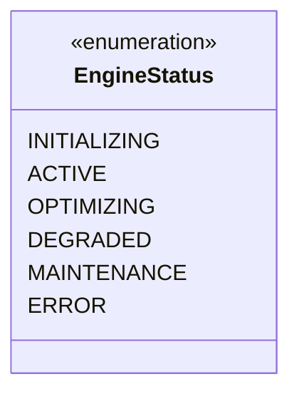
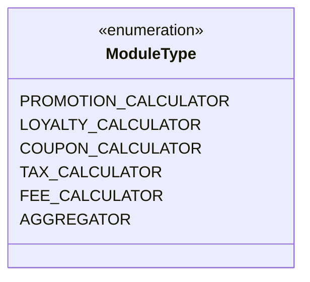
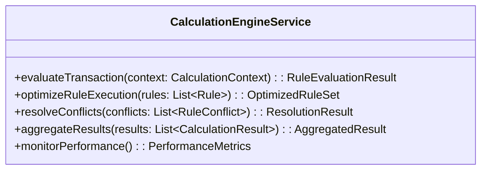
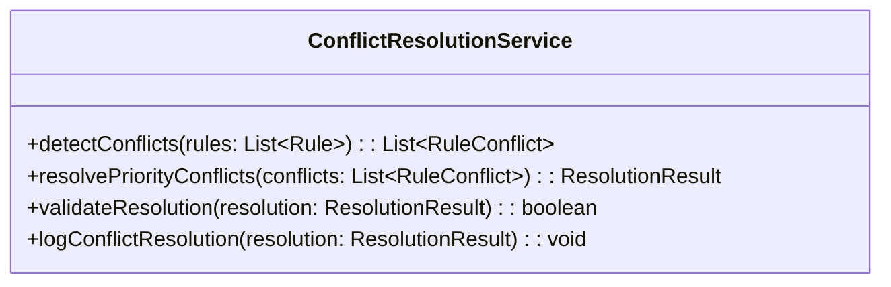
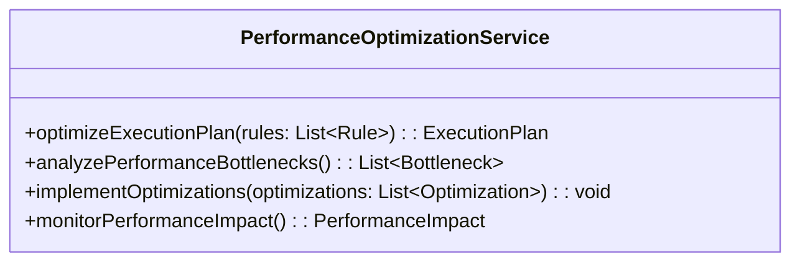

# Domain Model - Rule Evaluator/Calculator

## Overview
The Rule Evaluator/Calculator domain model defines the specialized calculation engine responsible for high-performance rule evaluation, conflict resolution, and result aggregation across all rule domains.

## Core Domain Concepts

### 1. Calculation Engine
The high-performance core that evaluates business rules against transaction contexts with optimized execution paths.

### 2. Conflict Resolution
The system that automatically detects and resolves conflicts between multiple applicable rules using priority-based algorithms.

### 3. Result Aggregation
The process that combines results from multiple rule types and domains into final transaction outcomes.

## Domain Model Diagram

```mermaid
classDiagram
    class CalculationEngine {
        +String id
        +String version
        +EngineStatus status
        +List~CalculationModule~ modules
        +PerformanceMetrics metrics
        +CacheManager cacheManager
        +evaluateRules(context, rules)
        +optimizeExecution()
        +getPerformanceMetrics()
    }

    class CalculationContext {
        +String id
        +String transactionId
        +Customer customer
        +Transaction transaction
        +List~Product~ products
        +Map~String, Object~ additionalData
        +DateTime evaluationTime
        +validateContext()
        +enrichContext()
    }

    class RuleEvaluationResult {
        +String id
        +String contextId
        +List~RuleExecution~ executions
        +ConflictResolution conflicts
        +AggregatedResult finalResult
        +PerformanceMetrics performance
        +DateTime completedAt
        +getAppliedRules()
        +getTotalBenefit()
    }

    class ConflictResolver {
        +String id
        +ResolutionStrategy strategy
        +List~ConflictRule~ rules
        +detectConflicts(executions)
        +resolveConflicts(conflicts)
        +validateResolution()
    }

    class CalculationModule {
        +String moduleId
        +String domain
        +ModuleType type
        +boolean isActive
        +calculate(context, rules)
        +validateInput()
        +optimizeCalculation()
    }

    CalculationEngine ||--o{ CalculationModule : contains
    CalculationEngine ||--|| ConflictResolver : uses
    CalculationContext ||--|| RuleEvaluationResult : produces
    RuleEvaluationResult ||--o{ ConflictResolver : resolves
```

## Value Objects

### EngineStatus


### ModuleType


## Domain Services

### CalculationEngineService


### ConflictResolutionService


### PerformanceOptimizationService


## Business Rules

### Calculation Rules
1. **Performance Rule**: All calculations must complete within 500ms for 95th percentile
2. **Accuracy Rule**: Calculation results must be accurate to the cent for financial calculations
3. **Conflict Resolution Rule**: Priority-based resolution with highest priority rule taking precedence
4. **Aggregation Rule**: Results from multiple domains must be aggregated consistently

### Optimization Rules
1. **Caching Rule**: Frequently accessed rules and data should be cached for performance
2. **Compilation Rule**: Hot path rules should be compiled for optimal execution
3. **Resource Management Rule**: Memory and CPU usage should be optimized for maximum throughput
4. **Scaling Rule**: Engine should scale horizontally to handle increased load
