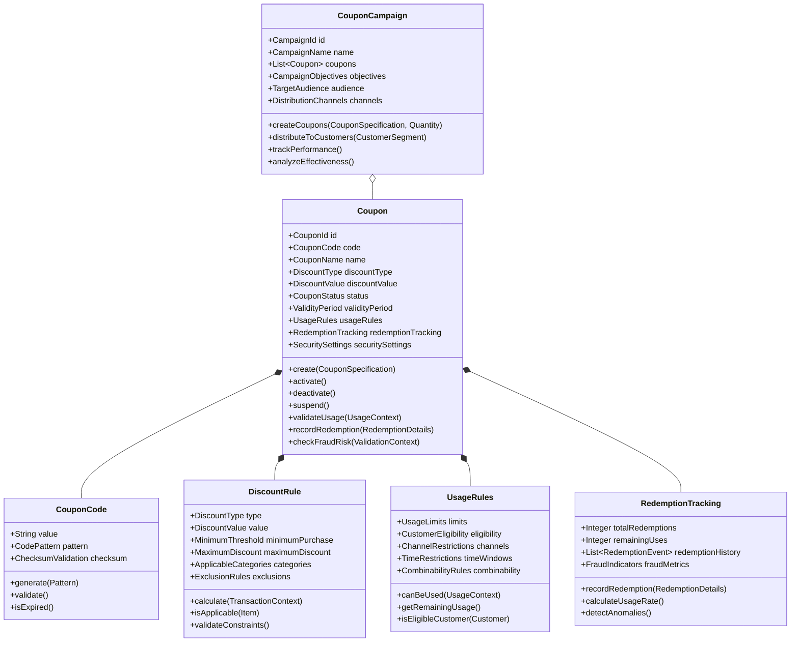

# Coupons Domain Model

## Bounded Context: Coupons Management

### Context Purpose
The Coupons bounded context is responsible for managing the complete lifecycle of promotional coupons, from creation and distribution to validation and redemption tracking. This context ensures secure, scalable, and fraud-resistant coupon operations across multiple sales channels.

### Core Domain Concepts

#### Aggregates

##### Coupon Aggregate

#### Value Objects

##### CouponId
- **Purpose**: Unique identifier for coupons
- **Format**: UUID v4 ensuring global uniqueness
- **Immutability**: Immutable once created
- **Validation**: Must be valid UUID format

##### CouponCode
- **Purpose**: User-facing coupon identifier
- **Format**: Configurable pattern (e.g., SAVE20-XXXX, WELCOME-YYYY)
- **Security**: Includes checksum validation to prevent guessing
- **Length**: 6-20 characters, configurable per campaign
- **Validation Rules**:
  - Must follow campaign-specific pattern
  - Must pass checksum validation
  - Must be unique across all active campaigns
  - Cannot contain confusing characters (0, O, I, L)

##### DiscountValue
- **Purpose**: Represents discount amount or percentage
- **Types**: 
  - FixedAmount: Specific monetary discount
  - Percentage: Percentage-based discount
  - BuyXGetY: Quantity-based discount
  - FreeShipping: Service-based discount
- **Validation**: 
  - Fixed amounts must be positive
  - Percentages must be 0-100%
  - Must specify currency for fixed amounts

##### ValidityPeriod
- **Purpose**: Defines when coupon can be used
- **Attributes**:
  - startDate: When coupon becomes valid
  - endDate: When coupon expires
  - timeZone: Timezone for validity calculation
- **Validation**:
  - End date must be after start date
  - Cannot be modified once coupon is active
  - Must consider timezone for global campaigns

#### Domain Events

##### CouponCreated
- **Trigger**: New coupon successfully created
- **Payload**: CouponId, CouponCode, CampaignId, CreatedBy, CreatedAt
- **Consequences**: Coupon available for distribution
- **Subscribers**: Campaign Management, Analytics Service

##### CouponActivated
- **Trigger**: Coupon becomes available for use
- **Payload**: CouponId, CouponCode, ActivatedAt, ValidityPeriod
- **Consequences**: Coupon ready for customer redemption
- **Subscribers**: Validation Service, Customer Communication

##### CouponRedeemed
- **Trigger**: Successful coupon redemption
- **Payload**: CouponId, CustomerId, TransactionId, DiscountApplied, RedeemedAt, Channel
- **Consequences**: Usage count updated, analytics updated
- **Subscribers**: Analytics Service, Fraud Detection, Customer Service

##### CouponExpired
- **Trigger**: Coupon passes expiration date
- **Payload**: CouponId, ExpiredAt, UnusedValue
- **Consequences**: Coupon no longer valid for redemption
- **Subscribers**: Analytics Service, Campaign Management

##### FraudDetected
- **Trigger**: Suspicious coupon usage pattern detected
- **Payload**: CouponId, FraudType, SuspiciousActivity, DetectedAt
- **Consequences**: Coupon may be suspended, security team alerted
- **Subscribers**: Security Service, Coupon Management, Analytics

#### Domain Services

##### CouponValidationService
- **Purpose**: Validates coupon eligibility and usage
- **Methods**:
  - validateCoupon(CouponCode, UsageContext): ValidationResult
  - checkEligibility(Customer, Coupon): EligibilityResult
  - calculateDiscount(Coupon, TransactionContext): DiscountCalculation
- **Business Rules**:
  - Must verify coupon is active and not expired
  - Must check customer eligibility and usage limits
  - Must validate transaction meets coupon requirements

##### FraudDetectionService
- **Purpose**: Detects and prevents coupon fraud
- **Methods**:
  - analyzeSuspiciousActivity(CouponUsage): FraudRisk
  - detectPatternAnomalies(CouponCode): AnomalyReport
  - validateCustomerBehavior(Customer, CouponUsage): BehaviorAnalysis
- **Detection Patterns**:
  - Rapid successive usage attempts
  - Usage from multiple IP addresses
  - Pattern-based code generation attempts
  - Unusual redemption velocity

##### CouponDistributionService
- **Purpose**: Manages coupon distribution across channels
- **Methods**:
  - distributeToSegment(CouponCampaign, CustomerSegment): DistributionResult
  - personalizeOffer(Customer, CouponTemplate): PersonalizedCoupon
  - trackDelivery(CouponId, DeliveryChannel): DeliveryStatus
- **Distribution Channels**:
  - Email campaigns
  - SMS notifications
  - Mobile app notifications
  - Website banners
  - Point-of-sale displays

### Integration Points

#### Inbound Dependencies
- **Customer Management**: Customer profiles and segments
- **Product Catalog**: Product information for applicability rules
- **Marketing Platform**: Campaign specifications and target audiences
- **Fraud Prevention**: External fraud detection signals

#### Outbound Dependencies
- **Payment Processing**: Discount application during checkout
- **Analytics Platform**: Usage metrics and campaign performance
- **Customer Communication**: Delivery of coupon codes
- **Audit Service**: Compliance and regulatory reporting

### Business Rules and Invariants

#### Coupon Uniqueness
- Coupon codes must be unique across all campaigns and time periods
- No two active coupons can have identical codes
- Expired coupon codes cannot be reused for 12 months

#### Usage Constraints
- Single-use coupons can only be redeemed once per customer
- Multi-use coupons must respect usage limits per customer
- Time-limited coupons cannot be used outside validity period

#### Discount Validation
- Minimum purchase requirements must be met before discount application
- Maximum discount limits cannot be exceeded
- Category restrictions must be enforced during validation

#### Security Requirements
- Coupon codes must include checksum validation
- Fraud detection must run for all redemption attempts
- Suspicious patterns must trigger automatic investigation

### Performance Requirements
- Coupon validation must complete within 200ms
- Fraud detection must not add more than 100ms to validation
- System must support 10,000+ concurrent validations
- Batch coupon generation must handle 1M+ coupons efficiently

### Data Privacy and Compliance
- Customer usage data must comply with GDPR requirements
- Coupon redemption history must be retained for audit purposes
- Personal data must be anonymized in analytics reporting
- Customer consent required for targeted coupon distribution
