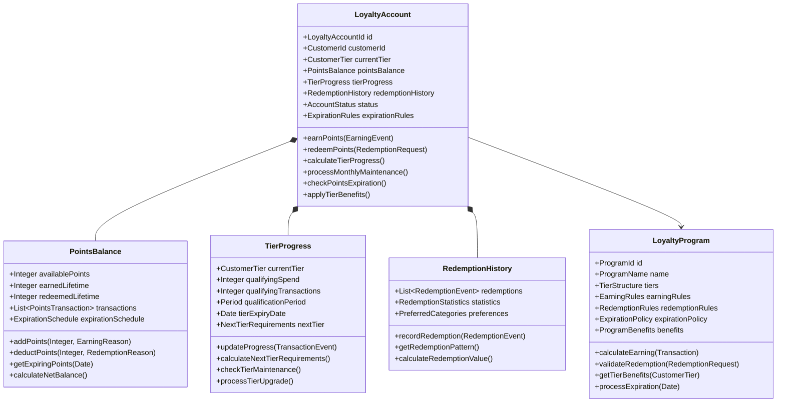

# Loyalty Management Domain Model

## Bounded Context: Loyalty Programs

### Context Purpose
The Loyalty Management bounded context is responsible for managing customer loyalty programs, including tier progression, points accumulation and redemption, rewards catalog, and personalized benefits. This context ensures engaging and valuable loyalty experiences that drive customer retention and lifetime value.

### Core Domain Concepts

#### Aggregates

##### LoyaltyAccount Aggregate

#### Value Objects

##### CustomerId
- **Purpose**: Unique identifier linking loyalty account to customer
- **Format**: String identifier matching customer management system
- **Validation**: Must be valid customer ID in the system
- **Immutability**: Immutable once assigned

##### PointsBalance
- **Purpose**: Tracks customer's points accumulation and usage
- **Attributes**:
  - availablePoints: Current redeemable points
  - earnedLifetime: Total points ever earned
  - redeemedLifetime: Total points ever redeemed
  - pendingPoints: Points not yet available for redemption
- **Business Rules**:
  - Available points cannot be negative
  - Lifetime earned must equal available + redeemed + expired
  - Points have expiration dates based on earning date

##### CustomerTier
- **Purpose**: Represents customer's loyalty tier status
- **Tiers**: 
  - BRONZE: Entry level (0-999 annual spend)
  - SILVER: Mid-level (1000-4999 annual spend)
  - GOLD: Premium (5000-9999 annual spend)
  - PLATINUM: Elite (10000+ annual spend)
- **Benefits**: Each tier has associated benefits and multipliers
- **Progression**: Based on rolling 12-month qualification period

##### RewardsCatalog
- **Purpose**: Available rewards for points redemption
- **Categories**:
  - DISCOUNT_VOUCHERS: Percentage or fixed amount discounts
  - FREE_PRODUCTS: Products available for points
  - EXPERIENCES: Special events and experiences
  - CHARITY_DONATIONS: Charitable giving options
- **Availability**: Real-time inventory and eligibility checking

#### Domain Events

##### PointsEarned
- **Trigger**: Customer earns points from qualifying activity
- **Payload**: CustomerId, PointsAmount, EarningReason, TransactionId, EarnedAt
- **Consequences**: Points balance updated, tier progress evaluated
- **Subscribers**: Analytics Service, Customer Communication, Tier Management

##### PointsRedeemed
- **Trigger**: Customer successfully redeems points for rewards
- **Payload**: CustomerId, PointsAmount, RewardDetails, RedemptionId, RedeemedAt
- **Consequences**: Points balance reduced, redemption history updated
- **Subscribers**: Fulfillment Service, Analytics, Customer Communication

##### TierUpgraded
- **Trigger**: Customer qualifies for higher tier
- **Payload**: CustomerId, PreviousTier, NewTier, QualificationData, UpgradedAt
- **Consequences**: Enhanced benefits activated, welcome communication sent
- **Subscribers**: Benefits Engine, Customer Communication, Analytics

##### TierDowngraded
- **Trigger**: Customer fails to maintain tier requirements
- **Payload**: CustomerId, PreviousTier, NewTier, ReasonCode, DowngradedAt
- **Consequences**: Reduced benefits, retention outreach triggered
- **Subscribers**: Benefits Engine, Retention Marketing, Analytics

##### PointsExpired
- **Trigger**: Points reach expiration date without redemption
- **Payload**: CustomerId, ExpiredPoints, ExpirationDate, OriginalEarningDate
- **Consequences**: Points balance reduced, expiration warning sent
- **Subscribers**: Customer Communication, Analytics, Account Management

#### Domain Services

##### TierCalculationService
- **Purpose**: Manages tier qualification and progression
- **Methods**:
  - calculateTierStatus(CustomerId, QualificationPeriod): TierStatus
  - evaluateTierProgress(LoyaltyAccount): TierProgress
  - processTierMaintenance(LoyaltyAccount): TierAction
- **Business Rules**:
  - Rolling 12-month qualification period
  - Spending and transaction count requirements
  - Grace period for tier maintenance

##### PointsEarningService
- **Purpose**: Calculates points earning for transactions and activities
- **Methods**:
  - calculateEarning(Transaction, CustomerTier): PointsEarning
  - applyPromotionalMultipliers(EarningCalculation): AdjustedEarning
  - validateEarningRules(EarningRequest): ValidationResult
- **Earning Rules**:
  - Base earning rates by tier and category
  - Promotional multipliers and bonuses
  - Minimum transaction requirements

##### RedemptionValidationService
- **Purpose**: Validates and processes points redemption requests
- **Methods**:
  - validateRedemption(RedemptionRequest): ValidationResult
  - checkRewardAvailability(RewardId): AvailabilityStatus
  - processRedemption(ValidatedRedemption): RedemptionResult
- **Validation Rules**:
  - Sufficient points balance
  - Reward availability and eligibility
  - Account status and restrictions

##### ExpirationManagementService
- **Purpose**: Manages points expiration lifecycle
- **Methods**:
  - calculateExpirationSchedule(PointsTransaction): ExpirationSchedule
  - processExpiringPoints(Date): List<ExpirationEvent>
  - sendExpirationWarnings(WarningPeriod): List<NotificationEvent>
- **Expiration Rules**:
  - Points expire 24 months from earning date
  - 30-day and 7-day warning notifications
  - Activity-based extension policies

### Integration Points

#### Inbound Dependencies
- **Customer Management**: Customer profiles and transaction history
- **Transaction Processing**: Purchase data for points earning
- **Marketing Platform**: Promotional campaigns and bonus point events
- **Rewards Fulfillment**: Reward inventory and delivery management

#### Outbound Dependencies
- **Customer Communication**: Tier changes, points updates, expiration warnings
- **Analytics Platform**: Program performance and customer behavior data
- **Promotional Engine**: Tier-based offers and personalized promotions
- **Customer Service**: Account status and history for support

### Business Rules and Invariants

#### Points Management
- Points can only be earned from verified transactions
- Points balance cannot be negative
- Earned points must be available for redemption within 24 hours
- Points expire exactly 24 months from earning date

#### Tier Management
- Tier status is calculated on rolling 12-month periods
- Tier upgrades are immediate upon qualification
- Tier downgrades have 3-month grace period
- Tier benefits are applied in real-time

#### Redemption Rules
- Minimum redemption threshold (varies by tier)
- Maximum redemption per transaction limits
- Reward availability is checked in real-time
- Redemptions are processed immediately

#### Program Integrity
- All points transactions must be auditable
- Tier calculations must be reproducible
- No retroactive points adjustments without approval
- Customer consent required for program terms changes

### Performance Requirements
- Points earning calculation must complete within 100ms
- Tier status lookup must complete within 50ms
- Redemption validation must complete within 200ms
- Batch expiration processing must handle 1M+ accounts efficiently

### Data Privacy and Compliance
- Customer points data must comply with GDPR requirements
- Points earning history must be retained for audit purposes
- Personal data must be anonymized in analytics reporting
- Customer consent required for promotional communications
