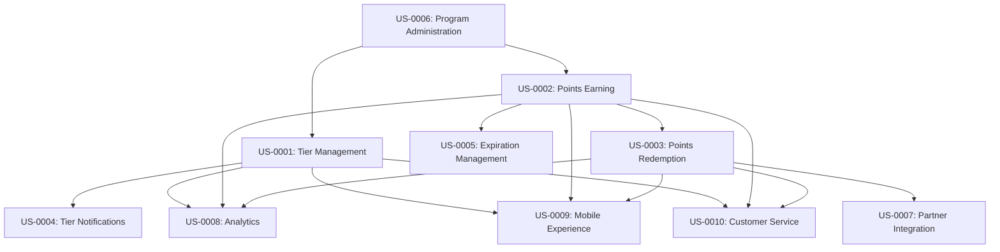

# User Stories - Loyalty Management

## Epic: Customer Loyalty Program Management

### US-0001: Customer Tier Management
**As a** customer  
**I want to** see my current loyalty tier and benefits  
**So that** I understand my status and what benefits I'm entitled to

**Acceptance Criteria:**
- Customer can view current tier (Bronze, Silver, Gold, Platinum)
- Customer can see tier benefits and privileges
- Customer can view progress toward next tier
- Customer can see tier qualification period and renewal date

**Priority**: High  
**Story Points**: 5  
**Business Value**: Customer engagement and transparency

### US-0002: Points Earning and Tracking
**As a** customer  
**I want to** earn points for my purchases automatically  
**So that** I can accumulate rewards without manual effort

**Acceptance Criteria:**
- Points are automatically calculated and added after purchase completion
- Points earning rate varies by customer tier (1x, 1.5x, 2x, 3x)
- Points are visible in customer account within 24 hours
- Points earning includes bonus categories (e.g., 2x points for electronics)

**Priority**: High  
**Story Points**: 8  
**Business Value**: Core loyalty functionality

### US-0003: Points Redemption
**As a** customer  
**I want to** redeem my points for rewards  
**So that** I can get value from my loyalty program participation

**Acceptance Criteria:**
- Customer can browse available rewards catalog
- Customer can filter rewards by points required and category
- Redemption process deducts correct points amount
- Rewards are delivered according to fulfillment process

**Priority**: High  
**Story Points**: 8  
**Business Value**: Customer value realization

### US-0004: Tier Progression Notifications
**As a** customer  
**I want to** be notified when I qualify for a higher tier  
**So that** I can enjoy new benefits immediately

**Acceptance Criteria:**
- Customer receives notification when tier qualification is achieved
- Notification includes new benefits explanation
- Tier upgrade is processed automatically
- Customer can see effective date of new tier status

**Priority**: Medium  
**Story Points**: 5  
**Business Value**: Customer engagement and satisfaction

### US-0005: Points Expiration Management
**As a** customer  
**I want to** be warned before my points expire  
**So that** I can use them before losing value

**Acceptance Criteria:**
- Customer receives 30-day expiration warning
- Customer receives 7-day expiration warning
- Customer can see expiration dates for all point balances
- Activity extends expiration date for additional 24 months

**Priority**: Medium  
**Story Points**: 5  
**Business Value**: Customer retention and engagement

### US-0006: Loyalty Program Administration
**As a** loyalty program manager  
**I want to** configure loyalty program rules and benefits  
**So that** I can optimize customer engagement and program performance

**Acceptance Criteria:**
- Manager can set tier qualification thresholds
- Manager can configure points earning rates by category
- Manager can add/remove rewards from catalog
- Manager can set expiration policies and rules

**Priority**: Medium  
**Story Points**: 13  
**Business Value**: Program flexibility and optimization

### US-0007: Partner Rewards Integration
**As a** customer  
**I want to** earn and redeem points with partner merchants  
**So that** I can maximize my loyalty program value

**Acceptance Criteria:**
- Customer can earn points at partner locations
- Partner points are synchronized with main account
- Customer can redeem points for partner rewards
- Partner transactions appear in loyalty activity history

**Priority**: Low  
**Story Points**: 13  
**Business Value**: Program expansion and customer value

### US-0008: Loyalty Analytics and Insights
**As a** business analyst  
**I want to** analyze loyalty program performance  
**So that** I can optimize program effectiveness

**Acceptance Criteria:**
- Analytics show tier distribution and progression trends
- Reports include points liability and redemption patterns
- Customer engagement metrics are available
- Program ROI and customer lifetime value analysis available

**Priority**: Low  
**Story Points**: 8  
**Business Value**: Program optimization and business intelligence

### US-0009: Mobile Loyalty Experience
**As a** mobile customer  
**I want to** access my loyalty information on mobile devices  
**So that** I can check my status and redeem rewards on the go

**Acceptance Criteria:**
- Mobile app displays current points balance and tier
- Mobile users can browse and redeem rewards
- Push notifications for tier changes and point expirations
- Mobile-optimized reward redemption process

**Priority**: Medium  
**Story Points**: 8  
**Business Value**: Customer convenience and engagement

### US-0010: Loyalty Customer Service
**As a** customer service representative  
**I want to** access customer loyalty information and resolve issues  
**So that** I can provide excellent customer support

**Acceptance Criteria:**
- CSR can view complete customer loyalty history
- CSR can manually adjust points balances with proper authorization
- CSR can explain tier benefits and qualification requirements
- CSR can initiate tier reviews and adjustments

**Priority**: Medium  
**Story Points**: 8  
**Business Value**: Customer satisfaction and issue resolution

## Story Dependencies and Flow

## Epic Summary

**Total Story Points**: 89  
**Estimated Duration**: 6-8 sprints  
**Priority Distribution**:
- High Priority: 3 stories (21 points)
- Medium Priority: 5 stories (47 points)  
- Low Priority: 2 stories (21 points)

**Business Value Focus**:
1. Core loyalty functionality (points earning/redemption)
2. Customer engagement and transparency
3. Program management and optimization
4. Multi-channel customer experience
