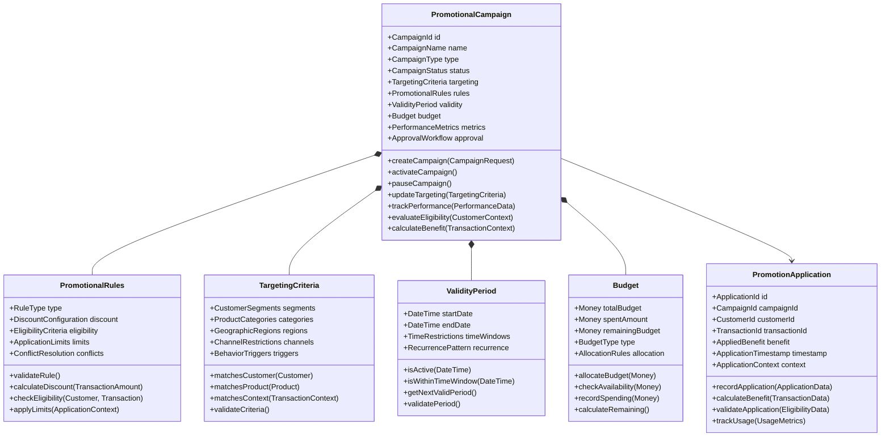

# Promotions Management Domain Model

## Bounded Context: Promotional Campaigns and Offers

### Context Purpose
The Promotions Management bounded context is responsible for creating, managing, and executing promotional campaigns including percentage discounts, buy-X-get-Y offers, bundle deals, and time-limited promotions. This context ensures effective promotional strategies that drive sales conversion, increase average order value, and attract new customers while maintaining profitability and business objectives.

### Core Domain Concepts

#### Aggregates

##### PromotionalCampaign Aggregate

#### Value Objects

##### CampaignId
- **Purpose**: Unique identifier for promotional campaigns ensuring global uniqueness
- **Format**: String identifier with campaign prefix (e.g., "PROMO-2024-001")
- **Validation**: Must be valid campaign ID format with proper prefix
- **Immutability**: Immutable once assigned

##### DiscountConfiguration
- **Purpose**: Defines the discount structure and calculation rules for promotions
- **Types**:
  - PERCENTAGE: Percentage-based discount (e.g., 15% off)
  - FIXED_AMOUNT: Fixed dollar amount discount (e.g., $10 off)
  - BUY_X_GET_Y: Buy X items, get Y items free/discounted
  - BUNDLE: Product bundle with special pricing
- **Attributes**:
  - discountType: Type of discount being applied
  - discountValue: Numeric value (percentage or amount)
  - minimumPurchase: Minimum purchase requirement
  - maximumDiscount: Maximum discount amount allowed
- **Business Rules**:
  - Percentage discounts must be between 0% and 100%
  - Fixed amount discounts cannot exceed transaction value
  - Bundle configurations must include valid product combinations

##### CustomerSegments
- **Purpose**: Defines target customer groups for promotional campaigns
- **Segments**:
  - NEW_CUSTOMERS: First-time purchasers
  - LOYAL_CUSTOMERS: High lifetime value customers
  - TIER_BASED: Based on loyalty tier (Bronze, Silver, Gold, Platinum)
  - BEHAVIORAL: Based on purchase behavior patterns
  - GEOGRAPHIC: Based on location and region
- **Attributes**:
  - segmentType: Type of customer segmentation
  - criteria: Specific criteria for segment inclusion
  - exclusions: Criteria for segment exclusion
- **Business Rules**:
  - Segments must be mutually exclusive or have clear priority
  - Criteria must be verifiable against customer data
  - Exclusions take precedence over inclusions

##### PromotionType
- **Purpose**: Categorizes different types of promotional offers
- **Types**:
  - SEASONAL: Holiday and seasonal promotions
  - CLEARANCE: Inventory clearance promotions
  - LOYALTY: Loyalty program specific promotions
  - ACQUISITION: New customer acquisition promotions
  - RETENTION: Customer retention promotions
  - CROSS_SELL: Cross-selling promotional offers
  - UPSELL: Upselling promotional offers
- **Attributes**:
  - category: Primary promotion category
  - priority: Priority level for conflict resolution
  - stackability: Whether promotion can stack with others
- **Business Rules**:
  - Each promotion must have clear category classification
  - Priority determines application order in conflicts
  - Stackability rules prevent conflicting combinations

#### Domain Events

##### PromotionalCampaignCreated
- **Trigger**: When a new promotional campaign is successfully created
- **Payload**: CampaignId, CampaignName, CampaignType, CreatedBy, CreatedAt, TargetingCriteria
- **Consequences**: Campaign appears in management interfaces, validation processes triggered
- **Subscribers**: Campaign Management UI, Analytics Service, Notification Service

##### PromotionalCampaignActivated
- **Trigger**: When a promotional campaign is activated and becomes available for application
- **Payload**: CampaignId, ActivatedBy, ActivatedAt, ValidityPeriod, Budget, TargetingCriteria
- **Consequences**: Campaign becomes available for customer application, cache updates
- **Subscribers**: Rules Evaluation Engine, Customer Communication, Analytics Service

##### PromotionApplied
- **Trigger**: When a promotion is successfully applied to a customer transaction
- **Payload**: ApplicationId, CampaignId, CustomerId, TransactionId, AppliedBenefit, ApplicationContext
- **Consequences**: Discount applied, budget allocated, usage tracked
- **Subscribers**: Transaction Processing, Budget Management, Analytics Service

##### PromotionEligibilityChecked
- **Trigger**: When promotion eligibility is evaluated for a customer/transaction
- **Payload**: CampaignId, CustomerId, EligibilityResult, CheckedAt, EligibilityCriteria
- **Consequences**: Eligibility result cached, targeting effectiveness tracked
- **Subscribers**: Customer Experience, Analytics Service, A/B Testing Platform

##### CampaignBudgetExhausted
- **Trigger**: When a promotional campaign reaches its budget limit
- **Payload**: CampaignId, ExhaustedAt, TotalSpent, LastApplication, NextBudgetPeriod
- **Consequences**: Campaign deactivated, notifications sent, budget analysis triggered
- **Subscribers**: Campaign Management, Finance Team, Customer Communication

##### PromotionalConflictDetected
- **Trigger**: When multiple promotions conflict and require resolution
- **Payload**: ConflictId, ConflictingCampaigns, ResolutionStrategy, Customer, Transaction
- **Consequences**: Conflict resolution applied, optimization analysis triggered
- **Subscribers**: Conflict Resolution Service, Analytics Service, Campaign Optimization

#### Domain Services

##### CampaignEligibilityService
- **Purpose**: Evaluates customer and transaction eligibility for promotional campaigns
- **Methods**:
  - evaluateEligibility(Customer, Transaction, Campaign): EligibilityResult
  - checkSegmentMembership(Customer, CustomerSegments): Boolean
  - validateTransactionCriteria(Transaction, EligibilityCriteria): Boolean
  - calculateEligibilityScore(Customer, Campaign): EligibilityScore
- **Business Rules**:
  - All targeting criteria must be satisfied for eligibility
  - Geographic restrictions take precedence over other criteria
  - Time-based eligibility checked at evaluation time
  - Customer exclusion lists override inclusion criteria

##### PromotionCalculationService
- **Purpose**: Calculates promotional benefits and discount amounts for eligible transactions
- **Methods**:
  - calculateDiscount(Transaction, PromotionalRules): DiscountAmount
  - applyBuyXGetY(CartItems, BuyXGetYRules): BenefitApplication
  - calculateBundleDiscount(CartItems, BundleRules): BundleDiscount
  - optimizePromotionalBenefit(Customer, Transaction, AvailableCampaigns): OptimalBenefit
- **Calculation Rules**:
  - Percentage discounts applied to eligible items only
  - Fixed amount discounts distributed proportionally
  - Buy-X-Get-Y applied to qualifying item combinations
  - Bundle discounts applied to complete bundles only

##### CampaignPerformanceService
- **Purpose**: Tracks and analyzes promotional campaign performance metrics
- **Methods**:
  - trackCampaignMetrics(Campaign, ApplicationData): PerformanceMetrics
  - calculateROI(Campaign, RevenueData, CostData): ROI
  - analyzeCampaignEffectiveness(Campaign, TimeRange): EffectivenessReport
  - generateOptimizationRecommendations(Campaign, PerformanceData): Recommendations
- **Metrics Tracked**:
  - Application rate and conversion metrics
  - Revenue impact and ROI calculations
  - Customer acquisition and retention metrics
  - Budget utilization and efficiency

##### ConflictResolutionService
- **Purpose**: Resolves conflicts when multiple promotions apply to the same transaction
- **Methods**:
  - detectConflicts(AvailablePromotions, Transaction): ConflictAnalysis
  - resolveBestForCustomer(ConflictingPromotions, Customer): ResolutionResult
  - applyPriorityBasedResolution(ConflictingPromotions): PriorityResolution
  - calculateOptimalCombination(StackablePromotions, Transaction): OptimalCombination
- **Resolution Strategies**:
  - BEST_FOR_CUSTOMER: Maximum benefit to customer
  - PRIORITY_BASED: Campaign priority determines application
  - BUDGET_OPTIMIZED: Optimize budget utilization
  - BUSINESS_RULE_BASED: Apply predefined business rules

### Integration Points

#### Inbound Dependencies
- **Customer Management**: Customer profiles, segments, and purchase history
- **Product Catalog**: Product information, categories, and pricing
- **Transaction Processing**: Real-time transaction data for promotion application
- **Inventory Management**: Product availability for bundle and clearance promotions
- **Rules Evaluation Engine**: Integration with core rule evaluation for complex logic

#### Outbound Dependencies
- **Pricing Engine**: Dynamic pricing updates based on promotional rules
- **Customer Communication**: Promotional offers and campaign notifications
- **Analytics Platform**: Campaign performance and effectiveness analysis
- **Financial Systems**: Budget tracking and promotional cost allocation
- **Loyalty Management**: Coordination with loyalty-based promotions

### Business Rules and Invariants

#### Campaign Management Rules
- Campaigns must have valid start and end dates with end date after start date
- Budget allocation cannot exceed available campaign budget
- Only approved campaigns can be activated for customer application
- Conflicting campaigns must have clear resolution strategy

#### Promotion Application Rules
- Customer must meet all targeting criteria for promotion eligibility
- Transaction must satisfy minimum purchase and product requirements
- Promotion benefits cannot exceed maximum discount limits
- Usage limits per customer must be enforced

#### Budget and Financial Rules
- Campaign spending cannot exceed allocated budget limits
- Budget allocation must be tracked in real-time for accurate availability
- Financial impact must be calculated and reported for all promotions
- Budget exhaustion triggers automatic campaign deactivation

#### Performance and Optimization Rules
- Campaign performance must be tracked for ROI analysis
- A/B testing variations must maintain statistical significance
- Optimization recommendations based on performance data
- Campaign effectiveness measured against predefined KPIs

### Performance Requirements
- Campaign eligibility evaluation must complete within 200ms
- Promotion calculation must complete within 100ms for simple discounts
- Conflict resolution must complete within 500ms for complex scenarios
- Campaign activation must propagate to all systems within 5 minutes

### Data Privacy and Compliance
- Customer targeting data must comply with privacy regulations
- Promotional history must be retained for audit and analysis purposes
- Personal data used in targeting must be anonymized in reports
- Customer consent required for personalized promotional communications

### Analytics and Reporting Requirements
- Real-time campaign performance dashboards
- Customer response and engagement analytics
- Revenue impact and ROI analysis
- A/B testing results and statistical significance
- Budget utilization and efficiency reporting
