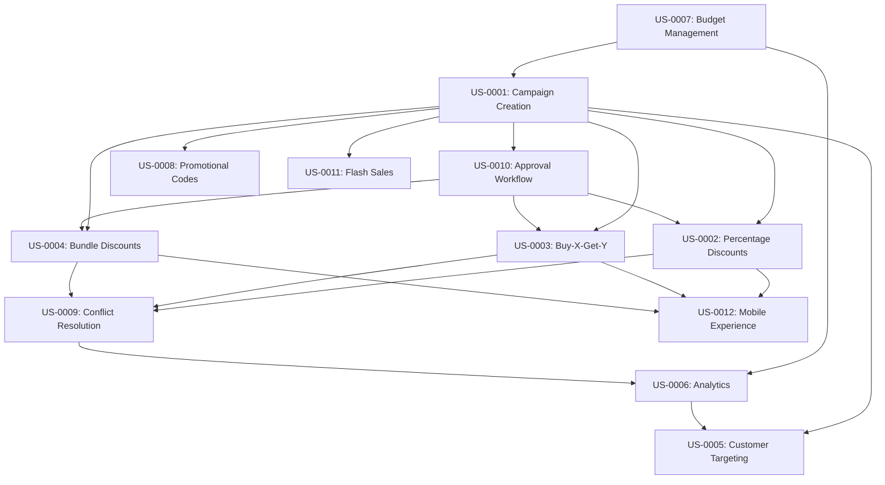

# User Stories - Promotions Management

## Epic: Promotional Campaigns and Offers Management

### US-0001: Campaign Creation and Configuration
**As a** marketing manager  
**I want to** create and configure promotional campaigns with specific targeting and rules  
**So that** I can drive sales and customer engagement through targeted offers

**Acceptance Criteria:**
- Marketing manager can create campaigns with name, description, and objectives
- Campaign can be configured with start/end dates and time restrictions
- Target customer segments can be defined (new, loyal, tier-based, geographic)
- Discount rules can be configured (percentage, fixed amount, buy-X-get-Y, bundles)
- Budget limits and allocation rules can be set
- Campaign priority can be assigned for conflict resolution

**Priority**: High  
**Story Points**: 13  
**Business Value**: Enable targeted marketing and promotional strategies

### US-0002: Percentage and Fixed Discount Promotions
**As a** customer  
**I want to** receive percentage or fixed amount discounts on eligible purchases  
**So that** I can save money and get better value for my purchases

**Acceptance Criteria:**
- Customer receives percentage discounts (e.g., 15% off) on eligible items
- Customer receives fixed amount discounts (e.g., $10 off) on qualifying orders
- Minimum purchase requirements are enforced before discount application
- Maximum discount limits are applied to prevent excessive discounts
- Discount is clearly shown in cart and checkout process

**Priority**: High  
**Story Points**: 8  
**Business Value**: Core promotional functionality for customer savings

### US-0003: Buy-X-Get-Y Promotional Offers
**As a** customer  
**I want to** receive free or discounted items when I buy qualifying quantities  
**So that** I can maximize value and try new products

**Acceptance Criteria:**
- Customer can get free items when purchasing required quantities (buy 2 get 1 free)
- Customer can get discounted items for additional purchases (buy 2 get 1 half price)
- Qualifying items are automatically identified in cart
- Free/discounted items are applied to lowest-priced eligible items
- Promotion rules clearly displayed to customer

**Priority**: High  
**Story Points**: 13  
**Business Value**: Increase average order value and product trial

### US-0004: Bundle Discount Promotions
**As a** customer  
**I want to** receive special pricing when purchasing product bundles  
**So that** I can get complementary products at better value

**Acceptance Criteria:**
- Customer can purchase predefined product bundles at special prices
- Bundle discount is greater than individual item discounts
- Bundle components are automatically identified and grouped
- Partial bundle purchases don't receive bundle pricing
- Alternative bundle options are suggested when possible

**Priority**: Medium  
**Story Points**: 13  
**Business Value**: Increase cross-selling and average order value

### US-0005: Customer Segment Targeting
**As a** marketing manager  
**I want to** target specific customer segments with tailored promotions  
**So that** I can maximize campaign effectiveness and ROI

**Acceptance Criteria:**
- Manager can target new customers with acquisition promotions
- Manager can target loyal customers with retention offers
- Manager can target specific tiers (Bronze, Silver, Gold, Platinum) with tier-based benefits
- Geographic targeting can be applied by region, state, or city
- Behavioral targeting based on purchase history and patterns

**Priority**: Medium  
**Story Points**: 8  
**Business Value**: Improve campaign targeting and effectiveness

### US-0006: Promotional Campaign Analytics
**As a** marketing manager  
**I want to** track and analyze promotional campaign performance  
**So that** I can optimize campaigns and demonstrate ROI

**Acceptance Criteria:**
- Manager can view real-time campaign performance metrics
- Analytics show application rate, conversion rate, and revenue impact
- ROI calculation includes campaign costs and revenue attribution
- Customer engagement metrics track promotion interaction
- A/B testing results compare campaign variations

**Priority**: Medium  
**Story Points**: 8  
**Business Value**: Enable data-driven campaign optimization

### US-0007: Budget Management and Control
**As a** marketing manager  
**I want to** manage campaign budgets and spending limits  
**So that** I can control promotional costs and maintain profitability

**Acceptance Criteria:**
- Manager can set total campaign budget limits
- Real-time budget tracking shows spending and remaining budget
- Campaigns automatically pause when budget is exhausted
- Budget allocation can be distributed across time periods
- Spending alerts notify when approaching budget limits

**Priority**: Medium  
**Story Points**: 8  
**Business Value**: Financial control and cost management

### US-0008: Promotional Code Management
**As a** marketing manager  
**I want to** create and manage promotional codes for customer distribution  
**So that** I can provide targeted offers through various channels

**Acceptance Criteria:**
- Manager can generate unique promotional codes for campaigns
- Codes can be configured for single-use or multiple-use
- Code usage limits can be set per customer or globally
- Code expiration dates can be configured independently of campaign dates
- Invalid or expired codes provide clear error messages to customers

**Priority**: Low  
**Story Points**: 8  
**Business Value**: Enable code-based promotional distribution

### US-0009: Promotional Conflict Resolution
**As a** customer  
**I want to** automatically receive the best available promotion when multiple offers apply  
**So that** I get maximum value without having to compare options manually

**Acceptance Criteria:**
- System automatically evaluates all applicable promotions
- Customer receives the promotion with the highest benefit value
- Conflicting promotions are resolved based on predefined rules
- Stackable promotions can be combined when beneficial
- Customer is informed which promotions were applied and why

**Priority**: Medium  
**Story Points**: 13  
**Business Value**: Optimize customer value and satisfaction

### US-0010: Campaign Approval Workflow
**As a** campaign approver  
**I want to** review and approve promotional campaigns before activation  
**So that** I can ensure campaigns align with business objectives and policies

**Acceptance Criteria:**
- Approver can review campaign details, targeting, and budget
- Approval workflow supports multiple approval levels
- Campaigns cannot be activated without proper approvals
- Approver can request changes or reject campaigns with feedback
- Approval history and comments are tracked for audit purposes

**Priority**: Low  
**Story Points**: 8  
**Business Value**: Governance and risk management

### US-0011: Time-Limited Flash Sales
**As a** marketing manager  
**I want to** create time-limited flash sales with countdown timers  
**So that** I can create urgency and drive immediate purchases

**Acceptance Criteria:**
- Manager can create short-duration promotional campaigns (hours/days)
- Real-time countdown timer displays remaining promotion time
- Promotion automatically activates and deactivates at scheduled times
- Inventory limits can be set for flash sale items
- Social sharing features promote flash sale awareness

**Priority**: Low  
**Story Points**: 8  
**Business Value**: Create urgency and increase conversion rates

### US-0012: Mobile Promotional Experience
**As a** mobile customer  
**I want to** access and apply promotions seamlessly on mobile devices  
**So that** I can shop and save effectively on the go

**Acceptance Criteria:**
- Mobile app displays available promotions clearly
- Promotional codes can be easily entered and applied
- Mobile-specific promotions can be configured (location-based, app-exclusive)
- Push notifications alert customers to relevant promotions
- Mobile checkout process clearly shows applied discounts

**Priority**: Medium  
**Story Points**: 8  
**Business Value**: Optimize mobile commerce experience

## Story Dependencies and Flow

## Epic Summary

**Total Story Points**: 124  
**Estimated Duration**: 8-10 sprints  
**Priority Distribution**:
- High Priority: 3 stories (34 points)
- Medium Priority: 6 stories (64 points)  
- Low Priority: 3 stories (26 points)

**Business Value Focus**:
1. Core promotional functionality (discounts, buy-X-get-Y, bundles)
2. Campaign management and optimization
3. Customer targeting and personalization
4. Mobile and multi-channel experience
5. Analytics and performance tracking

## User Journey Mapping

### Campaign Manager Journey
1. **Planning Phase**: Create campaign concept and define objectives
2. **Configuration Phase**: Set up targeting, rules, budget, and approval
3. **Approval Phase**: Submit for review and address feedback
4. **Launch Phase**: Activate campaign and monitor initial performance
5. **Optimization Phase**: Analyze performance and make adjustments
6. **Completion Phase**: Evaluate results and document learnings

### Customer Journey
1. **Discovery**: Encounter promotion through various channels
2. **Evaluation**: Understand promotion terms and benefits
3. **Shopping**: Add eligible items to cart and see potential savings
4. **Application**: Apply promotion codes or automatic discounts
5. **Checkout**: Complete purchase with applied promotions
6. **Confirmation**: Receive confirmation of savings and benefits

### Technical Implementation Journey
1. **Campaign Definition**: Technical specification and rule configuration
2. **System Integration**: Integration with pricing, inventory, and customer systems
3. **Testing**: Comprehensive testing of promotion logic and calculations
4. **Deployment**: Gradual rollout with monitoring and validation
5. **Monitoring**: Real-time performance tracking and issue detection
6. **Optimization**: Performance tuning and rule refinement

## Acceptance Criteria Details

### Campaign Creation and Management
- **Data Validation**: All campaign fields must be validated for completeness and accuracy
- **Business Rules**: Campaigns must comply with business policies and legal requirements
- **Integration**: Campaign data must integrate with pricing, inventory, and customer systems
- **Audit Trail**: All campaign changes must be logged for compliance and analysis

### Promotional Calculations
- **Accuracy**: All discount calculations must be mathematically correct and consistent
- **Performance**: Calculations must complete within performance thresholds (<100ms)
- **Edge Cases**: Handle edge cases like rounding, minimum orders, and product exclusions
- **Transparency**: Customers must clearly understand how discounts are calculated

### Customer Experience
- **Clarity**: Promotional terms and benefits must be clearly communicated
- **Ease of Use**: Promotion application should be intuitive and frictionless
- **Transparency**: Customers should understand which promotions apply and why
- **Responsiveness**: Mobile experience must be optimized for various devices

### Analytics and Reporting
- **Accuracy**: All metrics must accurately reflect campaign performance
- **Timeliness**: Reports must be available within acceptable timeframes
- **Completeness**: Analytics must cover all aspects of campaign effectiveness
- **Actionability**: Insights must support decision-making and optimization
