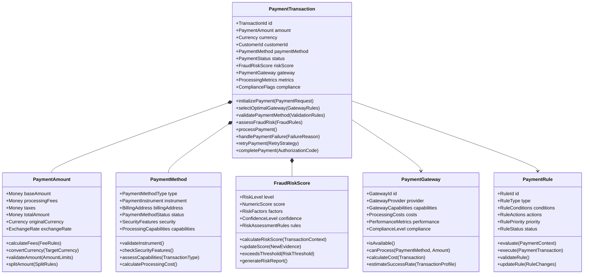

# Payment Rules Domain Model

## Bounded Context: Payment Processing and Rules

### Context Purpose
The Payment Rules bounded context is responsible for intelligent payment processing, including payment method selection, fraud prevention, gateway routing, currency handling, and payment optimization. This context ensures secure, efficient, and compliant payment processing while maximizing success rates and minimizing costs through intelligent rule-driven decision making.

### Core Domain Concepts

#### Aggregates

##### PaymentTransaction Aggregate

#### Value Objects

##### PaymentMethodType
- **Purpose**: Categorizes different payment instruments and their processing characteristics
- **Types**:
  - CREDIT_CARD: Traditional credit card payments
  - DEBIT_CARD: Bank debit card transactions
  - DIGITAL_WALLET: Apple Pay, Google Pay, PayPal, etc.
  - BANK_TRANSFER: ACH, wire transfers, direct debits
  - BUY_NOW_PAY_LATER: Installment and BNPL services
  - CRYPTOCURRENCY: Digital currency payments (if enabled)
  - GIFT_CARD: Store credit and gift card redemptions
- **Attributes**:
  - processingTime: Expected time for authorization and settlement
  - securityLevel: Required security measures and protocols
  - costStructure: Fee structure and processing costs
  - complianceRequirements: Regulatory requirements by type
- **Business Rules**:
  - Each type has specific validation requirements
  - Processing capabilities vary by geography and gateway
  - Cost structures influence optimal gateway selection

##### RiskLevel
- **Purpose**: Categorizes fraud risk assessment for payment transactions
- **Levels**:
  - VERY_LOW: Trusted customers with established patterns
  - LOW: Normal transactions with minimal risk indicators
  - MEDIUM: Transactions requiring additional validation
  - HIGH: Suspicious transactions needing manual review
  - VERY_HIGH: Likely fraudulent transactions to block
- **Attributes**:
  - numericRange: Specific score ranges for each level
  - actionRequired: Automatic actions triggered by level
  - reviewProcess: Manual review requirements
  - blockingRules: Conditions for automatic blocking
- **Business Rules**:
  - Risk levels determine processing flow and requirements
  - Higher levels trigger additional security measures
  - Thresholds are configurable by business requirements

##### Currency
- **Purpose**: Represents currency handling and conversion capabilities
- **Attributes**:
  - currencyCode: ISO 4217 currency codes
  - exchangeRate: Current exchange rate for conversions
  - conversionFees: Fees associated with currency conversion
  - supportedGateways: Gateways that support the currency
  - regulatoryRequirements: Currency-specific compliance needs
- **Business Rules**:
  - Exchange rates updated in real-time from financial feeds
  - Conversion fees calculated based on amount and currency pair
  - Some gateways only support specific currencies
  - Regulatory requirements vary by currency and geography

##### ComplianceFlags
- **Purpose**: Tracks compliance requirements and validation status
- **Flags**:
  - PCI_DSS_COMPLIANT: Payment Card Industry compliance
  - AML_VERIFIED: Anti-Money Laundering verification
  - KYC_COMPLETED: Know Your Customer verification
  - GDPR_COMPLIANT: General Data Protection Regulation
  - REGIONAL_COMPLIANCE: Local regulatory compliance
- **Attributes**:
  - complianceLevel: Required compliance level for transaction
  - verificationStatus: Current verification state
  - expirationDate: When compliance verification expires
  - documentationRequired: Additional documentation needed
- **Business Rules**:
  - All payment transactions must meet minimum compliance
  - Higher value transactions require enhanced compliance
  - Non-compliant transactions are automatically blocked

#### Domain Events

##### PaymentTransactionInitiated
- **Trigger**: When a new payment transaction is started by customer
- **Payload**: TransactionId, CustomerId, PaymentAmount, PaymentMethod, InitiatedAt
- **Consequences**: Fraud assessment triggered, gateway selection initiated
- **Subscribers**: Fraud Detection Service, Gateway Routing Service, Analytics

##### PaymentMethodSelected
- **Trigger**: When optimal payment method is selected for transaction
- **Payload**: TransactionId, SelectedMethod, SelectionReason, AlternativeMethods
- **Consequences**: Gateway routing updated, processing fees calculated
- **Subscribers**: Gateway Routing, Fee Calculation, Customer Experience

##### FraudRiskAssessed
- **Trigger**: When fraud risk analysis is completed for transaction
- **Payload**: TransactionId, RiskScore, RiskLevel, RiskFactors, AssessedAt
- **Consequences**: Risk-based processing flow triggered, manual review initiated if needed
- **Subscribers**: Payment Processing, Risk Management, Compliance

##### PaymentGatewaySelected
- **Trigger**: When optimal payment gateway is chosen for processing
- **Payload**: TransactionId, SelectedGateway, SelectionCriteria, ExpectedCost, EstimatedSuccessRate
- **Consequences**: Payment routing configured, processing initiated
- **Subscribers**: Payment Processing, Cost Tracking, Performance Monitoring

##### PaymentProcessingStarted
- **Trigger**: When payment processing begins at selected gateway
- **Payload**: TransactionId, GatewayId, ProcessingStartedAt, EstimatedCompletionTime
- **Consequences**: Processing status tracking initiated, timeout monitoring started
- **Subscribers**: Status Tracking, Customer Notification, Timeout Management

##### PaymentProcessingCompleted
- **Trigger**: When payment processing finishes (success or failure)
- **Payload**: TransactionId, ProcessingResult, AuthorizationCode, ProcessingTime, GatewayResponse
- **Consequences**: Transaction status updated, customer notified, metrics recorded
- **Subscribers**: Transaction Management, Customer Notification, Analytics

##### PaymentFailureDetected
- **Trigger**: When payment processing fails for any reason
- **Payload**: TransactionId, FailureReason, FailureCode, GatewayResponse, FailedAt
- **Consequences**: Retry logic triggered, alternative gateway considered
- **Subscribers**: Retry Management, Gateway Performance, Customer Support

##### PaymentRetryInitiated
- **Trigger**: When payment retry is attempted with different configuration
- **Payload**: TransactionId, RetryAttempt, RetryStrategy, PreviousFailureReason
- **Consequences**: New processing attempt started, retry metrics tracked
- **Subscribers**: Payment Processing, Retry Analytics, Success Rate Tracking

#### Domain Services

##### PaymentGatewaySelectionService
- **Purpose**: Selects optimal payment gateway based on transaction characteristics and business rules
- **Methods**:
  - selectOptimalGateway(PaymentTransaction, AvailableGateways): GatewaySelection
  - evaluateGatewayCapabilities(Gateway, Transaction): CapabilityAssessment
  - calculateExpectedCost(Gateway, Transaction): CostEstimate
  - estimateSuccessRate(Gateway, CustomerProfile, TransactionProfile): SuccessRateEstimate
- **Selection Criteria**:
  - Gateway availability and performance metrics
  - Processing costs and fee structures
  - Payment method and currency support
  - Geographic and regulatory compliance
  - Historical success rates for similar transactions

##### FraudDetectionService
- **Purpose**: Analyzes transactions for fraud risk and applies appropriate security measures
- **Methods**:
  - assessFraudRisk(PaymentTransaction, CustomerProfile): FraudRiskAssessment
  - validatePaymentInstrument(PaymentMethod): ValidationResult
  - checkTransactionPatterns(CustomerHistory, CurrentTransaction): PatternAnalysis
  - applySecurityMeasures(RiskLevel, Transaction): SecurityActions
- **Risk Factors**:
  - Customer behavior patterns and transaction history
  - Payment instrument validation and verification
  - Geographic and temporal transaction patterns
  - Device fingerprinting and session analysis
  - External fraud database checks

##### CurrencyConversionService
- **Purpose**: Handles multi-currency transactions with real-time exchange rates and fee calculation
- **Methods**:
  - convertCurrency(SourceAmount, TargetCurrency): ConversionResult
  - calculateConversionFees(Amount, CurrencyPair): FeeCalculation
  - validateCurrencySupport(Currency, Gateway): SupportValidation
  - getExchangeRate(CurrencyPair, Timestamp): ExchangeRate
- **Conversion Rules**:
  - Real-time exchange rates from multiple financial data providers
  - Conversion fees based on amount tiers and currency pairs
  - Gateway-specific currency support validation
  - Regulatory compliance for international transfers

##### PaymentRetryService
- **Purpose**: Manages payment retry logic with intelligent strategy selection
- **Methods**:
  - determineRetryStrategy(FailureReason, PaymentHistory): RetryStrategy
  - scheduleRetry(Transaction, RetryStrategy): RetrySchedule
  - selectAlternativeGateway(FailedGateway, Transaction): GatewayAlternative
  - updateRetryMetrics(RetryAttempt, Result): MetricsUpdate
- **Retry Strategies**:
  - Immediate retry for temporary failures
  - Delayed retry with exponential backoff
  - Alternative gateway retry for gateway-specific failures
  - Alternative payment method suggestion for instrument failures

##### ComplianceValidationService
- **Purpose**: Ensures all payment transactions meet regulatory and security requirements
- **Methods**:
  - validateCompliance(Transaction, Jurisdiction): ComplianceResult
  - checkAMLRequirements(CustomerProfile, TransactionAmount): AMLValidation
  - verifyKYCStatus(Customer, TransactionType): KYCVerification
  - assessRegionalRequirements(Geography, PaymentMethod): RegionalCompliance
- **Compliance Areas**:
  - PCI DSS compliance for card data handling
  - AML verification for high-value transactions
  - KYC requirements for new customers and large amounts
  - Regional regulations (GDPR, PSD2, etc.)
  - Industry-specific compliance requirements

### Integration Points

#### Inbound Dependencies
- **Customer Management**: Customer profiles, verification status, and transaction history
- **Transaction Processing**: Transaction details, cart information, and order context
- **Product Catalog**: Product information for payment method restrictions
- **Risk Management**: External fraud databases and risk intelligence feeds
- **Currency Services**: Real-time exchange rates and currency validation

#### Outbound Dependencies
- **Payment Gateways**: Multiple payment processors for transaction processing
- **Fraud Prevention**: External fraud detection and validation services
- **Compliance Services**: Regulatory verification and compliance checking
- **Notification Service**: Customer and merchant notifications for payment events
- **Analytics Platform**: Payment performance metrics and business intelligence

### Business Rules and Invariants

#### Payment Processing Rules
- All payment transactions must be validated before processing
- Payment methods must be verified and authorized for use
- Fraud risk assessment is mandatory for all transactions
- Gateway selection must optimize for success rate and cost
- Compliance requirements must be met before processing

#### Fraud Prevention Rules
- High-risk transactions require manual review before processing
- Repeated failed attempts trigger account protection measures
- Suspicious patterns activate enhanced security protocols
- Geographic anomalies require additional verification
- Payment instrument validation is mandatory for new methods

#### Gateway Management Rules
- Failed gateways are temporarily excluded from routing
- Gateway selection considers cost, performance, and capabilities
- Retry attempts follow intelligent strategy based on failure type
- Gateway performance metrics influence future selection decisions
- Compliance capabilities must match transaction requirements

#### Currency and Conversion Rules
- Exchange rates are updated in real-time for accuracy
- Conversion fees are calculated transparently and disclosed
- Currency support is validated before transaction initiation
- Cross-border transactions require enhanced compliance checking
- Currency conversion limits apply based on regulations

### Performance Requirements
- Payment method selection must complete within 100ms
- Fraud risk assessment must complete within 200ms
- Gateway selection and routing must complete within 150ms
- Payment processing initiation must complete within 300ms
- Currency conversion calculations must complete within 50ms

### Security and Compliance Requirements
- All payment data must be encrypted in transit and at rest
- PCI DSS compliance mandatory for card data handling
- Tokenization required for stored payment instrument data
- Access controls and audit trails for all payment operations
- Fraud detection algorithms must be regularly updated and tuned

### Data Privacy and Retention
- Payment instrument data retention according to regulatory requirements
- Customer consent management for payment data processing
- Right to erasure compliance for payment transaction history
- Data minimization principles applied to payment data collection
- Cross-border data transfer compliance for international payments

### Analytics and Monitoring Requirements
- Real-time payment performance dashboards and alerting
- Gateway performance monitoring and comparative analysis
- Fraud detection effectiveness measurement and tuning
- Customer payment experience metrics and optimization
- Compliance monitoring and regulatory reporting automation
