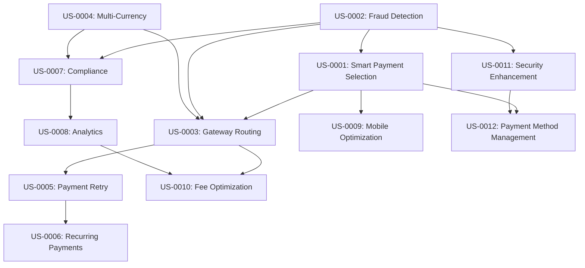

# User Stories - Payment Rules and Processing

## Epic: Intelligent Payment Processing and Optimization

### US-0001: Smart Payment Method Selection
**As a** customer  
**I want to** have the most suitable payment method automatically suggested based on my profile and transaction  
**So that** I can complete payments quickly with the highest success rate

**Acceptance Criteria:**
- System analyzes customer payment history and preferences
- Payment method recommendations consider transaction amount and type
- Alternative payment methods are suggested if primary method fails
- Payment method capabilities are validated against transaction requirements
- Customer can override system recommendations and choose preferred method

**Priority**: High  
**Story Points**: 8  
**Business Value**: Improved conversion rates and customer experience

### US-0002: Fraud Detection and Prevention
**As a** security officer  
**I want to** automatically detect and prevent fraudulent payment attempts  
**So that** we can protect customers and reduce financial losses

**Acceptance Criteria:**
- Real-time fraud risk assessment for all payment transactions
- Multi-layered fraud detection using behavior patterns and transaction analysis
- Automatic blocking of high-risk transactions with immediate alerts
- Manual review workflow for medium-risk transactions
- False positive minimization through machine learning optimization

**Priority**: High  
**Story Points**: 13  
**Business Value**: Risk mitigation and compliance

### US-0003: Intelligent Gateway Routing
**As a** payment operations manager  
**I want to** automatically route payments to the optimal gateway  
**So that** we can maximize success rates while minimizing processing costs

**Acceptance Criteria:**
- Real-time gateway selection based on performance metrics
- Cost optimization considering processing fees and success rates
- Automatic failover to backup gateways when primary gateway fails
- Geographic routing based on customer location and gateway capabilities
- Performance monitoring and routing rule optimization

**Priority**: High  
**Story Points**: 13  
**Business Value**: Cost reduction and payment reliability

### US-0004: Multi-Currency Payment Support
**As a** international customer  
**I want to** pay in my local currency with transparent conversion rates  
**So that** I can understand the exact cost and avoid currency confusion

**Acceptance Criteria:**
- Support for 50+ major currencies with real-time exchange rates
- Transparent currency conversion with fees clearly displayed
- Customer choice between original currency and local currency pricing
- Automatic currency detection based on customer location
- Compliance with international currency exchange regulations

**Priority**: Medium  
**Story Points**: 8  
**Business Value**: Global market expansion

### US-0005: Payment Retry and Recovery
**As a** customer  
**I want to** have payment failures automatically retried with alternative methods  
**So that** I don't lose my purchase when temporary payment issues occur

**Acceptance Criteria:**
- Intelligent retry logic based on failure reason and type
- Automatic gateway switching for gateway-specific failures
- Payment method alternatives suggested for instrument failures
- Customer notification of retry attempts and final outcomes
- Manual retry option with different payment methods

**Priority**: Medium  
**Story Points**: 8  
**Business Value**: Improved conversion and reduced abandonment

### US-0006: Recurring Payment Management
**As a** subscription customer  
**I want to** have my recurring payments processed automatically with smart failure handling  
**So that** my services continue uninterrupted even with payment issues

**Acceptance Criteria:**
- Automatic recurring payment processing on scheduled dates
- Smart retry logic for failed recurring payments with dunning management
- Payment method updating and expiration handling
- Customer notifications for payment successes, failures, and required actions
- Subscription billing integration with prorated charges and credits

**Priority**: Medium  
**Story Points**: 13  
**Business Value**: Recurring revenue protection

### US-0007: Payment Compliance Management
**As a** compliance officer  
**I want to** ensure all payments meet regulatory requirements automatically  
**So that** we maintain compliance across all jurisdictions

**Acceptance Criteria:**
- Automatic PCI DSS compliance validation for card transactions
- AML (Anti-Money Laundering) screening for high-value transactions
- KYC (Know Your Customer) verification for new customers and large amounts
- Regional compliance checking (GDPR, PSD2, etc.) based on geography
- Audit trail maintenance for all compliance decisions and actions

**Priority**: High  
**Story Points**: 13  
**Business Value**: Regulatory compliance and risk mitigation

### US-0008: Payment Performance Analytics
**As a** payment operations manager  
**I want to** monitor payment performance and success rates across all channels  
**So that** I can optimize payment processing and identify issues quickly

**Acceptance Criteria:**
- Real-time dashboards showing payment success rates by gateway, method, and geography
- Performance alerts for declining success rates or increased failures
- Cost analysis and optimization recommendations
- Fraud detection effectiveness metrics and false positive rates
- Customer payment experience metrics and satisfaction tracking

**Priority**: Medium  
**Story Points**: 8  
**Business Value**: Operational optimization and monitoring

### US-0009: Mobile Payment Optimization
**As a** mobile customer  
**I want to** have payment processing optimized for mobile devices  
**So that** I can complete purchases quickly and securely on my phone

**Acceptance Criteria:**
- Mobile-optimized payment flows with minimal input requirements
- Biometric authentication integration (Touch ID, Face ID)
- Mobile wallet support (Apple Pay, Google Pay, Samsung Pay)
- One-click payment for returning customers with saved methods
- Mobile-specific fraud detection considering device characteristics

**Priority**: Medium  
**Story Points**: 8  
**Business Value**: Mobile conversion optimization

### US-0010: Payment Fee Optimization
**As a** finance manager  
**I want to** minimize payment processing costs through intelligent routing  
**So that** we can improve profitability while maintaining payment reliability

**Acceptance Criteria:**
- Real-time fee calculation and comparison across available gateways
- Dynamic routing based on transaction value and processing costs
- Volume-based pricing optimization with gateway negotiations
- Fee transparency reporting for financial analysis
- Cost-benefit analysis for gateway selection decisions

**Priority**: Low  
**Story Points**: 8  
**Business Value**: Cost optimization

### US-0011: Payment Security Enhancement
**As a** security-conscious customer  
**I want to** have multiple security options for payment verification  
**So that** I can feel confident my transactions are protected

**Acceptance Criteria:**
- Multi-factor authentication options for high-value transactions
- Device fingerprinting and behavior analysis for fraud prevention
- Secure payment tokenization for stored payment methods
- Real-time security alerts for suspicious account activity
- Customer control over security preferences and verification methods

**Priority**: Medium  
**Story Points**: 13  
**Business Value**: Customer trust and security

### US-0012: Payment Method Management
**As a** customer  
**I want to** easily manage my saved payment methods and preferences  
**So that** I can control how my payments are processed

**Acceptance Criteria:**
- Secure storage and management of multiple payment methods
- Payment method verification and validation upon addition
- Default payment method selection with override capabilities
- Payment method expiration tracking and update reminders
- Quick deletion and modification of stored payment methods

**Priority**: Low  
**Story Points**: 5  
**Business Value**: Customer convenience and control

## Story Dependencies and Flow

## Epic Summary

**Total Story Points**: 124  
**Estimated Duration**: 8-10 sprints  
**Priority Distribution**:
- High Priority: 4 stories (47 points)
- Medium Priority: 6 stories (67 points)  
- Low Priority: 2 stories (13 points)

**Business Value Focus**:
1. Payment security and fraud prevention
2. Conversion rate optimization through intelligent routing
3. Cost reduction through fee optimization
4. Compliance and regulatory adherence
5. Customer experience enhancement

## User Journey Mapping

### Customer Payment Journey
1. **Payment Initiation**: Customer proceeds to checkout with selected items
2. **Payment Method Selection**: System suggests optimal payment method based on profile
3. **Security Validation**: Fraud detection and compliance checks performed
4. **Payment Processing**: Transaction routed to optimal gateway with real-time monitoring
5. **Confirmation**: Customer receives immediate confirmation and transaction details
6. **Follow-up**: Any issues handled automatically with retry logic and notifications

### Merchant Payment Management Journey
1. **Configuration**: Set up payment rules, gateways, and compliance requirements
2. **Monitoring**: Real-time dashboard monitoring of payment performance
3. **Optimization**: Analyze metrics and adjust routing rules for better performance
4. **Issue Resolution**: Handle failed payments and customer support requests
5. **Reporting**: Generate financial and compliance reports for business analysis
6. **Continuous Improvement**: Update rules and strategies based on performance data

### Technical Processing Journey
1. **Transaction Initialization**: Payment request received and validated
2. **Risk Assessment**: Fraud detection and compliance checks executed
3. **Gateway Selection**: Optimal gateway selected based on current rules and performance
4. **Payment Processing**: Transaction submitted to selected gateway with monitoring
5. **Result Handling**: Success or failure processed with appropriate follow-up actions
6. **Metrics Recording**: Performance data captured for analytics and optimization

## Acceptance Criteria Details

### Payment Method Selection
- **Intelligence**: System learns from customer behavior and transaction patterns
- **Performance**: Selection algorithm completes within 100ms
- **Accuracy**: Method recommendations have >90% customer acceptance rate
- **Flexibility**: Customer can override system recommendations at any time

### Fraud Detection
- **Real-time Processing**: All transactions assessed within 200ms
- **Accuracy**: False positive rate <2%, fraud detection rate >95%
- **Adaptability**: Machine learning models updated weekly with new patterns
- **Transparency**: Clear explanation provided for blocked transactions

### Gateway Routing
- **Optimization**: Routing decisions consider success rate, cost, and performance
- **Reliability**: Automatic failover within 500ms for gateway failures
- **Geographic Intelligence**: Location-based routing for optimal performance
- **Cost Efficiency**: Processing cost optimization while maintaining success rates

### Compliance Management
- **Automation**: All regulatory checks automated with manual review for edge cases
- **Coverage**: Support for PCI DSS, AML, KYC, GDPR, and regional requirements
- **Audit Trail**: Complete documentation of all compliance decisions
- **Updates**: Automatic updates for changing regulatory requirements

### Performance Monitoring
- **Real-time Metrics**: Dashboard updates within 10 seconds of transaction completion
- **Alerting**: Immediate alerts for performance degradation or security issues
- **Historical Analysis**: Trend analysis and predictive insights for optimization
- **Reporting**: Automated daily, weekly, and monthly performance reports
