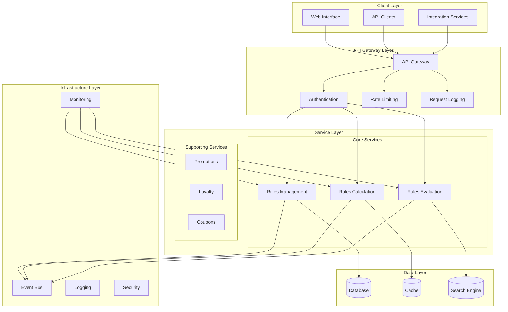
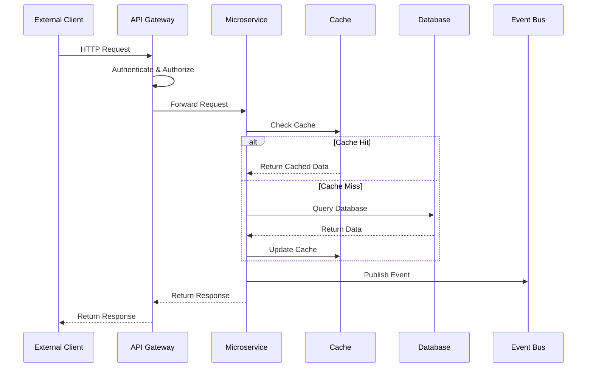
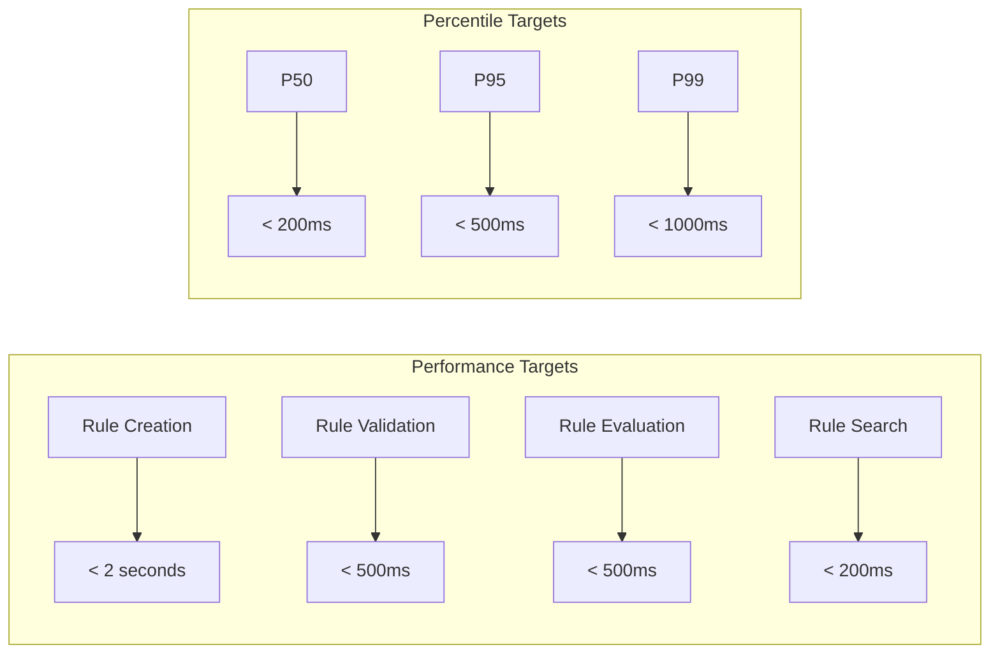
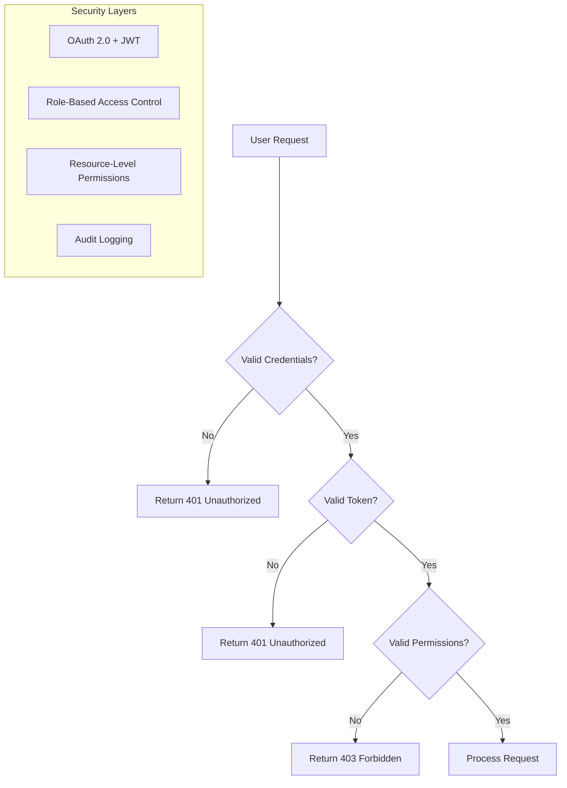
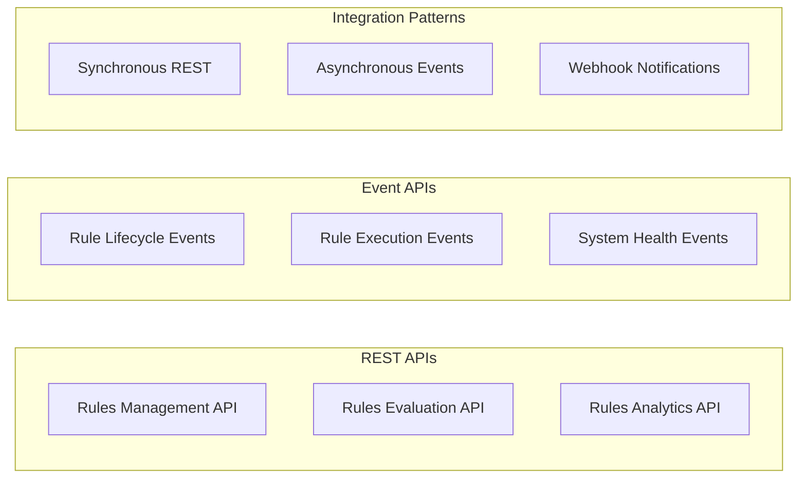
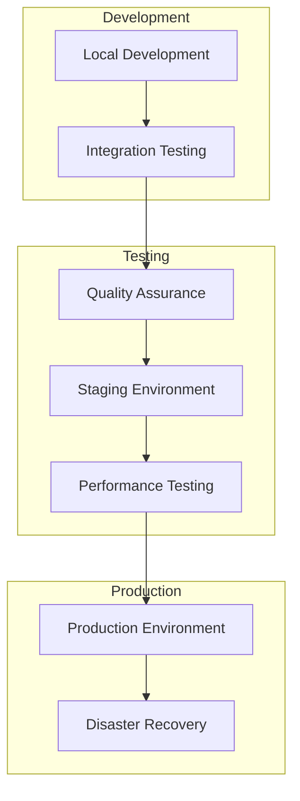

# Technical Requirements

## Architecture Overview
The Rules Engine follows a microservices architecture with six bounded contexts working together to deliver a complete rule lifecycle management solution from authoring to execution.

### System Architecture

### Service Communication Pattern

## Technology Stack

### Backend Technologies
- **Runtime**: Modern JVM-based runtime with enterprise framework
- **Framework**: Enterprise application framework with cloud capabilities
- **Build Tool**: Modern build automation tool
- **API Documentation**: OpenAPI 3.0 specification

### Database Technologies
- **Primary Database**: Enterprise-grade relational database
- **Caching**: High-performance in-memory cache
- **Search**: Full-text search and analytics engine
- **Message Queue**: Distributed event streaming platform

### Infrastructure Technologies
- **Containerization**: Container platform with orchestration
- **Orchestration**: Container orchestration platform
- **Service Mesh**: Service-to-service communication management
- **API Gateway**: Enterprise API gateway with rate limiting

### Monitoring and Observability
- **Metrics**: Time-series metrics collection system
- **Visualization**: Metrics visualization and dashboarding
- **Logging**: Centralized logging and log analysis
- **Tracing**: Distributed tracing and performance analysis

## Performance Requirements

### Response Time Requirements

### Throughput Requirements
- **Rule Evaluation**: 1000+ transactions per second
- **Rule Creation**: 100+ rules per hour
- **Rule Validation**: 500+ validations per minute
- **Concurrent Users**: 500+ simultaneous users

### Scalability Requirements
- **Horizontal Scaling**: Linear scaling with additional instances
- **Database Scaling**: Read replicas and connection pooling
- **Cache Scaling**: Distributed cache for high availability
- **Load Balancing**: Round-robin with health checks

## Security Requirements

### Authentication and Authorization

### Data Protection
- **Encryption at Rest**: AES-256 encryption for sensitive data
- **Encryption in Transit**: TLS 1.3 for all communications
- **Data Masking**: PII protection and anonymization
- **Access Logging**: Complete audit trail for all data access

### Compliance Requirements
- **SOX Compliance**: Financial rule change audit trails
- **GDPR Compliance**: Data privacy and user consent management
- **PCI DSS**: Payment-related rule security
- **Industry Standards**: Retail and financial services regulations

## Integration Requirements

### API Specifications

### External System Integration
- **Authentication Service**: OAuth 2.0 integration
- **Customer Data**: CRM and loyalty system APIs
- **Transaction Systems**: POS and e-commerce platforms
- **Notification Service**: Email and SMS integration

### API Design Standards
- **RESTful Design**: Resource-based URL structure
- **Versioning**: API versioning with backward compatibility
- **Rate Limiting**: Request throttling and quotas
- **Error Handling**: Consistent error response format

## Deployment Requirements

### Environment Configuration

### Infrastructure Requirements
- **Compute**: Minimum 4 CPU cores, 8GB RAM per service
- **Storage**: SSD storage with 100GB+ per service
- **Network**: Low-latency network (<1ms between services)
- **Availability**: 99.9% uptime with automatic failover

### Deployment Strategy
- **Blue-Green Deployment**: Zero-downtime deployments
- **Canary Releases**: Gradual rollout with monitoring
- **Rollback Capability**: Automatic rollback on failures
- **Health Checks**: Comprehensive health monitoring

## Quality Assurance

### Code Quality Standards
- **Test Coverage**: ≥80% unit test coverage
- **Code Review**: Mandatory peer review for all changes
- **Static Analysis**: Code quality analysis tools
- **Documentation**: Comprehensive API and code documentation

### Performance Testing
- **Load Testing**: Simulate production load patterns
- **Stress Testing**: Test system limits and failure modes
- **Endurance Testing**: Long-running performance validation
- **Scalability Testing**: Verify horizontal scaling capabilities

### Security Testing
- **Penetration Testing**: Regular security assessments
- **Vulnerability Scanning**: Automated security scanning
- **Compliance Testing**: Regulatory requirement validation
- **Access Control Testing**: Permission and authorization validation
