# Non-Functional Requirements

## Performance Requirements

### Response Time Targets

### Throughput Requirements
- **Rule Evaluation**: 1000+ transactions per second
- **Rule Creation**: 100+ rules per hour
- **Rule Validation**: 500+ validations per minute
- **Concurrent Users**: 500+ simultaneous users
- **API Requests**: 10,000+ requests per minute

### Scalability Requirements

## Reliability Requirements

### Availability Targets

### Fault Tolerance
- **Service Degradation**: Graceful degradation under load
- **Circuit Breaker**: Automatic failure isolation
- **Retry Logic**: Exponential backoff with jitter
- **Fallback Mechanisms**: Alternative processing paths

### Disaster Recovery

## Security Requirements

### Authentication and Authorization

### Data Protection
- **Encryption at Rest**: AES-256 encryption for sensitive data
- **Encryption in Transit**: TLS 1.3 for all communications
- **Data Masking**: PII protection and anonymization
- **Access Logging**: Complete audit trail for all data access

### Compliance Requirements

## Maintainability Requirements

### Code Quality

```mermaid
graph TD
    A[Code Quality Metrics] --> B[Test Coverage ≥80%]
    A --> C[Code Duplication <3%]
    A --> D[Cyclomatic Complexity <10]
    A --> E[Technical Debt <5%]
    
    subgraph "Quality Gates"
        F[Static Analysis]
        G[Code Review]
        H[Automated Testing]
        I[Performance Validation]
    end
```

### Documentation Standards
- **API Documentation**: OpenAPI 3.0 with examples
- **Code Documentation**: Comprehensive inline comments
- **Architecture Documentation**: System design and decisions
- **User Documentation**: Complete user guides and tutorials

### Monitoring and Observability

## Usability Requirements

### User Experience

### Accessibility Requirements
- **WCAG 2.1 AA Compliance**: Full accessibility support
- **Keyboard Navigation**: Complete keyboard-only operation
- **Screen Reader Support**: ARIA labels and semantic HTML
- **Color Contrast**: Minimum 4.5:1 contrast ratio

### Internationalization
- **Multi-language Support**: English, Spanish, French
- **Localization**: Date formats, currency, number formats
- **Cultural Adaptation**: Business rules and terminology

## Scalability Requirements

### Horizontal Scaling

### Database Scaling
- **Read Replicas**: Horizontal scaling for read operations
- **Connection Pooling**: Efficient database connection management
- **Query Optimization**: Index optimization and query tuning
- **Partitioning**: Data partitioning for large datasets

### Cache Scaling

## Performance Monitoring

### Key Performance Indicators

### Resource Utilization
- **CPU Usage**: <70% under normal load
- **Memory Usage**: <80% of allocated memory
- **Disk I/O**: <80% of disk capacity
- **Network I/O**: <80% of network capacity

### Alerting and Notification

## Compliance and Governance

### Audit Requirements
- **Change Tracking**: Complete history of all modifications
- **Access Logging**: All user access and actions logged
- **Data Retention**: Compliance with regulatory retention periods
- **Audit Reports**: Automated compliance reporting

### Risk Management

### Change Management
- **Change Approval**: Multi-level approval for significant changes
- **Change Testing**: Comprehensive testing before deployment
- **Rollback Capability**: Automatic rollback on failures
- **Change Communication**: Stakeholder notification and training
