# UI/UX

## User Interface Design

### Design Principles
The Rules Engine user interface follows modern design principles focused on usability, accessibility, and business user empowerment.

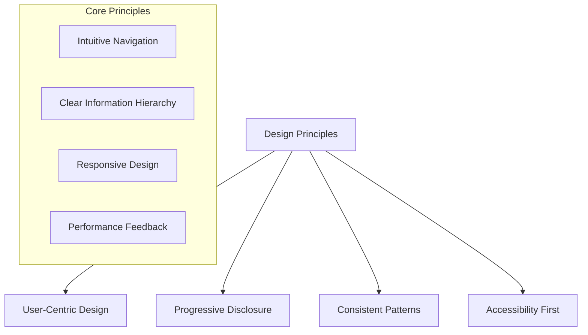

### Visual Design System
- **Color Palette**: Professional, accessible color scheme
- **Typography**: Clear, readable fonts with proper hierarchy
- **Icons**: Consistent iconography for common actions
- **Spacing**: Consistent spacing and layout patterns

## User Experience Flows

### Rule Creation Journey
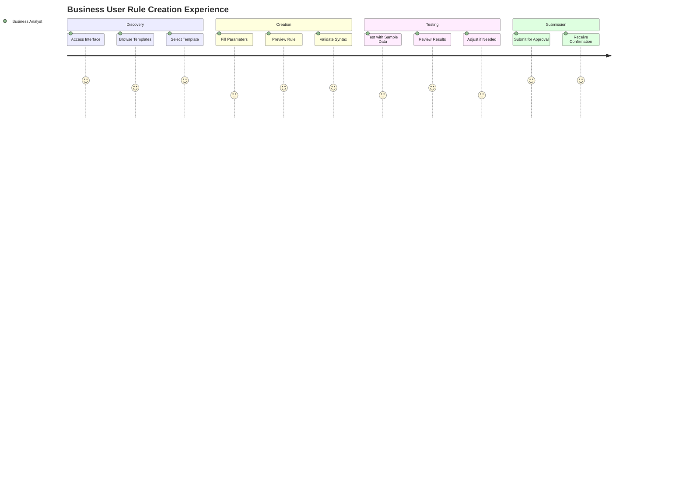

### Rule Approval Workflow
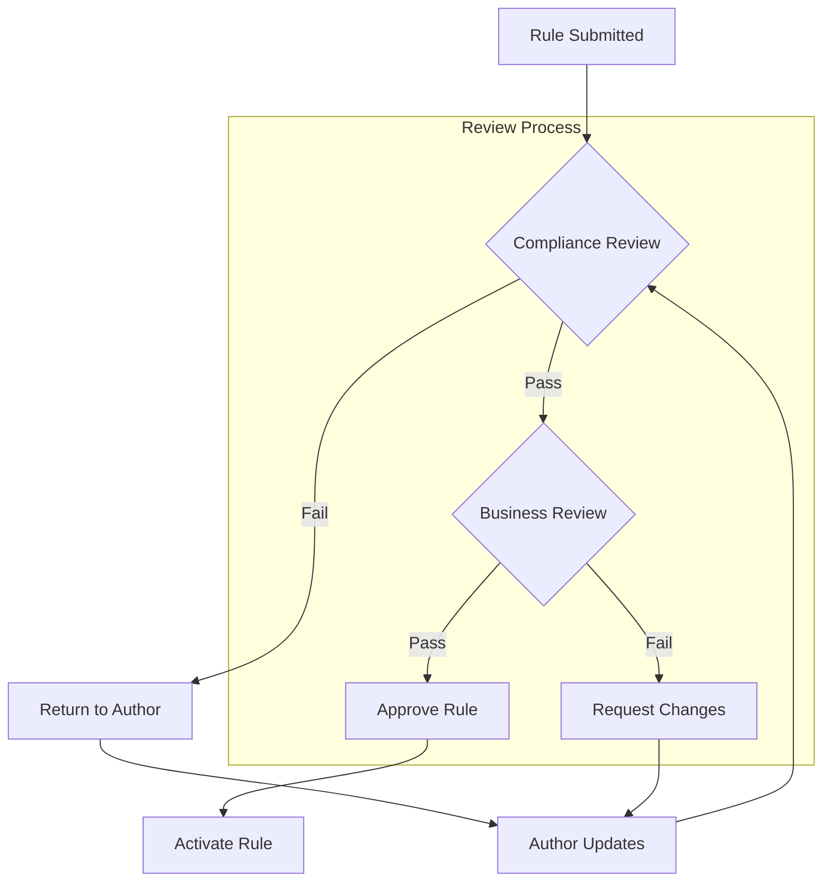

## Screen Designs

### Main Dashboard
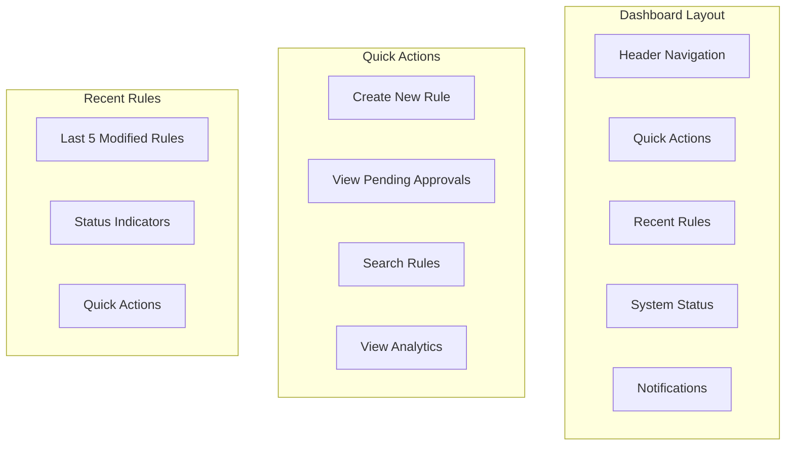

### Rule Creation Interface
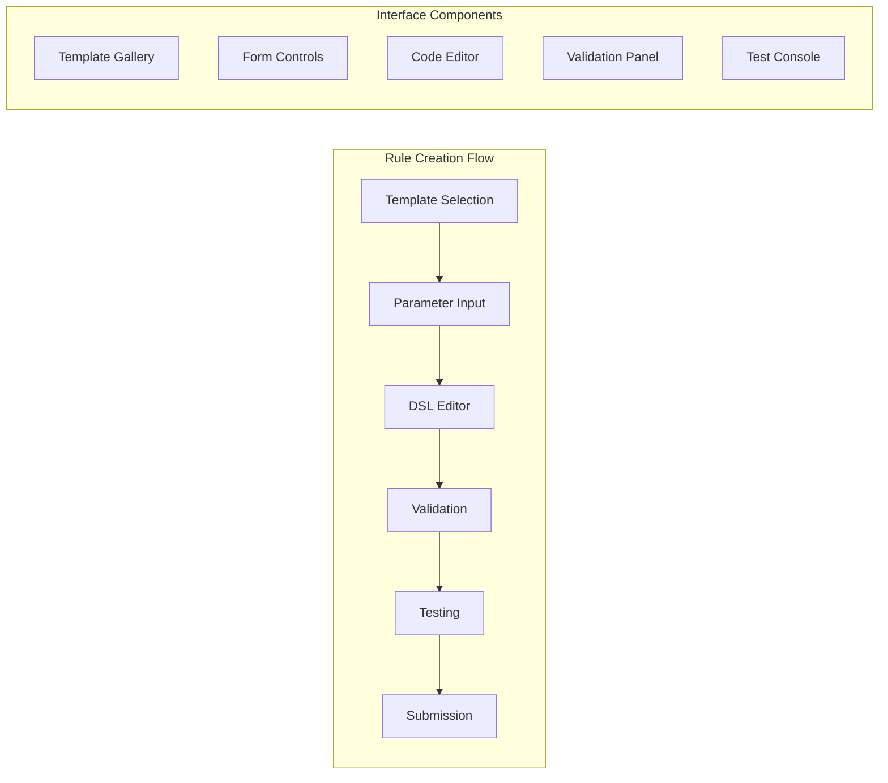

### Rule Management Interface
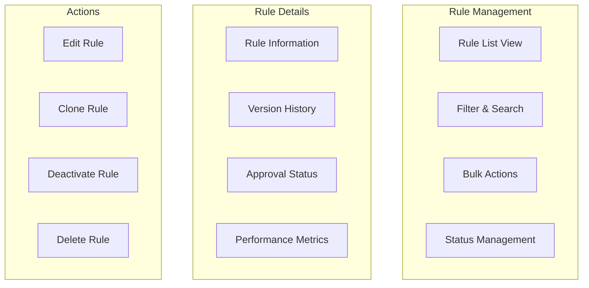

## Interaction Patterns

### Form Interactions
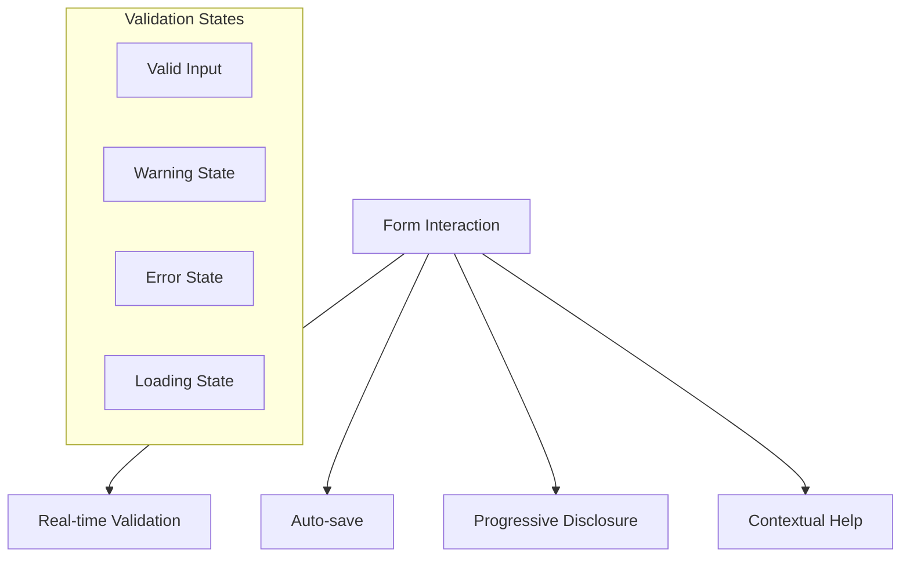

### Navigation Patterns
- **Breadcrumb Navigation**: Clear path indication
- **Tab Navigation**: Logical grouping of related content
- **Sidebar Navigation**: Quick access to main sections
- **Search Navigation**: Global search with filters

### Feedback Mechanisms
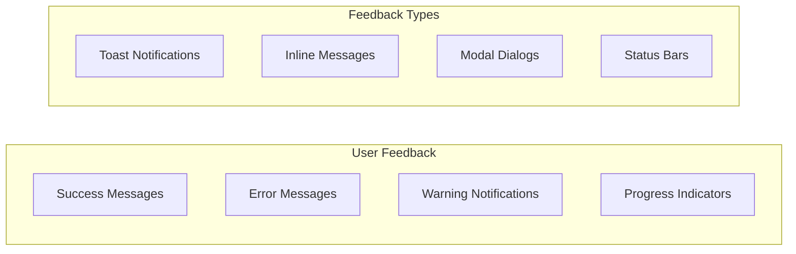

## Responsive Design

### Breakpoint Strategy
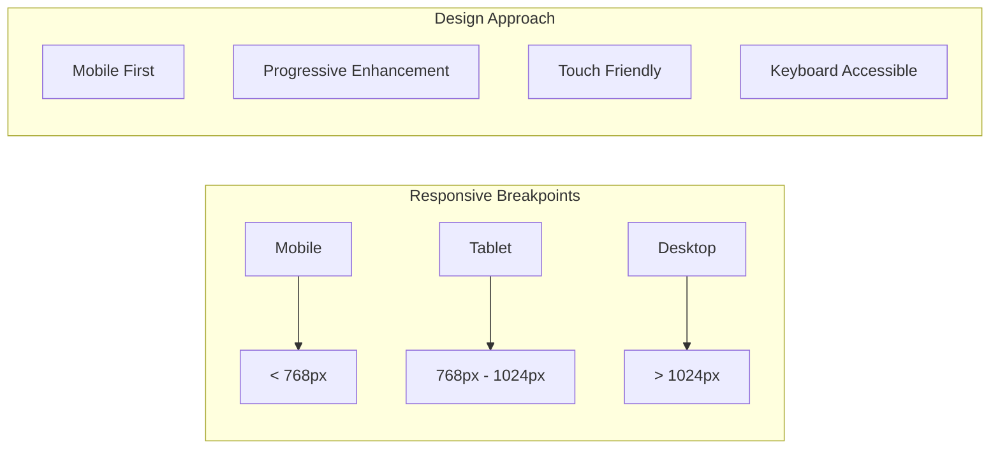

### Mobile Experience
- **Touch-Friendly Interface**: Appropriate touch target sizes
- **Simplified Navigation**: Streamlined mobile navigation
- **Optimized Forms**: Mobile-optimized form controls
- **Performance**: Fast loading on mobile networks

### Desktop Experience
- **Multi-column Layout**: Efficient use of screen real estate
- **Keyboard Shortcuts**: Power user productivity features
- **Advanced Features**: Full feature set for desktop users
- **Multi-tasking**: Support for multiple open windows

## Accessibility Requirements

### WCAG 2.1 AA Compliance
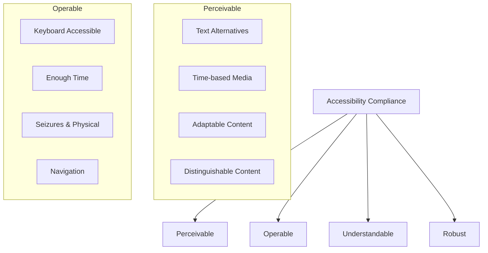

### Accessibility Features
- **Screen Reader Support**: Complete ARIA labeling
- **Keyboard Navigation**: Full keyboard-only operation
- **Color Contrast**: Minimum 4.5:1 contrast ratio
- **Focus Management**: Clear focus indicators and order

### Assistive Technology Support
- **Screen Readers**: NVDA, JAWS, VoiceOver compatibility
- **Voice Control**: Voice command support
- **Magnification**: High DPI and zoom support
- **Alternative Input**: Switch devices and eye tracking

## User Interface Components

### Common Components
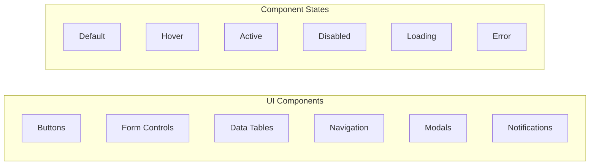

### Component Library
- **Design System**: Consistent component patterns
- **Component Documentation**: Usage guidelines and examples
- **Accessibility Guidelines**: Component-specific accessibility notes
- **Testing Requirements**: Component testing specifications

## Performance and Usability

### Loading States
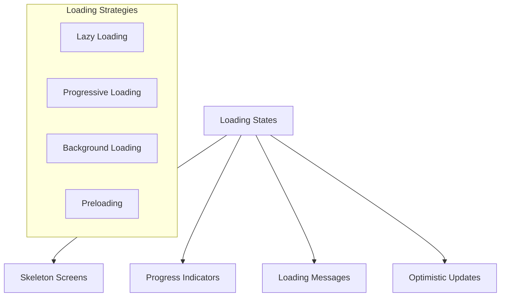

### Error Handling
- **User-Friendly Messages**: Clear, actionable error messages
- **Recovery Options**: Suggested solutions and alternatives
- **Error Prevention**: Proactive validation and guidance
- **Fallback Mechanisms**: Graceful degradation on errors

### Performance Optimization
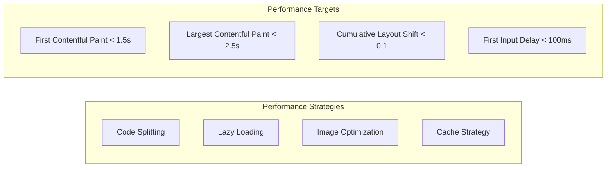

## User Testing and Validation

### Usability Testing
- **User Research**: Understanding user needs and pain points
- **Usability Testing**: Observing users interact with the interface
- **A/B Testing**: Comparing different design approaches
- **Accessibility Testing**: Testing with assistive technologies

### Design Validation
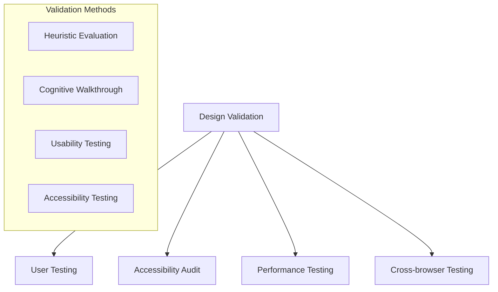

### Continuous Improvement
- **User Feedback**: Collecting user feedback and suggestions
- **Analytics**: Monitoring user behavior and performance metrics
- **Iterative Design**: Continuous refinement based on data
- **Design System Evolution**: Updating components and patterns
