# Success Metrics

## Overview
Success metrics provide a comprehensive framework for measuring the effectiveness and business value of the Rules Engine system. These metrics are categorized into technical performance, business impact, user experience, and compliance measures.

## Service Level Indicators (SLIs) and Service Level Objectives (SLOs)

### Performance SLIs and SLOs

#### Response Time SLIs
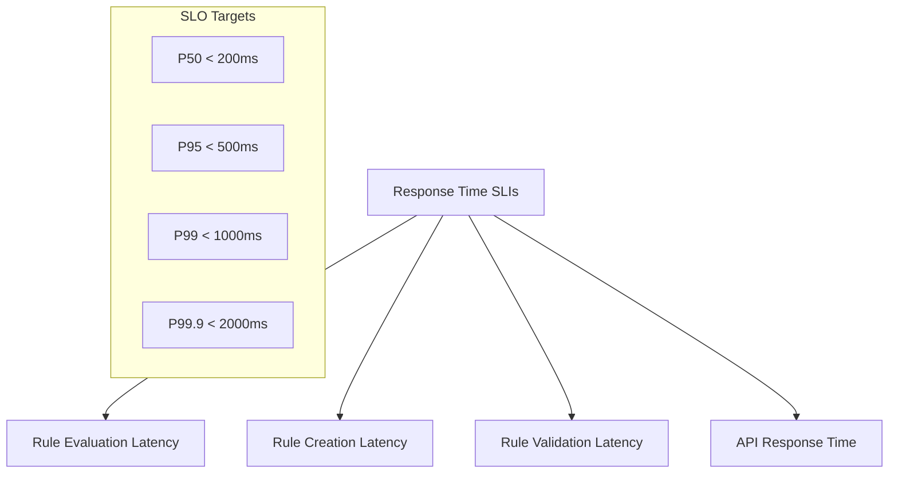

**SLI-001: Rule Evaluation Response Time**
- **Definition**: Time from evaluation request to response completion
- **Measurement**: 95th percentile response time across all evaluation requests
- **SLO**: 95% of rule evaluations complete within 500ms
- **Target**: P95 < 500ms, P99 < 1000ms, P99.9 < 2000ms

**SLI-002: Rule Creation Response Time**
- **Definition**: Time from rule creation request to completion
- **Measurement**: 95th percentile response time for rule creation
- **SLO**: 95% of rule creations complete within 2 seconds
- **Target**: P95 < 2s, P99 < 5s

**SLI-003: Rule Validation Response Time**
- **Definition**: Time from validation request to validation result
- **Measurement**: 95th percentile response time for rule validation
- **SLO**: 95% of rule validations complete within 500ms
- **Target**: P95 < 500ms, P99 < 1000ms

**SLI-004: API Response Time**
- **Definition**: Time from API request to response completion
- **Measurement**: 95th percentile response time for all API endpoints
- **SLO**: 95% of API requests complete within 500ms
- **Target**: P95 < 500ms, P99 < 1000ms

#### Throughput SLIs
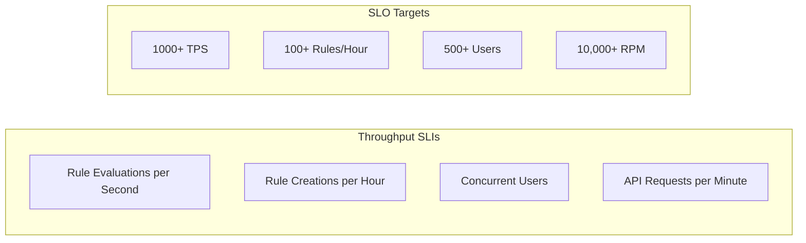

**SLI-005: Rule Evaluation Throughput**
- **Definition**: Number of rule evaluations processed per second
- **Measurement**: Average evaluations per second over 5-minute windows
- **SLO**: System processes 1000+ rule evaluations per second
- **Target**: 1000 TPS sustained, 2000 TPS peak

**SLI-006: Rule Creation Throughput**
- **Definition**: Number of rules created per hour
- **Measurement**: Average rules created per hour
- **SLO**: System supports 100+ rule creations per hour
- **Target**: 100 rules/hour sustained, 200 rules/hour peak

**SLI-007: Concurrent User Capacity**
- **Definition**: Number of simultaneous active users
- **Measurement**: Peak concurrent users over 24-hour period
- **SLO**: System supports 500+ concurrent users
- **Target**: 500 concurrent users sustained, 1000 peak

**SLI-008: API Request Throughput**
- **Definition**: Number of API requests processed per minute
- **Measurement**: Average API requests per minute
- **SLO**: System processes 10,000+ API requests per minute
- **Target**: 10,000 RPM sustained, 20,000 RPM peak

### Availability SLIs and SLOs

#### System Availability
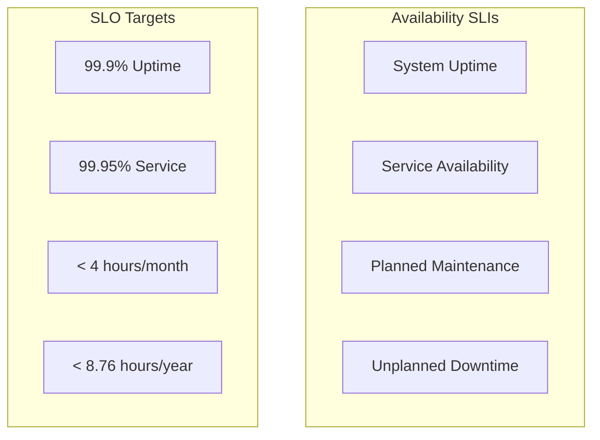

**SLI-009: System Uptime**
- **Definition**: Percentage of time system is operational
- **Measurement**: (Total time - Downtime) / Total time
- **SLO**: 99.9% system uptime
- **Target**: 99.9% monthly, 99.95% quarterly

**SLI-010: Service Availability**
- **Definition**: Percentage of time all core services are responding
- **Measurement**: Health check success rate across all services
- **SLO**: 99.95% service availability
- **Target**: 99.95% monthly, 99.99% quarterly

**SLI-011: Planned Maintenance Window**
- **Definition**: Total time spent in planned maintenance
- **Measurement**: Sum of all planned maintenance windows
- **SLO**: Less than 4 hours of planned maintenance per month
- **Target**: < 4 hours/month, < 2 hours/month

**SLI-012: Unplanned Downtime**
- **Definition**: Total time of unplanned system outages
- **Measurement**: Sum of all unplanned downtime incidents
- **SLO**: Less than 8.76 hours of unplanned downtime per year
- **Target**: < 8.76 hours/year, < 4.38 hours/year

#### Recovery SLIs
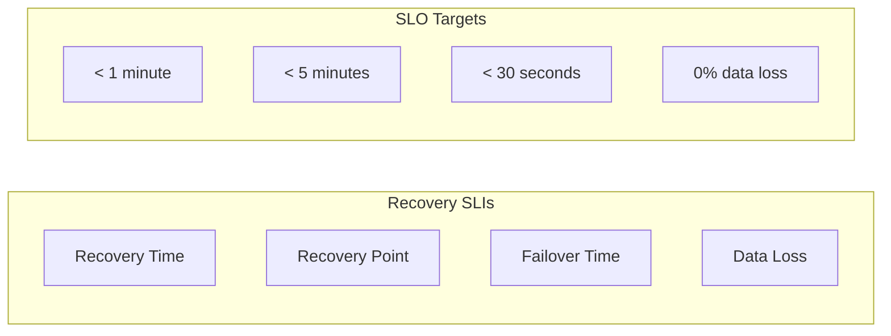

**SLI-013: Recovery Time Objective (RTO)**
- **Definition**: Time to restore service after failure
- **Measurement**: Time from failure detection to service restoration
- **SLO**: Service recovery within 1 minute
- **Target**: < 1 minute for 95% of incidents

**SLI-014: Recovery Point Objective (RPO)**
- **Definition**: Maximum acceptable data loss in time
- **Measurement**: Time difference between last backup and failure
- **SLO**: Maximum 5 minutes of data loss
- **Target**: < 5 minutes for 99% of incidents

**SLI-015: Failover Time**
- **Definition**: Time to switch to backup system
- **Measurement**: Time from primary failure to backup activation
- **SLO**: Failover within 30 seconds
- **Target**: < 30 seconds for 95% of failovers

**SLI-016: Data Loss Rate**
- **Definition**: Percentage of data lost during failures
- **Measurement**: (Lost data / Total data) * 100
- **SLO**: 0% data loss
- **Target**: 0% data loss for 99.99% of incidents

### Error Rate SLIs and SLOs

#### Error Rate Metrics
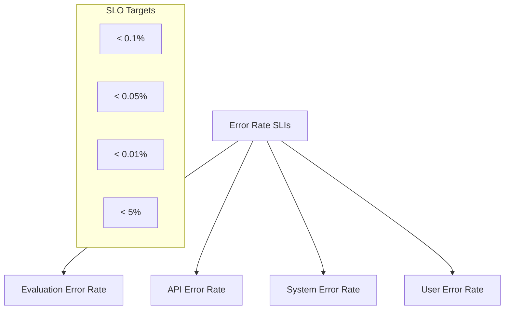

**SLI-017: Rule Evaluation Error Rate**
- **Definition**: Percentage of rule evaluations that fail
- **Measurement**: Failed evaluations / Total evaluations * 100
- **SLO**: Less than 0.1% evaluation error rate
- **Target**: < 0.1% monthly, < 0.05% quarterly

**SLI-018: API Error Rate**
- **Definition**: Percentage of API requests that return errors
- **Measurement**: HTTP 5xx errors / Total requests * 100
- **SLO**: Less than 0.05% API error rate
- **Target**: < 0.05% monthly, < 0.01% quarterly

**SLI-019: System Error Rate**
- **Definition**: Percentage of system operations that fail
- **Measurement**: System failures / Total operations * 100
- **SLO**: Less than 0.01% system error rate
- **Target**: < 0.01% monthly, < 0.005% quarterly

**SLI-020: User Error Rate**
- **Definition**: Percentage of user operations that fail due to system issues
- **Measurement**: User-reported failures / Total user operations * 100
- **SLO**: Less than 5% user error rate
- **Target**: < 5% monthly, < 2% quarterly

### Business Impact SLIs and SLOs

#### Time-to-Market SLIs
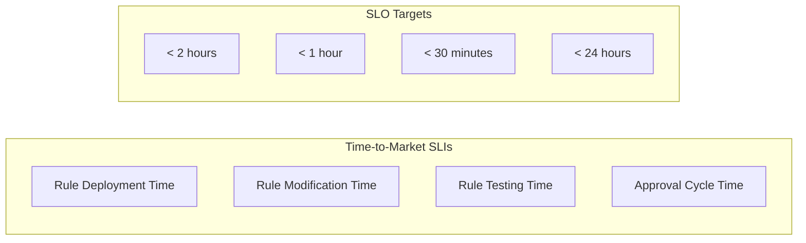

**SLI-021: Rule Deployment Time**
- **Definition**: Time from rule approval to production activation
- **Measurement**: Average time from approval to activation
- **SLO**: Rule deployment within 2 hours
- **Target**: < 2 hours for 95% of deployments

**SLI-022: Rule Modification Time**
- **Definition**: Time to modify existing rules
- **Measurement**: Average time from modification request to completion
- **SLO**: Rule modification within 1 hour
- **Target**: < 1 hour for 90% of modifications

**SLI-023: Rule Testing Time**
- **Definition**: Time to test rule changes
- **Measurement**: Average time from test start to completion
- **SLO**: Rule testing within 30 minutes
- **Target**: < 30 minutes for 95% of tests

**SLI-024: Approval Cycle Time**
- **Definition**: Time from submission to approval
- **Measurement**: Average time from submission to final approval
- **SLO**: Approval cycle within 24 hours
- **Target**: < 24 hours for 80% of approvals

#### Operational Efficiency SLIs
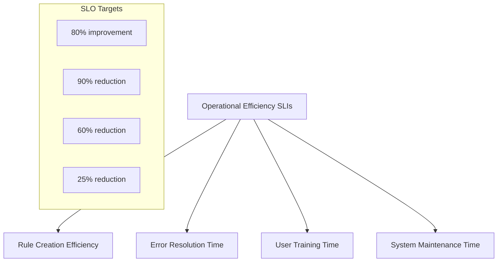

**SLI-025: Rule Creation Efficiency**
- **Definition**: Time reduction in rule creation process
- **Measurement**: (Baseline time - Current time) / Baseline time * 100
- **SLO**: 80% improvement in rule creation time
- **Target**: 80% improvement from baseline

**SLI-026: Error Resolution Time**
- **Definition**: Time to resolve rule-related errors
- **Measurement**: Average time from error detection to resolution
- **SLO**: 90% reduction in error resolution time
- **Target**: 90% reduction from baseline

**SLI-027: User Training Time**
- **Definition**: Time required to train users on system
- **Measurement**: Average training time per user
- **SLO**: 60% reduction in user training time
- **Target**: 60% reduction from baseline

**SLI-028: System Maintenance Time**
- **Definition**: Time spent on system maintenance
- **Measurement**: Total maintenance time per month
- **SLO**: 25% reduction in maintenance time
- **Target**: 25% reduction from baseline

### User Experience SLIs and SLOs

#### User Satisfaction SLIs
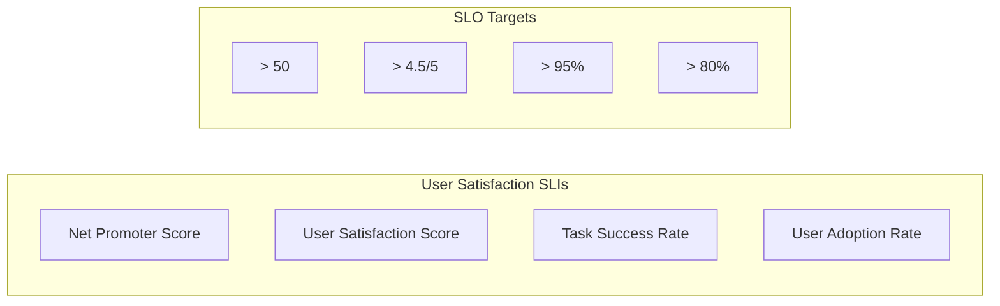

**SLI-029: Net Promoter Score (NPS)**
- **Definition**: Likelihood of users recommending the system
- **Measurement**: (Promoters - Detractors) / Total respondents * 100
- **SLO**: NPS greater than 50
- **Target**: > 50 quarterly, > 60 annually

**SLI-030: User Satisfaction Score**
- **Definition**: Average user satisfaction rating
- **Measurement**: Average rating on 5-point satisfaction scale
- **SLO**: Satisfaction score greater than 4.5/5
- **Target**: > 4.5/5 monthly, > 4.7/5 quarterly

**SLI-031: Task Success Rate**
- **Definition**: Percentage of user tasks completed successfully
- **Measurement**: Successful task completions / Total tasks * 100
- **SLO**: Task success rate greater than 95%
- **Target**: > 95% monthly, > 97% quarterly

**SLI-032: User Adoption Rate**
- **Definition**: Percentage of eligible users actively using the system
- **Measurement**: Active users / Eligible users * 100
- **SLO**: User adoption rate greater than 80%
- **Target**: > 80% monthly, > 85% quarterly

#### Usability SLIs
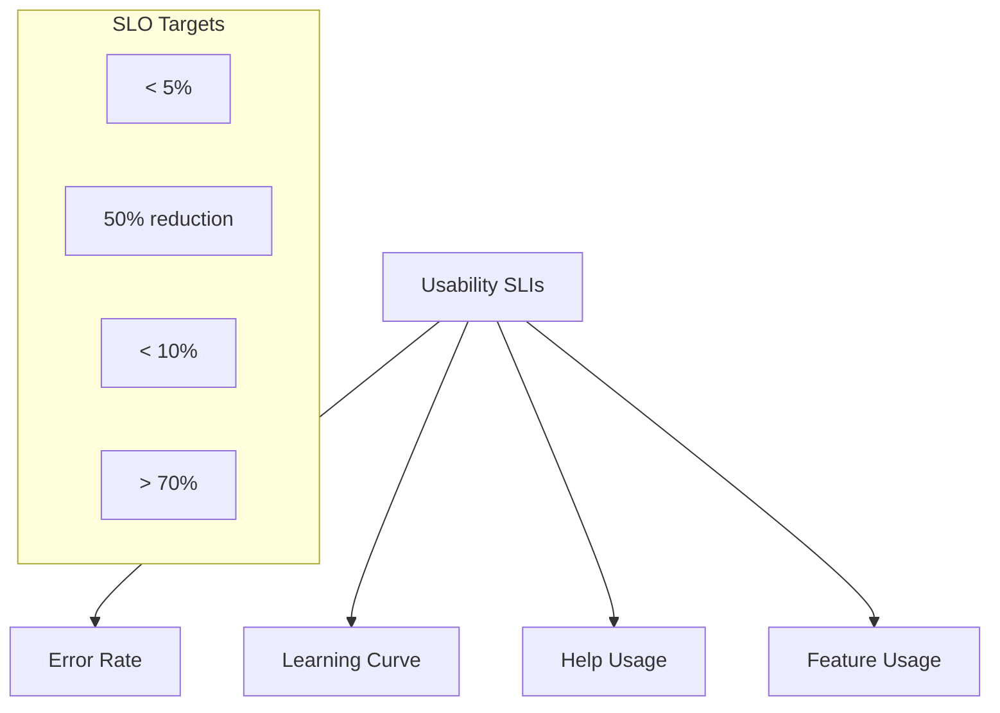

**SLI-033: User Error Rate**
- **Definition**: Percentage of user errors during system usage
- **Measurement**: User errors / Total user actions * 100
- **SLO**: User error rate less than 5%
- **Target**: < 5% monthly, < 3% quarterly

**SLI-034: Learning Curve Reduction**
- **Definition**: Reduction in time to achieve proficiency
- **Measurement**: (Baseline time - Current time) / Baseline time * 100
- **SLO**: 50% reduction in learning curve
- **Target**: 50% reduction from baseline

**SLI-035: Help Usage Rate**
- **Definition**: Percentage of users requiring help documentation
- **Measurement**: Users accessing help / Total users * 100
- **SLO**: Help usage rate less than 10%
- **Target**: < 10% monthly, < 5% quarterly

**SLI-036: Feature Usage Rate**
- **Definition**: Percentage of available features being used
- **Measurement**: Used features / Total features * 100
- **SLO**: Feature usage rate greater than 70%
- **Target**: > 70% monthly, > 80% quarterly

### Compliance and Security SLIs and SLOs

#### Compliance SLIs
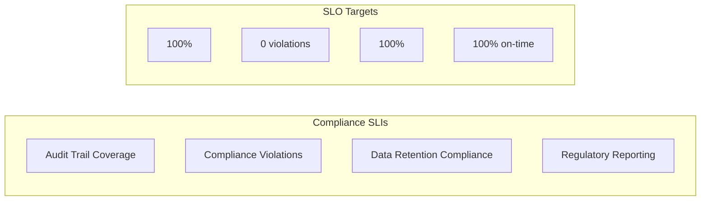

**SLI-037: Audit Trail Coverage**
- **Definition**: Percentage of system actions with complete audit trails
- **Measurement**: Actions with audit trails / Total actions * 100
- **SLO**: 100% audit trail coverage
- **Target**: 100% monthly, 100% quarterly

**SLI-038: Compliance Violations**
- **Definition**: Number of compliance violations per quarter
- **Measurement**: Count of compliance violations
- **SLO**: 0 compliance violations
- **Target**: 0 violations per quarter

**SLI-039: Data Retention Compliance**
- **Definition**: Percentage of data retention policies properly enforced
- **Measurement**: Compliant data retention / Total data * 100
- **SLO**: 100% data retention compliance
- **Target**: 100% monthly, 100% quarterly

**SLI-040: Regulatory Reporting**
- **Definition**: Percentage of regulatory reports submitted on time
- **Measurement**: On-time reports / Total reports * 100
- **SLO**: 100% on-time regulatory reporting
- **Target**: 100% monthly, 100% quarterly

#### Security SLIs
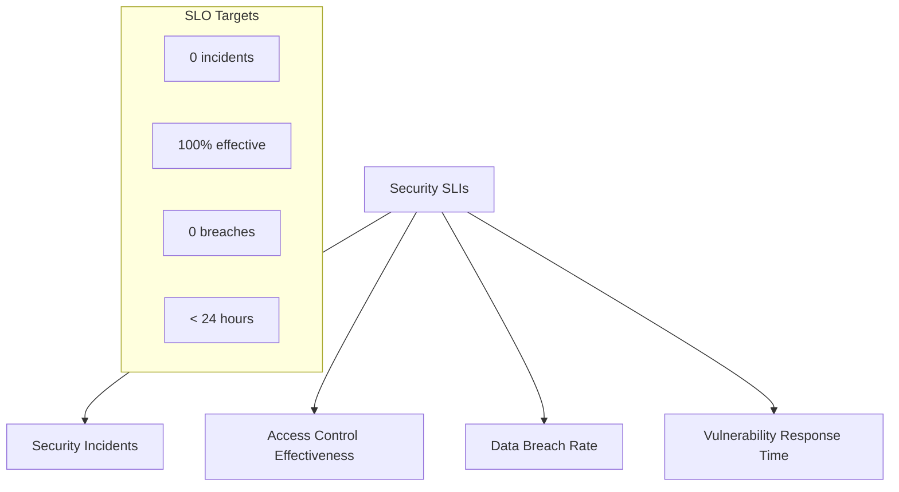

**SLI-041: Security Incidents**
- **Definition**: Number of security incidents per quarter
- **Measurement**: Count of security incidents
- **SLO**: 0 security incidents
- **Target**: 0 incidents per quarter

**SLI-042: Access Control Effectiveness**
- **Definition**: Percentage of unauthorized access attempts blocked
- **Measurement**: Blocked attempts / Total attempts * 100
- **SLO**: 100% access control effectiveness
- **Target**: 100% monthly, 100% quarterly

**SLI-043: Data Breach Rate**
- **Definition**: Number of data breaches per year
- **Measurement**: Count of data breaches
- **SLO**: 0 data breaches
- **Target**: 0 breaches per year

**SLI-044: Vulnerability Response Time**
- **Definition**: Time to respond to security vulnerabilities
- **Measurement**: Average time from detection to response
- **SLO**: Vulnerability response within 24 hours
- **Target**: < 24 hours for 95% of vulnerabilities

### Feature-Specific SLIs and SLOs

#### FEAT-0001: Rule Creation and Management
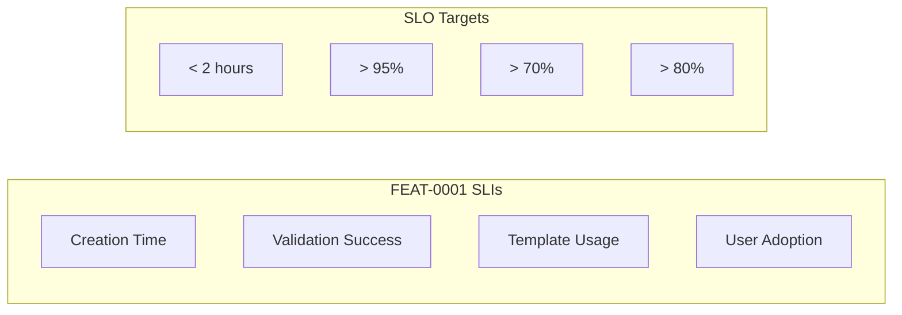

**SLI-045: Rule Creation Time (FEAT-0001)**
- **Definition**: Time to create a new rule from start to completion
- **Measurement**: Average time from creation start to completion
- **SLO**: Rule creation within 2 hours
- **Target**: < 2 hours for 90% of rules

**SLI-046: Validation Success Rate (FEAT-0001)**
- **Definition**: Percentage of rules that pass validation on first attempt
- **Measurement**: Valid rules / Total rules * 100
- **SLO**: 95% validation success rate
- **Target**: > 95% monthly, > 97% quarterly

**SLI-047: Template Usage Rate (FEAT-0001)**
- **Definition**: Percentage of rules created using templates
- **Measurement**: Rules using templates / Total rules * 100
- **SLO**: 70% template usage rate
- **Target**: > 70% monthly, > 80% quarterly

**SLI-048: User Adoption Rate (FEAT-0001)**
- **Definition**: Percentage of eligible users creating rules
- **Measurement**: Users creating rules / Eligible users * 100
- **SLO**: 80% user adoption rate
- **Target**: > 80% monthly, > 85% quarterly

#### FEAT-0002: Rule Evaluation Engine
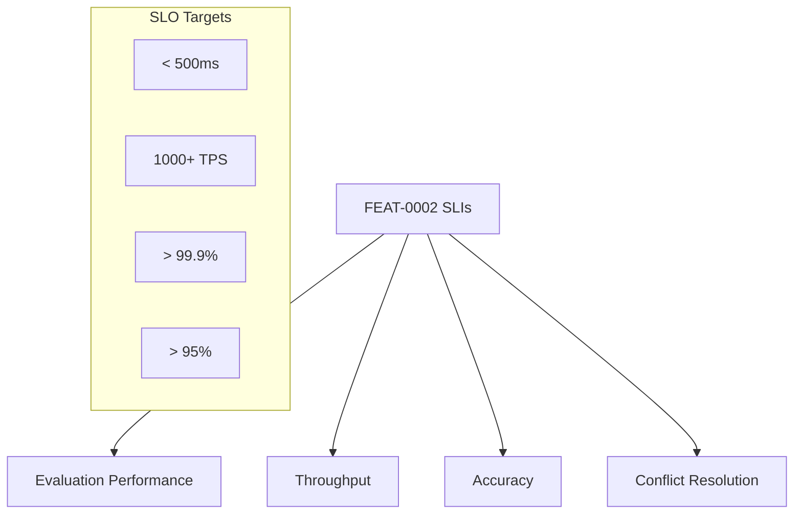

**SLI-049: Evaluation Performance (FEAT-0002)**
- **Definition**: Response time for rule evaluation
- **Measurement**: 95th percentile evaluation response time
- **SLO**: Evaluation within 500ms
- **Target**: P95 < 500ms, P99 < 1000ms

**SLI-050: Evaluation Throughput (FEAT-0002)**
- **Definition**: Number of evaluations processed per second
- **Measurement**: Average evaluations per second
- **SLO**: 1000+ evaluations per second
- **Target**: 1000 TPS sustained, 2000 TPS peak

**SLI-051: Evaluation Accuracy (FEAT-0002)**
- **Definition**: Percentage of correct evaluation results
- **Measurement**: Correct evaluations / Total evaluations * 100
- **SLO**: 99.9% evaluation accuracy
- **Target**: > 99.9% monthly, > 99.95% quarterly

**SLI-052: Conflict Resolution Rate (FEAT-0002)**
- **Definition**: Percentage of conflicts successfully resolved
- **Measurement**: Resolved conflicts / Total conflicts * 100
- **SLO**: 95% conflict resolution rate
- **Target**: > 95% monthly, > 97% quarterly

#### FEAT-0003: Rule Approval Workflow
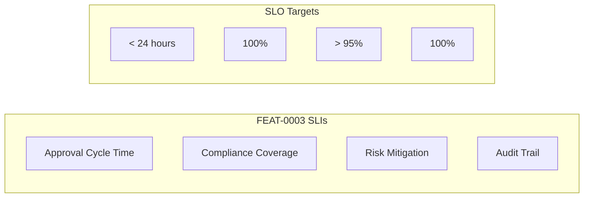

**SLI-053: Approval Cycle Time (FEAT-0003)**
- **Definition**: Time from submission to final approval
- **Measurement**: Average time from submission to approval
- **SLO**: Approval cycle within 24 hours
- **Target**: < 24 hours for 80% of approvals

**SLI-054: Compliance Coverage (FEAT-0003)**
- **Definition**: Percentage of rules going through compliance review
- **Measurement**: Rules with compliance review / Total rules * 100
- **SLO**: 100% compliance coverage
- **Target**: 100% monthly, 100% quarterly

**SLI-055: Risk Mitigation Rate (FEAT-0003)**
- **Definition**: Percentage of identified risks successfully mitigated
- **Measurement**: Mitigated risks / Total risks * 100
- **SLO**: 95% risk mitigation rate
- **Target**: > 95% monthly, > 97% quarterly

**SLI-056: Audit Trail Completeness (FEAT-0003)**
- **Definition**: Percentage of approval actions with complete audit trails
- **Measurement**: Actions with audit trails / Total actions * 100
- **SLO**: 100% audit trail completeness
- **Target**: 100% monthly, 100% quarterly

## Measurement Framework

### Data Collection
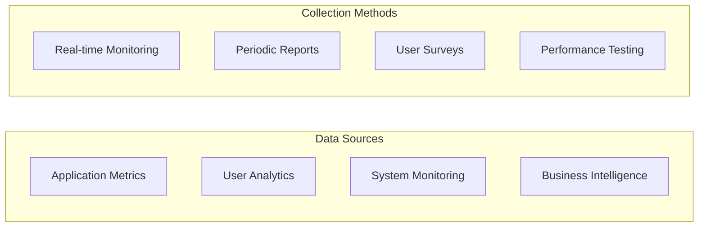

### Reporting and Dashboards
- **Real-time Dashboards**: Live system performance and user activity
- **Daily Reports**: Summary of key metrics and trends
- **Weekly Analysis**: Detailed performance analysis and insights
- **Monthly Reviews**: Comprehensive business impact assessment

### Continuous Improvement
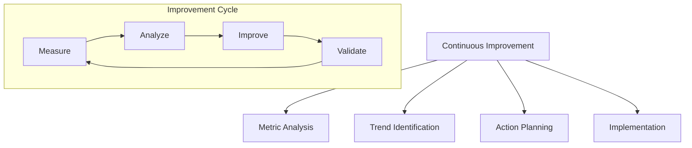

## Success Criteria

### Phase 1 Success Criteria (Months 1-3)
- **Technical**: Basic rule engine functional with <1000ms evaluation time
- **Business**: 50% reduction in rule creation time
- **User**: 60% user adoption rate
- **Compliance**: 100% audit trail coverage

### Phase 2 Success Criteria (Months 4-6)
- **Technical**: Management interface operational with approval workflow
- **Business**: 70% reduction in rule deployment time
- **User**: 75% user adoption rate
- **Compliance**: 100% compliance coverage

### Phase 3 Success Criteria (Months 7-9)
- **Technical**: Advanced features implemented with <500ms evaluation time
- **Business**: 80% reduction in rule deployment time
- **User**: 80% user adoption rate
- **Performance**: 1000+ TPS achieved

### Phase 4 Success Criteria (Months 10-12)
- **Technical**: Production system meeting all performance and reliability targets
- **Business**: 90% reduction in rule deployment time
- **User**: 90% user adoption rate
- **Overall**: All success metrics achieved and validated
