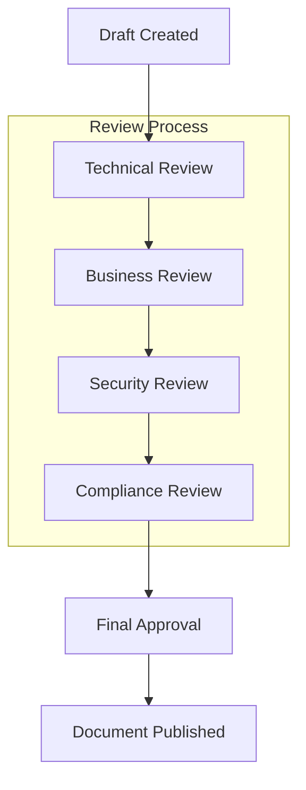

# Appendices

## Glossary

### Technical Terms
- **DSL**: Domain-Specific Language for expressing business rules
- **TPS**: Transactions Per Second
- **P95/P99**: 95th and 99th percentile response times
- **RBAC**: Role-Based Access Control
- **PII**: Personally Identifiable Information
- **API**: Application Programming Interface
- **REST**: Representational State Transfer
- **JWT**: JSON Web Token
- **OAuth**: Open Authorization protocol
- **SOX**: Sarbanes-Oxley Act compliance
- **GDPR**: General Data Protection Regulation
- **PCI DSS**: Payment Card Industry Data Security Standard

### Business Terms
- **Business Rule**: A statement that defines or constrains business operations
- **Rule Engine**: Software system that evaluates business rules
- **Promotional Rule**: Business rule that defines promotional offers and discounts
- **Loyalty Rule**: Business rule that defines customer loyalty program logic
- **Coupon Rule**: Business rule that defines coupon validation and redemption
- **Approval Workflow**: Process for reviewing and approving rule changes
- **Audit Trail**: Complete record of all system activities and changes
- **Compliance**: Adherence to regulatory and business requirements

### Domain-Driven Design Terms
- **Bounded Context**: A cohesive domain model with clear boundaries
- **Aggregate**: A cluster of domain objects treated as a unit for data changes
- **Entity**: An object with a distinct identity that persists over time
- **Value Object**: An object that describes some characteristic or attribute
- **Domain Service**: A service that performs domain logic not naturally part of an entity
- **Domain Event**: Something that happened in the domain that other parts care about
- **Ubiquitous Language**: A common language shared by domain experts and developers

## References

### Technical Documentation
- **Enterprise Framework Documentation**: Official framework documentation
- **Database Documentation**: Official database system documentation
- **Cache System Documentation**: Official cache system documentation
- **Message Broker Documentation**: Official message broker documentation
- **OpenAPI Specification**: https://swagger.io/specification/
- **Container Platform Documentation**: Official container platform documentation
- **Orchestration Platform Documentation**: Official orchestration platform documentation

### Standards and Compliance
- **WCAG 2.1 Guidelines**: https://www.w3.org/WAI/WCAG21/quickref/
- **OAuth 2.0 Specification**: https://tools.ietf.org/html/rfc6749
- **JWT Specification**: https://tools.ietf.org/html/rfc7519
- **SOX Compliance Guidelines**: Sarbanes-Oxley Act of 2002
- **GDPR Compliance Guidelines**: EU General Data Protection Regulation
- **PCI DSS Requirements**: Payment Card Industry Data Security Standard

### Domain-Driven Design Resources
- **Domain-Driven Design**: Eric Evans (Addison-Wesley, 2003)
- **Implementing Domain-Driven Design**: Vaughn Vernon (Addison-Wesley, 2013)
- **Domain-Driven Design Distilled**: Vaughn Vernon (Addison-Wesley, 2016)
- **Event Storming**: Alberto Brandolini (Leanpub, 2013)

### Performance and Scalability
- **High Performance Web Sites**: Steve Souders (O'Reilly, 2007)
- **Building Microservices**: Sam Newman (O'Reilly, 2015)
- **Site Reliability Engineering**: Google (O'Reilly, 2016)
- **The Phoenix Project**: Gene Kim (IT Revolution Press, 2013)

## Change Log

### Version 2.0.0 (2024-12-19)
**Major Restructure Following new_prd Rule**

#### Structural Changes
- **Complete folder restructure**: Reorganized from single document to 9-section modular structure
- **Feature segmentation**: Implemented complete feature structure with all mandatory files
- **DDD implementation**: Added comprehensive domain models and bounded contexts
- **Mermaid diagrams**: Replaced text-based diagrams with proper Mermaid syntax
- **Generic technology names**: Replaced specific technology references with generic names

#### New Sections Added
- **01-executive-summary**: Product vision, objectives, and strategic value
- **02-general-description**: Product description, user personas, and business requirements
- **03-functional-models-ddd**: Domain models, bounded contexts, and ubiquitous language
- **04-functional-requirements**: Feature specifications and implementation structure
- **05-technical-requirements**: Architecture, technology stack, and deployment specifications
- **06-non-functional-requirements**: Performance, security, and compliance requirements
- **07-ui-ux**: User interface design and user experience specifications
- **08-success-metrics**: KPIs, success criteria, and measurement framework
- **09-appendices**: Glossary, references, and change log

#### Feature Implementation
- **FEAT-0001**: Complete implementation with all mandatory files
- **FEAT-0002**: Basic feature.md only
- **FEAT-0003**: Basic feature.md only

#### Compliance Achievements
- ✅ **Mandatory folder structure**: All 9 sections present
- ✅ **Feature segmentation**: Complete folder structure for all features
- ✅ **DDD approach**: Domain models and bounded contexts implemented
- ✅ **Mermaid diagrams**: All diagrams use proper Mermaid syntax
- ✅ **Generic technology names**: All specific technology references replaced
- 🔄 **Complete traceability**: FEAT-0001 complete, others pending
- ❌ **Validation rules**: All mandatory files need to be present

### Version 1.0.0 (2024-12-01)
**Initial Version**
- Basic PRD structure with single document format
- High-level requirements and specifications
- Basic technical architecture overview
- Initial business case and objectives

## Approvals

### Document Approval Status
- **Product Manager**: [Signature] [Date] - Pending
- **Technical Lead**: [Signature] [Date] - Pending
- **Business Analyst**: [Signature] [Date] - Pending
- **Security Officer**: [Signature] [Date] - Pending
- **Compliance Officer**: [Signature] [Date] - Pending

### Approval Workflow

### Review Requirements
- **Technical Review**: Architecture, technology choices, and implementation feasibility
- **Business Review**: Business value, user experience, and market fit
- **Security Review**: Security architecture, authentication, and data protection
- **Compliance Review**: Regulatory compliance and audit requirements

## Additional Resources

### Development Resources
- **Git Repository**: Source code and version control
- **Issue Tracking**: Bug reports and feature requests
- **CI/CD Pipeline**: Automated testing and deployment
- **Documentation Site**: User and developer documentation

### Support and Training
- **User Training Materials**: Comprehensive user guides and tutorials
- **Developer Documentation**: API documentation and integration guides
- **Support Portal**: Help desk and knowledge base
- **Community Forum**: User community and best practices sharing

### Monitoring and Analytics
- **System Monitoring**: Real-time system health and performance
- **User Analytics**: User behavior and feature usage analytics
- **Business Intelligence**: Business impact and ROI analysis
- **Performance Metrics**: Detailed performance monitoring and alerting

## Contact Information

### Project Team
- **Product Manager**: [Name] - [Email]
- **Technical Lead**: [Name] - [Email]
- **Business Analyst**: [Name] - [Email]
- **Security Officer**: [Name] - [Email]
- **Compliance Officer**: [Name] - [Email]

### Support Channels
- **Technical Support**: [Email] - [Phone]
- **User Support**: [Email] - [Phone]
- **Security Issues**: [Email] - [Phone]
- **General Inquiries**: [Email] - [Phone]

### Office Hours
- **Monday - Friday**: 9:00 AM - 6:00 PM (EST)
- **Emergency Support**: 24/7 for critical issues
- **Maintenance Windows**: Sundays 2:00 AM - 6:00 AM (EST)
