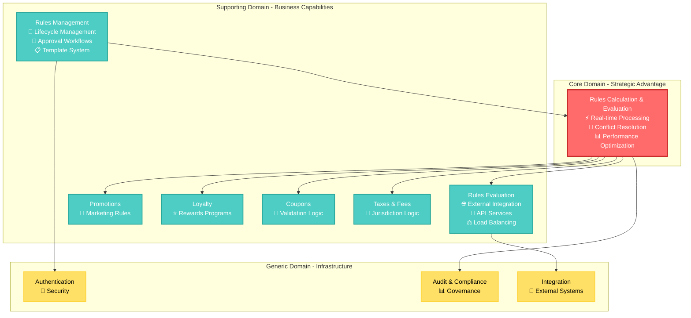

# Rules Engine - Domain-Driven Design Documentation

**Version:** 1.0.0  
**Last Updated:** 2024-12-19  
**Document Type:** DDD Architecture Documentation  
**Target Audience:** Software Architects, Developers, Domain Experts, Product Teams  
**Status:** Complete

## Table of Contents

1. [Overview](#overview)
2. [Documentation Structure](#documentation-structure)
3. [Domain Architecture](#domain-architecture)
4. [Bounded Contexts](#bounded-contexts)
5. [Strategic Design Decisions](#strategic-design-decisions)
6. [Implementation Guidelines](#implementation-guidelines)
7. [Quality Assurance](#quality-assurance)
8. [Evolution Strategy](#evolution-strategy)

## Overview

This DDD documentation provides a comprehensive view of the Rules Engine domain, following Domain-Driven Design principles to create a shared understanding between business and technical stakeholders. The documentation is organized to support both strategic design decisions and tactical implementation patterns.

### DDD Implementation Approach

The Rules Engine domain implementation follows these DDD principles:

- **Ubiquitous Language**: Consistent terminology across all contexts and communications
- **Bounded Context Clarity**: Clear boundaries and responsibilities for each context
- **Aggregate Design**: Well-defined consistency boundaries and business invariants
- **Domain Events**: Event-driven communication between contexts
- **Strategic Patterns**: Context mapping patterns for integration
- **Tactical Patterns**: Implementation patterns for code organization

### Business Domain Focus

The Rules Engine operates in the **Business Rules Management** domain, focusing on:

- **Dynamic Rule Processing**: Real-time evaluation of business logic
- **Business User Empowerment**: Non-technical rule creation and management
- **Governance and Compliance**: Approval workflows and audit trails
- **High Performance**: Sub-500ms evaluation with 1000+ TPS throughput
- **Enterprise Integration**: Seamless integration with existing systems

## Documentation Structure

### Core Documentation Components

```
DDD/
├── docs/
│   ├── domain/                          # Domain-level documentation
│   │   ├── README.md                    # Domain overview and business context
│   │   ├── ubiquitous-language.md       # Complete domain vocabulary
│   │   └── domain-model-overview.md     # High-level domain relationships
│   │
│   ├── bounded-contexts/               # Context-specific documentation
│   │   ├── README.md                   # Context overview and relationships
│   │   ├── context-map.md              # Detailed context mapping
│   │   ├── rules-management/           # Rules Management context
│   │   ├── rules-calculation/          # Rules Calculation context
│   │   ├── rules-evaluation/           # Rules Evaluation context
│   │   └── [supporting-contexts]/      # Supporting domain contexts
│   │
│   └── architecture/                   # Strategic design documentation
│       ├── strategic-design.md         # High-level architectural decisions
│       ├── tactical-design.md          # Implementation patterns
│       └── integration-patterns.md     # Context integration approaches
│
└── diagrams/                           # Visual documentation
    └── source/                         # Mermaid source files
        ├── domain/                     # Domain-level diagrams
        ├── bounded-contexts/           # Context relationship diagrams
        ├── aggregates/                 # Aggregate design diagrams
        └── event-flows/                # Event flow and sequence diagrams
```

### Navigation Guide

#### For Business Stakeholders
1. **Start with**: [Domain Overview](docs/domain/README.md)
2. **Understand terminology**: [Ubiquitous Language](docs/domain/ubiquitous-language.md)
3. **Explore capabilities**: [Bounded Contexts Overview](docs/bounded-contexts/README.md)

#### For Solution Architects
1. **Review strategic design**: [Context Map](docs/bounded-contexts/context-map.md)
2. **Understand integration**: [Integration Patterns](docs/bounded-contexts/context-map.md#integration-patterns-detailed)
3. **Plan evolution**: [Context Evolution Strategy](docs/bounded-contexts/README.md#context-evolution-strategy)

#### For Development Teams
1. **Understand context**: Individual context documentation
2. **Review aggregates**: [Aggregate Design Diagrams](diagrams/source/aggregates/)
3. **Follow events**: [Event Flow Diagrams](diagrams/source/event-flows/)

## Domain Architecture

### Strategic Domain Overview



### Domain Decomposition Rationale

#### Core Domain: Rules Calculation & Evaluation
- **Strategic Value**: Provides competitive advantage through real-time rule processing
- **Business Criticality**: Essential for customer experience and business operations
- **Technical Complexity**: High - complex algorithms, performance optimization, conflict resolution
- **Investment Priority**: Maximum investment in capability and performance

#### Supporting Domains
- **Rules Management**: Critical for business agility but not differentiating
- **Rules Evaluation**: Important for integration but standard API patterns
- **Domain-Specific Rules**: Business-critical but domain-specific implementations

#### Generic Domains
- **Authentication**: Standard enterprise patterns, buy/leverage existing
- **Audit & Compliance**: Important but standard compliance patterns
- **Integration**: Standard integration patterns and protocols

### Key Design Principles

#### Domain-Centric Design
- **Business Logic First**: Domain models reflect business concepts and rules
- **Technology Independence**: Core domain logic independent of infrastructure
- **Business Language**: Code and documentation use business terminology
- **Domain Expert Collaboration**: Continuous collaboration with business experts

#### Bounded Context Autonomy
- **Independent Evolution**: Contexts can evolve independently
- **Technology Freedom**: Each context can choose appropriate technology
- **Team Ownership**: Clear team ownership and responsibility
- **Service Boundaries**: Context boundaries align with service boundaries

#### Event-Driven Architecture
- **Loose Coupling**: Contexts communicate through events, not direct calls
- **Eventual Consistency**: Accept eventual consistency between contexts
- **Audit Trail**: Complete event history for compliance and debugging
- **Scalability**: Event-driven patterns support horizontal scaling

## Bounded Contexts

### Context Overview and Relationships

| Context | Type | Team | Primary Responsibility | Key Integrations |
|---------|------|------|----------------------|------------------|
| **Rules Management** | Supporting | Business Rules Team | Rule lifecycle and governance | Rules Calculation, Authentication, Audit |
| **Rules Calculation** | Core | Core Engine Team | High-performance rule evaluation | All supporting contexts, Rules Evaluation |
| **Rules Evaluation** | Supporting | API Team | External integration services | Rules Calculation, Integration layer |
| **Promotions** | Supporting | Marketing Team | Promotional rule patterns | Rules Calculation, Loyalty |
| **Loyalty** | Supporting | Loyalty Team | Loyalty program rules | Rules Calculation, Promotions |
| **Coupons** | Supporting | E-commerce Team | Coupon validation logic | Rules Calculation, Promotions |
| **Taxes & Fees** | Supporting | Finance Team | Tax and fee calculations | Rules Calculation |

### Integration Patterns Summary

#### Customer/Supplier Patterns
- **Rules Management → Rules Calculation**: Rule definitions and lifecycle events
- **Rules Calculation → Rules Evaluation**: Evaluation requests and results

#### Open Host Service Patterns
- **Rules Calculation → Supporting Domains**: Standardized evaluation API for all domain-specific rules

#### Shared Kernel Pattern
- **Rules Calculation ↔ Rule Evaluator/Calculator**: Shared calculation algorithms and performance libraries

#### Infrastructure Patterns
- **Conformist**: Integration with enterprise authentication systems
- **Anti-Corruption Layer**: Protection from external system changes
- **Published Language**: Standardized audit event formats

### Context Evolution Strategy

#### Short-Term (6-12 months)
- **Optimize Core**: Enhance Rules Calculation performance and conflict resolution
- **Enhance Management**: Improve rule authoring and approval workflows
- **Strengthen Integration**: Better external system integration patterns

#### Medium-Term (1-2 years)
- **Context Specialization**: Optimize domain-specific rule contexts
- **Advanced Analytics**: Dedicated analytics context for rule performance
- **ML Integration**: Machine learning context for rule optimization

#### Long-Term (2+ years)
- **Multi-Tenancy**: Support for multiple organizations
- **Context Marketplace**: Shareable contexts and rule patterns
- **Autonomous Systems**: Self-healing and self-optimizing contexts

## Strategic Design Decisions

### Architecture Decision Records (ADRs)

#### ADR-001: Event-Driven Architecture
- **Status**: Accepted
- **Context**: Need for loose coupling between contexts and audit trail requirements
- **Decision**: Implement event-driven architecture with domain events
- **Consequences**: 
  - ✅ Loose coupling between contexts
  - ✅ Complete audit trail through events
  - ✅ Better scalability and resilience
  - ❌ Increased complexity in testing and debugging
  - ❌ Eventual consistency requires careful design

#### ADR-002: Shared Kernel for Calculation Engine
- **Status**: Accepted
- **Context**: Rules Calculation and Rule Evaluator/Calculator need shared algorithms
- **Decision**: Implement shared kernel pattern for core calculation components
- **Consequences**:
  - ✅ Avoid code duplication
  - ✅ Consistent calculation logic
  - ✅ Shared performance optimizations
  - ❌ Requires coordinated releases
  - ❌ Potential coupling between teams

#### ADR-003: Domain-Specific Rule Contexts
- **Status**: Accepted
- **Context**: Different rule types have distinct business patterns and requirements
- **Decision**: Create separate contexts for Promotions, Loyalty, Coupons, and Taxes
- **Consequences**:
  - ✅ Domain expertise and specialization
  - ✅ Independent evolution and optimization
  - ✅ Clear business ownership
  - ❌ More contexts to manage
  - ❌ Potential duplication across contexts

#### ADR-004: API-First Integration
- **Status**: Accepted
- **Context**: Need for external system integration and future extensibility
- **Decision**: Design APIs first with OpenAPI specifications
- **Consequences**:
  - ✅ Clear integration contracts
  - ✅ Better external integration
  - ✅ Documentation and testing automation
  - ❌ Additional design overhead
  - ❌ API versioning complexity

### Technology Stack Alignment

#### Core Domain Technologies
- **Languages**: Java/JVM for performance and enterprise integration
- **Frameworks**: Spring Boot for microservices architecture
- **Databases**: PostgreSQL for ACID compliance, Redis for caching
- **Messaging**: Apache Kafka for event streaming
- **Monitoring**: Prometheus/Grafana for observability

#### Context-Specific Technologies
- **Rules Management**: Spring Boot, PostgreSQL, Redis, React UI
- **Rules Calculation**: Java with performance optimizations, In-memory computing
- **Rules Evaluation**: Spring Boot, API Gateway, Load balancers
- **Supporting Contexts**: Domain-appropriate technology choices

## Implementation Guidelines

### Development Standards

#### Code Organization
```
src/
├── main/
│   ├── java/
│   │   └── com/company/rules/
│   │       ├── domain/                 # Domain layer
│   │       │   ├── model/             # Aggregates, entities, value objects
│   │       │   ├── service/           # Domain services
│   │       │   └── event/             # Domain events
│   │       ├── application/           # Application layer
│   │       │   ├── service/           # Application services
│   │       │   ├── command/           # Commands and handlers
│   │       │   └── query/             # Queries and handlers
│   │       ├── infrastructure/        # Infrastructure layer
│   │       │   ├── repository/        # Repository implementations
│   │       │   ├── messaging/         # Event publishing
│   │       │   └── web/               # REST controllers
│   │       └── shared/                # Shared kernel (if applicable)
│   └── resources/
└── test/                              # Test organization mirrors main
```

#### Domain Model Implementation
```java
// Aggregate Root Example
@Entity
@Table(name = "rules")
public class Rule implements AggregateRoot<RuleId> {
    @EmbeddedId
    private RuleId id;
    
    @Embedded
    private RuleName name;
    
    @Embedded
    private DSLContent dslContent;
    
    @Enumerated(EnumType.STRING)
    private RuleStatus status;
    
    @Enumerated(EnumType.STRING)
    private Priority priority;
    
    // Business methods
    public void activate() {
        if (!canBeActivated()) {
            throw new IllegalStateException("Rule cannot be activated");
        }
        this.status = RuleStatus.ACTIVE;
        addEvent(new RuleActivated(this.id, this.name, Instant.now()));
    }
    
    // Invariant enforcement
    private boolean canBeActivated() {
        return status == RuleStatus.APPROVED && dslContent.isValid();
    }
}
```

#### Event Design Patterns
```java
// Domain Event Example
public class RuleActivated implements DomainEvent {
    private final RuleId ruleId;
    private final RuleName ruleName;
    private final Instant occurredAt;
    
    public RuleActivated(RuleId ruleId, RuleName ruleName, Instant occurredAt) {
        this.ruleId = ruleId;
        this.ruleName = ruleName;
        this.occurredAt = occurredAt;
    }
    
    @Override
    public String getEventType() {
        return "rule.activated.v1";
    }
    
    @Override
    public String getAggregateId() {
        return ruleId.getValue();
    }
}
```

### Testing Strategies

#### Domain Model Testing
- **Unit Tests**: Test aggregates, entities, and value objects in isolation
- **Domain Service Tests**: Test domain services with mock repositories
- **Integration Tests**: Test repository implementations with real databases
- **Contract Tests**: Test event schemas and API contracts

#### Context Integration Testing
- **API Contract Tests**: Consumer-driven contract testing between contexts
- **Event Contract Tests**: Validate event schema compatibility
- **End-to-End Tests**: Test complete workflows across contexts

### Documentation Standards

#### Code Documentation
- **Aggregate Documentation**: Business purpose and invariants
- **Domain Service Documentation**: Responsibilities and dependencies
- **Event Documentation**: Triggers, consequences, and schema
- **Repository Documentation**: Data access patterns and performance

#### Architecture Documentation
- **Context Documentation**: Purpose, boundaries, and integration patterns
- **Decision Records**: Document significant architectural decisions
- **Integration Patterns**: Document context communication patterns

## Quality Assurance

### DDD Compliance Validation

#### Domain Model Quality
- [ ] **Ubiquitous Language**: Consistent terminology across code and documentation
- [ ] **Business Rules**: All invariants documented and enforced in code
- [ ] **Domain Events**: Event triggers and consequences clearly defined
- [ ] **Aggregates**: Boundaries and responsibilities clearly delineated
- [ ] **Value Objects**: Immutability and equality rules implemented

#### Context Boundaries
- [ ] **Context Purpose**: Clear business capability definition
- [ ] **Boundaries**: Explicit inclusion/exclusion criteria
- [ ] **Team Ownership**: Responsible team clearly identified
- [ ] **Integration Points**: All external dependencies documented
- [ ] **API Design**: Public interfaces clearly specified

#### Implementation Quality
- [ ] **Business Context**: Code comments explain business significance
- [ ] **Aggregate Rules**: Business invariants enforced in code
- [ ] **Event Consistency**: Event schemas documented and versioned
- [ ] **Repository Contracts**: Data access patterns well-defined
- [ ] **Service Clarity**: Domain service responsibilities clear

### Testing and Validation

#### Automated Quality Checks
```bash
# Domain Model Validation
./gradlew test --tests "**.*DomainTest"

# Architecture Compliance Tests
./gradlew test --tests "**.*ArchitectureTest"

# Event Schema Validation
./gradlew test --tests "**.*EventSchemaTest"

# Context Integration Tests
./gradlew test --tests "**.*IntegrationTest"
```

#### Continuous Validation
- **Build Pipeline**: Automated DDD compliance checks in CI/CD
- **Code Review**: DDD pattern adherence in code reviews
- **Architecture Review**: Regular architecture decision reviews
- **Domain Expert Review**: Business logic validation with domain experts

## Evolution Strategy

### Continuous Improvement Process

#### Monthly Reviews
- **Domain Model Evolution**: Review model adequacy and business alignment
- **Context Boundary Assessment**: Evaluate context responsibilities and boundaries
- **Integration Pattern Effectiveness**: Assess communication patterns between contexts
- **Team Ownership**: Review team structure and context ownership

#### Quarterly Assessments
- **Strategic Design Review**: Evaluate high-level architectural decisions
- **Technology Alignment**: Assess technology choices against business needs
- **Performance Analysis**: Review system performance against business requirements
- **Business Value Assessment**: Measure business impact of DDD implementation

#### Annual Strategic Planning
- **Domain Evolution**: Plan domain model evolution based on business changes
- **Context Restructuring**: Consider context splitting or merging based on team dynamics
- **Technology Migration**: Plan technology upgrades and migrations
- **Skill Development**: Plan team training and capability development

### Adaptation Guidelines

#### Context Evolution Triggers
- **Team Growth**: Split contexts when teams become too large
- **Business Complexity**: Create new contexts for new business capabilities
- **Performance Requirements**: Optimize contexts for specific performance needs
- **Integration Complexity**: Simplify contexts when integration becomes complex

#### Model Refactoring Patterns
- **Aggregate Splitting**: When aggregates become too complex
- **Value Object Extraction**: When attributes have business significance
- **Domain Service Creation**: When logic doesn't belong to any aggregate
- **Event Granularity**: Adjust event granularity based on consumer needs

This DDD documentation serves as the comprehensive guide for understanding, implementing, and evolving the Rules Engine domain using Domain-Driven Design principles and patterns.
