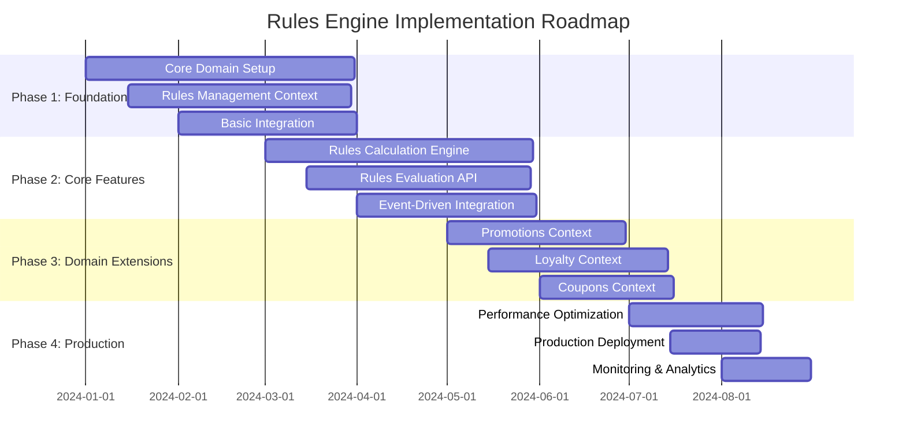
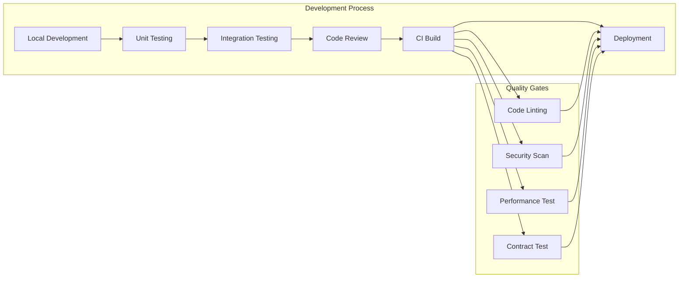

# Implementation Guide - Rules Engine Domain

**Version:** 1.0.0  
**Last Updated:** 2024-12-19  
**Document Type:** Implementation Guide  
**Target Audience:** Development Teams, Technical Leads, DevOps Engineers  
**Status:** Complete

## Table of Contents

1. [Implementation Overview](#implementation-overview)
2. [Development Environment Setup](#development-environment-setup)
3. [Technology Stack Implementation](#technology-stack-implementation)
4. [Context Implementation Guidelines](#context-implementation-guidelines)
5. [Integration Implementation](#integration-implementation)
6. [Testing Implementation](#testing-implementation)
7. [Deployment and Operations](#deployment-and-operations)
8. [Monitoring and Observability](#monitoring-and-observability)
9. [Performance Optimization](#performance-optimization)
10. [Security Implementation](#security-implementation)

## Implementation Overview

### Implementation Strategy

The Rules Engine implementation follows a **context-first approach** where each bounded context is implemented as an independent microservice with its own:

- **Development Team**: Dedicated team ownership
- **Technology Stack**: Context-appropriate technology choices
- **Data Store**: Independent data storage and schema
- **Deployment Pipeline**: Independent build and deployment
- **Monitoring**: Context-specific metrics and alerts

### Implementation Phases



### Development Workflow



## Development Environment Setup

### Prerequisites

#### Required Software
```bash
# Java Development Kit
java --version  # Requires Java 17+

# Build Tool
./gradlew --version  # Gradle 8.x

# Database
docker run --name postgres-rules -e POSTGRES_PASSWORD=password -p 5432:5432 -d postgres:15

# Message Broker
docker run --name kafka-rules -p 9092:9092 -d confluentinc/cp-kafka:7.4.0

# Cache
docker run --name redis-rules -p 6379:6379 -d redis:7-alpine

# Container Runtime
docker --version
docker-compose --version
```

#### Development Tools
```bash
# IDE Setup (IntelliJ IDEA recommended)
# Install plugins:
# - Lombok
# - Spring Boot
# - Docker
# - Database Navigator

# Code Quality Tools
./gradlew sonarqube  # SonarQube analysis
./gradlew pmdMain checkstyleMain spotbugsMain  # Static analysis

# API Tools
# Install Postman or use curl for API testing
# Install OpenAPI Generator for client generation
```

### Local Development Setup

#### 1. Repository Setup
```bash
# Clone repository
git clone https://github.com/company/rules-engine.git
cd rules-engine

# Setup development branch
git checkout -b feature/your-feature-name

# Install dependencies
./gradlew clean build
```

#### 2. Environment Configuration
```yaml
# config/application-local.yml
spring:
  profiles:
    active: local
  datasource:
    url: jdbc:postgresql://localhost:5432/rules_engine
    username: rules_user
    password: password
  redis:
    host: localhost
    port: 6379
  kafka:
    bootstrap-servers: localhost:9092

rules-engine:
  validation:
    enabled: true
    performance-check: true
  cache:
    enabled: true
    ttl: 300s
  events:
    publishing: true
```

#### 3. Database Setup
```sql
-- Create development database
CREATE DATABASE rules_engine;
CREATE USER rules_user WITH ENCRYPTED PASSWORD 'password';
GRANT ALL PRIVILEGES ON DATABASE rules_engine TO rules_user;

-- Run migrations
./gradlew flywayMigrate
```

#### 4. Local Testing
```bash
# Run all tests
./gradlew test

# Run specific test categories
./gradlew test --tests "*DomainTest"
./gradlew test --tests "*IntegrationTest"

# Run with coverage
./gradlew test jacocoTestReport
```

## Technology Stack Implementation

### Core Framework Configuration

#### Spring Boot Application
```java
@SpringBootApplication
@EnableJpaRepositories(basePackages = "com.company.rules.infrastructure.repository")
@EnableKafka
@EnableCaching
@EnableAsync
public class RulesEngineApplication {
    
    public static void main(String[] args) {
        SpringApplication.run(RulesEngineApplication.class, args);
    }
    
    @Bean
    public ApplicationEventPublisher applicationEventPublisher() {
        return new SimpleApplicationEventPublisher();
    }
}
```

#### Database Configuration
```java
@Configuration
@EnableTransactionManagement
public class DatabaseConfiguration {
    
    @Bean
    @Primary
    @ConfigurationProperties("spring.datasource")
    public DataSource dataSource() {
        return DataSourceBuilder.create()
            .type(HikariDataSource.class)
            .build();
    }
    
    @Bean
    public PlatformTransactionManager transactionManager(EntityManagerFactory emf) {
        return new JpaTransactionManager(emf);
    }
    
    @Bean
    public FlywayMigrationStrategy flywayMigrationStrategy() {
        return flyway -> {
            flyway.repair();
            flyway.migrate();
        };
    }
}
```

#### Kafka Configuration
```java
@Configuration
@EnableKafka
public class KafkaConfiguration {
    
    @Bean
    public ProducerFactory<String, DomainEvent> producerFactory() {
        Map<String, Object> props = new HashMap<>();
        props.put(ProducerConfig.BOOTSTRAP_SERVERS_CONFIG, "localhost:9092");
        props.put(ProducerConfig.KEY_SERIALIZER_CLASS_CONFIG, StringSerializer.class);
        props.put(ProducerConfig.VALUE_SERIALIZER_CLASS_CONFIG, JsonSerializer.class);
        props.put(ProducerConfig.ACKS_CONFIG, "all");
        props.put(ProducerConfig.RETRIES_CONFIG, 3);
        return new DefaultKafkaProducerFactory<>(props);
    }
    
    @Bean
    public KafkaTemplate<String, DomainEvent> kafkaTemplate() {
        return new KafkaTemplate<>(producerFactory());
    }
    
    @Bean
    public ConsumerFactory<String, DomainEvent> consumerFactory() {
        Map<String, Object> props = new HashMap<>();
        props.put(ConsumerConfig.BOOTSTRAP_SERVERS_CONFIG, "localhost:9092");
        props.put(ConsumerConfig.GROUP_ID_CONFIG, "rules-engine");
        props.put(ConsumerConfig.KEY_DESERIALIZER_CLASS_CONFIG, StringDeserializer.class);
        props.put(ConsumerConfig.VALUE_DESERIALIZER_CLASS_CONFIG, JsonDeserializer.class);
        props.put(ConsumerConfig.AUTO_OFFSET_RESET_CONFIG, "earliest");
        return new DefaultKafkaConsumerFactory<>(props);
    }
}
```

#### Redis Configuration
```java
@Configuration
@EnableCaching
public class CacheConfiguration {
    
    @Bean
    public LettuceConnectionFactory redisConnectionFactory() {
        return new LettuceConnectionFactory(
            new RedisStandaloneConfiguration("localhost", 6379));
    }
    
    @Bean
    public RedisTemplate<String, Object> redisTemplate() {
        RedisTemplate<String, Object> template = new RedisTemplate<>();
        template.setConnectionFactory(redisConnectionFactory());
        template.setDefaultSerializer(new GenericJackson2JsonRedisSerializer());
        return template;
    }
    
    @Bean
    public CacheManager cacheManager() {
        RedisCacheConfiguration config = RedisCacheConfiguration.defaultCacheConfig()
            .entryTtl(Duration.ofMinutes(30))
            .serializeKeysWith(RedisSerializationContext.SerializationPair
                .fromSerializer(new StringRedisSerializer()))
            .serializeValuesWith(RedisSerializationContext.SerializationPair
                .fromSerializer(new GenericJackson2JsonRedisSerializer()));
        
        return RedisCacheManager.builder(redisConnectionFactory())
            .cacheDefaults(config)
            .build();
    }
}
```

## Context Implementation Guidelines

### Rules Management Context Implementation

#### Project Structure
```
rules-management/
├── src/main/java/com/company/rules/management/
│   ├── domain/
│   │   ├── model/
│   │   │   ├── Rule.java
│   │   │   ├── RuleTemplate.java
│   │   │   └── ApprovalWorkflow.java
│   │   ├── service/
│   │   │   ├── RuleValidationService.java
│   │   │   └── RuleFactory.java
│   │   └── repository/
│   │       └── RuleRepository.java
│   ├── application/
│   │   ├── command/
│   │   │   ├── CreateRuleCommand.java
│   │   │   └── CreateRuleCommandHandler.java
│   │   └── query/
│   │       ├── GetRuleQuery.java
│   │       └── GetRuleQueryHandler.java
│   ├── infrastructure/
│   │   ├── repository/
│   │   │   └── JpaRuleRepository.java
│   │   ├── web/
│   │   │   └── RuleController.java
│   │   └── messaging/
│   │       └── RuleEventPublisher.java
│   └── config/
├── src/test/java/
└── src/main/resources/
    ├── application.yml
    └── db/migration/
```

#### Domain Implementation
```java
// Rule.java - Aggregate Root
@Entity
@Table(name = "rules")
public class Rule implements AggregateRoot<RuleId> {
    
    @EmbeddedId
    private RuleId id;
    
    @Embedded
    private RuleName name;
    
    @Embedded
    private DSLContent dslContent;
    
    @Enumerated(EnumType.STRING)
    @Column(name = "status")
    private RuleStatus status;
    
    @Enumerated(EnumType.STRING)
    @Column(name = "priority")
    private Priority priority;
    
    @Embedded
    private RuleMetadata metadata;
    
    @Version
    private Long version;
    
    @Transient
    private final List<DomainEvent> domainEvents = new ArrayList<>();
    
    // Business methods with invariant enforcement
    public void activate() {
        if (!canBeActivated()) {
            throw new IllegalStateException("Rule cannot be activated in current state");
        }
        this.status = RuleStatus.ACTIVE;
        addDomainEvent(new RuleActivated(this.id, this.name, Instant.now()));
    }
    
    private boolean canBeActivated() {
        return this.status == RuleStatus.APPROVED && 
               this.dslContent.isValid();
    }
}
```

#### Application Service Implementation
```java
@Service
@Transactional
public class RuleApplicationService {
    
    private final RuleRepository ruleRepository;
    private final RuleFactory ruleFactory;
    private final DomainEventPublisher eventPublisher;
    
    public RuleId createRule(CreateRuleCommand command) {
        // Validate business rules
        validateCreateRuleCommand(command);
        
        // Create rule using factory
        Rule rule = ruleFactory.createFromCommand(command);
        
        // Save rule
        ruleRepository.save(rule);
        
        // Publish events
        eventPublisher.publishAll(rule.getUncommittedEvents());
        rule.markEventsAsCommitted();
        
        return rule.getId();
    }
    
    private void validateCreateRuleCommand(CreateRuleCommand command) {
        if (ruleRepository.existsByNameAndCategory(
                command.getName(), command.getCategory())) {
            throw new DuplicateRuleException("Rule with same name exists");
        }
    }
}
```

#### REST Controller Implementation
```java
@RestController
@RequestMapping("/api/v1/rules")
@Validated
public class RuleController {
    
    private final RuleApplicationService ruleService;
    private final RuleQueryService queryService;
    
    @PostMapping
    public ResponseEntity<RuleResponse> createRule(@Valid @RequestBody CreateRuleRequest request) {
        CreateRuleCommand command = mapToCommand(request);
        RuleId ruleId = ruleService.createRule(command);
        
        RuleResponse response = queryService.getRuleById(ruleId);
        return ResponseEntity.status(HttpStatus.CREATED).body(response);
    }
    
    @GetMapping("/{ruleId}")
    public ResponseEntity<RuleResponse> getRule(@PathVariable String ruleId) {
        RuleResponse rule = queryService.getRuleById(RuleId.of(ruleId));
        return ResponseEntity.ok(rule);
    }
    
    @PostMapping("/{ruleId}/activate")
    public ResponseEntity<Void> activateRule(@PathVariable String ruleId) {
        ruleService.activateRule(RuleId.of(ruleId));
        return ResponseEntity.ok().build();
    }
}
```

### Rules Calculation Context Implementation

#### High-Performance Configuration
```java
@Configuration
public class PerformanceConfiguration {
    
    @Bean
    public ThreadPoolTaskExecutor ruleEvaluationExecutor() {
        ThreadPoolTaskExecutor executor = new ThreadPoolTaskExecutor();
        executor.setCorePoolSize(10);
        executor.setMaxPoolSize(50);
        executor.setQueueCapacity(100);
        executor.setThreadNamePrefix("rule-eval-");
        executor.setRejectedExecutionHandler(new ThreadPoolExecutor.CallerRunsPolicy());
        executor.initialize();
        return executor;
    }
    
    @Bean
    public CacheManager highPerformanceCacheManager() {
        return Caffeine.newBuilder()
            .maximumSize(10000)
            .expireAfterWrite(Duration.ofMinutes(15))
            .recordStats()
            .buildCaffeineCache();
    }
}
```

#### Rule Evaluation Engine
```java
@Service
public class RuleEvaluationEngine {
    
    private final RuleRepository ruleRepository;
    private final ConflictResolutionService conflictResolver;
    private final PerformanceMonitor performanceMonitor;
    
    @Async("ruleEvaluationExecutor")
    @Cacheable(value = "evaluationResults", key = "#context.transactionId")
    public CompletableFuture<EvaluationResult> evaluateRules(EvaluationContext context) {
        Stopwatch stopwatch = Stopwatch.createStarted();
        
        try {
            // Load applicable rules
            List<Rule> applicableRules = loadApplicableRules(context);
            
            // Execute rules in priority order
            List<RuleExecution> executions = executeRules(applicableRules, context);
            
            // Resolve conflicts
            List<RuleExecution> resolvedExecutions = conflictResolver.resolve(executions);
            
            // Create result
            EvaluationResult result = createEvaluationResult(resolvedExecutions, context);
            
            return CompletableFuture.completedFuture(result);
            
        } finally {
            performanceMonitor.recordEvaluationTime(stopwatch.elapsed());
        }
    }
    
    private List<Rule> loadApplicableRules(EvaluationContext context) {
        return ruleRepository.findActiveRulesByCategory(context.getCategory())
            .stream()
            .filter(rule -> rule.isApplicable(context))
            .sorted(Comparator.comparing(Rule::getPriority))
            .collect(Collectors.toList());
    }
}
```

## Integration Implementation

### Event-Driven Integration

#### Event Publisher Implementation
```java
@Component
public class DomainEventPublisher {
    
    private final KafkaTemplate<String, DomainEvent> kafkaTemplate;
    private final ApplicationEventPublisher localEventPublisher;
    
    @EventListener
    @Async
    public void publish(DomainEvent event) {
        // Publish locally for same-context handlers
        localEventPublisher.publishEvent(event);
        
        // Publish to Kafka for cross-context communication
        publishToKafka(event);
    }
    
    private void publishToKafka(DomainEvent event) {
        String topic = determineTopicForEvent(event);
        String key = event.getAggregateId();
        
        kafkaTemplate.send(topic, key, event)
            .addCallback(
                result -> logSuccess(event),
                failure -> handlePublishFailure(event, failure)
            );
    }
    
    private String determineTopicForEvent(DomainEvent event) {
        return "rules.events." + event.getEventType().replace(".", "-");
    }
}
```

#### Event Consumer Implementation
```java
@Component
public class RuleEventConsumer {
    
    private final CacheManager cacheManager;
    private final NotificationService notificationService;
    
    @KafkaListener(topics = "rules.events.rule-activated")
    public void handleRuleActivated(RuleActivated event) {
        // Invalidate cache
        cacheManager.getCache("activeRules").evict(event.getRuleId());
        
        // Send notifications
        notificationService.notifyStakeholders(event);
        
        // Update local state if necessary
        updateLocalRuleCache(event);
    }
    
    @KafkaListener(topics = "rules.events.rule-deactivated")
    public void handleRuleDeactivated(RuleDeactivated event) {
        // Remove from active rules cache
        cacheManager.getCache("activeRules").evict(event.getRuleId());
        
        // Log deactivation
        auditService.logRuleDeactivation(event);
    }
}
```

### API Integration

#### OpenAPI Specification
```yaml
# api-spec.yml
openapi: 3.0.3
info:
  title: Rules Engine API
  version: 1.0.0
  description: Rules Engine Management and Evaluation APIs

paths:
  /api/v1/rules:
    post:
      summary: Create a new rule
      requestBody:
        required: true
        content:
          application/json:
            schema:
              $ref: '#/components/schemas/CreateRuleRequest'
      responses:
        '201':
          description: Rule created successfully
          content:
            application/json:
              schema:
                $ref: '#/components/schemas/RuleResponse'

  /api/v1/evaluation/evaluate:
    post:
      summary: Evaluate rules for a transaction
      requestBody:
        required: true
        content:
          application/json:
            schema:
              $ref: '#/components/schemas/EvaluationRequest'
      responses:
        '200':
          description: Evaluation completed
          content:
            application/json:
              schema:
                $ref: '#/components/schemas/EvaluationResponse'

components:
  schemas:
    CreateRuleRequest:
      type: object
      required: [name, dslContent, category]
      properties:
        name:
          type: string
          minLength: 3
          maxLength: 100
        dslContent:
          type: string
        category:
          type: string
          enum: [PROMOTIONS, LOYALTY, COUPONS, TAXES]
        priority:
          type: string
          enum: [LOW, MEDIUM, HIGH, CRITICAL]
```

#### Client Generation
```bash
# Generate client libraries
openapi-generator generate \
  -i api-spec.yml \
  -g java \
  -o generated/java-client \
  --package-name com.company.rules.client

openapi-generator generate \
  -i api-spec.yml \
  -g typescript-axios \
  -o generated/typescript-client
```

## Testing Implementation

### Test Configuration

#### Test Application Properties
```yaml
# test/resources/application-test.yml
spring:
  profiles:
    active: test
  datasource:
    url: jdbc:h2:mem:testdb;DB_CLOSE_DELAY=-1;DB_CLOSE_ON_EXIT=FALSE
    driver-class-name: org.h2.Driver
    username: sa
    password:
  jpa:
    hibernate:
      ddl-auto: create-drop
  kafka:
    bootstrap-servers: ${spring.embedded.kafka.brokers}
  redis:
    url: redis://localhost:${spring.embedded.redis.port}

rules-engine:
  cache:
    enabled: false
  events:
    publishing: false
```

#### Test Containers Configuration
```java
@TestConfiguration
public class TestContainersConfiguration {
    
    @Bean
    @ServiceConnection
    @Primary
    public PostgreSQLContainer<?> postgreSQLContainer() {
        return new PostgreSQLContainer<>("postgres:15-alpine")
            .withDatabaseName("rules_test")
            .withUsername("test")
            .withPassword("test");
    }
    
    @Bean
    @ServiceConnection
    public RedisContainer redisContainer() {
        return new RedisContainer("redis:7-alpine");
    }
    
    @Bean
    @ServiceConnection
    public KafkaContainer kafkaContainer() {
        return new KafkaContainer(DockerImageName.parse("confluentinc/cp-kafka:7.4.0"));
    }
}
```

### Integration Test Implementation

```java
@SpringBootTest(webEnvironment = SpringBootTest.WebEnvironment.RANDOM_PORT)
@Testcontainers
@ActiveProfiles("test")
class RuleManagementIntegrationTest {
    
    @Autowired
    private TestRestTemplate restTemplate;
    
    @Autowired
    private RuleRepository ruleRepository;
    
    @Test
    void shouldCreateRuleSuccessfully() {
        // Given
        CreateRuleRequest request = CreateRuleRequest.builder()
            .name("Test Discount Rule")
            .dslContent("category = 'electronics' AND amount > 100")
            .category("PROMOTIONS")
            .priority("MEDIUM")
            .build();
        
        // When
        ResponseEntity<RuleResponse> response = restTemplate.postForEntity(
            "/api/v1/rules", request, RuleResponse.class);
        
        // Then
        assertThat(response.getStatusCode()).isEqualTo(HttpStatus.CREATED);
        assertThat(response.getBody()).isNotNull();
        assertThat(response.getBody().getName()).isEqualTo("Test Discount Rule");
        
        // Verify persistence
        Optional<Rule> savedRule = ruleRepository.findById(
            RuleId.of(response.getBody().getId()));
        assertThat(savedRule).isPresent();
    }
}
```

### Performance Test Implementation

```java
@SpringBootTest
@ActiveProfiles("performance")
class RuleEvaluationPerformanceTest {
    
    @Autowired
    private RuleEvaluationEngine evaluationEngine;
    
    @Test
    void shouldEvaluateRulesWithinPerformanceTarget() {
        // Given
        EvaluationContext context = createEvaluationContext();
        int numberOfRules = 100;
        createTestRules(numberOfRules);
        
        // When
        Stopwatch stopwatch = Stopwatch.createStarted();
        EvaluationResult result = evaluationEngine.evaluateRules(context).join();
        Duration elapsedTime = stopwatch.elapsed();
        
        // Then
        assertThat(result).isNotNull();
        assertThat(elapsedTime).isLessThan(Duration.ofMillis(500)); // SLA requirement
        assertThat(result.getExecutions()).isNotEmpty();
    }
    
    @Test
    void shouldHandleConcurrentEvaluations() throws InterruptedException {
        // Given
        int numberOfConcurrentRequests = 100;
        ExecutorService executor = Executors.newFixedThreadPool(10);
        CountDownLatch latch = new CountDownLatch(numberOfConcurrentRequests);
        List<Future<EvaluationResult>> futures = new ArrayList<>();
        
        // When
        for (int i = 0; i < numberOfConcurrentRequests; i++) {
            Future<EvaluationResult> future = executor.submit(() -> {
                try {
                    EvaluationContext context = createEvaluationContext();
                    return evaluationEngine.evaluateRules(context).join();
                } finally {
                    latch.countDown();
                }
            });
            futures.add(future);
        }
        
        latch.await(30, TimeUnit.SECONDS);
        
        // Then
        for (Future<EvaluationResult> future : futures) {
            assertThat(future.isDone()).isTrue();
            assertThat(future.get()).isNotNull();
        }
    }
}
```

## Deployment and Operations

### Docker Configuration

#### Dockerfile
```dockerfile
FROM openjdk:17-jdk-slim as builder
WORKDIR /app
COPY . .
RUN ./gradlew clean build -x test

FROM openjdk:17-jre-slim
WORKDIR /app
COPY --from=builder /app/build/libs/*.jar app.jar
EXPOSE 8080
ENTRYPOINT ["java", "-jar", "app.jar"]
```

#### Docker Compose
```yaml
version: '3.8'
services:
  rules-management:
    build: ./rules-management
    ports:
      - "8081:8080"
    environment:
      - SPRING_PROFILES_ACTIVE=docker
      - DATABASE_URL=jdbc:postgresql://postgres:5432/rules_management
    depends_on:
      - postgres
      - kafka
      - redis
    
  rules-calculation:
    build: ./rules-calculation
    ports:
      - "8082:8080"
    environment:
      - SPRING_PROFILES_ACTIVE=docker
      - DATABASE_URL=jdbc:postgresql://postgres:5432/rules_calculation
    depends_on:
      - postgres
      - kafka
      - redis
    
  postgres:
    image: postgres:15-alpine
    environment:
      POSTGRES_USER: rules_user
      POSTGRES_PASSWORD: password
      POSTGRES_DB: rules_engine
    volumes:
      - postgres_data:/var/lib/postgresql/data
    
  kafka:
    image: confluentinc/cp-kafka:7.4.0
    environment:
      KAFKA_ZOOKEEPER_CONNECT: zookeeper:2181
      KAFKA_ADVERTISED_LISTENERS: PLAINTEXT://kafka:9092
      KAFKA_OFFSETS_TOPIC_REPLICATION_FACTOR: 1
    depends_on:
      - zookeeper
    
  redis:
    image: redis:7-alpine
    command: redis-server --appendonly yes
    volumes:
      - redis_data:/data

volumes:
  postgres_data:
  redis_data:
```

### Kubernetes Configuration

#### Deployment Manifest
```yaml
apiVersion: apps/v1
kind: Deployment
metadata:
  name: rules-management
  labels:
    app: rules-management
    context: rules-management
spec:
  replicas: 3
  selector:
    matchLabels:
      app: rules-management
  template:
    metadata:
      labels:
        app: rules-management
    spec:
      containers:
      - name: rules-management
        image: rules-engine/rules-management:latest
        ports:
        - containerPort: 8080
        env:
        - name: SPRING_PROFILES_ACTIVE
          value: "kubernetes"
        - name: DATABASE_URL
          valueFrom:
            secretKeyRef:
              name: database-secret
              key: url
        resources:
          requests:
            memory: "512Mi"
            cpu: "250m"
          limits:
            memory: "1Gi"
            cpu: "500m"
        livenessProbe:
          httpGet:
            path: /actuator/health
            port: 8080
          initialDelaySeconds: 30
          periodSeconds: 10
        readinessProbe:
          httpGet:
            path: /actuator/health/readiness
            port: 8080
          initialDelaySeconds: 5
          periodSeconds: 5
```

This implementation guide provides comprehensive guidance for developing, testing, and deploying the Rules Engine using Domain-Driven Design principles while maintaining high performance, reliability, and maintainability standards.
