# Strategic Design - Rules Engine Domain

**Version:** 1.0.0  
**Last Updated:** 2024-12-19  
**Document Type:** Strategic Architecture Documentation  
**Target Audience:** Solution Architects, Technical Leads, Product Managers  
**Status:** Complete

## Table of Contents

1. [Strategic Design Overview](#strategic-design-overview)
2. [Domain Decomposition Strategy](#domain-decomposition-strategy)
3. [Bounded Context Strategy](#bounded-context-strategy)
4. [Integration Architecture](#integration-architecture)
5. [Evolution Strategy](#evolution-strategy)
6. [Architecture Decision Records](#architecture-decision-records)
7. [Risk Assessment](#risk-assessment)
8. [Success Metrics](#success-metrics)

## Strategic Design Overview

### Business Strategy Alignment

The Rules Engine strategic design aligns with the following business objectives:

- **Business Agility**: Enable rapid deployment of business rule changes (80% reduction in deployment time)
- **Operational Excellence**: Achieve 99.9% availability with sub-500ms response times
- **Compliance Governance**: Maintain complete audit trails and regulatory compliance
- **User Empowerment**: Enable business users to create rules without technical dependencies
- **Competitive Advantage**: Provide real-time rule evaluation capabilities for customer experience

### Strategic Design Principles

#### 1. Domain-Centric Architecture
- **Business Logic First**: Core domain encapsulates business rules and logic
- **Technology Independence**: Domain models are independent of infrastructure concerns
- **Business Language**: Architecture reflects business terminology and concepts
- **Domain Expert Collaboration**: Continuous alignment with business stakeholders

#### 2. Bounded Context Autonomy
- **Independent Evolution**: Each context evolves independently based on business needs
- **Team Ownership**: Clear team ownership with dedicated product ownership
- **Technology Freedom**: Context-appropriate technology stack choices
- **Service Boundaries**: Context boundaries align with microservice boundaries

#### 3. Event-Driven Integration
- **Loose Coupling**: Contexts communicate through events rather than direct calls
- **Eventual Consistency**: Accept eventual consistency for better resilience
- **Audit Trail**: Complete event history for compliance and debugging
- **Scalability**: Event-driven patterns support horizontal scaling

#### 4. Performance-Driven Design
- **Core Domain Optimization**: Maximum investment in core evaluation engine performance
- **Caching Strategy**: Multi-level caching for frequently accessed data
- **Async Processing**: Non-critical operations processed asynchronously
- **Resource Optimization**: Efficient resource utilization for high throughput

## Domain Decomposition Strategy

### Core Domain Identification

```mermaid
graph TB
    subgraph "Strategic Importance vs Technical Complexity"
        direction TB
        
        subgraph "High Strategic Value"
            direction LR
            CORE[Rules Calculation & Evaluation<br/>🎯 Core Domain<br/>⚡ Real-time Processing<br/>🔧 Conflict Resolution]
        end
        
        subgraph "Medium Strategic Value"
            direction LR
            MGMT[Rules Management<br/>📝 Supporting Domain<br/>🔄 Lifecycle Management<br/>📋 Governance]
            EVAL[Rules Evaluation<br/>🌐 Supporting Domain<br/>📡 Integration Services<br/>⚖️ Load Balancing]
            DOMAIN1[Promotions<br/>🎯 Supporting Domain<br/>💰 Marketing Rules]
            DOMAIN2[Loyalty<br/>⭐ Supporting Domain<br/>🏆 Rewards Logic]
        end
        
        subgraph "Low Strategic Value"
            direction LR
            AUTH[Authentication<br/>🔐 Generic Domain<br/>🛡️ Standard Security]
            AUDIT[Audit & Compliance<br/>📊 Generic Domain<br/>📋 Standard Logging]
            INT[Integration<br/>🔌 Generic Domain<br/>📡 Standard Protocols]
        end
    end
    
    classDef coreContext fill:#ff6b6b,stroke:#c92a2a,stroke-width:3px,color:#fff
    classDef supportingContext fill:#4ecdc4,stroke:#26a69a,stroke-width:2px,color:#fff
    classDef genericContext fill:#ffe066,stroke:#ffd43b,stroke-width:2px,color:#000
    
    class CORE coreContext
    class MGMT,EVAL,DOMAIN1,DOMAIN2 supportingContext
    class AUTH,AUDIT,INT genericContext
```



### Domain Investment Strategy

#### Core Domain: Rules Calculation & Evaluation
- **Investment Level**: Maximum (80% of engineering resources)
- **Strategic Value**: High - Provides competitive differentiation
- **Technical Complexity**: High - Complex algorithms and performance optimization
- **Business Impact**: Direct impact on customer experience and business operations
- **Approach**: Build in-house with dedicated high-performance team
- **Success Metrics**: Sub-500ms response time, 1000+ TPS throughput, 99.99% accuracy

#### Supporting Domains
- **Investment Level**: Medium (15% of engineering resources)
- **Strategic Value**: Medium - Important for business operations but not differentiating
- **Technical Complexity**: Medium - Standard business logic patterns
- **Business Impact**: Indirect impact through enablement of core domain
- **Approach**: Build in-house with business-aligned teams
- **Success Metrics**: Feature delivery velocity, user adoption, business satisfaction

#### Generic Domains
- **Investment Level**: Minimum (5% of engineering resources)
- **Strategic Value**: Low - Standard infrastructure capabilities
- **Technical Complexity**: Low - Well-established patterns
- **Business Impact**: Foundational support for core capabilities
- **Approach**: Buy/leverage existing solutions where possible
- **Success Metrics**: Cost efficiency, reliability, compliance

### Context Boundary Criteria

#### Context Creation Criteria
1. **Business Capability Alignment**: Each context represents a distinct business capability
2. **Team Organization**: Context boundaries align with team responsibilities
3. **Data Ownership**: Each context owns its data and business rules
4. **Change Frequency**: Contexts with different change frequencies are separated
5. **Technology Requirements**: Contexts with different technology needs are separated

#### Context Splitting Triggers
- **Team Size**: Split when development team exceeds 8-10 people
- **Domain Complexity**: Split when business logic becomes too complex for single team
- **Performance Requirements**: Split when different performance characteristics needed
- **Integration Complexity**: Split when external integration requirements differ significantly

## Bounded Context Strategy

### Context Portfolio

| Context | Type | Strategic Importance | Team Size | Technology Stack | Integration Pattern |
|---------|------|---------------------|-----------|------------------|-------------------|
| **Rules Calculation** | Core | Critical | 6-8 developers | Java, High-performance computing | Shared Kernel, Open Host |
| **Rules Management** | Supporting | High | 4-6 developers | Java Spring Boot, React | Customer/Supplier |
| **Rules Evaluation** | Supporting | High | 3-4 developers | Java Spring Boot, API Gateway | Customer/Supplier, ACL |
| **Promotions** | Supporting | Medium | 2-3 developers | Java Spring Boot | Open Host Service client |
| **Loyalty** | Supporting | Medium | 2-3 developers | Java Spring Boot | Open Host Service client |
| **Coupons** | Supporting | Medium | 2-3 developers | Java Spring Boot | Open Host Service client |
| **Taxes & Fees** | Supporting | Medium | 2-3 developers | Java Spring Boot | Open Host Service client |
| **Authentication** | Generic | Low | 1-2 developers | Enterprise SSO | Conformist |
| **Audit & Compliance** | Generic | Medium | 1-2 developers | Elasticsearch, Kibana | Published Language |

### Context Evolution Roadmap

#### Phase 1: Foundation (Current - 6 months)


#### Phase 2: Expansion (6-12 months)
- **Domain-Specific Contexts**: Complete implementation of Loyalty, Coupons, Taxes & Fees
- **Advanced Features**: Rule analytics, advanced conflict resolution, ML integration
- **Performance Optimization**: Caching optimization, horizontal scaling implementation

#### Phase 3: Optimization (12-18 months)
- **Context Specialization**: Optimize each context for specific performance characteristics
- **Advanced Integration**: Implement advanced integration patterns (Saga, CQRS)
- **Analytics Integration**: Dedicated analytics context for business intelligence

#### Phase 4: Evolution (18+ months)
- **Multi-Tenancy**: Support for multiple organizations and rule isolation
- **Context Marketplace**: Shareable contexts and rule patterns across organizations
- **Autonomous Operations**: Self-healing and self-optimizing context capabilities

## Integration Architecture

### Integration Pattern Strategy

```mermaid
graph TB
    subgraph "Integration Patterns by Context Type"
        direction TB
        
        subgraph "Core Domain Integration"
            direction LR
            RM[Rules Management] -.->|Customer/Supplier<br/>📤 Rule Definitions<br/>📝 Lifecycle Events| RC[Rules Calculation]
            RC -.->|Customer/Supplier<br/>⚡ Evaluation Results<br/>📊 Performance Data| RE[Rules Evaluation]
            RC -.->|Shared Kernel<br/>🔢 Algorithms<br/>⚡ Performance Libraries| CALC[Rule Calculator]
        end
        
        subgraph "Supporting Domain Integration"
            direction LR
            RC -.->|Open Host Service<br/>📊 Evaluation API<br/>🔄 Events| PROM[Promotions]
            RC -.->|Open Host Service<br/>📊 Evaluation API<br/>🔄 Events| LOY[Loyalty]
            RC -.->|Open Host Service<br/>📊 Evaluation API<br/>🔄 Events| COUP[Coupons]
            RC -.->|Open Host Service<br/>📊 Evaluation API<br/>🔄 Events| TAX[Taxes & Fees]
        end
        
        subgraph "Generic Domain Integration"
            direction LR
            RM -.->|Conformist<br/>🔐 Auth Standards| AUTH[Authentication]
            RE -.->|Anti-Corruption Layer<br/>🛡️ External Protection| INT[Integration]
            RC -.->|Published Language<br/>📊 Audit Events| AUDIT[Audit & Compliance]
        end
    end
    
    classDef coreContext fill:#ff6b6b,stroke:#c92a2a,stroke-width:2px,color:#fff
    classDef supportingContext fill:#4ecdc4,stroke:#26a69a,stroke-width:2px,color:#fff
    classDef genericContext fill:#ffe066,stroke:#ffd43b,stroke-width:2px,color:#000
    
    class RM,RC,RE,CALC coreContext
    class PROM,LOY,COUP,TAX supportingContext
    class AUTH,INT,AUDIT genericContext
```



### Integration Technology Stack

#### Synchronous Communication
- **Protocol**: HTTP/REST with OpenAPI 3.0 specifications
- **Format**: JSON with schema validation
- **Security**: OAuth 2.0 + JWT tokens
- **Monitoring**: Distributed tracing with correlation IDs
- **Rate Limiting**: Context-specific rate limits and throttling

#### Asynchronous Communication
- **Message Broker**: Apache Kafka for high-throughput event streaming
- **Event Format**: Cloud Events specification with JSON payload
- **Serialization**: Apache Avro for schema evolution
- **Delivery Guarantees**: At-least-once delivery with idempotent consumers
- **Event Store**: Kafka as event store with compaction for state events

#### Data Integration
- **Change Data Capture**: For real-time data synchronization
- **API Gateway**: Centralized API management and routing
- **Service Mesh**: Istio for service-to-service communication
- **Caching**: Redis for distributed caching across contexts

### Context Communication Protocols

#### Rules Management → Rules Calculation
```yaml
# Event-Driven Communication
Events:
  RuleActivated:
    schema: rules/events/rule-activated-v1.json
    delivery: at-least-once
    retry_policy: exponential_backoff
    dead_letter: rules-calculation-dlq
  
  RuleDeactivated:
    schema: rules/events/rule-deactivated-v1.json
    delivery: at-least-once
    retry_policy: exponential_backoff

# Synchronous API Calls
APIs:
  validate_rule:
    endpoint: POST /api/v1/rules/validate
    timeout: 2s
    retry: 3 attempts
    circuit_breaker: enabled
```

#### Rules Calculation → Supporting Domains
```yaml
# Open Host Service API
API:
  base_url: /api/v1/evaluation
  version: v1
  authentication: JWT
  rate_limit: 1000/minute/context
  
Endpoints:
  evaluate_rules:
    path: POST /evaluate
    timeout: 500ms
    schema: evaluation/request-v1.json
    response_schema: evaluation/response-v1.json
  
  get_rule_details:
    path: GET /rules/{ruleId}
    timeout: 200ms
    cache_ttl: 300s
```

## Evolution Strategy

### Technology Evolution Path

#### Current State (2024)
- **Languages**: Java 17, JavaScript/TypeScript
- **Frameworks**: Spring Boot 3.x, React 18
- **Data Storage**: PostgreSQL 15, Redis 7
- **Messaging**: Apache Kafka 3.x
- **Deployment**: Docker containers on Kubernetes

#### Near-term Evolution (2024-2025)
- **Performance**: GraalVM native images for faster startup
- **Caching**: Hazelcast for distributed in-memory computing
- **Monitoring**: OpenTelemetry for observability standardization
- **Security**: mTLS for service-to-service communication

#### Medium-term Evolution (2025-2026)
- **Architecture**: Event Sourcing for audit trail and state reconstruction
- **Data**: Multi-model databases for context-specific data patterns
- **AI/ML**: Integration with ML platforms for rule optimization
- **Edge Computing**: Edge deployment for reduced latency

#### Long-term Evolution (2026+)
- **Serverless**: Function-as-a-Service for elastic scaling
- **Quantum**: Quantum computing integration for complex optimization
- **Autonomous**: Self-healing and self-optimizing systems
- **Federated**: Multi-cloud and federated architecture

### Context Evolution Patterns

#### Context Splitting Pattern


#### Context Merging Pattern


### Business Capability Evolution

#### New Capability Integration
1. **Assessment**: Evaluate if new capability fits existing contexts
2. **Context Assignment**: Assign to existing context or create new context
3. **Integration Design**: Design integration patterns with existing contexts
4. **Implementation**: Implement with proper testing and monitoring
5. **Evolution**: Monitor and adjust based on usage patterns

#### Capability Retirement
1. **Deprecation**: Mark capability as deprecated with migration path
2. **Migration**: Provide migration tools and documentation
3. **Sunset**: Gradually reduce support and usage
4. **Removal**: Complete removal after migration period
5. **Cleanup**: Remove code, documentation, and infrastructure

## Architecture Decision Records

### ADR-001: Event-Driven Architecture for Context Integration

**Date**: 2024-01-15  
**Status**: Accepted  
**Deciders**: Architecture Team, Technical Leads

#### Context
Need for loose coupling between bounded contexts while maintaining audit trail and enabling horizontal scaling.

#### Decision
Implement event-driven architecture using Apache Kafka for inter-context communication.

#### Rationale
- **Loose Coupling**: Contexts can evolve independently
- **Scalability**: Better support for horizontal scaling
- **Audit Trail**: Complete event history for compliance
- **Resilience**: Better fault isolation and recovery

#### Consequences
- ✅ **Positive**: Improved scalability, better fault isolation, complete audit trail
- ❌ **Negative**: Increased complexity, eventual consistency challenges, debugging difficulty
- 🔄 **Neutral**: Need for event schema management, monitoring complexity

#### Implementation
- Apache Kafka as message broker
- Cloud Events specification for event format
- Schema registry for event schema evolution
- Dead letter queues for failed message handling

---

### ADR-002: Shared Kernel for Core Calculation Components

**Date**: 2024-01-20  
**Status**: Accepted  
**Deciders**: Core Engine Team, Architecture Team

#### Context
Rules Calculation and Rule Evaluator/Calculator contexts need shared algorithms and performance optimizations.

#### Decision
Implement shared kernel pattern for core calculation components.

#### Rationale
- **Performance**: Shared optimizations benefit all contexts
- **Consistency**: Consistent calculation logic across contexts
- **Efficiency**: Avoid duplication of complex algorithms
- **Maintenance**: Single point of maintenance for core logic

#### Consequences
- ✅ **Positive**: Better performance, consistent results, reduced duplication
- ❌ **Negative**: Increased coupling, coordinated releases required
- 🔄 **Neutral**: Need for shared governance and testing

#### Implementation
- Shared library with calculation algorithms
- Coordinated release process between teams
- Shared test suites and performance benchmarks
- Clear API contracts for shared components

---

### ADR-003: Open Host Service Pattern for Domain-Specific Contexts

**Date**: 2024-02-01  
**Status**: Accepted  
**Deciders**: Architecture Team, Domain Teams

#### Context
Multiple supporting domain contexts (Promotions, Loyalty, Coupons, Taxes) need access to rule evaluation capabilities.

#### Decision
Implement Open Host Service pattern with Rules Calculation as the host providing standardized evaluation API.

#### Rationale
- **Standardization**: Single API for all domain-specific contexts
- **Evolution**: Host can evolve API without breaking clients
- **Documentation**: Well-documented public API
- **Governance**: Clear ownership and responsibility

#### Consequences
- ✅ **Positive**: Clear integration contracts, better documentation, single point of evolution
- ❌ **Negative**: Host context becomes critical dependency, API versioning complexity
- 🔄 **Neutral**: Need for comprehensive API documentation and testing

#### Implementation
- OpenAPI 3.0 specification for API documentation
- Semantic versioning for API evolution
- Comprehensive API testing and monitoring
- Client SDK libraries for supporting contexts

---

### ADR-004: Anti-Corruption Layer for External System Integration

**Date**: 2024-02-15  
**Status**: Accepted  
**Deciders**: Integration Team, Architecture Team

#### Context
Need to integrate with multiple external systems with different protocols and data formats while protecting core domain.

#### Decision
Implement Anti-Corruption Layer pattern in Rules Evaluation context for external system integration.

#### Rationale
- **Protection**: Shield core domain from external system changes
- **Translation**: Handle protocol and data format differences
- **Stability**: Provide stable interface despite external changes
- **Evolution**: Allow core domain to evolve independently

#### Consequences
- ✅ **Positive**: Better isolation, stable core domain, easier external system changes
- ❌ **Negative**: Additional translation layer, potential performance impact
- 🔄 **Neutral**: Need for translation logic maintenance

#### Implementation
- Translation services for different protocols
- Data format converters for different schemas
- Error handling and fallback mechanisms
- Monitoring and alerting for external system health

## Risk Assessment

### Technical Risks

#### High-Risk Areas

**1. Performance Degradation**
- **Risk**: System performance degrades under high load
- **Impact**: Customer experience degradation, business revenue loss
- **Probability**: Medium
- **Mitigation**: 
  - Comprehensive performance testing
  - Load testing with production-like data
  - Performance monitoring and alerting
  - Caching strategies and optimization
- **Contingency**: Performance rollback procedures, capacity scaling

**2. Event Processing Failures**
- **Risk**: Critical events lost or processed incorrectly
- **Impact**: Data inconsistency, audit trail gaps, business logic failures
- **Probability**: Medium
- **Mitigation**:
  - At-least-once delivery guarantees
  - Dead letter queues for failed events
  - Event replay capabilities
  - Comprehensive monitoring and alerting
- **Contingency**: Event replay procedures, manual data reconciliation

**3. Context Integration Complexity**
- **Risk**: Integration patterns become too complex to maintain
- **Impact**: Development velocity reduction, system instability
- **Probability**: Medium
- **Mitigation**:
  - Clear integration patterns and guidelines
  - Automated integration testing
  - Regular architecture reviews
  - Context boundary validation
- **Contingency**: Context restructuring, pattern simplification

#### Medium-Risk Areas

**1. Shared Kernel Dependencies**
- **Risk**: Shared kernel creates tight coupling between contexts
- **Impact**: Deployment coordination complexity, change propagation
- **Probability**: Medium
- **Mitigation**:
  - Clear versioning and compatibility policies
  - Automated compatibility testing
  - Gradual migration procedures
- **Contingency**: Context decoupling, shared kernel extraction

**2. Technology Stack Evolution**
- **Risk**: Technology choices become outdated or unsupported
- **Impact**: Maintenance complexity, security vulnerabilities
- **Probability**: Low
- **Mitigation**:
  - Regular technology assessment
  - Migration planning and preparation
  - Proof-of-concept implementations
- **Contingency**: Technology migration roadmap, gradual replacement

### Business Risks

#### Strategic Risks

**1. Business Model Changes**
- **Risk**: Business model evolution requires major architecture changes
- **Impact**: Architecture becomes misaligned with business needs
- **Probability**: Medium
- **Mitigation**:
  - Regular business alignment reviews
  - Flexible architecture patterns
  - Context boundary validation
  - Stakeholder engagement
- **Contingency**: Architecture evolution planning, context restructuring

**2. Competitive Pressure**
- **Risk**: Competitors develop superior rule processing capabilities
- **Impact**: Loss of competitive advantage
- **Probability**: Medium
- **Mitigation**:
  - Continuous performance optimization
  - Feature innovation and development
  - Market analysis and benchmarking
- **Contingency**: Technology refresh, capability enhancement

### Operational Risks

**1. Team Knowledge Dependencies**
- **Risk**: Critical knowledge concentrated in few individuals
- **Impact**: Development bottlenecks, knowledge loss
- **Probability**: Medium
- **Mitigation**:
  - Knowledge documentation and sharing
  - Cross-training and rotation
  - Pair programming and code reviews
- **Contingency**: Knowledge transfer procedures, external expertise

**2. Vendor Dependencies**
- **Risk**: Critical vendor services become unavailable or expensive
- **Impact**: System unavailability, cost increases
- **Probability**: Low
- **Mitigation**:
  - Multi-vendor strategies
  - Vendor risk assessment
  - Alternative solution preparation
- **Contingency**: Vendor replacement procedures, service migration

## Success Metrics

### Strategic Metrics

#### Business Alignment
- **Time-to-Market**: 80% reduction in rule deployment time (Target: <2 hours)
- **Business Agility**: 90% of rule changes deployable without technical intervention
- **User Adoption**: 80% of eligible business users actively using the system
- **Business Satisfaction**: >4.5/5 user satisfaction rating

#### Technical Excellence
- **System Performance**: 95th percentile response time <500ms
- **Throughput**: 1000+ transactions per second sustained
- **Availability**: 99.9% system uptime
- **Scalability**: Linear scaling to 10x current volume

#### Architecture Quality
- **Context Autonomy**: Each context can deploy independently
- **Integration Stability**: <0.1% integration failure rate
- **Code Quality**: 80%+ test coverage with comprehensive test suites
- **Documentation Quality**: 90%+ stakeholder satisfaction with documentation

### Operational Metrics

#### Development Velocity
- **Feature Delivery**: Predictable delivery within planned timelines
- **Defect Rate**: <5% of deployed features require hotfixes
- **Development Efficiency**: 70%+ time spent on feature development (vs. maintenance)
- **Team Satisfaction**: >4.0/5 developer satisfaction rating

#### System Reliability
- **Error Rate**: <0.1% of requests result in errors
- **Recovery Time**: <1 minute mean time to recovery
- **Data Consistency**: 100% audit trail completeness
- **Security**: Zero security incidents per quarter

#### Business Impact
- **Revenue Impact**: Positive impact on business revenue through rule optimization
- **Cost Efficiency**: 50% reduction in rule management operational costs
- **Compliance**: 100% regulatory compliance with audit requirements
- **Innovation**: 25% of new business capabilities enabled by rule platform

### Monitoring and Reporting

#### Real-time Dashboards
- **System Health**: Real-time system performance and availability
- **Business Metrics**: Rule usage, user adoption, business impact
- **Technical Metrics**: Performance, errors, resource utilization
- **Context Health**: Individual context performance and integration status

#### Periodic Reviews
- **Weekly**: Technical performance and operational metrics
- **Monthly**: Business impact and user satisfaction
- **Quarterly**: Strategic alignment and architecture evolution
- **Annual**: Comprehensive architecture assessment and planning

This strategic design documentation provides the foundation for making informed decisions about the Rules Engine architecture evolution and ensures alignment between business objectives and technical implementation strategies.
