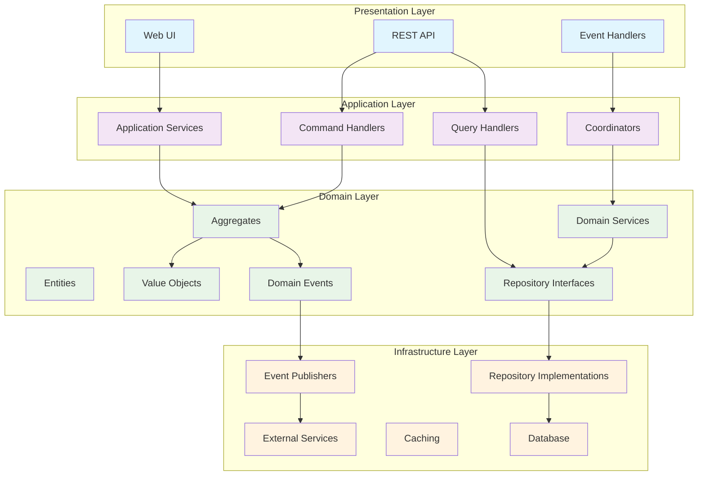

# Tactical Design - Rules Engine Domain

**Version:** 1.0.0  
**Last Updated:** 2024-12-19  
**Document Type:** Tactical Architecture Documentation  
**Target Audience:** Developers, Technical Leads, Software Architects  
**Status:** Complete

## Table of Contents

1. [Tactical Design Overview](#tactical-design-overview)
2. [Aggregate Design Patterns](#aggregate-design-patterns)
3. [Domain Service Patterns](#domain-service-patterns)
4. [Repository Patterns](#repository-patterns)
5. [Domain Event Patterns](#domain-event-patterns)
6. [Value Object Patterns](#value-object-patterns)
7. [Application Service Patterns](#application-service-patterns)
8. [Infrastructure Patterns](#infrastructure-patterns)
9. [Testing Strategies](#testing-strategies)
10. [Code Organization Standards](#code-organization-standards)

## Tactical Design Overview

### Implementation Philosophy

The Rules Engine tactical design follows these core principles:

- **Domain-Centric Implementation**: Business logic encapsulated in domain models
- **Explicit Modeling**: Domain concepts explicitly represented in code
- **Ubiquitous Language**: Code reflects business terminology
- **Testable Design**: Design supports comprehensive testing
- **Performance Optimization**: High-performance patterns for core domain

### Layered Architecture



## Aggregate Design Patterns

### Rule Aggregate Implementation

```java
@Entity
@Table(name = "rules")
public class Rule implements AggregateRoot<RuleId> {
    
    @EmbeddedId
    private RuleId id;
    
    @Embedded
    private RuleName name;
    
    @Embedded
    private DSLContent dslContent;
    
    @Enumerated(EnumType.STRING)
    private RuleStatus status;
    
    @Enumerated(EnumType.STRING)
    private Priority priority;
    
    @Embedded
    private RuleMetadata metadata;
    
    @Version
    private Long version;
    
    @Transient
    private List<DomainEvent> domainEvents = new ArrayList<>();
    
    // Business Methods
    public void activate() {
        validateCanBeActivated();
        changeStatus(RuleStatus.ACTIVE);
        addDomainEvent(new RuleActivated(this.id, this.name, Instant.now()));
    }
    
    public void deactivate(String reason) {
        validateCanBeDeactivated();
        changeStatus(RuleStatus.INACTIVE);
        addDomainEvent(new RuleDeactivated(this.id, reason, Instant.now()));
    }
    
    public void approve(UserId approver, String comments) {
        validateCanBeApproved();
        this.status = RuleStatus.APPROVED;
        this.metadata = metadata.withApproval(approver, comments);
        addDomainEvent(new RuleApproved(this.id, approver, comments, Instant.now()));
    }
    
    // Invariant Enforcement
    private void validateCanBeActivated() {
        if (!status.equals(RuleStatus.APPROVED)) {
            throw new DomainException("Rule must be approved before activation");
        }
        if (!dslContent.isValid()) {
            throw new DomainException("Rule DSL content must be valid");
        }
    }
    
    private void changeStatus(RuleStatus newStatus) {
        RuleStatus previousStatus = this.status;
        if (!isValidStatusTransition(previousStatus, newStatus)) {
            throw new DomainException(
                String.format("Invalid status transition from %s to %s", 
                    previousStatus, newStatus));
        }
        this.status = newStatus;
    }
    
    private boolean isValidStatusTransition(RuleStatus from, RuleStatus to) {
        return RuleStatusTransitions.isValidTransition(from, to);
    }
    
    // Event Management
    private void addDomainEvent(DomainEvent event) {
        this.domainEvents.add(event);
    }
    
    @Override
    public List<DomainEvent> getUncommittedEvents() {
        return Collections.unmodifiableList(domainEvents);
    }
    
    @Override
    public void markEventsAsCommitted() {
        this.domainEvents.clear();
    }
}
```

### Aggregate Factory Pattern

```java
@Component
public class RuleFactory {
    
    private final RuleValidationService validationService;
    private final RuleTemplateService templateService;
    
    public Rule createFromTemplate(CreateRuleFromTemplateCommand command) {
        RuleTemplate template = templateService.getTemplate(command.getTemplateId());
        DSLContent dslContent = template.generateDSL(command.getParameters());
        
        ValidationResult validation = validationService.validate(dslContent);
        if (!validation.isValid()) {
            throw new DomainException("Generated rule failed validation: " + 
                validation.getErrors());
        }
        
        Rule rule = new Rule(
            RuleId.generate(),
            command.getRuleName(),
            dslContent,
            RuleStatus.DRAFT,
            command.getPriority(),
            RuleMetadata.create(command.getCategory(), command.getCreatedBy())
        );
        
        rule.addDomainEvent(new RuleCreated(
            rule.getId(), 
            rule.getName(), 
            command.getCreatedBy(), 
            Instant.now()));
        
        return rule;
    }
    
    public Rule createFromScratch(CreateRuleCommand command) {
        DSLContent dslContent = DSLContent.of(command.getDslContent());
        
        ValidationResult validation = validationService.validate(dslContent);
        if (!validation.isValid()) {
            throw new DomainException("Rule DSL failed validation: " + 
                validation.getErrors());
        }
        
        return new Rule(
            RuleId.generate(),
            command.getRuleName(),
            dslContent,
            RuleStatus.DRAFT,
            command.getPriority(),
            RuleMetadata.create(command.getCategory(), command.getCreatedBy())
        );
    }
}
```

### Aggregate Repository Interface

```java
public interface RuleRepository extends Repository<Rule, RuleId> {
    
    Optional<Rule> findById(RuleId id);
    
    List<Rule> findByStatus(RuleStatus status);
    
    List<Rule> findActiveRulesForCategory(RuleCategory category);
    
    Page<Rule> findBySearchCriteria(RuleSearchCriteria criteria, Pageable pageable);
    
    void save(Rule rule);
    
    void delete(RuleId id);
    
    boolean existsByNameAndCategory(RuleName name, RuleCategory category);
    
    List<Rule> findConflictingRules(Rule rule);
}
```

## Domain Service Patterns

### Rule Validation Service

```java
@DomainService
public class RuleValidationService {
    
    private final DSLParser dslParser;
    private final ConflictDetectionService conflictDetectionService;
    
    public ValidationResult validate(DSLContent dslContent) {
        ValidationResult result = new ValidationResult();
        
        // Syntax validation
        result.addErrors(validateSyntax(dslContent));
        
        // Semantic validation
        result.addErrors(validateSemantics(dslContent));
        
        // Performance validation
        result.addWarnings(validatePerformance(dslContent));
        
        return result;
    }
    
    public ValidationResult validateWithConflictCheck(Rule rule, List<Rule> existingRules) {
        ValidationResult result = validate(rule.getDslContent());
        
        List<Conflict> conflicts = conflictDetectionService.detectConflicts(rule, existingRules);
        result.addConflicts(conflicts);
        
        return result;
    }
    
    private List<ValidationError> validateSyntax(DSLContent dslContent) {
        try {
            dslParser.parse(dslContent.getContent());
            return Collections.emptyList();
        } catch (DSLParseException e) {
            return List.of(new ValidationError(
                ValidationErrorType.SYNTAX_ERROR,
                e.getMessage(),
                e.getPosition()
            ));
        }
    }
    
    private List<ValidationError> validateSemantics(DSLContent dslContent) {
        // Validate referenced attributes exist
        // Validate function calls are correct
        // Validate data types match
        return Collections.emptyList(); // Implementation details
    }
    
    private List<ValidationWarning> validatePerformance(DSLContent dslContent) {
        ComplexityLevel complexity = dslContent.calculateComplexity();
        if (complexity.isHigher(ComplexityLevel.HIGH)) {
            return List.of(new ValidationWarning(
                "Rule complexity is high and may impact performance"
            ));
        }
        return Collections.emptyList();
    }
}
```

### Conflict Detection Service

```java
@DomainService
public class ConflictDetectionService {
    
    public List<Conflict> detectConflicts(Rule newRule, List<Rule> existingRules) {
        List<Conflict> conflicts = new ArrayList<>();
        
        for (Rule existingRule : existingRules) {
            if (hasOverlappingConditions(newRule, existingRule)) {
                ConflictType type = determineConflictType(newRule, existingRule);
                conflicts.add(new Conflict(
                    ConflictId.generate(),
                    List.of(newRule.getId(), existingRule.getId()),
                    type,
                    createConflictDescription(newRule, existingRule, type)
                ));
            }
        }
        
        return conflicts;
    }
    
    private boolean hasOverlappingConditions(Rule rule1, Rule rule2) {
        // Compare DSL conditions to determine overlap
        DSLCondition conditions1 = parseConditions(rule1.getDslContent());
        DSLCondition conditions2 = parseConditions(rule2.getDslContent());
        
        return conditions1.overlapsWith(conditions2);
    }
    
    private ConflictType determineConflictType(Rule rule1, Rule rule2) {
        if (hasSameAction(rule1, rule2)) {
            return ConflictType.DUPLICATE_ACTION;
        } else if (hasContradictoryActions(rule1, rule2)) {
            return ConflictType.CONTRADICTORY_ACTION;
        } else {
            return ConflictType.OVERLAPPING_CONDITIONS;
        }
    }
}
```

## Repository Patterns

### Base Repository Implementation

```java
@Repository
@Transactional
public class JpaRuleRepository implements RuleRepository {
    
    private final EntityManager entityManager;
    private final DomainEventPublisher eventPublisher;
    
    @Override
    public Optional<Rule> findById(RuleId id) {
        Rule rule = entityManager.find(Rule.class, id);
        return Optional.ofNullable(rule);
    }
    
    @Override
    public List<Rule> findByStatus(RuleStatus status) {
        return entityManager.createQuery(
            "SELECT r FROM Rule r WHERE r.status = :status", Rule.class)
            .setParameter("status", status)
            .getResultList();
    }
    
    @Override
    public List<Rule> findActiveRulesForCategory(RuleCategory category) {
        return entityManager.createQuery(
            "SELECT r FROM Rule r WHERE r.status = :status AND r.metadata.category = :category " +
            "ORDER BY r.priority DESC, r.createdAt ASC", Rule.class)
            .setParameter("status", RuleStatus.ACTIVE)
            .setParameter("category", category)
            .getResultList();
    }
    
    @Override
    public void save(Rule rule) {
        if (rule.getId() == null) {
            entityManager.persist(rule);
        } else {
            entityManager.merge(rule);
        }
        
        // Publish domain events
        publishDomainEvents(rule);
    }
    
    private void publishDomainEvents(Rule rule) {
        List<DomainEvent> events = rule.getUncommittedEvents();
        events.forEach(eventPublisher::publish);
        rule.markEventsAsCommitted();
    }
    
    @Override
    @Cacheable(value = "rules", key = "#criteria.hashCode()")
    public Page<Rule> findBySearchCriteria(RuleSearchCriteria criteria, Pageable pageable) {
        CriteriaBuilder cb = entityManager.getCriteriaBuilder();
        CriteriaQuery<Rule> query = cb.createQuery(Rule.class);
        Root<Rule> root = query.from(Rule.class);
        
        List<Predicate> predicates = buildPredicates(criteria, cb, root);
        query.where(predicates.toArray(new Predicate[0]));
        
        // Add sorting
        if (pageable.getSort().isSorted()) {
            List<Order> orders = buildOrderList(pageable.getSort(), cb, root);
            query.orderBy(orders);
        }
        
        TypedQuery<Rule> typedQuery = entityManager.createQuery(query);
        typedQuery.setFirstResult((int) pageable.getOffset());
        typedQuery.setMaxResults(pageable.getPageSize());
        
        List<Rule> results = typedQuery.getResultList();
        long total = countBySearchCriteria(criteria);
        
        return new PageImpl<>(results, pageable, total);
    }
}
```

### Repository Caching Strategy

```java
@Configuration
@EnableCaching
public class CacheConfiguration {
    
    @Bean
    public CacheManager cacheManager() {
        RedisCacheManager.Builder builder = RedisCacheManager
            .RedisCacheManagerBuilder
            .fromConnectionFactory(redisConnectionFactory())
            .cacheDefaults(cacheConfiguration());
        return builder.build();
    }
    
    private RedisCacheConfiguration cacheConfiguration() {
        return RedisCacheConfiguration.defaultCacheConfig()
            .entryTtl(Duration.ofMinutes(30))
            .serializeKeysWith(RedisSerializationContext.SerializationPair
                .fromSerializer(new StringRedisSerializer()))
            .serializeValuesWith(RedisSerializationContext.SerializationPair
                .fromSerializer(new GenericJackson2JsonRedisSerializer()));
    }
    
    @EventListener
    public void handleRuleActivated(RuleActivated event) {
        // Invalidate cache when rule is activated
        cacheManager.getCache("activeRules").evict(event.getRuleId());
    }
    
    @EventListener
    public void handleRuleDeactivated(RuleDeactivated event) {
        // Invalidate cache when rule is deactivated
        cacheManager.getCache("activeRules").evict(event.getRuleId());
    }
}
```

## Domain Event Patterns

### Domain Event Base Class

```java
public abstract class DomainEvent {
    
    private final String eventId;
    private final Instant occurredAt;
    private final String aggregateId;
    private final Long aggregateVersion;
    
    protected DomainEvent(String aggregateId, Long aggregateVersion) {
        this.eventId = UUID.randomUUID().toString();
        this.occurredAt = Instant.now();
        this.aggregateId = aggregateId;
        this.aggregateVersion = aggregateVersion;
    }
    
    public abstract String getEventType();
    
    // Getters
    public String getEventId() { return eventId; }
    public Instant getOccurredAt() { return occurredAt; }
    public String getAggregateId() { return aggregateId; }
    public Long getAggregateVersion() { return aggregateVersion; }
}
```

### Event Publishing Pattern

```java
@Component
public class DomainEventPublisher {
    
    private final ApplicationEventPublisher springEventPublisher;
    private final KafkaTemplate<String, DomainEvent> kafkaTemplate;
    
    @Async
    @EventListener
    public void handleDomainEvent(DomainEvent event) {
        // Publish to external systems via Kafka
        publishToExternalSystems(event);
        
        // Publish internally via Spring Events
        springEventPublisher.publishEvent(event);
    }
    
    private void publishToExternalSystems(DomainEvent event) {
        String topic = determineTopicForEvent(event);
        kafkaTemplate.send(topic, event.getAggregateId(), event);
    }
    
    private String determineTopicForEvent(DomainEvent event) {
        return "rules." + event.getEventType().replace(".", "-");
    }
}
```

### Event Handler Pattern

```java
@Component
public class RuleLifecycleEventHandler {
    
    private final CacheManager cacheManager;
    private final NotificationService notificationService;
    
    @EventListener
    @Transactional
    public void handleRuleActivated(RuleActivated event) {
        // Update cache
        invalidateRuleCache(event.getRuleId());
        
        // Send notifications
        notificationService.notifyRuleActivated(event);
        
        // Update analytics
        updateRuleAnalytics(event);
    }
    
    @EventListener
    @Transactional
    public void handleRuleApproved(RuleApproved event) {
        // Send approval notifications
        notificationService.notifyRuleApproved(event);
        
        // Update workflow status
        updateApprovalWorkflow(event);
    }
    
    private void invalidateRuleCache(RuleId ruleId) {
        cacheManager.getCache("activeRules").evict(ruleId.getValue());
        cacheManager.getCache("rulesByCategory").clear();
    }
}
```

## Value Object Patterns

### Money Value Object

```java
@Embeddable
public class Money {
    
    @Column(name = "amount", precision = 19, scale = 4)
    private BigDecimal amount;
    
    @Column(name = "currency", length = 3)
    private String currency;
    
    protected Money() {} // JPA constructor
    
    private Money(BigDecimal amount, String currency) {
        this.amount = Objects.requireNonNull(amount, "Amount cannot be null");
        this.currency = Objects.requireNonNull(currency, "Currency cannot be null");
        validateCurrency(currency);
        validateAmount(amount);
    }
    
    public static Money of(BigDecimal amount, String currency) {
        return new Money(amount, currency);
    }
    
    public static Money zero(String currency) {
        return new Money(BigDecimal.ZERO, currency);
    }
    
    public Money add(Money other) {
        validateSameCurrency(other);
        return new Money(this.amount.add(other.amount), this.currency);
    }
    
    public Money subtract(Money other) {
        validateSameCurrency(other);
        return new Money(this.amount.subtract(other.amount), this.currency);
    }
    
    public Money multiply(BigDecimal multiplier) {
        return new Money(this.amount.multiply(multiplier), this.currency);
    }
    
    public boolean isPositive() {
        return amount.compareTo(BigDecimal.ZERO) > 0;
    }
    
    public boolean isZero() {
        return amount.compareTo(BigDecimal.ZERO) == 0;
    }
    
    private void validateCurrency(String currency) {
        if (!isValidCurrencyCode(currency)) {
            throw new IllegalArgumentException("Invalid currency code: " + currency);
        }
    }
    
    private void validateAmount(BigDecimal amount) {
        if (amount.scale() > 4) {
            throw new IllegalArgumentException("Amount cannot have more than 4 decimal places");
        }
    }
    
    private void validateSameCurrency(Money other) {
        if (!this.currency.equals(other.currency)) {
            throw new IllegalArgumentException("Cannot perform operation on different currencies");
        }
    }
    
    private boolean isValidCurrencyCode(String currency) {
        try {
            Currency.getInstance(currency);
            return true;
        } catch (IllegalArgumentException e) {
            return false;
        }
    }
    
    @Override
    public boolean equals(Object o) {
        if (this == o) return true;
        if (o == null || getClass() != o.getClass()) return false;
        Money money = (Money) o;
        return Objects.equals(amount, money.amount) && Objects.equals(currency, money.currency);
    }
    
    @Override
    public int hashCode() {
        return Objects.hash(amount, currency);
    }
    
    @Override
    public String toString() {
        return String.format("%s %s", currency, amount);
    }
}
```

## Application Service Patterns

### Command Handler Pattern

```java
@Component
@Transactional
public class RuleCommandHandler {
    
    private final RuleRepository ruleRepository;
    private final RuleFactory ruleFactory;
    private final RuleValidationService validationService;
    
    @CommandHandler
    public RuleId handle(CreateRuleCommand command) {
        // Validate command
        validateCreateRuleCommand(command);
        
        // Check for duplicates
        if (ruleRepository.existsByNameAndCategory(command.getRuleName(), command.getCategory())) {
            throw new DuplicateRuleException("Rule with same name already exists in category");
        }
        
        // Create rule
        Rule rule = ruleFactory.createFromScratch(command);
        
        // Save rule
        ruleRepository.save(rule);
        
        return rule.getId();
    }
    
    @CommandHandler
    public void handle(ActivateRuleCommand command) {
        Rule rule = ruleRepository.findById(command.getRuleId())
            .orElseThrow(() -> new RuleNotFoundException(command.getRuleId()));
        
        // Check for conflicts with active rules
        List<Rule> activeRules = ruleRepository.findActiveRulesForCategory(rule.getCategory());
        ValidationResult validation = validationService.validateWithConflictCheck(rule, activeRules);
        
        if (validation.hasErrors()) {
            throw new RuleValidationException("Cannot activate rule due to validation errors", 
                validation.getErrors());
        }
        
        // Activate rule
        rule.activate();
        
        // Save changes
        ruleRepository.save(rule);
    }
    
    private void validateCreateRuleCommand(CreateRuleCommand command) {
        if (command.getRuleName() == null || command.getRuleName().isEmpty()) {
            throw new IllegalArgumentException("Rule name is required");
        }
        if (command.getDslContent() == null || command.getDslContent().isEmpty()) {
            throw new IllegalArgumentException("DSL content is required");
        }
        // Additional validation...
    }
}
```

### Query Handler Pattern

```java
@Component
@Transactional(readOnly = true)
public class RuleQueryHandler {
    
    private final RuleRepository ruleRepository;
    private final RuleMapper ruleMapper;
    
    @QueryHandler
    public RuleDetailsView handle(GetRuleDetailsQuery query) {
        Rule rule = ruleRepository.findById(query.getRuleId())
            .orElseThrow(() -> new RuleNotFoundException(query.getRuleId()));
        
        return ruleMapper.toDetailsView(rule);
    }
    
    @QueryHandler
    @Cacheable(value = "ruleSearch", key = "#query.hashCode()")
    public Page<RuleListView> handle(SearchRulesQuery query) {
        RuleSearchCriteria criteria = buildSearchCriteria(query);
        Pageable pageable = PageRequest.of(
            query.getPage(), 
            query.getSize(), 
            query.getSort()
        );
        
        Page<Rule> rules = ruleRepository.findBySearchCriteria(criteria, pageable);
        return rules.map(ruleMapper::toListView);
    }
    
    private RuleSearchCriteria buildSearchCriteria(SearchRulesQuery query) {
        return RuleSearchCriteria.builder()
            .name(query.getName())
            .status(query.getStatus())
            .category(query.getCategory())
            .createdBy(query.getCreatedBy())
            .createdDateRange(query.getCreatedDateRange())
            .build();
    }
}
```

## Testing Strategies

### Domain Model Testing

```java
@ExtendWith(MockitoExtension.class)
class RuleTest {
    
    @Test
    void shouldActivateApprovedRule() {
        // Given
        Rule rule = createApprovedRule();
        
        // When
        rule.activate();
        
        // Then
        assertThat(rule.getStatus()).isEqualTo(RuleStatus.ACTIVE);
        assertThat(rule.getUncommittedEvents()).hasSize(1);
        assertThat(rule.getUncommittedEvents().get(0)).isInstanceOf(RuleActivated.class);
    }
    
    @Test
    void shouldThrowExceptionWhenActivatingDraftRule() {
        // Given
        Rule rule = createDraftRule();
        
        // When & Then
        assertThatThrownBy(rule::activate)
            .isInstanceOf(DomainException.class)
            .hasMessage("Rule must be approved before activation");
    }
    
    private Rule createApprovedRule() {
        return Rule.builder()
            .id(RuleId.generate())
            .name(RuleName.of("Test Rule"))
            .dslContent(DSLContent.of("category = 'electronics'"))
            .status(RuleStatus.APPROVED)
            .priority(Priority.MEDIUM)
            .build();
    }
}
```

### Integration Testing

```java
@SpringBootTest
@Transactional
class RuleRepositoryIntegrationTest {
    
    @Autowired
    private RuleRepository ruleRepository;
    
    @Autowired
    private TestEntityManager entityManager;
    
    @Test
    void shouldFindActiveRulesForCategory() {
        // Given
        Rule activeRule = createAndSaveRule(RuleStatus.ACTIVE, RuleCategory.PROMOTIONS);
        Rule inactiveRule = createAndSaveRule(RuleStatus.INACTIVE, RuleCategory.PROMOTIONS);
        entityManager.flush();
        
        // When
        List<Rule> activeRules = ruleRepository.findActiveRulesForCategory(RuleCategory.PROMOTIONS);
        
        // Then
        assertThat(activeRules).hasSize(1);
        assertThat(activeRules.get(0).getId()).isEqualTo(activeRule.getId());
    }
    
    @Test
    void shouldCacheSearchResults() {
        // Given
        RuleSearchCriteria criteria = RuleSearchCriteria.builder()
            .status(RuleStatus.ACTIVE)
            .build();
        Pageable pageable = PageRequest.of(0, 10);
        
        // When
        Page<Rule> firstCall = ruleRepository.findBySearchCriteria(criteria, pageable);
        Page<Rule> secondCall = ruleRepository.findBySearchCriteria(criteria, pageable);
        
        // Then
        assertThat(firstCall).isEqualTo(secondCall);
        // Verify cache hit through metrics or manual verification
    }
}
```

## Code Organization Standards

### Package Structure

```
src/main/java/com/company/rules/
├── domain/
│   ├── model/
│   │   ├── rule/                      # Rule aggregate
│   │   │   ├── Rule.java
│   │   │   ├── RuleId.java
│   │   │   ├── RuleName.java
│   │   │   ├── DSLContent.java
│   │   │   └── RuleStatus.java
│   │   ├── template/                  # Template aggregate
│   │   └── workflow/                  # Workflow aggregate
│   ├── service/                       # Domain services
│   │   ├── RuleValidationService.java
│   │   ├── ConflictDetectionService.java
│   │   └── RuleFactory.java
│   ├── event/                         # Domain events
│   │   ├── RuleCreated.java
│   │   ├── RuleActivated.java
│   │   └── RuleApproved.java
│   └── repository/                    # Repository interfaces
│       ├── RuleRepository.java
│       └── RuleTemplateRepository.java
├── application/
│   ├── service/                       # Application services
│   ├── command/                       # Commands and handlers
│   └── query/                         # Queries and handlers
├── infrastructure/
│   ├── repository/                    # Repository implementations
│   ├── messaging/                     # Event publishing
│   ├── web/                          # REST controllers
│   └── config/                       # Configuration
└── shared/                           # Shared kernel (if applicable)
    ├── event/
    ├── exception/
    └── util/
```

### Naming Conventions

#### Domain Models
- **Aggregates**: Noun (e.g., `Rule`, `RuleTemplate`)
- **Value Objects**: Descriptive noun (e.g., `RuleId`, `DSLContent`, `Money`)
- **Enums**: Noun (e.g., `RuleStatus`, `Priority`)
- **Domain Services**: Service + domain concept (e.g., `RuleValidationService`)
- **Domain Events**: Past tense verb (e.g., `RuleCreated`, `RuleActivated`)

#### Application Layer
- **Commands**: Imperative verb (e.g., `CreateRuleCommand`, `ActivateRuleCommand`)
- **Queries**: Question format (e.g., `GetRuleDetailsQuery`, `SearchRulesQuery`)
- **Handlers**: Handler + command/query name (e.g., `CreateRuleCommandHandler`)

#### Infrastructure
- **Repositories**: Domain name + Repository (e.g., `JpaRuleRepository`)
- **Controllers**: Domain name + Controller (e.g., `RuleController`)
- **Configurations**: Purpose + Configuration (e.g., `CacheConfiguration`)

This tactical design provides concrete implementation patterns and guidelines for building the Rules Engine domain using Domain-Driven Design principles while maintaining high code quality and testability.
