# Bounded Contexts Overview - Rules Engine Domain

**Extracted from PRD Sources**: `02-general-description/`, `dependencies.md`, `feature.md`, `functional-tests.md` from all features

## Context Map Overview

The Rules Engine domain is organized into multiple bounded contexts that work together to provide comprehensive rule management and evaluation capabilities. Each context has clear responsibilities and well-defined integration patterns based on the dependency analysis from the PRD.

```mermaid
graph TB
    subgraph "Core Domain Contexts"
        RM[Rules Management<br/>📝 Rule Lifecycle<br/>🔄 Approval Workflow<br/>📋 Template System]
        RC[Rules Calculation<br/>⚡ Core Evaluation Engine<br/>🔧 Conflict Resolution<br/>📊 Performance Optimization]
        RE[Rules Evaluation<br/>🌐 External API Services<br/>📡 Integration Gateway<br/>⚖️ Load Balancing]
    end
    
    subgraph "Supporting Domain Contexts"
        PROM[Promotions<br/>🎯 Discount Rules<br/>🏷️ Campaign Management<br/>💰 Benefit Calculation]
        LOY[Loyalty<br/>⭐ Points Rules<br/>🏆 Tier Management<br/>🎁 Rewards Calculation]
        COUP[Coupons<br/>🎫 Validation Rules<br/>🔒 Usage Tracking<br/>🛡️ Fraud Prevention]
        TAX[Taxes & Fees<br/>📍 Jurisdiction Rules<br/>💸 Tax Calculation<br/>📋 Compliance Reporting]
        CALC[Rule Evaluator/Calculator<br/>🔢 Calculation Engine<br/>⚡ High Performance<br/>🔄 Multi-Domain Processing]
    end
    
    subgraph "Generic Domain Contexts"
        AUTH[Authentication<br/>🔐 User Management<br/>🛡️ OAuth 2.0/JWT<br/>🎫 Session Management]
        INT[Integration<br/>🔌 External Systems<br/>📡 Data Sync<br/>🔄 Protocol Translation]
        AUDIT[Audit & Compliance<br/>📊 Event Logging<br/>📋 Compliance Tracking<br/>🗂️ Audit Reports]
    end
    
    %% Core Domain Relationships - Customer/Supplier
    RM -.->|Customer/Supplier<br/>📤 Rule Definitions<br/>📝 Lifecycle Events<br/>✅ Validation Requests| RC
    RC -.->|Customer/Supplier<br/>⚡ Evaluation Results<br/>📊 Performance Data<br/>🔄 Cache Updates| RE
    
    %% Shared Kernel Relationship
    RC -.->|Shared Kernel<br/>🔢 Calculation Algorithms<br/>⚡ Performance Libraries<br/>🧮 Core Math Functions| CALC
    
    %% Open Host Service Relationships
    RC -.->|Open Host Service<br/>🎯 Evaluation API<br/>📊 Rule Results<br/>🔄 Event Notifications| PROM
    RC -.->|Open Host Service<br/>⭐ Evaluation API<br/>🏆 Points Calculation<br/>📈 Performance Data| LOY
    RC -.->|Open Host Service<br/>🎫 Validation API<br/>🔒 Usage Verification<br/>📊 Fraud Detection| COUP
    RC -.->|Open Host Service<br/>💸 Calculation API<br/>📍 Jurisdiction Processing<br/>📋 Compliance Data| TAX
    
    %% Supporting Domain Relationships - Partner
    PROM -.->|Partner<br/>🤝 Cross-Promotion Rules<br/>⭐ Loyalty Integration<br/>📊 Shared Analytics| LOY
    COUP -.->|Customer/Supplier<br/>🎫 Coupon Promotions<br/>💰 Discount Integration<br/>📈 Campaign Data| PROM
    
    %% Generic Domain Relationships
    RM -.->|Conformist<br/>🔐 Auth Integration<br/>👤 User Sessions<br/>🛡️ Security Compliance| AUTH
    RE -.->|Anti-Corruption Layer<br/>🔌 Protocol Translation<br/>📡 Data Transformation<br/>🛡️ External Isolation| INT
    
    %% Published Language Relationships - Audit
    RM -.->|Published Language<br/>📝 Rule Events<br/>👤 User Actions<br/>🔄 Status Changes| AUDIT
    RC -.->|Published Language<br/>⚡ Evaluation Events<br/>📊 Performance Metrics<br/>⚠️ Error Events| AUDIT
    RE -.->|Published Language<br/>🌐 API Events<br/>📡 Integration Events<br/>📊 Usage Metrics| AUDIT
    
    %% Separate Ways Relationship
    TAX -.->|Separate Ways<br/>🚫 No Direct Integration<br/>📋 Independent Compliance<br/>💸 Separate Tax Logic| COUP
    
    classDef coreContext fill:#ff6b6b,stroke:#c92a2a,stroke-width:3px,color:#fff
    classDef supportingContext fill:#4ecdc4,stroke:#26a69a,stroke-width:2px,color:#fff
    classDef genericContext fill:#ffe066,stroke:#ffd43b,stroke-width:2px,color:#000
    
    class RM,RC,RE coreContext
    class PROM,LOY,COUP,TAX,CALC supportingContext
    class AUTH,INT,AUDIT genericContext
```



## Context Relationship Patterns

### Core Domain Integration Patterns

#### Customer/Supplier Pattern: Rules Management → Rules Calculation
**Extracted from**: FEAT-0001 dependencies on FEAT-0002 for rule testing functionality

- **Upstream Context**: Rules Management (Supplier)
- **Downstream Context**: Rules Calculation (Customer)
- **Integration Method**: Domain Events + REST APIs
- **Data Flow**: Rule definitions, lifecycle events, validation requests
- **Responsibilities**: 
  - **Rules Management**: Provides validated, approved rules ready for evaluation
  - **Rules Calculation**: Consumes rules for evaluation processing and testing

**Integration Points** (from dependency analysis):
- Rule testing requires evaluation engine (FEAT-0001 → FEAT-0002 strong dependency)
- Performance analysis depends on evaluation metrics
- Conflict detection uses evaluation logic
- Rule validation service integration

#### Customer/Supplier Pattern: Rules Calculation → Rules Evaluation
**Extracted from**: System architecture showing evaluation services consuming calculation results

- **Upstream Context**: Rules Calculation (Supplier)
- **Downstream Context**: Rules Evaluation (Customer)
- **Integration Method**: Synchronous API calls + Performance Events
- **Data Flow**: Evaluation requests, results, performance metrics
- **Responsibilities**: 
  - **Rules Calculation**: Provides high-performance rule evaluation capabilities
  - **Rules Evaluation**: Formats requests and responses for external systems

### Supporting Domain Integration Patterns

#### Shared Kernel Pattern: Rules Calculation ↔ Rule Evaluator/Calculator
**Extracted from**: FEAT-0005 dependencies showing shared calculation components

- **Shared Model**: Core evaluation algorithms, calculation engines, performance libraries
- **Team Coordination**: Joint ownership of calculation logic (from FEAT-0005 dependencies)
- **Change Management**: Coordinated releases and testing
- **Testing Strategy**: Shared test suites and validation

**Shared Components**:
- High-performance calculation algorithms
- Conflict resolution strategies
- Performance optimization libraries
- Mathematical operation frameworks

#### Open Host Service Pattern: Rules Calculation → Domain-Specific Contexts
**Extracted from**: Multiple feature dependencies on core evaluation services

- **Service Provider**: Rules Calculation (Host)
- **Published Language**: Standardized evaluation API
- **Service Consumers**: Promotions, Loyalty, Coupons, Taxes & Fees
- **Version Management**: Backward-compatible API evolution

**API Specification** (derived from integration requirements):
```yaml
EvaluateRules:
  endpoint: POST /api/v1/evaluation/evaluate
  timeout: 500ms
  authentication: JWT
  rate_limit: 1000/minute/context

GetRuleDetails:
  endpoint: GET /api/v1/evaluation/rules/{ruleId}
  timeout: 200ms
  cache_ttl: 300s
```

### Generic Domain Integration Patterns

#### Conformist Pattern: Rules Management → Authentication
**Extracted from**: FEAT-0001 dependencies on Authentication Service (OAuth 2.0/JWT)

- **Upstream Context**: Authentication (Dominant - Enterprise Standard)
- **Downstream Context**: Rules Management (Conforming)
- **Constraints**: Must use enterprise OAuth 2.0/SAML standards
- **Adaptation Strategy**: Implement standard authentication client

**Integration Details** (from dependencies.md):
- OAuth 2.0 Provider with JWT tokens
- Role-based access control integration
- Session management and timeout handling
- Enterprise directory integration (LDAP/Active Directory)

#### Anti-Corruption Layer Pattern: Rules Evaluation → Integration
**Extracted from**: Multiple external system dependencies requiring protocol translation

- **External Systems**: POS Systems, E-commerce Platforms, CRM Systems (from general description)
- **Translation Logic**: Protocol translation, data format conversion
- **Isolation Strategy**: Prevent external changes from affecting core domain
- **Maintenance**: Dedicated integration team responsibility

**Protected Internal Model**:
- Core Rules Engine domain model remains stable
- External system changes absorbed by ACL
- Consistent internal API regardless of external variations

#### Published Language Pattern: Core Contexts → Audit & Compliance
**Extracted from**: Compliance requirements and audit logging dependencies

- **Service Providers**: Rules Management, Rules Calculation, Rules Evaluation
- **Published Language**: Standardized audit event format
- **Consuming Context**: Audit & Compliance
- **Stability Guarantee**: Audit event schema backward compatibility

**Event Schema** (derived from compliance requirements):
```yaml
AuditEvent:
  eventId: string
  eventType: string
  timestamp: datetime
  contextName: string
  aggregateId: string
  userId: string
  eventData: object
  compliance:
    sox: boolean
    gdpr: boolean
    retention: duration
```

## Context Boundaries and Responsibilities

### Core Domain Contexts

#### Rules Management Context
**Extracted from**: FEAT-0001 (Rule Creation and Management)

- **Primary Responsibility**: Rule lifecycle management and governance
- **Key Capabilities**:
  - Rule creation and editing with DSL support (US-0001, US-0002)
  - Template management and reuse (US-0003)
  - Approval workflow orchestration (US-0008)
  - Version control and audit trails (US-0009)
- **Team Ownership**: Business Rules Engineering Team
- **Technology Stack**: Java Spring Boot, PostgreSQL, Redis Cache

**Context Boundaries**:
- **Included**: Rule metadata, DSL content, templates, approval workflows, user interfaces
- **Excluded**: Rule execution, performance optimization, external integrations

#### Rules Calculation Context
**Extracted from**: FEAT-0002 (Rule Evaluation Engine) and FEAT-0005 (Rule Evaluator/Calculator)

- **Primary Responsibility**: Core rule evaluation and calculation engine
- **Key Capabilities**:
  - High-performance rule evaluation (<500ms)
  - Conflict detection and resolution
  - Result calculation and aggregation
  - Performance optimization and caching
- **Team Ownership**: Core Engine Team
- **Technology Stack**: Java with performance optimizations, In-Memory Computing

**Context Boundaries**:
- **Included**: Evaluation algorithms, conflict resolution, performance monitoring, caching
- **Excluded**: Rule creation interfaces, external API management, approval workflows

#### Rules Evaluation Context
**Extracted from**: System integration requirements and external API needs

- **Primary Responsibility**: External-facing rule evaluation services
- **Key Capabilities**:
  - REST API for rule evaluation requests
  - Response formatting and protocol handling
  - Rate limiting and throttling
  - Integration monitoring and health checks
- **Team Ownership**: API and Integration Team
- **Technology Stack**: Java Spring Boot, API Gateway, Load Balancers

**Context Boundaries**:
- **Included**: External APIs, integration protocols, load balancing, monitoring
- **Excluded**: Rule logic, conflict resolution, rule management interfaces

### Supporting Domain Contexts

#### Promotions Context
**Extracted from**: Business requirements for promotional rule management

- **Primary Responsibility**: Promotional rule management and execution
- **Key Capabilities**:
  - Promotion-specific rule templates (discount rules from US-0001)
  - Discount calculation algorithms
  - Promotion eligibility verification
  - Campaign management integration
- **Team Ownership**: Marketing Technology Team

#### Loyalty Context
**Extracted from**: Business requirements for loyalty program rules

- **Primary Responsibility**: Loyalty program rules and point calculations
- **Key Capabilities**:
  - Loyalty rule templates and patterns (points rules from US-0002)
  - Points earning and redemption calculations
  - Tier management and progression
  - Loyalty program integration
- **Team Ownership**: Loyalty Platform Team

#### Coupons Context
**Extracted from**: Business requirements for coupon validation

- **Primary Responsibility**: Coupon validation and redemption rules
- **Key Capabilities**:
  - Coupon-specific rule patterns
  - Validation and redemption logic
  - Usage tracking and limits
  - Fraud prevention measures
- **Team Ownership**: E-commerce Platform Team

#### Taxes & Fees Context
**Extracted from**: FEAT-0004 (Taxes and Fees)

- **Primary Responsibility**: Tax and fee calculation with jurisdiction awareness
- **Key Capabilities**:
  - Multi-jurisdiction tax rules
  - Fee calculation algorithms
  - Compliance validation
  - Regulatory reporting
- **Team Ownership**: Financial Systems Team

### Generic Domain Contexts

#### Authentication Context
**Extracted from**: Security dependencies across all features

- **Primary Responsibility**: User authentication and authorization
- **Key Capabilities**:
  - OAuth 2.0/JWT token management
  - Role-based access control
  - Session management
  - Enterprise directory integration
- **Team Ownership**: Security Team

#### Integration Context
**Extracted from**: External system dependencies

- **Primary Responsibility**: External system integration and data synchronization
- **Key Capabilities**:
  - Protocol translation and data transformation
  - External API management
  - Data synchronization
  - Integration monitoring
- **Team Ownership**: Integration Team

#### Audit & Compliance Context
**Extracted from**: Compliance requirements (SOX, GDPR) from dependencies

- **Primary Responsibility**: Audit logging and compliance tracking
- **Key Capabilities**:
  - Comprehensive event logging
  - Compliance report generation
  - Audit trail maintenance
  - Regulatory reporting
- **Team Ownership**: Compliance Team

## Context Evolution Strategy

### Short-Term Evolution (6-12 months)

#### Context Boundary Refinement
- **Rules Management**: Enhance template management capabilities and user experience
- **Rules Calculation**: Optimize conflict resolution algorithms and performance
- **Rules Evaluation**: Improve API performance and integration monitoring

#### Integration Pattern Enhancement
- **Event Sourcing**: Implement event sourcing for complete audit trails
- **CQRS**: Separate read/write models for performance optimization
- **Saga Pattern**: Orchestrate complex approval workflows

### Medium-Term Evolution (1-2 years)

#### Context Specialization
- **Domain-Specific Optimization**: Specialized engines for each supporting context
- **Advanced Analytics**: Dedicated analytics context for rule performance
- **ML Integration**: Machine learning context for rule optimization

#### New Context Introduction
- **Rule Analytics Context**: Comprehensive analytics and reporting
- **Rule Testing Context**: Advanced testing and simulation capabilities
- **Customer Context**: Customer data management and segmentation

### Long-Term Evolution (2+ years)

#### Context Federation
- **Multi-Tenant Architecture**: Support for multiple organizations
- **Context Marketplace**: Shareable contexts across organizations
- **Cloud-Native Contexts**: Serverless and event-driven architectures

#### Advanced Integration Patterns
- **Event Mesh**: Advanced event routing and processing
- **Context Composition**: Dynamic context composition for complex scenarios
- **Self-Healing Systems**: Autonomous context recovery and optimization

## Organizational Alignment

### Team Structure and Context Ownership

#### Core Domain Teams
- **Business Rules Team**: Rules Management Context
  - Business Analysts, Rule Designers, Workflow Engineers
- **Core Engine Team**: Rules Calculation + Rule Evaluator/Calculator Contexts
  - Performance Engineers, Algorithm Specialists, System Architects
- **API Integration Team**: Rules Evaluation Context
  - API Developers, Integration Engineers, DevOps Engineers

#### Supporting Domain Teams
- **Marketing Technology Team**: Promotions Context
- **Loyalty Platform Team**: Loyalty Context
- **E-commerce Platform Team**: Coupons Context
- **Financial Systems Team**: Taxes & Fees Context

#### Platform Teams
- **Security Team**: Authentication Context
- **Infrastructure Team**: Integration Context
- **Compliance Team**: Audit & Compliance Context

### Communication and Coordination

#### Context Team Communication
- **Weekly Sync**: Cross-context coordination meetings
- **Monthly Review**: Context boundary and integration review
- **Quarterly Planning**: Strategic alignment and evolution planning

#### Integration Governance
- **API Standards**: Consistent API design across contexts
- **Event Standards**: Standardized event schemas and patterns
- **Data Standards**: Common data formats and validation rules

#### Change Management
- **Context Evolution**: Coordinated context boundary changes
- **Integration Updates**: Managed integration pattern evolution
- **Team Restructuring**: Organizational changes with context alignment

This bounded contexts overview provides the strategic framework for organizing the Rules Engine domain into manageable, cohesive units while maintaining clear integration patterns and evolutionary paths, all derived from the comprehensive PRD analysis.