# Context Map - Rules Engine Domain

**Extracted from PRD Sources**: `dependencies.md` files, `02-general-description/`, `feature.md` integration requirements, system architecture

## Context Relationships Overview

The Rules Engine domain consists of multiple bounded contexts that collaborate to provide comprehensive rule management and evaluation capabilities. This context map defines the relationships, integration patterns, and data flows between all contexts based on the detailed dependency analysis from the PRD.

```mermaid
graph TB
    subgraph "Core Domain"
        direction TB
        RM[Rules Management<br/>📝 Rule Lifecycle<br/>🔄 Approval Workflow<br/>📋 Template Management]
        RC[Rules Calculation<br/>⚡ Core Evaluation Engine<br/>🔧 Conflict Resolution<br/>📊 Performance Optimization]
        RE[Rules Evaluation<br/>🌐 External API<br/>📡 Integration Services<br/>⚖️ Load Balancing]
    end
    
    subgraph "Supporting Domains"
        direction TB
        PROM[Promotions<br/>🎯 Discount Rules<br/>🏷️ Campaign Management<br/>💰 Benefit Calculation]
        LOY[Loyalty<br/>⭐ Points Rules<br/>🏆 Tier Management<br/>🎁 Rewards Calculation]
        COUP[Coupons<br/>🎫 Validation Rules<br/>🔒 Usage Tracking<br/>🛡️ Fraud Prevention]
        TAX[Taxes & Fees<br/>📍 Jurisdiction Rules<br/>💸 Tax Calculation<br/>📋 Compliance Reporting]
        PAY[Payments<br/>💳 Payment Rules<br/>🔒 Fraud Detection<br/>🌐 Multi-Gateway]
        CALC[Rule Evaluator/Calculator<br/>🔢 Calculation Engine<br/>⚡ High Performance<br/>🔄 Multi-Domain Processing]
    end
    
    subgraph "Generic Domains"
        direction TB
        AUTH[Authentication<br/>🔐 User Management<br/>🛡️ Security<br/>🎫 Token Management]
        INT[Integration<br/>🔌 External Systems<br/>📡 Data Sync<br/>🔄 Protocol Translation]
        AUDIT[Audit & Compliance<br/>📊 Event Logging<br/>📋 Compliance Tracking<br/>🗂️ Audit Reports]
    end
    
    %% Core Domain Relationships - Customer/Supplier
    RM -.->|Customer/Supplier<br/>📤 Rule Definitions<br/>📝 Lifecycle Events<br/>✅ Validation Requests| RC
    RC -.->|Customer/Supplier<br/>⚡ Evaluation Requests<br/>📊 Performance Metrics<br/>🔄 Cache Updates| RE
    
    %% Shared Kernel Relationship
    RC -.->|Shared Kernel<br/>🔢 Calculation Algorithms<br/>⚡ Performance Libraries<br/>🧮 Core Math Functions| CALC
    
    %% Open Host Service Relationships
    RC -.->|Open Host Service<br/>🎯 Evaluation API<br/>📊 Rule Results<br/>🔄 Event Notifications| PROM
    RC -.->|Open Host Service<br/>⭐ Evaluation API<br/>🏆 Points Calculation<br/>📈 Performance Data| LOY
    RC -.->|Open Host Service<br/>🎫 Validation API<br/>🔒 Usage Verification<br/>📊 Fraud Detection| COUP
    RC -.->|Open Host Service<br/>💸 Calculation API<br/>📍 Jurisdiction Processing<br/>📋 Compliance Data| TAX
    RC -.->|Open Host Service<br/>💳 Payment Rules API<br/>🔒 Fraud Assessment<br/>⚡ Real-time Validation| PAY
    
    %% Supporting Domain Relationships - Partner
    PROM -.->|Partner<br/>🤝 Cross-Promotion Rules<br/>⭐ Loyalty Integration<br/>📊 Shared Analytics| LOY
    COUP -.->|Customer/Supplier<br/>🎫 Coupon Promotions<br/>💰 Discount Integration<br/>📈 Campaign Data| PROM
    LOY -.->|Customer/Supplier<br/>🎁 Loyalty Rewards<br/>⭐ Points Redemption<br/>🛍️ Purchase Benefits| COUP
    PAY -.->|Anti-Corruption Layer<br/>💳 Payment Processing<br/>🔒 Fraud Prevention<br/>🌐 Gateway Integration| INT
    
    %% Generic Domain Relationships
    RM -.->|Conformist<br/>🔐 Auth Integration<br/>👤 User Sessions<br/>🛡️ Security Compliance| AUTH
    RE -.->|Anti-Corruption Layer<br/>🔌 Protocol Translation<br/>📡 Data Transformation<br/>🛡️ External Isolation| INT
    
    %% Published Language Relationships - Audit
    RM -.->|Published Language<br/>📝 Rule Events<br/>👤 User Actions<br/>🔄 Status Changes| AUDIT
    RC -.->|Published Language<br/>⚡ Evaluation Events<br/>📊 Performance Metrics<br/>⚠️ Error Events| AUDIT
    RE -.->|Published Language<br/>🌐 API Events<br/>📡 Integration Events<br/>📊 Usage Metrics| AUDIT
    
    %% Separate Ways Relationship
    TAX -.->|Separate Ways<br/>🚫 No Direct Integration<br/>📋 Independent Compliance<br/>💸 Separate Tax Logic| COUP
    
    classDef coreContext fill:#ff6b6b,stroke:#c92a2a,stroke-width:3px,color:#fff
    classDef supportingContext fill:#4ecdc4,stroke:#26a69a,stroke-width:2px,color:#fff
    classDef genericContext fill:#ffe066,stroke:#ffd43b,stroke-width:2px,color:#000
    
    class RM,RC,RE coreContext
    class PROM,LOY,COUP,TAX,CALC supportingContext
    class AUTH,INT,AUDIT genericContext
```



## Integration Patterns Detailed

### 1. Customer/Supplier Pattern

#### Rules Management → Rules Calculation
**Pattern**: Customer/Supplier  
**Direction**: Rules Management (Upstream/Supplier) → Rules Calculation (Downstream/Customer)  
**Extracted from**: FEAT-0001 dependencies on FEAT-0002 for rule testing and validation

**Integration Details**:
- **Method**: Domain Events + Synchronous API calls
- **Data Exchange**:
  - **Rules Definitions**: Validated and approved rule specifications with DSL content
  - **Lifecycle Events**: Rule creation, updates, activation, deactivation events
  - **Validation Requests**: Real-time validation for rule syntax and semantics
  - **Testing Requests**: Rule testing with sample data for verification

**Responsibilities**:
- **Rules Management (Supplier)**:
  - Provides validated, approved rules ready for evaluation
  - Publishes rule lifecycle events for cache management (RuleActivated, RuleDeactivated)
  - Ensures rule quality through approval workflow
  - Maintains rule versioning and audit trails

- **Rules Calculation (Customer)**:
  - Consumes approved rules for evaluation processing
  - Subscribes to rule lifecycle events for cache invalidation
  - Provides rule testing services for rule creation process
  - Adapts to rule format and schema changes

**Event Contracts** (derived from domain events):
```yaml
RuleActivated:
  ruleId: string
  ruleName: string
  dslContent: string
  priority: enum[CRITICAL, HIGH, MEDIUM, LOW]
  effectiveFrom: datetime
  effectiveTo: datetime
  category: string
  activatedBy: string

RuleDeactivated:
  ruleId: string
  deactivatedAt: datetime
  reason: string
  deactivatedBy: string
```

**API Contracts** (derived from testing requirements):
```yaml
ValidateRule:
  endpoint: POST /api/internal/v1/rules/validate
  timeout: 2s
  request:
    ruleId: string
    dslContent: string
    context: object
  response:
    isValid: boolean
    errors: array[ValidationError]
    warnings: array[ValidationWarning]
    performanceImpact: PerformanceAssessment

TestRule:
  endpoint: POST /api/internal/v1/rules/test
  timeout: 3s
  request:
    ruleId: string
    testData: TransactionContext
  response:
    executionResult: EvaluationResult
    executionTime: duration
    appliedActions: array[string]
```

#### Rules Calculation → Rules Evaluation
**Pattern**: Customer/Supplier  
**Direction**: Rules Calculation (Upstream/Supplier) → Rules Evaluation (Downstream/Customer)  
**Extracted from**: System architecture and external API requirements

**Integration Details**:
- **Method**: Synchronous API calls + Performance Events
- **Data Exchange**:
  - **Evaluation Requests**: Transaction data formatted for rule processing
  - **Evaluation Results**: Calculated benefits, discounts, and actions
  - **Performance Metrics**: Response times, throughput, error rates
  - **Cache Coordination**: Cache invalidation and warming events

**Responsibilities**:
- **Rules Calculation (Supplier)**:
  - Provides high-performance rule evaluation capabilities (<500ms SLA)
  - Maintains sub-500ms response time SLA for 95% of requests
  - Publishes performance and health metrics
  - Handles conflict resolution and result aggregation

- **Rules Evaluation (Customer)**:
  - Formats external requests for internal evaluation
  - Handles rate limiting and throttling (1000+ TPS)
  - Transforms results for external system consumption
  - Monitors and reports API performance

**Performance SLA** (extracted from success criteria):
- Response Time: <500ms for 95% of evaluation requests
- Throughput: 1000+ transactions per second sustained
- Availability: 99.9% uptime
- Error Rate: <0.1% of evaluation requests

### 2. Shared Kernel Pattern

#### Rules Calculation ↔ Rule Evaluator/Calculator
**Pattern**: Shared Kernel  
**Direction**: Bidirectional collaboration  
**Extracted from**: FEAT-0005 dependencies showing shared calculation components

**Shared Components**:
- **Calculation Algorithms**: Core mathematical and logical operations for all rule types
- **Performance Libraries**: Optimization utilities and caching mechanisms
- **Data Structures**: Shared evaluation context and result structures
- **Conflict Resolution**: Common conflict detection and resolution algorithms
- **Test Suites**: Common validation and performance test frameworks

**Team Coordination**:
- **Joint Ownership**: Both Core Engine Team and Calculator Team co-own shared kernel
- **Coordinated Releases**: Changes require approval from both teams
- **Shared Documentation**: Common API documentation and specifications
- **Integration Testing**: Comprehensive test coverage for shared components

**Change Management**:
- **Backward Compatibility**: All changes must maintain API compatibility
- **Version Synchronization**: Coordinated versioning across contexts
- **Impact Assessment**: Cross-team impact analysis for changes
- **Release Coordination**: Synchronized deployment procedures

**Shared Interfaces**:
```java
// Shared calculation interface
public interface CalculationEngine {
    EvaluationResult evaluate(EvaluationContext context, List<Rule> rules);
    ConflictResolution resolveConflicts(List<RuleExecution> executions);
    PerformanceMetrics getPerformanceMetrics();
}

// Shared optimization interface
public interface PerformanceOptimizer {
    OptimizedRuleSet optimizeRules(List<Rule> rules);
    CacheStrategy getCacheStrategy(RuleCategory category);
    ExecutionPlan createExecutionPlan(List<Rule> rules);
}
```

### 3. Open Host Service Pattern

#### Rules Calculation → Supporting Domains
**Pattern**: Open Host Service  
**Host**: Rules Calculation  
**Clients**: Promotions, Loyalty, Coupons, Taxes & Fees  
**Extracted from**: Multiple feature dependencies on core evaluation services

**Published Language**: Standardized Rule Evaluation API

**Service Interface**:
```yaml
EvaluateRules:
  endpoint: POST /api/v1/evaluation/evaluate
  timeout: 500ms
  authentication: JWT
  rate_limit: 1000/minute/context
  request:
    transactionId: string
    customerId: string
    contextData: object
    ruleFilters:
      categories: array[string]
      priorities: array[Priority]
      effectiveDate: datetime
  response:
    evaluationId: string
    appliedRules: array[RuleExecution]
    totalBenefit: Money
    conflicts: array[Conflict]
    executionTime: duration
    performance:
      cacheHitRate: percentage
      rulesEvaluated: integer

GetRuleDetails:
  endpoint: GET /api/v1/evaluation/rules/{ruleId}
  timeout: 200ms
  cache_ttl: 300s
  response:
    ruleId: string
    name: string
    description: string
    category: string
    priority: Priority
    isActive: boolean
    effectivePeriod: DateRange
    metadata: object

BatchEvaluate:
  endpoint: POST /api/v1/evaluation/batch
  timeout: 2s
  max_batch_size: 100
  request:
    evaluations: array[EvaluationRequest]
  response:
    results: array[EvaluationResult]
    batchId: string
    processingTime: duration
```

**Version Management**:
- **Semantic Versioning**: API versions follow semver principles (v1.0.0, v1.1.0, v2.0.0)
- **Backward Compatibility**: Minimum 12-month compatibility guarantee
- **Deprecation Policy**: 6-month notice for breaking changes with migration guides
- **Client SDKs**: Generated client libraries for supporting contexts

**Quality Assurance**:
- **Contract Testing**: Consumer-driven contract tests for all client contexts
- **Performance Testing**: Load testing to ensure SLA compliance
- **Monitoring**: Real-time API performance and usage monitoring
- **Documentation**: Comprehensive OpenAPI 3.0 specification

### 4. Conformist Pattern

#### Rules Management → Authentication
**Pattern**: Conformist  
**Upstream**: Authentication (Enterprise Standard)  
**Downstream**: Rules Management (Conforming)  
**Extracted from**: FEAT-0001 dependencies on Authentication Service (OAuth 2.0/JWT)

**Constraints**:
- **Enterprise Standards**: Must use corporate OAuth 2.0/SAML integration
- **User Directory**: Integrate with enterprise LDAP/Active Directory
- **Role Model**: Adopt enterprise role-based access control (RBAC)
- **Session Management**: Use enterprise session management and timeout policies
- **Compliance**: Follow enterprise security and compliance requirements

**Integration Details** (from dependencies.md):
```yaml
Authentication Service:
  type: External System
  criticality: High
  endpoints:
    - /auth/authenticate # User login validation
    - /auth/authorize # Permission checking  
    - /auth/users/{userId}/roles # User role retrieval
  data_exchange:
    - JWT tokens with enterprise claims
    - User profiles with role information
    - Permission sets and access policies
  sla_requirements:
    availability: 99.9%
    response_time: <500ms for authentication, <200ms for authorization
    backup_strategy: Local user session caching for 30 minutes
```

**Adaptation Strategy**:
- **Client Implementation**: Standard OAuth 2.0 client with enterprise configuration
- **Role Mapping**: Map enterprise roles to application permissions
- **Session Handling**: Use enterprise session tokens and refresh mechanisms
- **Error Handling**: Graceful degradation with cached permissions during outages
- **Compliance**: Implement enterprise audit logging and security requirements

**Implementation Example**:
```java
@Service
public class EnterpriseAuthenticationService implements AuthenticationService {
    
    private final OAuth2Client enterpriseOAuthClient;
    private final CacheManager sessionCache;
    
    @Override
    public AuthenticationResult authenticate(String username, String password) {
        try {
            // Conform to enterprise OAuth2 flow
            TokenResponse response = enterpriseOAuthClient.authenticate(username, password);
            UserPrincipal principal = extractUserPrincipal(response);
            
            // Cache session for graceful degradation
            sessionCache.put(principal.getUserId(), principal, Duration.ofMinutes(30));
            
            return AuthenticationResult.success(principal);
        } catch (AuthenticationException e) {
            // Fallback to cached session if available
            return handleAuthenticationFailure(username, e);
        }
    }
}
```

### 5. Anti-Corruption Layer Pattern

#### Rules Evaluation → Integration
**Pattern**: Anti-Corruption Layer  
**Internal**: Rules Evaluation  
**External**: Various legacy and external systems  
**Extracted from**: External system dependencies requiring protocol and data transformation

**Translation Responsibilities**:
- **Protocol Translation**: REST ↔ SOAP, JSON ↔ XML, HTTP ↔ Message Queue
- **Data Format Conversion**: Internal domain models ↔ External system schemas
- **Error Translation**: External system errors ↔ Internal error handling
- **Security Translation**: Authentication and authorization mapping across systems

**External System Integration** (from general description):
```yaml
POS Systems:
  protocols: [REST, SOAP]
  data_formats: [JSON, XML]
  authentication: API_KEY
  transformation:
    internal: EvaluationRequest
    external: POSTransactionRequest

E-commerce Platforms:
  protocols: [REST, GraphQL]
  data_formats: [JSON]
  authentication: OAuth2
  transformation:
    internal: EvaluationResult
    external: ShoppingCartResponse

CRM Systems:
  protocols: [REST, Message Queue]
  data_formats: [JSON, Avro]
  authentication: JWT
  transformation:
    internal: CustomerContext
    external: CRMCustomerProfile
```

**Isolation Strategy**:
- **Interface Stability**: External system changes don't affect internal domain model
- **Data Validation**: Comprehensive validation of external data before internal processing
- **Error Boundaries**: External system failures contained within ACL
- **Performance Isolation**: External system performance doesn't impact core evaluation

**ACL Implementation Pattern**:
```java
@Component
public class ExternalSystemAdapter {
    
    private final DomainModelTranslator translator;
    private final ExternalSystemClient externalClient;
    private final CircuitBreaker circuitBreaker;
    
    public EvaluationResult processExternalRequest(ExternalRequest externalRequest) {
        return circuitBreaker.executeSupplier(() -> {
            // Translate external format to internal domain model
            InternalRequest internalRequest = translator.toInternal(externalRequest);
            
            // Process using internal domain logic
            InternalResult internalResult = rulesEngine.evaluate(internalRequest);
            
            // Translate back to external format
            return translator.toExternal(internalResult);
        });
    }
}
```

### 6. Published Language Pattern

#### Core Contexts → Audit & Compliance
**Pattern**: Published Language  
**Publishers**: Rules Management, Rules Calculation, Rules Evaluation  
**Consumer**: Audit & Compliance  
**Extracted from**: Compliance requirements (SOX, GDPR) and audit logging dependencies

**Standardized Event Schema**:
```yaml
AuditEvent:
  eventId: string # UUID for unique identification
  eventType: string # Hierarchical event type (rules.management.created)
  timestamp: datetime # ISO 8601 with timezone
  contextName: string # Source bounded context
  aggregateId: string # Domain aggregate identifier
  aggregateType: string # Type of aggregate (Rule, Evaluation, etc.)
  userId: string # User performing the action
  sessionId: string # Session identifier for correlation
  eventData: object # Event-specific payload
  metadata:
    version: string # Event schema version
    source: string # Source system identifier
    correlationId: string # Cross-context correlation
    compliance:
      sox: boolean # SOX compliance required
      gdpr: boolean # GDPR compliance required
      retention: duration # Data retention requirement
```

**Event Categories** (derived from domain events):
```yaml
Rule Management Events:
  - rules.management.rule.created
  - rules.management.rule.updated
  - rules.management.rule.submitted_for_approval
  - rules.management.rule.approved
  - rules.management.rule.rejected
  - rules.management.rule.activated
  - rules.management.rule.deactivated

Rule Evaluation Events:
  - rules.calculation.evaluation.started
  - rules.calculation.evaluation.completed
  - rules.calculation.evaluation.failed
  - rules.calculation.conflict.detected
  - rules.calculation.conflict.resolved
  - rules.calculation.performance.threshold_exceeded

Rule Evaluation API Events:
  - rules.evaluation.api.request_received
  - rules.evaluation.api.response_sent
  - rules.evaluation.api.error_occurred
  - rules.evaluation.api.rate_limit_exceeded
```

**Compliance Requirements** (from dependencies.md):
```yaml
SOX Compliance:
  events: [rule.created, rule.approved, rule.activated, evaluation.completed]
  retention: 7_years
  immutability: true
  encryption: required

GDPR Compliance:
  events: [customer.data.accessed, rule.applied_to_customer]
  retention: variable # Based on data subject rights
  right_to_erasure: supported
  data_portability: required

Industry Standards:
  financial_services: # Additional requirements for financial rules
  retail_commerce: # Retail-specific compliance needs
```

### 7. Partner Pattern

#### Promotions ↔ Loyalty
**Pattern**: Partner  
**Direction**: Bidirectional collaboration  
**Extracted from**: Business requirements for cross-promotional campaigns and loyalty integration

**Collaboration Areas**:
- **Cross-Promotion Rules**: Promotional campaigns that include loyalty benefits
- **Shared Customer Insights**: Customer behavior analysis across both domains
- **Campaign Coordination**: Synchronized marketing campaigns
- **Analytics Integration**: Combined analytics for promotional and loyalty effectiveness

**Integration Approach**:
```yaml
Shared Data Models:
  - Customer: Unified customer representation
  - Campaign: Cross-domain campaign definition
  - Benefit: Unified benefit calculation

Shared Events:
  - customer.promotion.applied
  - loyalty.points.earned
  - campaign.performance.updated

Coordination Mechanisms:
  - Joint campaign planning workflows
  - Shared analytics dashboards
  - Cross-domain rule validation
```

### 8. Separate Ways Pattern

#### Taxes & Fees ↔ Coupons
**Pattern**: Separate Ways  
**Direction**: Independent operation  
**Extracted from**: Different compliance requirements and independent business logic

**Rationale for Separation**:
- **Compliance Differences**: Tax calculations require different regulatory compliance than coupon processing
- **Business Logic Independence**: Tax rules and coupon rules operate independently
- **Team Autonomy**: Different teams with different expertise and priorities
- **Technology Differences**: Different performance and accuracy requirements

**Independent Operations**:
- **No Direct Integration**: Contexts operate completely independently
- **Separate Compliance**: Independent audit and regulatory requirements
- **Different APIs**: No shared interfaces or data models
- **Independent Evolution**: Contexts can evolve at different speeds

## Context Evolution Roadmap

### Phase 1: Foundation (Current)
- **Core Patterns**: Customer/Supplier, Open Host Service established
- **Basic Integration**: Event-driven communication implemented
- **Monitoring**: Basic audit and compliance tracking

### Phase 2: Optimization (6 months)
- **Shared Kernel**: Extract common calculation components
- **Enhanced ACL**: Improve external system integration resilience
- **Performance**: Optimize context communication patterns

### Phase 3: Advanced Integration (12 months)
- **Event Sourcing**: Implement across core contexts for complete audit trails
- **CQRS**: Separate read/write models for performance optimization
- **Saga Orchestration**: Complex workflow coordination across contexts

### Phase 4: Evolution (18+ months)
- **Context Splitting**: Split large contexts based on team growth and complexity
- **New Patterns**: Introduce new integration patterns based on experience
- **Microservices**: Evolve to fine-grained service architecture

## Integration Monitoring and Governance

### Integration Health Monitoring
```yaml
Health Checks:
  - context_availability: Monitor context endpoint health
  - integration_latency: Track cross-context communication times
  - event_processing: Monitor event processing success rates
  - api_performance: Track API response times and error rates

Alerting Thresholds:
  - response_time: >500ms for 95th percentile
  - error_rate: >0.1% of requests
  - availability: <99.9% uptime
  - event_lag: >1 minute for critical events
```

### Change Management Process
1. **Impact Analysis**: Assess impact on all integrated contexts
2. **Contract Negotiation**: Update integration contracts and APIs
3. **Migration Planning**: Plan gradual migration with backward compatibility
4. **Testing Strategy**: Comprehensive integration and contract testing
5. **Rollout Coordination**: Coordinated deployment across contexts

This context map provides the comprehensive blueprint for understanding how the Rules Engine domain contexts collaborate while maintaining clear boundaries and responsibilities, all derived from thorough analysis of the PRD dependencies and requirements.