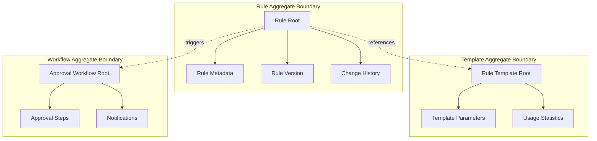

# Rules Management Bounded Context

## Context Definition

### Purpose
The Rules Management bounded context is responsible for the complete lifecycle management of business rules, from initial creation through approval workflows to deactivation. It serves as the upstream context that ensures rule quality, governance, and compliance before rules become available for evaluation.

### Business Capabilities
- **Rule Authoring**: DSL-based rule creation with template support
- **Rule Governance**: Multi-level approval workflows with impact analysis
- **Template Management**: Reusable rule patterns for common scenarios
- **Version Control**: Rule versioning and change management
- **Audit Trail**: Complete history of rule changes and approvals

### Value Delivered
- **Business Agility**: Enables rapid rule deployment from concept to production
- **Quality Assurance**: Ensures rule correctness through validation and testing
- **Compliance**: Maintains regulatory compliance through approval workflows
- **User Empowerment**: Allows business users to create rules without technical dependencies
- **Risk Mitigation**: Reduces errors through systematic validation and approval

### Boundaries

#### Included (What belongs in this context)
- **Rule Definition**: DSL content, conditions, actions, and metadata
- **Rule Lifecycle**: Status management from DRAFT to ARCHIVED
- **Approval Workflow**: Multi-step approval process with role-based permissions
- **Template System**: Rule templates with parameter substitution
- **Validation Engine**: Syntax and semantic validation for rules
- **Version Management**: Rule versioning and change tracking
- **User Interface**: Web-based rule creation and management tools

#### Excluded (What doesn't belong here)
- **Rule Execution**: Actual evaluation of rules against transaction data
- **Performance Optimization**: Rule evaluation performance tuning
- **External Integration**: Integration with POS systems or e-commerce platforms
- **Customer Data**: Customer profiles and transaction history
- **Analytics**: Business intelligence and rule performance analytics

#### Gray Areas (Unclear boundaries and decisions)
- **Rule Testing**: Basic testing capabilities included, advanced simulation excluded
- **Impact Analysis**: Business impact assessment included, technical performance excluded
- **Conflict Detection**: Rule-to-rule conflicts included, runtime conflicts excluded

### Team Ownership
- **Responsible Team**: Business Rules Engineering Team
- **Domain Expert**: Chief Business Analyst - Sarah Johnson (sarah.johnson@company.com)
- **Technical Lead**: Senior Software Engineer - Mike Chen (mike.chen@company.com)
- **Product Owner**: Product Manager - Lisa Rodriguez (lisa.rodriguez@company.com)

## Domain Model

### Core Entities

```mermaid
classDiagram
    class Rule {
        <<AggregateRoot>>
        +RuleId id
        +RuleName name
        +String description
        +RuleStatus status
        +Priority priority
        +DSLContent dslContent
        +DateTime createdAt
        +DateTime updatedAt
        +UserId createdBy
        +UserId approvedBy
        +DateTime approvedAt
        +RuleVersion version
        +activate()
        +deactivate()
        +approve(approver)
        +reject(reason)
        +validate()
        +updateContent(dslContent)
        +submitForApproval()
        +canBeModified()
    }
    
    class RuleTemplate {
        +TemplateId id
        +String name
        +String description
        +RuleCategory category
        +String dslTemplate
        +List~TemplateParameter~ parameters
        +DateTime createdAt
        +UserId createdBy
        +boolean isActive
        +applyTemplate(values)
        +validateParameters(values)
        +generateDSL(values)
    }
    
    class ApprovalWorkflow {
        +WorkflowId id
        +RuleId ruleId
        +WorkflowStatus status
        +List~ApprovalStep~ steps
        +DateTime startedAt
        +DateTime completedAt
        +UserId initiatedBy
        +advance()
        +reject(reason)
        +getCurrentStep()
        +isComplete()
    }
    
    class ApprovalStep {
        +StepId id
        +String stepName
        +ApprovalRole requiredRole
        +StepStatus status
        +UserId assignee
        +DateTime assignedAt
        +DateTime completedAt
        +String comments
        +approve(approver, comments)
        +reject(reason)
        +assign(user)
    }
    
    class RuleValidation {
        +ValidationId id
        +RuleId ruleId
        +ValidationStatus status
        +List~ValidationError~ errors
        +List~ValidationWarning~ warnings
        +DateTime validatedAt
        +UserId validatedBy
        +isValid()
        +addError(error)
        +addWarning(warning)
    }
    
    Rule }o--|| RuleTemplate : "created from"
    Rule ||--o{ ApprovalWorkflow : "has"
    Rule ||--o{ RuleValidation : "validated by"
    ApprovalWorkflow ||--o{ ApprovalStep : "contains"
```

### Value Objects

#### RuleId
- **Purpose**: Unique identifier for rules with global uniqueness guarantee
- **Format**: UUID v4 string representation
- **Validation**: Must be valid UUID format, non-null, non-empty
- **Immutability**: Immutable once created
- **Equality**: Based on string value comparison

#### DSLContent
- **Purpose**: Encapsulates rule business logic in domain-specific language
- **Attributes**: 
  - `content`: String containing DSL syntax
  - `variables`: List of referenced variables
  - `complexity`: Calculated complexity level
- **Validation**: 
  - Must pass syntax validation
  - Must pass semantic validation
  - Cannot exceed maximum complexity threshold
  - Must reference only valid attributes and functions
- **Operations**:
  - `validate()`: Performs comprehensive validation
  - `optimize()`: Optimizes DSL for performance
  - `getVariables()`: Extracts referenced variables
  - `calculateComplexity()`: Determines complexity level

#### RuleStatus
- **Purpose**: Defines the current state of a rule in its lifecycle
- **Values**: 
  - `DRAFT`: Rule is being created/edited
  - `UNDER_REVIEW`: Rule submitted for approval
  - `APPROVED`: Rule approved but not yet active
  - `ACTIVE`: Rule is live and being evaluated
  - `INACTIVE`: Rule temporarily disabled
  - `DEPRECATED`: Rule marked for retirement
  - `ARCHIVED`: Rule permanently retired
- **Transitions**: Enforced by business rules
- **Validation**: Only valid transitions allowed

#### Priority
- **Purpose**: Defines rule execution precedence and conflict resolution order
- **Values**: `CRITICAL`, `HIGH`, `MEDIUM`, `LOW`
- **Business Rules**: 
  - Higher priority rules evaluated first
  - Same category rules cannot have identical priority
  - Priority affects conflict resolution decisions
- **Ordering**: CRITICAL > HIGH > MEDIUM > LOW

### Aggregates Overview



### Domain Services

#### RuleValidationService
- **Purpose**: Validates rule syntax, semantics, and business logic
- **Responsibilities**:
  - **DSL Syntax Validation**: Verifies DSL syntax correctness
  - **Semantic Validation**: Ensures logical consistency and referential integrity
  - **Business Rule Validation**: Checks compliance with business constraints
  - **Conflict Detection**: Identifies potential conflicts with existing rules
  - **Performance Impact Assessment**: Evaluates potential performance implications
- **Operations**:
  - `validateSyntax(dslContent)`: Checks DSL syntax
  - `validateSemantics(rule, context)`: Validates business logic
  - `detectConflicts(rule, existingRules)`: Identifies rule conflicts
  - `assessPerformanceImpact(rule)`: Evaluates performance implications

#### RuleTemplateService
- **Purpose**: Manages rule templates and their application
- **Responsibilities**:
  - **Template Creation**: Design and validation of new templates
  - **Parameter Management**: Definition and validation of template parameters
  - **Template Application**: Generation of rules from templates
  - **Version Control**: Template versioning and compatibility
  - **Usage Tracking**: Monitoring template usage and effectiveness
- **Operations**:
  - `createTemplate(templateDefinition)`: Creates new template
  - `applyTemplate(templateId, parameters)`: Generates rule from template
  - `validateParameters(templateId, parameters)`: Validates parameter values
  - `getTemplateUsage(templateId)`: Retrieves usage statistics

#### ApprovalWorkflowService
- **Purpose**: Orchestrates rule approval processes
- **Responsibilities**:
  - **Workflow Configuration**: Define approval steps and roles
  - **Process Orchestration**: Manage workflow state transitions
  - **Notification Management**: Send notifications to approvers
  - **Escalation Handling**: Manage approval timeouts and escalations
  - **Audit Trail**: Maintain complete approval history
- **Operations**:
  - `initiateApproval(ruleId, workflowType)`: Starts approval process
  - `processApproval(workflowId, decision, comments)`: Handles approval decision
  - `escalateApproval(workflowId)`: Escalates overdue approvals
  - `getApprovalStatus(ruleId)`: Retrieves current approval status

### Integration Points

#### Inbound (How other contexts use this context)
- **Rules Calculation Context**: 
  - Subscribes to rule lifecycle events for cache management
  - Requests rule validation during evaluation preparation
  - Receives activated rules for evaluation engine loading

- **User Interface Applications**:
  - Access rule management APIs for CRUD operations
  - Subscribe to rule status change notifications
  - Request rule templates and validation services

- **Analytics and Reporting**:
  - Consume rule usage metrics and approval statistics
  - Subscribe to rule lifecycle events for business intelligence
  - Access rule metadata for impact analysis

#### Outbound (How this context uses other contexts)
- **Authentication Context**:
  - Validate user credentials and permissions
  - Retrieve user profiles and role information
  - Manage session tokens and security

- **Audit & Compliance Context**:
  - Publish audit events for all rule operations
  - Send compliance notifications for regulatory requirements
  - Submit approval documentation for audit trails

- **Notification Service**:
  - Send approval notifications to stakeholders
  - Notify users of rule status changes
  - Alert administrators of validation failures

#### Events Published
- **RuleCreated**: When a new rule is created
- **RuleUpdated**: When rule content is modified
- **RuleSubmittedForApproval**: When rule enters approval workflow
- **RuleApproved**: When rule completes approval process
- **RuleActivated**: When rule becomes available for evaluation
- **RuleDeactivated**: When rule is disabled
- **ValidationCompleted**: When rule validation finishes
- **ApprovalStepCompleted**: When individual approval step completes

#### Events Consumed
- **UserAuthenticated**: For session management and permissions
- **TemplateUpdated**: For template cache invalidation
- **SystemMaintenanceScheduled**: For rule deployment coordination

## Technical Implementation

### Architecture Patterns

#### Aggregate Pattern
- **Rule Aggregate**: Encapsulates rule data and behavior with consistency boundaries
- **Template Aggregate**: Manages template lifecycle and parameter validation
- **Workflow Aggregate**: Coordinates approval process state and transitions
- **Consistency**: Strong consistency within aggregates, eventual consistency between aggregates

#### Repository Pattern
- **RuleRepository**: Data access for rule aggregates with optimistic concurrency control
- **TemplateRepository**: Template storage with versioning support
- **WorkflowRepository**: Approval workflow persistence with state management
- **Caching**: Redis caching for frequently accessed rules and templates

#### Domain Service Pattern
- **Validation Services**: Stateless services for rule validation logic
- **Workflow Services**: Orchestration services for complex approval processes
- **Template Services**: Services for template management and application
- **Integration Services**: Services for external system communication

#### Event Sourcing (Partial)
- **Audit Trail**: Event sourcing for complete rule change history
- **Workflow State**: Event-driven workflow state management
- **Compliance**: Event store for regulatory audit requirements

### Data Model

#### Storage Technology
- **Primary Database**: PostgreSQL for ACID compliance and complex queries
- **Cache Layer**: Redis for high-performance rule and template caching
- **Search Engine**: Elasticsearch for rule discovery and full-text search
- **File Storage**: Cloud storage for rule documentation and attachments

#### Schema Design
```sql
-- Core Rule Table
CREATE TABLE rules (
    id UUID PRIMARY KEY,
    name VARCHAR(255) NOT NULL,
    description TEXT,
    status VARCHAR(50) NOT NULL,
    priority VARCHAR(20) NOT NULL,
    dsl_content TEXT NOT NULL,
    category VARCHAR(100) NOT NULL,
    created_at TIMESTAMP NOT NULL,
    updated_at TIMESTAMP NOT NULL,
    created_by UUID NOT NULL,
    approved_by UUID,
    approved_at TIMESTAMP,
    version_major INTEGER NOT NULL DEFAULT 1,
    version_minor INTEGER NOT NULL DEFAULT 0,
    effective_from TIMESTAMP,
    effective_to TIMESTAMP,
    metadata JSONB,
    CONSTRAINT uk_rules_name_category UNIQUE (name, category),
    CONSTRAINT ck_rules_status CHECK (status IN ('DRAFT', 'UNDER_REVIEW', 'APPROVED', 'ACTIVE', 'INACTIVE', 'DEPRECATED', 'ARCHIVED')),
    CONSTRAINT ck_rules_priority CHECK (priority IN ('CRITICAL', 'HIGH', 'MEDIUM', 'LOW'))
);

-- Rule Templates Table
CREATE TABLE rule_templates (
    id UUID PRIMARY KEY,
    name VARCHAR(255) NOT NULL,
    description TEXT,
    category VARCHAR(100) NOT NULL,
    dsl_template TEXT NOT NULL,
    parameters JSONB NOT NULL,
    created_at TIMESTAMP NOT NULL,
    created_by UUID NOT NULL,
    is_active BOOLEAN NOT NULL DEFAULT true,
    usage_count INTEGER NOT NULL DEFAULT 0,
    CONSTRAINT uk_templates_name_category UNIQUE (name, category)
);

-- Approval Workflows Table
CREATE TABLE approval_workflows (
    id UUID PRIMARY KEY,
    rule_id UUID NOT NULL REFERENCES rules(id),
    status VARCHAR(50) NOT NULL,
    workflow_type VARCHAR(50) NOT NULL,
    started_at TIMESTAMP NOT NULL,
    completed_at TIMESTAMP,
    initiated_by UUID NOT NULL,
    current_step INTEGER NOT NULL DEFAULT 1,
    total_steps INTEGER NOT NULL,
    CONSTRAINT ck_workflow_status CHECK (status IN ('PENDING', 'IN_PROGRESS', 'COMPLETED', 'REJECTED', 'CANCELLED'))
);
```

#### Migration Strategy
- **Schema Versioning**: Flyway for database schema evolution
- **Data Migration**: Blue-green deployment with data migration scripts
- **Backward Compatibility**: API versioning for breaking changes
- **Zero-Downtime**: Rolling deployments with feature flags

### API Design

#### REST Endpoints
```yaml
# Rule Management API
POST /api/v1/rules
GET /api/v1/rules/{ruleId}
PUT /api/v1/rules/{ruleId}
DELETE /api/v1/rules/{ruleId}
GET /api/v1/rules?category={category}&status={status}&page={page}

# Rule Lifecycle API
POST /api/v1/rules/{ruleId}/submit-for-approval
POST /api/v1/rules/{ruleId}/approve
POST /api/v1/rules/{ruleId}/reject
POST /api/v1/rules/{ruleId}/activate
POST /api/v1/rules/{ruleId}/deactivate

# Template Management API
GET /api/v1/templates
GET /api/v1/templates/{templateId}
POST /api/v1/templates/{templateId}/apply
GET /api/v1/templates?category={category}

# Validation API
POST /api/v1/rules/validate
POST /api/v1/rules/{ruleId}/test
```

#### Message Contracts
```yaml
# Rule Lifecycle Events
RuleCreated:
  ruleId: string
  ruleName: string
  category: string
  createdBy: string
  createdAt: datetime

RuleActivated:
  ruleId: string
  ruleName: string
  dslContent: string
  priority: string
  activatedAt: datetime
  effectivePeriod:
    from: datetime
    to: datetime

# Approval Events
ApprovalRequested:
  workflowId: string
  ruleId: string
  requestedBy: string
  requiredApprovers: array[string]
  dueDate: datetime

ApprovalCompleted:
  workflowId: string
  ruleId: string
  approved: boolean
  approvedBy: string
  comments: string
  completedAt: datetime
```

## Business Rules and Invariants

### Rule Lifecycle Invariants
1. **Status Transition Rules**: Rules must follow defined status workflow
   - DRAFT → UNDER_REVIEW → APPROVED → ACTIVE
   - Any status → INACTIVE (emergency deactivation)
   - INACTIVE → ACTIVE (reactivation)
   - Any status → ARCHIVED (permanent retirement)

2. **Content Modification Rules**: Rule content modification constraints
   - DRAFT rules: Full editing allowed
   - UNDER_REVIEW rules: No modifications allowed
   - APPROVED rules: No modifications (must create new version)
   - ACTIVE rules: No content changes (status changes only)

3. **Approval Requirements**: Rules must be approved before activation
   - Only APPROVED rules can be activated
   - Approval requires valid approver with appropriate permissions
   - Approval timestamp and approver must be recorded
   - Rejected rules return to DRAFT status for modifications

### Business Validation Rules
1. **Rule Naming**: Rule names must be unique within category
2. **Priority Constraints**: No two active rules in same category can have identical priority
3. **DSL Validation**: Rule content must pass syntax and semantic validation
4. **Effective Periods**: Rule effective periods must be valid and non-overlapping for conflicting rules
5. **Template Compliance**: Rules created from templates must validate against template constraints

### Data Integrity Constraints
1. **Referential Integrity**: All foreign keys must reference valid entities
2. **Version Control**: Rule versions must increment properly on changes
3. **Audit Trail**: All changes must be logged with user attribution and timestamps
4. **Concurrency Control**: Optimistic locking to prevent concurrent modification conflicts

## Quality Attributes

### Performance Requirements
- **Rule Creation**: <2 seconds for rule creation with validation
- **Rule Validation**: <500ms for syntax and semantic validation
- **Template Application**: <1 second for template-based rule generation
- **Search Operations**: <200ms for rule search and filtering
- **Approval Operations**: <1 second for approval workflow actions

### Scalability Requirements
- **Concurrent Users**: Support 100+ concurrent rule authors
- **Rule Volume**: Handle 10,000+ active rules per category
- **Template Library**: Support 500+ rule templates
- **Approval Workflows**: Process 1,000+ approvals per day

### Reliability Requirements
- **Availability**: 99.9% uptime for rule management operations
- **Data Consistency**: Strong consistency for rule data and approval states
- **Error Recovery**: Graceful handling of validation and approval failures
- **Backup and Recovery**: Daily backups with <1 hour recovery time

### Security Requirements
- **Authentication**: Integration with enterprise identity management
- **Authorization**: Role-based access control for rule operations
- **Data Protection**: Encryption of sensitive rule content
- **Audit Logging**: Complete audit trail for compliance requirements

This Rules Management bounded context serves as the foundation for rule governance and quality assurance, ensuring that only validated, approved rules enter the evaluation pipeline while maintaining complete audit trails and compliance with business requirements.
