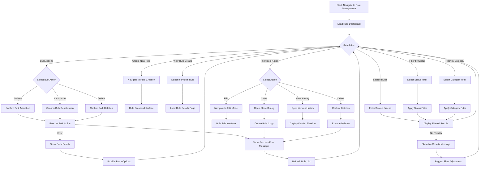

# UI-001: Business Rule Management Interface

**Purpose**: This interface provides comprehensive business rule management capabilities, allowing users to view, filter, search, and manage all business rules within the Rules Engine system.

**Target Users**: Business Analysts, Rule Managers, System Administrators

**Context**: Primary interface for rule lifecycle management supporting the Rules Management bounded context with CRUD operations, status management, and bulk actions.

---

## 1) User Flow (Mermaid Diagram)

---

## 2) UI Components and Wireframes (Text-based)

### Screen: Rule Management Dashboard

#### Layout Structure
- **Header Section**: Application navigation, user profile, notifications
- **Search and Filter Section**: Global search bar, advanced filters, quick filter buttons
- **Action Bar**: Bulk action controls, create new rule button, view toggle options
- **Main Content Area**: Rule listing table/grid with pagination
- **Side Panel** (collapsible): Recent actions, quick stats, help resources

#### Component Specifications

##### Header Section
- **Component**: Application Header
- **Elements**:
  - Logo/Brand: Rules Engine logo (left-aligned)
  - Primary Navigation: Dashboard, Rules, Analytics, Settings (horizontal menu)
  - User Profile: Avatar, name, role indicator (right-aligned)
  - Notifications: Bell icon with badge count
  - Help: Question mark icon with tooltip

##### Search and Filter Section
- **Component**: Advanced Search Panel
- **Layout**: Horizontal panel below header, expandable for advanced options
- **Elements**:
  - **Global Search**: 
    - Input field with search icon
    - Placeholder: "Search rules by name, description, or DSL content..."
    - Width: 40% of container
    - Real-time search suggestions dropdown
  - **Quick Filters** (Button group):
    - All Rules (default selected)
    - My Rules
    - Pending Approval
    - Active Rules
    - Recently Modified
  - **Advanced Filters** (Expandable section):
    - Status Dropdown: Multi-select (DRAFT, UNDER_REVIEW, APPROVED, ACTIVE, INACTIVE, ARCHIVED)
    - Priority Dropdown: Multi-select (CRITICAL, HIGH, MEDIUM, LOW)
    - Category Dropdown: Multi-select (Promotions, Loyalty, Taxes, Coupons, Fees)
    - Created Date Range: Date picker with presets (Last 7 days, Last 30 days, Custom range)
    - Created By: User selector with autocomplete
    - Template Used: Template selector dropdown

##### Action Bar
- **Component**: Action Toolbar
- **Layout**: Horizontal bar between filters and content
- **Elements**:
  - **Left Section**:
    - Bulk Selection: "Select All" checkbox
    - Bulk Actions Dropdown: Activate, Deactivate, Delete, Export (disabled when no selection)
    - Selected Count: "X rules selected" text
  - **Right Section**:
    - Create New Rule: Primary button with plus icon
    - View Toggle: List/Grid view toggle buttons
    - Sort Options: Dropdown (Name A-Z, Modified Date, Status, Priority)
    - Results Per Page: Dropdown (10, 25, 50, 100)

##### Main Content Area - Rule Table
- **Component**: Data Table with Row Actions
- **Table Structure**:
  - **Columns**:
    1. Selection: Checkbox column (40px)
    2. Status: Visual status indicator with text (120px)
    3. Name: Rule name with link to details (250px)
    4. Category: Category badge (100px)
    5. Priority: Priority indicator with color coding (100px)
    6. Last Modified: Relative date with tooltip (150px)
    7. Modified By: User name/avatar (120px)
    8. Actions: Dropdown menu (80px)
  
  - **Row Specifications**:
    - Height: 56px per row
    - Hover State: Light background highlight
    - Selection State: Highlighted border and background
    - Alternating row colors for better readability

  - **Action Menu per Row**:
    - View Details: Eye icon
    - Edit: Pencil icon (disabled if rule is ACTIVE)
    - Clone: Copy icon
    - View History: Clock icon
    - Activate/Deactivate: Toggle based on current status
    - Delete: Trash icon (with confirmation)

##### Status Indicators
- **Component**: Status Badge
- **Visual Design**:
  - DRAFT: Gray badge with dot
  - UNDER_REVIEW: Yellow badge with clock icon
  - APPROVED: Green badge with check icon
  - ACTIVE: Blue badge with play icon
  - INACTIVE: Orange badge with pause icon
  - ARCHIVED: Dark gray badge with archive icon

##### Priority Indicators
- **Component**: Priority Badge
- **Visual Design**:
  - CRITICAL: Red background, white text, fire icon
  - HIGH: Orange background, white text, exclamation icon
  - MEDIUM: Yellow background, dark text, minus icon
  - LOW: Green background, white text, down arrow icon

##### Pagination
- **Component**: Table Pagination
- **Layout**: Bottom of table, center-aligned
- **Elements**:
  - Results Summary: "Showing 1-25 of 247 rules"
  - Page Navigation: First, Previous, Page Numbers, Next, Last
  - Quick Jump: "Go to page" input field

### Screen: Grid View (Alternative Layout)
- **Component**: Rule Cards Grid
- **Layout**: 3-4 cards per row (responsive)
- **Card Structure**:
  - Header: Status badge, priority indicator, action menu
  - Title: Rule name (clickable)
  - Description: Rule description preview (2 lines, truncated)
  - Metadata: Category badge, last modified date
  - Footer: Created by user, rule metrics

---

## 3) Interaction and States

### UI States

#### Initial State
- **Loading**: Skeleton placeholders for table rows
- **Empty State**: No rules message with "Create your first rule" call-to-action
- **Default State**: Table loaded with first page of rules, no filters applied

#### Loading States
- **Table Loading**: Skeleton rows with animated loading shimmer
- **Filter Loading**: Disabled filter controls with spinner
- **Action Loading**: Individual row actions show spinner during execution
- **Bulk Action Loading**: Progress bar for bulk operations affecting multiple rules

#### Success States
- **Action Success**: Green toast notification with success message
- **Bulk Action Success**: Success notification with count of affected rules
- **Data Refresh**: Smooth transition with updated data

#### Error States
- **Load Error**: Error message with retry button replacing table content
- **Action Error**: Red toast notification with error details and suggested actions
- **Network Error**: Offline indicator with queue of pending actions
- **Validation Error**: Inline error messages for invalid filter inputs

#### Filter States
- **No Results**: "No rules match your criteria" message with filter reset options
- **Filtered View**: Active filter chips showing applied filters with remove options
- **Search Results**: Highlighted search terms in results with search summary

### User Actions and Corresponding Events

#### Search and Filter Actions
- **Action**: User types in global search field
  - **Event**: `SEARCH_RULES_REQUESTED`
  - **Debounce**: 300ms delay for real-time search
  - **Payload**: `{ searchTerm: string, currentFilters: object }`

- **Action**: User selects status filter
  - **Event**: `FILTER_BY_STATUS_APPLIED`
  - **Payload**: `{ statusFilters: string[], previousFilters: object }`

- **Action**: User applies date range filter
  - **Event**: `FILTER_BY_DATE_RANGE_APPLIED`
  - **Payload**: `{ startDate: Date, endDate: Date, filterType: string }`

#### Rule Management Actions
- **Action**: User clicks "Create New Rule"
  - **Event**: `NAVIGATE_TO_RULE_CREATION`
  - **Navigation**: Route to rule creation interface
  - **Analytics**: Track rule creation initiation

- **Action**: User clicks on rule name (view details)
  - **Event**: `NAVIGATE_TO_RULE_DETAILS`
  - **Payload**: `{ ruleId: string, viewMode: 'read' }`
  - **Navigation**: Route to rule details page

- **Action**: User clicks "Edit" on a rule
  - **Event**: `NAVIGATE_TO_RULE_EDIT`
  - **Payload**: `{ ruleId: string, viewMode: 'edit' }`
  - **Validation**: Check if rule can be edited (status requirements)

- **Action**: User clicks "Clone" on a rule
  - **Event**: `RULE_CLONE_REQUESTED`
  - **Payload**: `{ sourceRuleId: string, cloneOptions: object }`
  - **Modal**: Open clone configuration dialog

#### Bulk Actions
- **Action**: User selects multiple rules and clicks "Activate"
  - **Event**: `BULK_ACTIVATE_RULES_REQUESTED`
  - **Payload**: `{ ruleIds: string[], confirmationRequired: boolean }`
  - **Confirmation**: Show impact assessment and confirmation dialog

- **Action**: User selects rules and clicks "Delete"
  - **Event**: `BULK_DELETE_RULES_REQUESTED`
  - **Payload**: `{ ruleIds: string[], cascadeOptions: object }`
  - **Confirmation**: Multi-step confirmation with dependency warnings

#### Status Change Actions
- **Action**: User activates individual rule
  - **Event**: `RULE_ACTIVATION_REQUESTED`
  - **Payload**: `{ ruleId: string, activationDate: Date }`
  - **Validation**: Pre-activation conflict checking

- **Action**: User deactivates individual rule
  - **Event**: `RULE_DEACTIVATION_REQUESTED`
  - **Payload**: `{ ruleId: string, deactivationReason: string }`
  - **Impact**: Show deactivation impact assessment

#### View and Display Actions
- **Action**: User toggles between list and grid view
  - **Event**: `VIEW_MODE_CHANGED`
  - **Payload**: `{ viewMode: 'list' | 'grid', userPreference: boolean }`
  - **Persistence**: Save user preference for future sessions

- **Action**: User changes sort order
  - **Event**: `SORT_ORDER_CHANGED`
  - **Payload**: `{ sortField: string, sortDirection: 'asc' | 'desc' }`
  - **URL Update**: Reflect sort state in URL parameters

#### Pagination Actions
- **Action**: User clicks next page
  - **Event**: `PAGINATION_NEXT_REQUESTED`
  - **Payload**: `{ currentPage: number, pageSize: number }`
  - **URL Update**: Update page parameter in URL

- **Action**: User changes page size
  - **Event**: `PAGE_SIZE_CHANGED`
  - **Payload**: `{ newPageSize: number, totalResults: number }`
  - **Reset**: Return to first page with new page size

### Accessibility Considerations

#### Keyboard Navigation
- **Tab Order**: Logical progression through search, filters, table headers, and actions
- **Table Navigation**: Arrow keys for cell navigation, Enter to activate row actions
- **Skip Links**: "Skip to main content" and "Skip to filters" options
- **Focus Management**: Clear focus indicators and focus trapping in modals

#### Screen Reader Support
- **Table Accessibility**: Proper table headers, row/column associations
- **Status Announcements**: Live regions for filter results and action outcomes
- **Action Descriptions**: Descriptive button labels and ARIA descriptions
- **Sort State**: Announce current sort column and direction

#### Visual Accessibility
- **Color Contrast**: All status and priority indicators meet WCAG AA standards
- **Focus Indicators**: High contrast focus rings on all interactive elements
- **Text Alternatives**: Alt text for status icons and priority indicators
- **Responsive Text**: Scalable text up to 200% without horizontal scrolling

### Performance Considerations

#### Data Loading
- **Virtual Scrolling**: For large rule sets (>1000 rules)
- **Progressive Loading**: Load initial view quickly, then enhance with additional data
- **Caching Strategy**: Cache frequently accessed rule lists and filter combinations
- **Optimistic Updates**: Immediate UI updates for status changes with rollback capability

#### Search and Filter Performance
- **Debounced Search**: 300ms delay to reduce API calls during typing
- **Filter Caching**: Cache filter results for quick re-application
- **Incremental Filtering**: Apply filters progressively rather than reloading entire dataset
- **Background Refresh**: Update data in background while maintaining current user state

This rule management interface serves as the central hub for business rule administration, providing efficient access to all rule management functions while maintaining excellent usability and performance standards.
