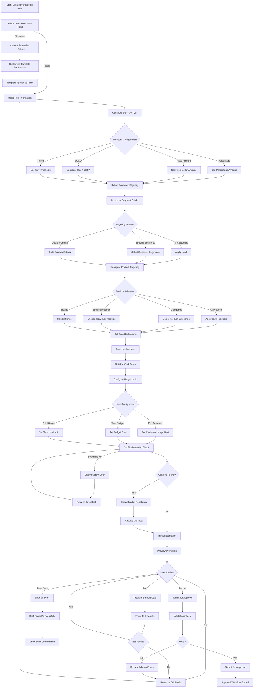

# UI-007: Promotional Rule Creation Interface

**Purpose**: This interface provides specialized tools for creating promotional rules including discount configuration, customer eligibility criteria, product targeting, time-based restrictions, and usage limits.

**Target Users**: Marketing Managers, Business Analysts, Promotion Specialists

**Context**: Specialized rule creation interface for the Promotions bounded context supporting discount campaigns, customer segmentation, and promotional strategy implementation.

---

## 1) User Flow (Mermaid Diagram)

---

## 2) UI Components and Wireframes (Text-based)

### Screen: Promotional Rule Creation Wizard

#### Layout Structure
- **Header**: Progress indicator, rule name field, draft auto-save status
- **Main Content**: Multi-step wizard with form sections
- **Sidebar**: Impact calculator, preview panel, help resources
- **Footer**: Navigation buttons (Previous, Next, Save Draft, Submit)

#### Component Specifications

##### Header Section
- **Component**: Wizard Progress Header
- **Elements**:
  - **Progress Indicator**: 
    - Step indicators: Basic Info → Discount → Targeting → Timing → Limits → Review
    - Visual progress bar showing completion percentage
    - Current step highlighted with active state
  - **Rule Name Field**: 
    - Large, prominent input field
    - Placeholder: "Enter promotional rule name..."
    - Auto-save indicator when typing stops
  - **Draft Status**: 
    - Auto-save status: "Draft saved 2 minutes ago"
    - Manual save button for immediate save

##### Step 1: Basic Information
- **Component**: Basic Rule Information Form
- **Layout**: Two-column form layout
- **Fields**:
  - **Rule Name**: Required text input, 100 character limit
  - **Description**: Rich text area, 500 character limit, markdown support
  - **Campaign Name**: Optional text input for internal tracking
  - **Priority**: Dropdown (CRITICAL, HIGH, MEDIUM, LOW) with explanation tooltips
  - **Rule Category**: Auto-set to "Promotions", display only
  - **Template Source**: Display template name if created from template

##### Step 2: Discount Configuration
- **Component**: Discount Type Selector and Configuration
- **Layout**: Card-based selection with detailed configuration panels

###### Discount Type Selection
- **Component**: Discount Type Cards
- **Options**:
  1. **Percentage Discount Card**:
     - Icon: Percentage symbol
     - Title: "Percentage Off"
     - Description: "Apply percentage discount to qualifying items"
     - Examples: "10% off, 25% off all items"
  
  2. **Fixed Amount Card**:
     - Icon: Dollar sign
     - Title: "Fixed Amount Off"
     - Description: "Subtract fixed amount from total or per item"
     - Examples: "$5 off order, $10 off each item"
  
  3. **BOGO Card**:
     - Icon: Gift box
     - Title: "Buy One Get One"
     - Description: "Buy X quantity, get Y quantity free/discounted"
     - Examples: "Buy 2 get 1 free, Buy 1 get 1 50% off"
  
  4. **Tiered Discount Card**:
     - Icon: Steps/ladder
     - Title: "Tiered Discounts"
     - Description: "Different discounts based on purchase amount"
     - Examples: "Spend $50 get 10% off, spend $100 get 20% off"

###### Configuration Panels (Dynamic based on selection)

**Percentage Discount Configuration**:
- **Discount Percentage**: Number input with slider (1-100%)
- **Apply To**: Radio buttons (Per Item, Subtotal, Total including taxes)
- **Maximum Discount**: Optional maximum dollar amount cap
- **Minimum Purchase**: Optional minimum purchase requirement

**Fixed Amount Configuration**:
- **Discount Amount**: Currency input with validation
- **Apply To**: Radio buttons (Per Item, Per Order, Subtotal)
- **Maximum Applications**: Number of times discount can apply per order
- **Minimum Purchase**: Optional minimum purchase requirement

**BOGO Configuration**:
- **Buy Quantity**: Number input (minimum 1)
- **Get Quantity**: Number input (minimum 1)
- **Get Discount**: Percentage input (0-100%, 100% = free)
- **Same Product**: Checkbox for same vs. different products
- **Cheapest/Most Expensive**: Radio for which items get discount

**Tiered Discount Configuration**:
- **Tier Builder**: Dynamic table for adding spending tiers
- **Tier Structure**:
  - Spending Threshold (currency input)
  - Discount Type (percentage or fixed)
  - Discount Value (based on type)
  - Add/Remove tier buttons

##### Step 3: Customer Targeting
- **Component**: Customer Eligibility Builder
- **Layout**: Multi-section targeting configuration

###### Targeting Scope Selection
- **Component**: Scope Selector
- **Options**:
  - **All Customers**: Single click to apply to everyone
  - **Customer Segments**: Select from predefined segments
  - **Custom Criteria**: Build custom eligibility rules
  - **VIP/Loyalty Tiers**: Target specific loyalty levels

###### Customer Segment Selector
- **Component**: Segment Multi-Select
- **Features**:
  - **Segment List**: Checkbox list with segment names and member counts
  - **Segment Preview**: Show sample criteria for selected segments
  - **Combination Logic**: AND/OR operators between segments
  - **New Segment**: Quick link to create new segment

###### Custom Criteria Builder
- **Component**: Dynamic Rule Builder
- **Interface**: Visual query builder with drag-and-drop
- **Criteria Categories**:
  - **Demographics**: Age, location, gender
  - **Purchase History**: Total spent, frequency, recency
  - **Product Preferences**: Categories purchased, brands preferred
  - **Behavioral**: Website activity, email engagement
  - **Account Status**: Registration date, loyalty tier

##### Step 4: Product Targeting
- **Component**: Product Selection Interface
- **Layout**: Hierarchical product selection with search

###### Product Scope Selection
- **Component**: Product Scope Selector
- **Options**:
  - **All Products**: Apply to entire catalog
  - **Product Categories**: Select categories and subcategories
  - **Specific Products**: Choose individual products
  - **Brand Selection**: Target specific brands
  - **Custom Attributes**: Filter by product attributes

###### Category Tree Selector
- **Component**: Hierarchical Category Tree
- **Features**:
  - **Tree View**: Expandable category hierarchy
  - **Search**: Real-time category search
  - **Selection**: Parent/child selection logic
  - **Product Count**: Show product count per category
  - **Preview**: Sample products in selected categories

###### Product Search and Selection
- **Component**: Product Search Interface
- **Features**:
  - **Search Bar**: Product name, SKU, barcode search
  - **Filters**: Brand, price range, availability, attributes
  - **Results Grid**: Product cards with images, names, prices
  - **Bulk Selection**: Select all in current view
  - **Selected Products**: Dedicated panel showing chosen items

##### Step 5: Time Restrictions
- **Component**: Scheduling and Time Configuration
- **Layout**: Calendar interface with time controls

###### Date Range Configuration
- **Component**: Date Range Picker
- **Features**:
  - **Visual Calendar**: Interactive calendar for date selection
  - **Quick Presets**: Today, This Weekend, Next Week, Custom
  - **Start Date**: Date picker with time selection
  - **End Date**: Date picker with time selection
  - **Timezone**: Timezone selector for multi-region campaigns

###### Schedule Pattern Configuration
- **Component**: Schedule Pattern Builder
- **Options**:
  - **Days of Week**: Checkbox selection for specific days
  - **Time of Day**: Time range sliders for active hours
  - **Recurring Patterns**: Daily, Weekly, Monthly options
  - **Blackout Dates**: Exclude specific dates (holidays, events)
  - **Flash Sale**: Specific start/end times for limited offers

##### Step 6: Usage Limits
- **Component**: Usage Limit Configuration
- **Layout**: Three-section limit controls

###### Per-Customer Limits
- **Component**: Customer Usage Controls
- **Fields**:
  - **Uses Per Customer**: Number input with unlimited option
  - **Per Time Period**: Dropdown (Per Order, Per Day, Per Week, Per Month)
  - **Cooldown Period**: Time between uses for same customer
  - **New Customer Only**: Checkbox for first-time user restriction

###### Total Campaign Limits
- **Component**: Campaign Budget Controls
- **Fields**:
  - **Total Budget**: Currency input for maximum campaign cost
  - **Total Uses**: Number input for maximum redemptions
  - **Daily Budget**: Optional daily spending cap
  - **Budget Alerts**: Threshold percentages for budget warnings

###### Advanced Limits
- **Component**: Advanced Restriction Controls
- **Fields**:
  - **Minimum Order Value**: Currency input for minimum purchase
  - **Maximum Discount**: Currency cap on discount amount
  - **Product Quantity Limits**: Min/max quantities for discounted items
  - **Stacking Rules**: Allow/disallow combination with other promotions

### Sidebar Components

##### Impact Calculator
- **Component**: Real-time Impact Estimator
- **Display**:
  - **Estimated Reach**: Number of eligible customers
  - **Projected Usage**: Expected redemption rate
  - **Cost Estimate**: Projected discount cost
  - **Revenue Impact**: Estimated revenue effect
  - **ROI Indicator**: Return on investment projection

##### Preview Panel
- **Component**: Promotion Preview
- **Content**:
  - **Customer View**: How promotion appears to customers
  - **Example Scenarios**: Sample calculations with different cart values
  - **Marketing Copy**: Auto-generated promotional text
  - **Terms and Conditions**: Generated legal text

---

## 3) Interaction and States

### UI States

#### Initial State
- **Step 1 Active**: Basic information form displayed
- **Empty Fields**: All inputs empty except for default values
- **Sidebar Collapsed**: Impact calculator and preview hidden initially
- **Navigation**: Only "Next" button enabled, "Previous" disabled

#### Progressive States
- **Form Validation**: Real-time validation with inline error messages
- **Step Completion**: Visual indicators when step is complete
- **Auto-Save**: Periodic saving with status indicators
- **Data Dependencies**: Dynamic form updates based on previous selections

#### Loading States
- **Template Loading**: Spinner while loading template data
- **Segment Loading**: Loading indicator while fetching customer segments
- **Product Loading**: Progressive loading for large product catalogs
- **Validation Loading**: Spinner during conflict detection and validation

#### Success States
- **Step Complete**: Green checkmark and progress indicator advancement
- **Draft Saved**: Success toast with timestamp
- **Validation Passed**: Green validation indicators
- **Preview Updated**: Smooth transition to updated preview

#### Error States
- **Validation Errors**: Red inline messages with specific guidance
- **Conflict Warnings**: Yellow warning panels with resolution options
- **System Errors**: Error messages with retry options
- **Data Load Errors**: Fallback options when external data fails

### User Actions and Corresponding Events

#### Navigation Actions
- **Action**: User clicks "Next" step
  - **Event**: `PROMOTION_WIZARD_STEP_ADVANCE`
  - **Validation**: Validate current step before advancing
  - **Payload**: `{ currentStep: number, formData: object, validationResults: object }`

- **Action**: User clicks "Previous" step
  - **Event**: `PROMOTION_WIZARD_STEP_BACK`
  - **Preservation**: Maintain form data when going back
  - **Payload**: `{ currentStep: number, preservedData: object }`

#### Discount Configuration Actions
- **Action**: User selects discount type
  - **Event**: `DISCOUNT_TYPE_SELECTED`
  - **UI Update**: Show/hide relevant configuration panels
  - **Payload**: `{ discountType: string, previousType: string }`

- **Action**: User adjusts discount percentage
  - **Event**: `DISCOUNT_PERCENTAGE_CHANGED`
  - **Real-time**: Update impact calculator immediately
  - **Payload**: `{ percentage: number, applicationType: string }`

- **Action**: User configures BOGO settings
  - **Event**: `BOGO_CONFIGURATION_UPDATED`
  - **Validation**: Ensure logical buy/get quantities
  - **Payload**: `{ buyQuantity: number, getQuantity: number, getDiscount: number }`

#### Targeting Actions
- **Action**: User selects customer segments
  - **Event**: `CUSTOMER_SEGMENTS_SELECTED`
  - **Impact**: Update reach estimation in sidebar
  - **Payload**: `{ selectedSegments: string[], estimatedReach: number }`

- **Action**: User builds custom criteria
  - **Event**: `CUSTOM_CRITERIA_UPDATED`
  - **Validation**: Check criteria logic and syntax
  - **Payload**: `{ criteriaRules: object[], estimatedMatches: number }`

- **Action**: User selects product categories
  - **Event**: `PRODUCT_CATEGORIES_SELECTED`
  - **Impact**: Update product count and revenue impact
  - **Payload**: `{ selectedCategories: string[], productCount: number }`

#### Scheduling Actions
- **Action**: User sets date range
  - **Event**: `PROMOTION_SCHEDULE_UPDATED`
  - **Validation**: Ensure end date after start date
  - **Payload**: `{ startDate: Date, endDate: Date, timezone: string }`

- **Action**: User configures recurring pattern
  - **Event**: `RECURRING_PATTERN_CONFIGURED`
  - **Calculation**: Update total promotion duration
  - **Payload**: `{ pattern: object, occurrences: number }`

#### Limit Configuration Actions
- **Action**: User sets usage limits
  - **Event**: `USAGE_LIMITS_CONFIGURED`
  - **Impact**: Update cost estimation calculations
  - **Payload**: `{ customerLimit: number, totalLimit: number, budgetCap: number }`

- **Action**: User sets budget cap
  - **Event**: `BUDGET_CAP_SET`
  - **Alert**: Configure budget warning thresholds
  - **Payload**: `{ budgetAmount: number, warningThresholds: number[] }`

#### Testing and Validation Actions
- **Action**: User clicks "Test Promotion"
  - **Event**: `PROMOTION_TEST_REQUESTED`
  - **Execution**: Run test scenarios with sample data
  - **Payload**: `{ testScenarios: object[], promotionConfig: object }`

- **Action**: User submits for approval
  - **Event**: `PROMOTION_SUBMIT_FOR_APPROVAL`
  - **Validation**: Final validation before submission
  - **Payload**: `{ promotionData: object, impactAnalysis: object }`

#### Preview and Impact Actions
- **Action**: User views customer preview
  - **Event**: `CUSTOMER_PREVIEW_REQUESTED`
  - **Generation**: Generate customer-facing preview
  - **Payload**: `{ promotionConfig: object, customerType: string }`

- **Action**: Impact calculator updates
  - **Event**: `IMPACT_CALCULATION_UPDATED`
  - **Real-time**: Automatic updates as user changes configuration
  - **Payload**: `{ estimatedReach: number, projectedCost: number, roi: number }`

### Accessibility Considerations

#### Wizard Navigation
- **Keyboard Navigation**: Full keyboard support for wizard steps
- **Step Indicators**: Clear ARIA labels for progress state
- **Focus Management**: Proper focus handling when moving between steps
- **Screen Reader**: Announcements for step changes and validation

#### Form Accessibility
- **Label Association**: All form controls properly labeled
- **Error Announcements**: Live regions for validation messages
- **Required Field Indicators**: Clear visual and programmatic indicators
- **Help Text**: Contextual help associated with form controls

#### Complex Interactions
- **Visual Builder**: Keyboard alternatives for drag-and-drop operations
- **Calendar Interface**: Keyboard navigation for date selection
- **Multi-Select**: Standard multi-select keyboard patterns
- **Dynamic Content**: Announcements when content changes

### Performance Considerations

#### Progressive Loading
- **Step-by-Step Loading**: Load data only when step is accessed
- **Lazy Loading**: Product and segment data loaded on demand
- **Caching**: Cache frequently used data (segments, categories)
- **Debounced Updates**: Limit real-time calculation frequency

#### Responsive Design
- **Mobile Optimization**: Simplified wizard flow for mobile devices
- **Touch Interactions**: Touch-friendly controls and gestures
- **Responsive Layout**: Adaptable layout for different screen sizes
- **Performance**: Optimized rendering for complex product selections

This promotional rule creation interface provides a comprehensive, user-friendly approach to creating complex promotional campaigns while maintaining system performance and ensuring accessibility for all users.
