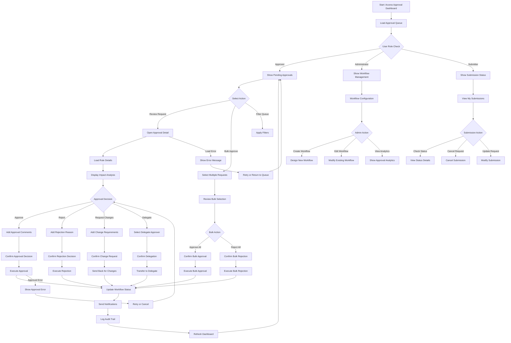

# UI-012: Approval Workflow Interface

**Purpose**: This interface manages multi-level approval processes for business rules, providing workflow configuration, approval tracking, and decision management capabilities.

**Target Users**: Approvers, Compliance Officers, Workflow Administrators, Business Managers

**Context**: Central interface for the Approval Workflow bounded context supporting governance, compliance validation, and approval orchestration.

---

## 1) User Flow (Mermaid Diagram)

---

## 2) UI Components and Wireframes (Text-based)

### Screen: Approval Dashboard

#### Layout Structure
- **Header**: User profile, notifications, role indicator
- **Navigation Bar**: Dashboard tabs by user role (Pending, My Approvals, Analytics, Admin)
- **Filter Panel**: Search, filters, and sorting options
- **Main Content**: Approval queue table/cards
- **Side Panel**: Quick actions, approval statistics, help

#### Component Specifications

##### Header Section
- **Component**: Approval Dashboard Header
- **Elements**:
  - **User Role Badge**: Clear indicator of approval permissions
  - **Notification Bell**: Urgent approval notifications with count
  - **Quick Stats**: Pending count, overdue count, today's processed
  - **Search Bar**: Global search across all approvals

##### Navigation Tabs
- **Component**: Role-Based Tab Navigation
- **Tabs**:
  1. **Pending Approvals** (Primary for approvers)
  2. **My Decisions** (Historical approvals by current user)
  3. **All Requests** (Administrative view)
  4. **Analytics & Reports** (Management dashboard)
  5. **Workflow Config** (Admin only)

##### Filter Panel
- **Component**: Advanced Filtering Interface
- **Layout**: Collapsible panel with filter sections
- **Filter Categories**:
  - **Request Type**: Rule type filter (Promotional, Loyalty, Tax, etc.)
  - **Priority**: Request priority levels
  - **Status**: Workflow status (Pending, In Review, Escalated)
  - **Submitted Date**: Date range picker
  - **Submitter**: User selector with autocomplete
  - **Business Impact**: Impact level classification
  - **Due Date**: Overdue, due today, due this week options

##### Main Content - Approval Queue Table
- **Component**: Interactive Approval Table
- **Table Columns**:
  1. **Selection**: Checkbox for bulk operations (40px)
  2. **Priority**: Visual priority indicator with color coding (60px)
  3. **Rule Name**: Request title with click to details (300px)
  4. **Type**: Rule category badge (100px)
  5. **Submitter**: User name with avatar (150px)
  6. **Submitted**: Relative date with tooltip (120px)
  7. **Due Date**: Due date with urgency indicator (120px)
  8. **Impact**: Business impact level (100px)
  9. **Status**: Current workflow step (120px)
  10. **Actions**: Quick action menu (80px)

##### Priority Indicators
- **Component**: Priority Visual System
- **Indicators**:
  - **URGENT**: Red background, fire icon, "Review within 2 hours"
  - **HIGH**: Orange background, exclamation, "Review within 1 day"
  - **MEDIUM**: Yellow background, clock icon, "Review within 3 days"
  - **LOW**: Green background, standard icon, "Review within 1 week"

##### Quick Actions Menu
- **Component**: Dropdown Action Menu
- **Actions**:
  - **Review**: Open full approval interface
  - **Quick Approve**: Approve with default comments (if permitted)
  - **Delegate**: Assign to another approver
  - **Request Info**: Ask for additional information
  - **Schedule Review**: Set reminder for later review

### Screen: Approval Detail View

#### Layout Structure
- **Header**: Request summary, status timeline, actions
- **Main Content**: Three-column layout
  - **Left**: Rule details and changes
  - **Center**: Impact analysis and business context
  - **Right**: Comments, history, and decision panel

#### Component Specifications

##### Request Header
- **Component**: Approval Request Summary
- **Elements**:
  - **Request Title**: Large, prominent rule name
  - **Status Timeline**: Visual workflow progress indicator
  - **Metadata Panel**: Submitter, date, priority, category
  - **Quick Actions**: Approve, Reject, Delegate buttons

##### Status Timeline
- **Component**: Workflow Progress Visualization
- **Timeline Elements**:
  - **Submitted**: Timestamp and submitter
  - **Current Step**: Highlighted current approval step
  - **Pending Steps**: Future approval steps
  - **Decision Points**: Previous approval decisions
  - **Estimated Completion**: Projected completion date

##### Rule Details Panel (Left Column)
- **Component**: Rule Information Display
- **Sections**:
  - **Rule Summary**: Name, description, category
  - **Rule Configuration**: 
    - DSL content with syntax highlighting
    - Configuration parameters
    - Applied templates
  - **Change Summary**: 
    - What's new or modified
    - Visual diff for rule changes
    - Impact of changes

##### Impact Analysis Panel (Center Column)
- **Component**: Business Impact Assessment
- **Sections**:
  - **Financial Impact**:
    - Revenue impact projection
    - Cost implications
    - ROI analysis
  - **Customer Impact**:
    - Affected customer segments
    - Customer experience implications
    - Reach estimation
  - **Operational Impact**:
    - System performance implications
    - Integration requirements
    - Resource requirements
  - **Risk Assessment**:
    - Business risks
    - Technical risks
    - Compliance considerations

##### Decision Panel (Right Column)
- **Component**: Approval Decision Interface
- **Sections**:
  - **Decision Options**:
    - **Approve**: Green button with confirmation
    - **Reject**: Red button with reason requirement
    - **Request Changes**: Yellow button with change specifications
    - **Delegate**: Blue button with assignee selector
  - **Comments Section**:
    - Rich text editor for decision rationale
    - @mention support for stakeholder notifications
    - File attachment support
  - **Approval Conditions**:
    - Optional conditional approval parameters
    - Implementation date specifications
    - Review requirements

##### Comment History
- **Component**: Approval Conversation Thread
- **Features**:
  - **Chronological Comments**: All approval-related discussions
  - **User Attribution**: Clear user identification and timestamps
  - **Decision Highlights**: Visual emphasis on approval decisions
  - **File Attachments**: Support for supporting documents
  - **Notification Settings**: Comment notification preferences

### Screen: Bulk Approval Interface

#### Layout Structure
- **Header**: Bulk selection summary and actions
- **Main Content**: Selected items overview with batch decision panel
- **Footer**: Confirmation and execution controls

#### Component Specifications

##### Bulk Selection Summary
- **Component**: Batch Operation Header
- **Elements**:
  - **Selection Count**: "X items selected for bulk approval"
  - **Mixed Priorities Warning**: Alert if different priority items selected
  - **Action Selector**: Dropdown for bulk action type
  - **Clear Selection**: Button to deselect all items

##### Batch Decision Panel
- **Component**: Bulk Decision Interface
- **Features**:
  - **Universal Comments**: Apply same comments to all selected items
  - **Individual Override**: Option to provide item-specific comments
  - **Approval Conditions**: Apply same conditions to all items
  - **Notification Settings**: Batch notification preferences

##### Selected Items Review
- **Component**: Bulk Selection Table
- **Columns**:
  - **Item**: Rule name and basic details
  - **Priority**: Priority level indicator
  - **Impact**: Quick impact summary
  - **Override**: Individual comment/decision override
  - **Remove**: Remove from bulk selection

### Screen: Workflow Administration

#### Layout Structure
- **Header**: Workflow management tools and statistics
- **Main Content**: Workflow list and configuration interface
- **Side Panel**: Workflow templates and help

#### Component Specifications

##### Workflow Configuration Panel
- **Component**: Visual Workflow Designer
- **Features**:
  - **Step Definition**: Define approval steps and roles
  - **Flow Logic**: Configure conditional approval paths
  - **Escalation Rules**: Set timeout and escalation procedures
  - **Notification Setup**: Configure automated notifications
  - **Testing Tools**: Test workflow with sample requests

##### Approval Analytics
- **Component**: Workflow Performance Dashboard
- **Metrics**:
  - **Approval Times**: Average time by step and overall
  - **Bottlenecks**: Steps with longest delays
  - **Approval Rates**: Approval vs. rejection percentages
  - **User Performance**: Individual approver statistics
  - **Trend Analysis**: Approval volume and timing trends

---

## 3) Interaction and States

### UI States

#### Dashboard States
- **Loading**: Skeleton placeholders while loading approval queue
- **Empty Queue**: "No pending approvals" state with helpful messaging
- **Filtered View**: Active filters with clear filter indicators
- **Bulk Selection**: Multi-select mode with batch action controls

#### Approval Detail States
- **Loading Detail**: Progressive loading of rule details and impact analysis
- **Decision Pending**: All decision options available and enabled
- **Decision in Progress**: Loading state during decision submission
- **Decision Complete**: Success confirmation with next steps
- **Error State**: Error messaging with retry options

#### Workflow States
- **Step Active**: Current approval step highlighted and actionable
- **Step Pending**: Future steps grayed out and inactive
- **Step Complete**: Completed steps with checkmarks and timestamps
- **Escalated**: Visual indication of escalated approvals
- **Overdue**: Warning indicators for overdue approvals

### User Actions and Corresponding Events

#### Dashboard Navigation Actions
- **Action**: User opens approval dashboard
  - **Event**: `APPROVAL_DASHBOARD_LOADED`
  - **Data Loading**: Load pending approvals, user permissions, statistics
  - **Payload**: `{ userId: string, userRole: string, pendingCount: number }`

- **Action**: User applies filters to approval queue
  - **Event**: `APPROVAL_QUEUE_FILTERED`
  - **Real-time**: Update results immediately
  - **Payload**: `{ filters: object, resultCount: number }`

- **Action**: User selects multiple approvals for bulk action
  - **Event**: `BULK_SELECTION_CHANGED`
  - **UI Update**: Enable/disable bulk action controls
  - **Payload**: `{ selectedIds: string[], selectionCount: number }`

#### Approval Decision Actions
- **Action**: User approves a request
  - **Event**: `APPROVAL_DECISION_SUBMITTED`
  - **Validation**: Ensure required comments provided
  - **Payload**: `{ requestId: string, decision: 'APPROVED', comments: string, conditions: object }`

- **Action**: User rejects a request
  - **Event**: `REJECTION_DECISION_SUBMITTED`
  - **Requirement**: Rejection reason mandatory
  - **Payload**: `{ requestId: string, decision: 'REJECTED', reason: string, comments: string }`

- **Action**: User requests changes
  - **Event**: `CHANGE_REQUEST_SUBMITTED`
  - **Requirements**: Specific change requirements
  - **Payload**: `{ requestId: string, decision: 'CHANGES_REQUESTED', requirements: string[], comments: string }`

- **Action**: User delegates approval
  - **Event**: `APPROVAL_DELEGATED`
  - **Validation**: Ensure delegate has appropriate permissions
  - **Payload**: `{ requestId: string, delegateTo: string, reason: string, retainVisibility: boolean }`

#### Bulk Approval Actions
- **Action**: User executes bulk approval
  - **Event**: `BULK_APPROVAL_EXECUTED`
  - **Processing**: Process each selected item individually
  - **Payload**: `{ selectedIds: string[], bulkDecision: string, comments: string }`

- **Action**: User cancels bulk operation
  - **Event**: `BULK_OPERATION_CANCELLED`
  - **Reset**: Clear selection and return to normal view
  - **Payload**: `{ selectedCount: number, operationType: string }`

#### Workflow Management Actions
- **Action**: Administrator creates new workflow
  - **Event**: `WORKFLOW_CREATED`
  - **Validation**: Validate workflow logic and assignments
  - **Payload**: `{ workflowDefinition: object, approvalSteps: array, escalationRules: object }`

- **Action**: Administrator modifies existing workflow
  - **Event**: `WORKFLOW_UPDATED`
  - **Impact Assessment**: Check impact on pending approvals
  - **Payload**: `{ workflowId: string, changes: object, affectedRequests: string[] }`

#### Comment and Communication Actions
- **Action**: User adds comment to approval request
  - **Event**: `APPROVAL_COMMENT_ADDED`
  - **Notifications**: Notify relevant stakeholders
  - **Payload**: `{ requestId: string, comment: string, mentions: string[], attachments: string[] }`

- **Action**: User @mentions another user in comments
  - **Event**: `USER_MENTIONED_IN_APPROVAL`
  - **Notification**: Send notification to mentioned user
  - **Payload**: `{ requestId: string, mentionedUser: string, context: string }`

#### Status and Tracking Actions
- **Action**: User views approval history
  - **Event**: `APPROVAL_HISTORY_REQUESTED`
  - **Data**: Load complete audit trail
  - **Payload**: `{ requestId: string, includeComments: boolean }`

- **Action**: User checks workflow status
  - **Event**: `WORKFLOW_STATUS_CHECKED`
  - **Updates**: Refresh current status and next steps
  - **Payload**: `{ requestId: string, currentStep: string }`

### Accessibility Considerations

#### Keyboard Navigation
- **Tab Order**: Logical progression through approval queue and decision controls
- **Keyboard Shortcuts**: Quick keys for common actions (A for approve, R for reject)
- **Focus Management**: Clear focus indicators and skip links
- **Table Navigation**: Arrow keys for navigating approval queue

#### Screen Reader Support
- **Status Announcements**: Live regions for workflow status changes
- **Decision Confirmation**: Clear announcements for approval decisions
- **Priority Indicators**: Descriptive text for visual priority indicators
- **Progress Updates**: Accessible progress indicators for multi-step workflows

#### Visual Accessibility
- **High Contrast**: Priority and status indicators meet contrast requirements
- **Color Independence**: Information conveyed through more than color alone
- **Text Scaling**: Readable text up to 200% zoom
- **Focus Indicators**: Clear visual focus indicators on all interactive elements

### Performance Considerations

#### Data Loading
- **Progressive Loading**: Load approval details on demand
- **Caching**: Cache frequently accessed approval data
- **Pagination**: Limit approval queue size for performance
- **Background Updates**: Real-time updates without full page refresh

#### Real-time Updates
- **WebSocket Connections**: Live updates for approval status changes
- **Optimistic Updates**: Immediate UI updates with rollback capability
- **Batch Processing**: Efficient handling of bulk operations
- **Conflict Resolution**: Handle concurrent approval decisions gracefully

#### Mobile Optimization
- **Responsive Design**: Mobile-friendly approval interface
- **Touch Interactions**: Touch-optimized controls for mobile users
- **Offline Capability**: Limited offline functionality for viewing
- **Push Notifications**: Mobile notifications for urgent approvals

This approval workflow interface provides comprehensive support for governance and compliance requirements while maintaining efficient approval processes and excellent user experience across all user roles.
