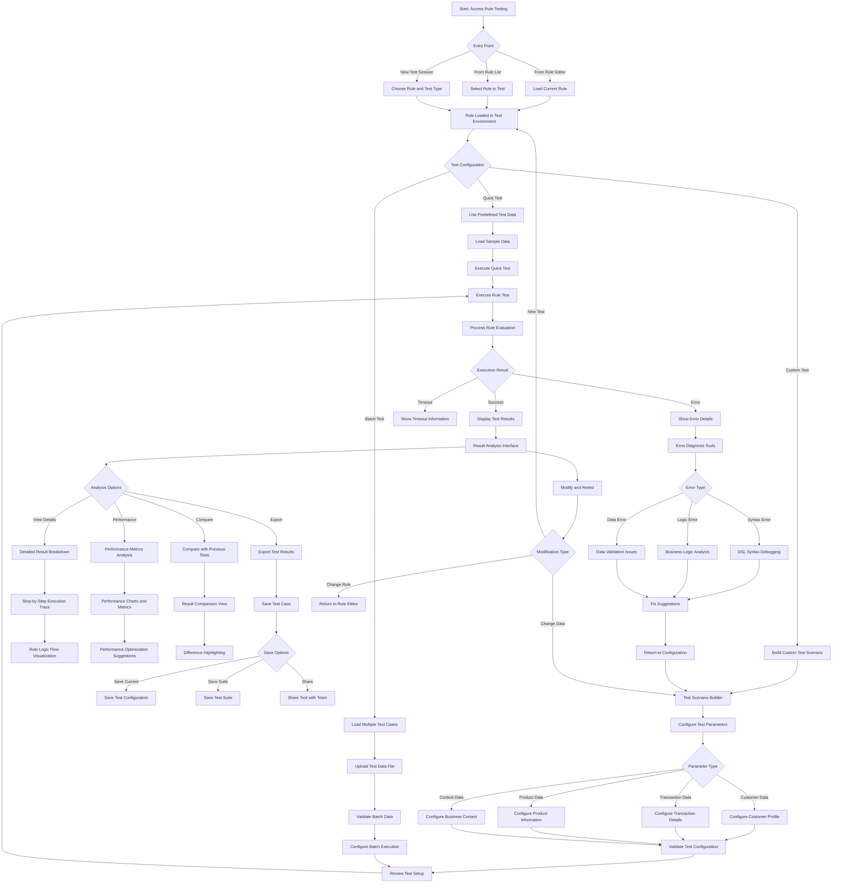

# UI-015: Rule Testing Interface

**Purpose**: This interface enables users to test business rules with sample data, providing simulation capabilities, result visualization, performance metrics, and debugging tools for rule validation.

**Target Users**: Business Analysts, Rule Creators, QA Testers, Developers

**Context**: Testing interface for the Rules Evaluation bounded context supporting rule validation, performance testing, and debugging before rule deployment.

---

## 1) User Flow (Mermaid Diagram)

---

## 2) UI Components and Wireframes (Text-based)

### Screen: Rule Testing Dashboard

#### Layout Structure
- **Header**: Rule information, test mode selector, save/load controls
- **Left Panel**: Test configuration and data input
- **Center Panel**: Test execution and results
- **Right Panel**: Performance metrics and debugging tools
- **Footer**: Test history and saved test cases

#### Component Specifications

##### Header Section
- **Component**: Test Session Header
- **Elements**:
  - **Rule Information**: 
    - Rule name (editable if testing draft)
    - Rule status indicator
    - Last test execution timestamp
  - **Test Mode Selector**: 
    - Quick Test (predefined scenarios)
    - Custom Test (user-defined scenarios)
    - Batch Test (multiple test cases)
    - A/B Test (compare rule versions)
  - **Session Controls**:
    - Save Test Configuration button
    - Load Saved Test button
    - Share Test Session button
    - Test History dropdown

##### Left Panel: Test Configuration

###### Test Data Input Section
- **Component**: Multi-Tab Data Configuration
- **Tabs**:
  1. **Customer Data Tab**:
     - Customer ID input or selector
     - Customer profile builder
     - Customer segment assignment
     - Customer history simulation
  
  2. **Transaction Data Tab**:
     - Cart/order builder interface
     - Product selection with quantities
     - Transaction metadata (date, channel, etc.)
     - Payment method configuration
  
  3. **Context Data Tab**:
     - Business context settings
     - Geographic location settings
     - Time zone and date/time configuration
     - System state variables
  
  4. **Advanced Settings Tab**:
     - Performance testing options
     - Debug mode configuration
     - Logging level selection
     - Mock external service responses

###### Quick Test Data Selection
- **Component**: Predefined Scenario Selector
- **Features**:
  - **Scenario Categories**:
    - New Customer scenarios
    - VIP Customer scenarios
    - High-Value Transaction scenarios
    - Edge Case scenarios
  - **Scenario Details**: 
    - Scenario description
    - Expected outcome preview
    - Scenario complexity indicator
  - **Custom Scenario Builder**:
    - Modify existing scenarios
    - Create new scenarios
    - Save scenarios for reuse

###### Batch Test Configuration
- **Component**: Batch Test Manager
- **Features**:
  - **File Upload**: CSV/JSON file upload for test data
  - **Data Mapping**: Map file columns to test parameters
  - **Validation**: Validate uploaded data format
  - **Execution Settings**: Parallel vs. sequential execution
  - **Progress Tracking**: Batch execution progress indicator

##### Center Panel: Test Execution and Results

###### Test Execution Control
- **Component**: Test Execution Interface
- **Elements**:
  - **Execute Button**: Large, prominent test execution button
  - **Execution Mode**: 
    - Single execution
    - Multiple iterations
    - Performance stress test
  - **Progress Indicator**: Real-time execution progress
  - **Stop/Cancel**: Ability to halt long-running tests

###### Results Display
- **Component**: Test Results Viewer
- **Layout**: Tabbed interface for different result views

**Results Overview Tab**:
- **Test Summary**:
  - Execution status (Success/Error/Warning)
  - Execution time
  - Rule outcome (Applied/Not Applied/Partially Applied)
  - Final calculated values
- **Quick Metrics**:
  - Rules evaluated count
  - Conflicts detected count
  - Performance score
  - Resource usage

**Detailed Results Tab**:
- **Component**: Step-by-Step Execution Trace
- **Features**:
  - **Execution Timeline**: Chronological list of rule evaluation steps
  - **Rule Logic Flow**: Visual representation of rule decision points
  - **Variable State**: Values of variables at each step
  - **Conditional Outcomes**: Results of conditional evaluations
  - **Final Calculations**: Breakdown of final result calculations

**Performance Tab**:
- **Component**: Performance Metrics Dashboard
- **Metrics**:
  - **Execution Time**: Overall and per-step timing
  - **Memory Usage**: Peak and average memory consumption
  - **CPU Usage**: Processing time and efficiency
  - **Cache Performance**: Hit/miss ratios and cache efficiency
  - **Comparison**: Performance vs. previous tests and benchmarks

**Error Analysis Tab** (if errors occur):
- **Component**: Error Diagnostic Interface
- **Features**:
  - **Error Classification**: Syntax, logic, data, or system errors
  - **Error Location**: Exact location in rule or data causing error
  - **Error Context**: Relevant data state when error occurred
  - **Fix Suggestions**: Automated suggestions for error resolution
  - **Help Resources**: Links to documentation and troubleshooting guides

##### Right Panel: Analysis and Debugging Tools

###### Performance Analysis
- **Component**: Performance Monitoring Dashboard
- **Widgets**:
  - **Execution Time Chart**: Time series of execution performance
  - **Resource Usage Gauges**: Real-time CPU, memory, and I/O usage
  - **Bottleneck Identification**: Slowest rule components highlighted
  - **Optimization Suggestions**: AI-powered performance recommendations

###### Debugging Tools
- **Component**: Rule Debugging Interface
- **Tools**:
  - **Variable Inspector**: View and modify variable values during execution
  - **Breakpoint Manager**: Set breakpoints in rule logic
  - **Step-Through Debugger**: Step through rule execution line by line
  - **Watch Expressions**: Monitor specific expressions during execution
  - **Call Stack**: View execution context and call hierarchy

###### Test Comparison
- **Component**: Test Result Comparison Tool
- **Features**:
  - **Version Comparison**: Compare results between rule versions
  - **Historical Comparison**: Compare with previous test executions
  - **Expected vs. Actual**: Compare with expected outcomes
  - **Difference Highlighting**: Visual highlighting of differences
  - **Regression Detection**: Identify performance or outcome regressions

### Screen: Batch Testing Interface

#### Layout Structure
- **Header**: Batch test information and controls
- **Main Content**: Batch execution progress and results table
- **Side Panel**: Batch configuration and summary statistics

#### Component Specifications

##### Batch Execution Progress
- **Component**: Batch Processing Dashboard
- **Elements**:
  - **Progress Bar**: Overall batch completion progress
  - **Current Test**: Currently executing test case details
  - **Execution Rate**: Tests per second/minute
  - **Estimated Completion**: Time remaining estimate
  - **Success/Failure Counts**: Running tally of test outcomes

##### Batch Results Table
- **Component**: Batch Results Data Table
- **Columns**:
  1. **Test Case ID**: Unique identifier for each test case
  2. **Status**: Success/Error/Skipped status indicator
  3. **Execution Time**: Individual test execution time
  4. **Result**: Rule outcome for each test
  5. **Conflicts**: Number of conflicts detected
  6. **Expected**: Expected outcome (if provided)
  7. **Match**: Whether result matches expected outcome
  8. **Actions**: View details, rerun individual test

##### Batch Summary Statistics
- **Component**: Batch Test Analytics
- **Metrics**:
  - **Overall Success Rate**: Percentage of successful tests
  - **Average Execution Time**: Mean execution time across all tests
  - **Performance Distribution**: Histogram of execution times
  - **Error Classification**: Breakdown of error types
  - **Coverage Analysis**: What scenarios were covered by the batch

---

## 3) Interaction and States

### UI States

#### Initial State
- **Rule Selection**: If accessing from rule editor, rule pre-loaded
- **Default Configuration**: Default test settings applied
- **Empty Results**: No test results displayed
- **Ready to Execute**: Execute button enabled and prominent

#### Configuration States
- **Data Entry**: Users building test scenarios with progressive validation
- **Validation**: Real-time validation of test configuration
- **Loading Scenarios**: Loading predefined test scenarios or saved configurations
- **Configuration Complete**: All required data provided, ready for execution

#### Execution States
- **Pre-Execution**: Final validation and preparation
- **Executing**: Real-time progress indication and cancellation option
- **Processing Results**: Analyzing and formatting test results
- **Results Ready**: Complete results available for analysis

#### Error States
- **Configuration Error**: Invalid test configuration with specific guidance
- **Execution Error**: Rule execution errors with debugging information
- **System Error**: Technical system errors with retry options
- **Timeout Error**: Long-running tests that exceeded time limits

#### Results States
- **Success Results**: Successful execution with complete result analysis
- **Partial Results**: Some tests succeeded, some failed (batch testing)
- **Comparison View**: Comparing results with previous tests or expectations
- **Analysis Mode**: Deep-dive analysis of performance and behavior

### User Actions and Corresponding Events

#### Test Configuration Actions
- **Action**: User selects test mode (Quick/Custom/Batch)
  - **Event**: `TEST_MODE_SELECTED`
  - **UI Update**: Show/hide relevant configuration panels
  - **Payload**: `{ testMode: string, ruleId: string }`

- **Action**: User configures customer data
  - **Event**: `CUSTOMER_DATA_CONFIGURED`
  - **Validation**: Validate customer data format and completeness
  - **Payload**: `{ customerData: object, customerId: string }`

- **Action**: User builds transaction scenario
  - **Event**: `TRANSACTION_SCENARIO_BUILT`
  - **Calculation**: Update estimated rule impact
  - **Payload**: `{ transactionData: object, products: array, totalValue: number }`

- **Action**: User uploads batch test file
  - **Event**: `BATCH_TEST_FILE_UPLOADED`
  - **Validation**: Validate file format and data structure
  - **Payload**: `{ fileName: string, rowCount: number, validationResults: object }`

#### Test Execution Actions
- **Action**: User executes single test
  - **Event**: `RULE_TEST_EXECUTED`
  - **Processing**: Execute rule with provided test data
  - **Payload**: `{ ruleId: string, testData: object, executionMode: string }`

- **Action**: User starts batch test execution
  - **Event**: `BATCH_TEST_EXECUTION_STARTED`
  - **Processing**: Begin processing all test cases in batch
  - **Payload**: `{ batchId: string, testCaseCount: number, executionSettings: object }`

- **Action**: User cancels running test
  - **Event**: `TEST_EXECUTION_CANCELLED`
  - **Cleanup**: Stop execution and clean up resources
  - **Payload**: `{ testId: string, cancellationReason: string }`

#### Results Analysis Actions
- **Action**: User views detailed execution trace
  - **Event**: `EXECUTION_TRACE_REQUESTED`
  - **Data**: Load complete step-by-step execution log
  - **Payload**: `{ testId: string, traceLevel: string }`

- **Action**: User analyzes performance metrics
  - **Event**: `PERFORMANCE_ANALYSIS_REQUESTED`
  - **Calculation**: Calculate and display performance analytics
  - **Payload**: `{ testId: string, metricsType: string }`

- **Action**: User compares test results
  - **Event**: `TEST_COMPARISON_REQUESTED`
  - **Analysis**: Compare current results with selected baseline
  - **Payload**: `{ currentTestId: string, baselineTestId: string, comparisonType: string }`

#### Debugging Actions
- **Action**: User sets debugging breakpoint
  - **Event**: `DEBUG_BREAKPOINT_SET`
  - **Configuration**: Configure debugger for step-through execution
  - **Payload**: `{ ruleLocation: string, breakpointType: string }`

- **Action**: User steps through rule execution
  - **Event**: `DEBUG_STEP_EXECUTED`
  - **Execution**: Execute single step with variable inspection
  - **Payload**: `{ stepId: string, variableState: object }`

#### Save and Share Actions
- **Action**: User saves test configuration
  - **Event**: `TEST_CONFIGURATION_SAVED`
  - **Storage**: Save configuration for future reuse
  - **Payload**: `{ configurationName: string, testData: object, settings: object }`

- **Action**: User shares test session
  - **Event**: `TEST_SESSION_SHARED`
  - **Access**: Generate shareable link with appropriate permissions
  - **Payload**: `{ testId: string, shareSettings: object, recipients: array }`

- **Action**: User exports test results
  - **Event**: `TEST_RESULTS_EXPORTED`
  - **Generation**: Generate export file in requested format
  - **Payload**: `{ testId: string, exportFormat: string, includeDetails: boolean }`

### Accessibility Considerations

#### Keyboard Navigation
- **Tab Order**: Logical progression through configuration, execution, and results
- **Keyboard Shortcuts**: Quick keys for test execution (F5), save (Ctrl+S), etc.
- **Focus Management**: Clear focus indicators and skip links for complex interfaces
- **Table Navigation**: Arrow key navigation for results tables

#### Screen Reader Support
- **Execution Status**: Live region announcements for test progress
- **Result Announcements**: Clear announcements of test outcomes
- **Error Descriptions**: Detailed error messages with context
- **Progress Updates**: Accessible progress indicators with text alternatives

#### Visual Accessibility
- **Status Indicators**: High contrast success/error indicators
- **Color Independence**: Information conveyed through icons and text, not just color
- **Text Scaling**: Readable interface up to 200% zoom
- **Focus Indicators**: Clear visual focus indicators on all interactive elements

### Performance Considerations

#### Test Execution Performance
- **Parallel Processing**: Execute multiple test cases concurrently when possible
- **Resource Management**: Monitor and limit resource usage during testing
- **Caching**: Cache rule compilation and frequently used test data
- **Streaming Results**: Stream results for large batch tests

#### UI Responsiveness
- **Progressive Loading**: Load results progressively for large datasets
- **Background Processing**: Execute tests in background with progress updates
- **Optimistic Updates**: Show immediate feedback while processing continues
- **Debounced Input**: Limit real-time validation frequency during data entry

#### Memory Management
- **Result Pagination**: Paginate large result sets to manage memory
- **Data Cleanup**: Clean up test data after execution completion
- **Cache Management**: Intelligent caching with automatic cleanup
- **Memory Monitoring**: Monitor memory usage and warn about large operations

This rule testing interface provides comprehensive testing capabilities while maintaining excellent performance and usability, enabling thorough validation of business rules before deployment.
