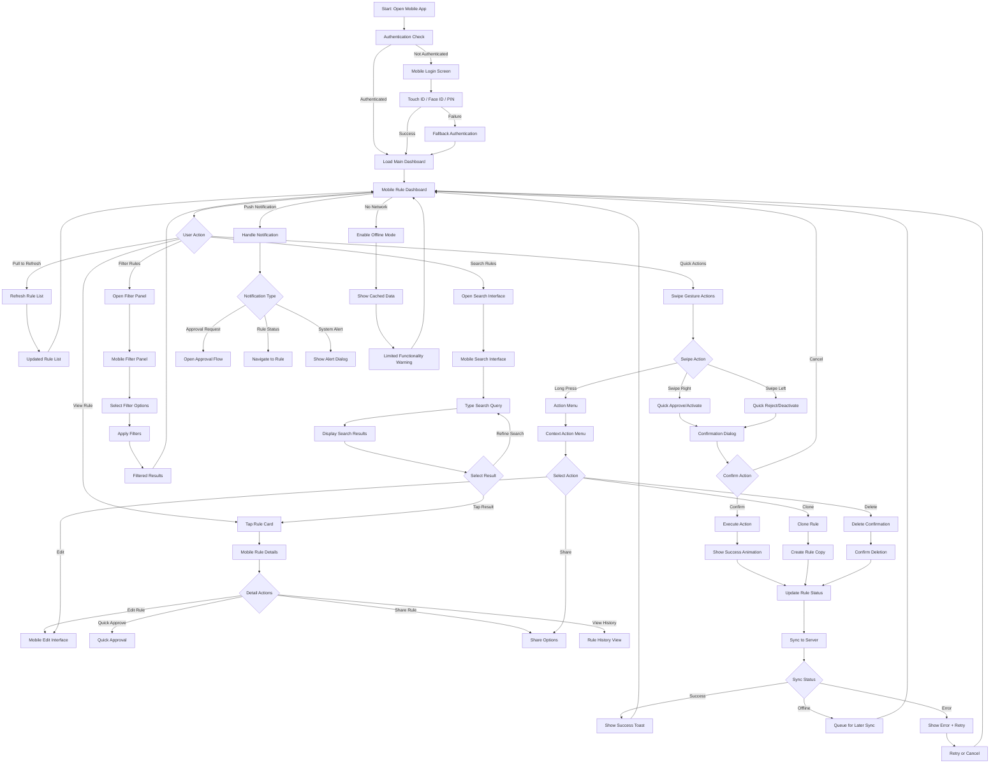

# UI-022: Mobile Rule Management Interface

**Purpose**: This interface provides mobile-optimized rule management capabilities including touch-friendly rule listing, swipe actions, mobile notifications, and essential rule management functions optimized for mobile devices.

**Target Users**: Business Analysts, Rule Managers, Approvers (on mobile devices)

**Context**: Mobile-first interface for the Rules Management bounded context supporting essential rule operations with touch interactions, offline capabilities, and mobile-specific user patterns.

---

## 1) User Flow (Mermaid Diagram)

---

## 2) UI Components and Wireframes (Text-based)

### Screen: Mobile Dashboard

#### Layout Structure
- **Header**: Fixed header with app title, search icon, filter icon, notifications
- **Main Content**: Scrollable rule list with pull-to-refresh
- **Bottom Navigation**: Tab bar for main sections (Rules, Approvals, Profile, Settings)
- **Floating Action Button**: Quick create rule action

#### Component Specifications

##### Mobile Header
- **Component**: Fixed Mobile Header
- **Height**: 60px (iOS) / 56px (Android)
- **Elements**:
  - **App Title**: "Rules Engine" with company logo
  - **Search Icon**: Magnifying glass (top-right)
  - **Filter Icon**: Filter funnel icon (top-right, left of search)
  - **Notification Badge**: Bell with red badge for urgent items
  - **Network Status**: Subtle indicator for offline mode

##### Pull-to-Refresh
- **Component**: Native Pull-to-Refresh
- **Animation**: Platform-specific refresh animation
- **Trigger**: Pull down gesture from top of list
- **Feedback**: Visual indication of refresh progress
- **Auto-hide**: Automatic dismissal when refresh completes

##### Rule Card (Mobile Optimized)
- **Component**: Touch-Friendly Rule Card
- **Dimensions**: Full width, 120px height minimum
- **Layout**: Optimized for single-thumb operation
- **Elements**:
  - **Status Indicator**: Large colored strip on left edge
  - **Rule Name**: Large, readable text (16px minimum)
  - **Category Badge**: Small, colored badge in top-right
  - **Priority Indicator**: Icon-based priority (high visibility)
  - **Last Modified**: Relative time (e.g., "2 hours ago")
  - **Creator**: User avatar and name
  - **Swipe Indicators**: Subtle left/right edge hints

##### Swipe Actions
- **Component**: Contextual Swipe Actions
- **Right Swipe Reveal** (from left edge):
  - **Quick Approve**: Green background with checkmark icon
  - **Activate**: Blue background with play icon
  - **Full Action**: Reveals on complete swipe
- **Left Swipe Reveal** (from right edge):
  - **Quick Reject**: Red background with X icon
  - **Deactivate**: Orange background with pause icon
  - **Delete**: Dark red background with trash icon

##### Bottom Navigation
- **Component**: Tab Bar Navigation
- **Tabs**:
  1. **Rules**: List icon with "Rules" label
  2. **Approvals**: Checkmark icon with "Approvals" and badge
  3. **Notifications**: Bell icon with "Alerts" and badge
  4. **Profile**: User icon with "Profile" label
- **Active State**: Highlighted tab with color and bold text
- **Badge Support**: Red badges on tabs with counts

##### Floating Action Button (FAB)
- **Component**: Material Design FAB
- **Position**: Bottom-right corner with margin
- **Icon**: Plus icon for "Create New Rule"
- **Behavior**: Hide on scroll down, show on scroll up
- **Action**: Navigate to mobile rule creation flow

### Screen: Mobile Rule Details

#### Layout Structure
- **Header**: Back button, rule name, action menu
- **Content**: Scrollable content with sections
- **Sticky Actions**: Bottom action bar with primary actions

#### Component Specifications

##### Mobile Detail Header
- **Component**: Navigation Header with Actions
- **Elements**:
  - **Back Button**: Platform-appropriate back arrow
  - **Rule Name**: Truncated with full name on tap
  - **Overflow Menu**: Three-dot menu for additional actions
  - **Status Badge**: Current rule status prominently displayed

##### Content Sections
- **Component**: Collapsible Content Sections
- **Sections**:
  1. **Rule Summary**: 
     - Description (expandable)
     - Key metrics (creation date, last modified)
     - Category and priority indicators
  
  2. **Rule Logic**:
     - Simplified DSL view (formatted for mobile)
     - "View Full Logic" link to detailed view
     - Logic complexity indicator
  
  3. **Performance Data**:
     - Key performance metrics in card format
     - Usage statistics
     - Performance trend indicator
  
  4. **Recent Activity**:
     - Last 5 activities in timeline format
     - "View Full History" link
     - Activity icons and short descriptions

##### Bottom Action Bar
- **Component**: Sticky Action Bar
- **Actions**:
  - **Primary Action**: Approve/Activate/Edit (context-dependent)
  - **Secondary Action**: Clone/Share
  - **Overflow**: Menu for additional actions
- **Design**: Semi-transparent background with blur effect
- **Safety**: Actions require confirmation for destructive operations

### Screen: Mobile Search Interface

#### Layout Structure
- **Search Header**: Search input with cancel button
- **Filter Chips**: Horizontal scrollable filter options
- **Results List**: Optimized rule cards for search results
- **No Results State**: Helpful messaging and suggestions

#### Component Specifications

##### Mobile Search Header
- **Component**: Search Input with Voice
- **Elements**:
  - **Search Input**: Large, touch-friendly input field
  - **Voice Search**: Microphone icon for voice input
  - **Cancel Button**: Clear "Cancel" text button
  - **Recent Searches**: Quick access to recent search terms

##### Filter Chips
- **Component**: Horizontal Scrollable Chips
- **Chips**:
  - **Status Filters**: Active, Draft, Under Review, etc.
  - **Category Filters**: Promotions, Loyalty, Taxes, etc.
  - **Priority Filters**: High, Medium, Low
  - **Date Filters**: Today, This Week, This Month
- **Interaction**: Tap to toggle, visual selection state
- **Scrolling**: Horizontal scroll with fade edges

##### Search Results
- **Component**: Optimized Search Result Cards
- **Features**:
  - **Highlighted Terms**: Search terms highlighted in results
  - **Quick Preview**: Expandable preview of rule content
  - **Relevance Score**: Visual indicator of search relevance
  - **Infinite Scroll**: Load more results as user scrolls

### Screen: Mobile Filter Panel

#### Layout Structure
- **Header**: Filter title and clear all option
- **Filter Sections**: Collapsible filter categories
- **Action Footer**: Apply and cancel buttons

#### Component Specifications

##### Filter Categories
- **Component**: Expandable Filter Sections
- **Categories**:
  1. **Status Filter**:
     - Multi-select checkbox list
     - Visual status indicators
     - "Select All" / "Clear All" options
  
  2. **Category Filter**:
     - Category icons with names
     - Multi-select with visual feedback
     - Category-specific rule counts
  
  3. **Date Range Filter**:
     - Quick date presets (Today, Week, Month)
     - Custom date range picker
     - Clear date range option
  
  4. **Advanced Filters**:
     - Created by user filter
     - Priority level filter
     - Template-based filter

##### Filter Actions
- **Component**: Fixed Footer Actions
- **Buttons**:
  - **Apply Filters**: Primary button with filter count
  - **Clear All**: Secondary button to reset filters
  - **Cancel**: Dismiss without applying changes

### Screen: Mobile Notifications

#### Layout Structure
- **Header**: Notifications title and mark all read
- **Notification List**: Chronological list of notifications
- **Empty State**: No notifications message

#### Component Specifications

##### Notification Cards
- **Component**: Touch-Friendly Notification Cards
- **Types**:
  1. **Approval Request**:
     - Rule name and requester
     - Priority indicator
     - Quick approve/reject actions
     - Time received
  
  2. **Status Update**:
     - Rule name and status change
     - Status change icons
     - Timestamp and brief description
  
  3. **System Alert**:
     - Alert type indicator
     - Brief message
     - Action required indicator

##### Notification Actions
- **Component**: Swipe and Tap Actions
- **Swipe Actions**:
  - **Right Swipe**: Mark as read
  - **Left Swipe**: Delete notification
- **Tap Actions**:
  - **Tap**: Navigate to relevant rule or approval
  - **Long Press**: Mark as read/unread toggle

---

## 3) Interaction and States

### UI States

#### Connection States
- **Online**: Full functionality with real-time updates
- **Offline**: Limited functionality with cached data
- **Syncing**: Background sync with progress indication
- **Sync Error**: Failed sync with retry options

#### Loading States
- **Initial Load**: Loading skeleton for rule list
- **Pull Refresh**: Native refresh animation
- **Infinite Scroll**: Loading indicator at bottom of list
- **Action Processing**: Loading state for user actions

#### Data States
- **Empty State**: No rules with create action
- **Filtered State**: Results with active filter indicators
- **Search State**: Search results with query display
- **Error State**: Error message with retry option

#### Interaction States
- **Normal**: Standard touch interactions enabled
- **Selection Mode**: Multi-select with action bar
- **Swipe Revealed**: Action buttons visible from swipe
- **Long Press**: Context menu or multi-select activation

### User Actions and Corresponding Events

#### Navigation Actions
- **Action**: User taps rule card
  - **Event**: `MOBILE_RULE_DETAILS_REQUESTED`
  - **Navigation**: Slide transition to detail view
  - **Payload**: `{ ruleId: string, viewMode: 'mobile', previousScreen: string }`

- **Action**: User swipes back to return to list
  - **Event**: `MOBILE_NAVIGATION_BACK`
  - **Animation**: Platform-appropriate back transition
  - **Payload**: `{ fromScreen: string, toScreen: string }`

#### Touch Gesture Actions
- **Action**: User swipes right on rule card (approve/activate)
  - **Event**: `MOBILE_SWIPE_ACTION_TRIGGERED`
  - **Feedback**: Haptic feedback and visual animation
  - **Payload**: `{ ruleId: string, action: 'approve', swipeDirection: 'right' }`

- **Action**: User swipes left on rule card (reject/deactivate)
  - **Event**: `MOBILE_SWIPE_ACTION_TRIGGERED`
  - **Confirmation**: Show confirmation dialog for destructive actions
  - **Payload**: `{ ruleId: string, action: 'reject', swipeDirection: 'left' }`

- **Action**: User long presses rule card
  - **Event**: `MOBILE_LONG_PRESS_DETECTED`
  - **Feedback**: Haptic feedback and context menu appearance
  - **Payload**: `{ ruleId: string, pressLocation: object }`

#### Search and Filter Actions
- **Action**: User taps search icon
  - **Event**: `MOBILE_SEARCH_OPENED`
  - **Focus**: Auto-focus search input with keyboard
  - **Payload**: `{ searchContext: 'rules', previousFilters: object }`

- **Action**: User applies voice search
  - **Event**: `MOBILE_VOICE_SEARCH_REQUESTED`
  - **Permission**: Request microphone permission if needed
  - **Payload**: `{ speechRecognitionSettings: object }`

- **Action**: User applies filters
  - **Event**: `MOBILE_FILTERS_APPLIED`
  - **UI Update**: Update filter chip display and results
  - **Payload**: `{ appliedFilters: object, resultCount: number }`

#### Offline Actions
- **Action**: User performs action while offline
  - **Event**: `MOBILE_OFFLINE_ACTION_QUEUED`
  - **Storage**: Queue action for later sync
  - **Payload**: `{ action: object, timestamp: Date, syncPriority: string }`

- **Action**: Device regains connectivity
  - **Event**: `MOBILE_CONNECTIVITY_RESTORED`
  - **Sync**: Process queued actions automatically
  - **Payload**: `{ queuedActions: array, syncStrategy: string }`

#### Notification Actions
- **Action**: User receives push notification
  - **Event**: `MOBILE_PUSH_NOTIFICATION_RECEIVED`
  - **Processing**: Handle notification based on type and app state
  - **Payload**: `{ notificationType: string, notificationData: object, appState: string }`

- **Action**: User taps notification
  - **Event**: `MOBILE_NOTIFICATION_TAPPED`
  - **Navigation**: Navigate to relevant screen
  - **Payload**: `{ notificationId: string, targetScreen: string, contextData: object }`

#### Pull-to-Refresh Actions
- **Action**: User pulls down to refresh
  - **Event**: `MOBILE_PULL_REFRESH_TRIGGERED`
  - **Data**: Refresh rule data from server
  - **Payload**: `{ refreshType: 'manual', lastRefreshTime: Date }`

- **Action**: Background refresh triggered
  - **Event**: `MOBILE_BACKGROUND_REFRESH_TRIGGERED`
  - **Data**: Automatic refresh based on app lifecycle
  - **Payload**: `{ refreshType: 'background', trigger: string }`

### Mobile-Specific Accessibility Considerations

#### Touch Accessibility
- **Touch Targets**: Minimum 44px x 44px touch targets
- **Gesture Alternatives**: Alternative methods for swipe actions
- **Touch Feedback**: Haptic feedback for important actions
- **Voice Control**: Support for voice navigation commands

#### Screen Reader Support
- **Dynamic Content**: Announce content changes during refresh
- **Gesture Descriptions**: Describe available swipe actions
- **Navigation Hints**: Clear navigation instructions
- **Content Grouping**: Logical content grouping for screen readers

#### Visual Accessibility
- **High Contrast Mode**: Support for high contrast display modes
- **Text Scaling**: Support for system text size preferences
- **Motion Reduction**: Respect reduced motion preferences
- **Color Blindness**: Color-independent status indicators

### Mobile Performance Considerations

#### App Performance
- **Launch Time**: Optimize for fast app startup
- **Memory Management**: Efficient memory usage with large rule lists
- **Battery Usage**: Optimize for minimal battery drain
- **Background Processing**: Efficient background sync

#### Network Optimization
- **Data Usage**: Minimize data consumption
- **Progressive Loading**: Load essential data first
- **Caching Strategy**: Intelligent caching for offline use
- **Sync Optimization**: Efficient delta sync for rule updates

#### Storage Management
- **Local Storage**: Efficient local data storage
- **Cache Management**: Automatic cache cleanup
- **Offline Storage**: Store essential data for offline access
- **Sync Queue**: Persistent queue for offline actions

This mobile rule management interface provides a comprehensive mobile experience optimized for touch interactions, offline functionality, and mobile-specific user patterns while maintaining access to essential rule management capabilities.
